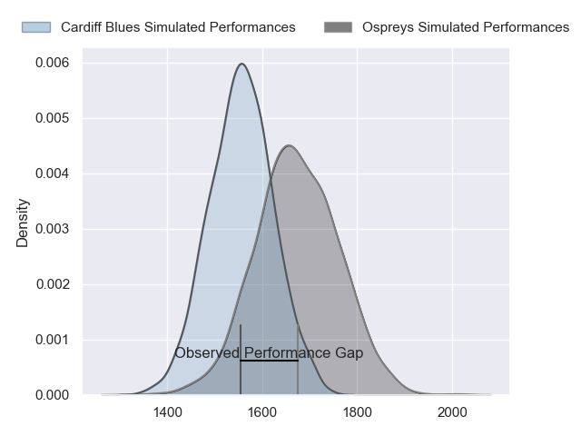
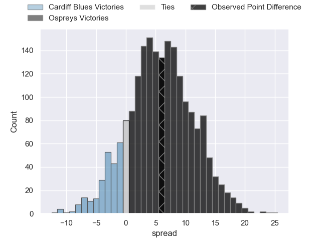
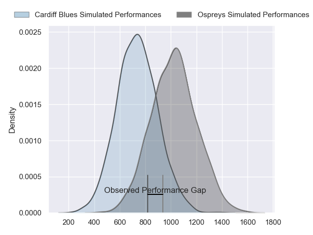
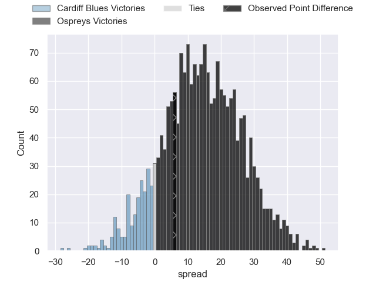
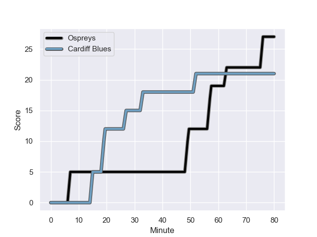
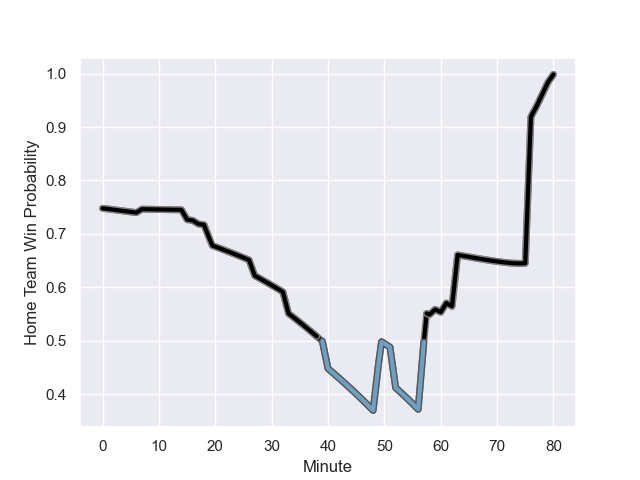

---  
layout: page  
title: Cardiff Blues at Ospreys; 21-27  
date: 2024-01-01 18:00:00 -0500  
categories: "United Rugby Championship 2023" match review  
---
# Cardiff Blues at Ospreys; 21-27

# Club Level Predictions

The first set of predictions treats a club as the smallest object, as the club develops its members, organizes a gameplan, and deploys its players as needed for each match. This club model has a prediction of 0.654, which translates to predicting Ospreys to win by 5.6.

Our Over/Under is 44.5 - and combined with the spread above, we have a predicted scoreline of 19 to 25

Each club has a rating and a rating deviation (similar to a Glicko rating), and expected performances can be generated. This allows for simulated matches and spreads like the ones below.
## Projected Performances - Club Model

## Projected Spreads - Club Model

## Projected Results - Club Model

# Player Level Predictions - Version 2

Treating teams instead as an entity made up of the currently active players, I have ratings for each player in an altogether different system. These can be combined to form team ratings once teamsheets are announced, weighting starters a bit higher than the reserves. After the match is played, players can be weighted by their minutes on the field, allowing for an accurate measure of the team's composition. With these compiled team ratings, we can make predictions, measure inaccuracy, and update the individual player ratings.
## Prediction with Player Minutes: Ospreys by 12.0

Ospreys by 6.1 on a neutral field
## Prediction without Player Minutes: Ospreys by 12.4

Ospreys by 6.6 on a neutral pitch

## Projected Performances - Player Model

## Projected Spreads - Player Model

## Projected Results - Player Model

## Scores over Time

## Win Probability over Time

There were 11 large changes in win probability in this match

|   Away Minutes | Away Player       |   Away elo |   Number |   Home elo | Home Player    |   Home Minutes |
|---------------:|:------------------|-----------:|---------:|-----------:|:---------------|---------------:|
|             55 | Corey Domachowski |      53.36 |        1 |      44.88 | Gareth Thomas  |             80 |
|             59 | Liam Belcher      |      60.21 |        2 |      68.99 | Sam Parry      |             80 |
|             59 | Keiron Assiratti  |      39.44 |        3 |      62.07 | Tom Botha      |             80 |
|             63 | Teddy Williams    |      50.2  |        4 |      53.1  | James Fender   |             80 |
|             59 | Seb Davies        |      14.71 |        5 |      79.15 | Adam Beard     |             80 |
|             80 | James Botham      |      62.13 |        6 |      41.52 | James Ratti    |             80 |
|             80 | Ellis Jenkins     |      39.12 |        7 |      56.89 | Harri Deaves   |             17 |
|             63 | Lopeti Timani     |      63.44 |        8 |      47.62 | Morgan Morse   |             80 |
|             80 | Tomos Williams    |      68.44 |        9 |      50.8  | Luke Davies    |             80 |
|             61 | Tinus de Beer     |      68.44 |       10 |     102.49 | Owen Williams  |             40 |
|             80 | Mason Grady       |      77.72 |       11 |      -5.47 | Keelan Giles   |             80 |
|             80 | Ben Thomas        |      60.65 |       12 |     106.79 | Owen Watkin    |             80 |
|             80 | Rey Lee-Lo        |     108.61 |       13 |     115.04 | George North   |             80 |
|             80 | Owen Lane         |     -12.28 |       14 |      38.97 | Iestyn Hopkins |             80 |
|             80 | Cam Winnett       |      12.78 |       15 |      60.28 | Jack Walsh     |             80 |
|             25 | Rhys Carré        |      17.16 |       16 |      49.25 | Tristan Davies |             23 |
|             21 | Rhys Litterick    |      41.18 |       17 |      49.19 | Dan Edwards    |             40 |
|             21 | Efan Daniel       |      42.82 |       18 |      36.74 | Dewi Lake      |             40 |
|             21 | Rory Thornton     |      13.03 |       19 |     nan    | nan            |            nan |
|             19 | Jacob Beetham     |      17.03 |       20 |     nan    | nan            |            nan |
|             17 | Josh Turnbull     |      59.36 |       21 |     nan    | nan            |            nan |
|             17 | Mackenzie Martin  |      40.16 |       22 |     nan    | nan            |            nan |

