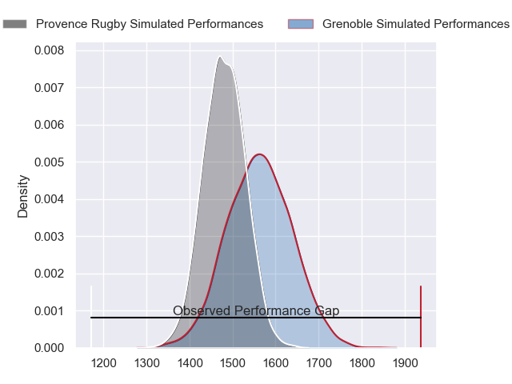
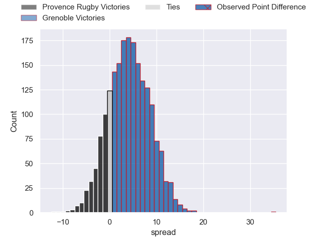
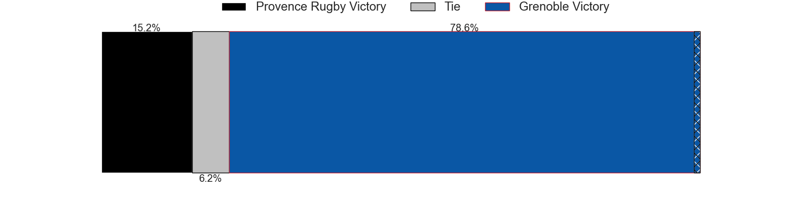
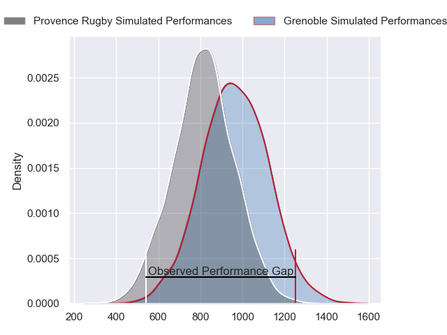
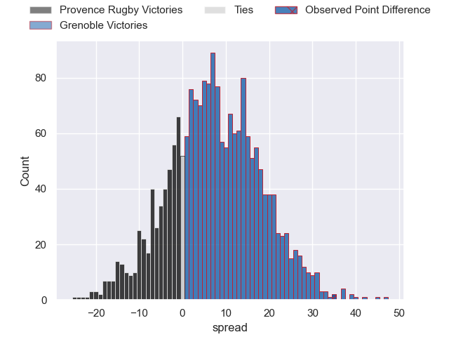
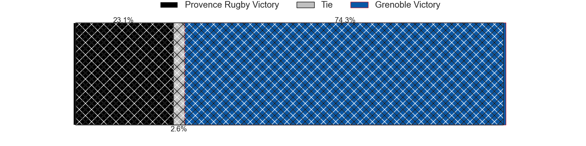
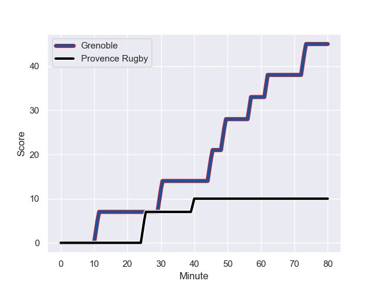
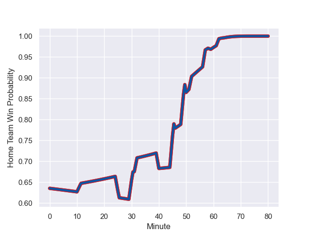

---  
layout: page  
title: Provence Rugby at Grenoble; 10-45  
date: 2024-01-04 18:00:00 -0500  
categories: "Pro D2 2023" match review  
---
# Provence Rugby at Grenoble; 10-45

# Club Level Predictions

The first set of predictions treats a club as the smallest object, as the club develops its members, organizes a gameplan, and deploys its players as needed for each match. This club model has a prediction of 0.614, which translates to predicting Grenoble to win by 4.1.

Our Over/Under is 43.5 - and combined with the spread above, we have a predicted scoreline of 20 to 24

Each club has a rating and a rating deviation (similar to a Glicko rating), and expected performances can be generated. This allows for simulated matches and spreads like the ones below.
## Projected Performances - Club Model

## Projected Spreads - Club Model

## Projected Results - Club Model

# Player Level Predictions - Version 2

Treating teams instead as an entity made up of the currently active players, I have ratings for each player in an altogether different system. These can be combined to form team ratings once teamsheets are announced, weighting starters a bit higher than the reserves. After the match is played, players can be weighted by their minutes on the field, allowing for an accurate measure of the team's composition. With these compiled team ratings, we can make predictions, measure inaccuracy, and update the individual player ratings.
## Prediction with Player Minutes: Grenoble by 6.1

Provence Rugby by 1.5 on a neutral field
## Prediction without Player Minutes: Grenoble by 4.9

Provence Rugby by 2.7 on a neutral pitch

## Projected Performances - Player Model

## Projected Spreads - Player Model

## Projected Results - Player Model

## Scores over Time

## Win Probability over Time

There were 9 large changes in win probability in this match

|   Away Minutes | Away Player           |   Away elo |   Number |   Home elo | Home Player            |   Home Minutes |
|---------------:|:----------------------|-----------:|---------:|-----------:|:-----------------------|---------------:|
|             46 | Federico Wegrzyn      |      51.91 |        1 |      57.38 | Zack Gauthier          |             64 |
|             46 | Jean Charles Orioli   |      35.98 |        2 |      22.31 | Mathis Sarragallet     |             50 |
|             46 | Paul Mallez           |      54.77 |        3 |      58.03 | Irakli Aptsiauri       |             65 |
|             52 | Clément Chartier      |      62.53 |        4 |      65.12 | Georgi Javakhia        |             80 |
|             80 | Theo Hannoyer         |      31.66 |        5 |      57.98 | Pierce Phillips        |             64 |
|             80 | Carl Axtens           |      44.02 |        6 |      22.85 | Antonin Berruyer       |             80 |
|             32 | Bilel Taieb           |      86.22 |        7 |       6.54 | Steeve Blanc-Mappaz    |             80 |
|             80 | Malohi Suta           |      49.56 |        8 |      33.77 | Pio Muarua             |             65 |
|             52 | Joris Cazenave        |      39.9  |        9 |      61.69 | Eric Escande           |             59 |
|             80 | Jimmy Gopperth        |      61.05 |       10 |      77.82 | Sam Davies             |             80 |
|             52 | Eto Bainivalu         |      49.05 |       11 |      23.82 | Geoffrey Cros          |             59 |
|             80 | Kaveinga Finau        |     107.23 |       12 |      95.66 | Bautista Ezcurra       |             80 |
|             52 | Atila Septar          |      53.36 |       13 |      49.72 | Romain Trouilloud      |             64 |
|             80 | Sione Tui             |      78.58 |       14 |      49.35 | Wilfried Hulleu        |             80 |
|             80 | Adrien Lapegue-Lafaye |      18.91 |       15 |     115.03 | Julien Farnoux         |             80 |
|             48 | Nicolas Mousties      |      34.99 |       16 |      48.42 | Barnabé Massa          |             30 |
|             34 | Lucas Martin          |      87.9  |       17 |      49    | Erwan Dridi            |             21 |
|             34 | Thomas Vernet         |      47.38 |       18 |      13.53 | Barnabe Couilloud      |             21 |
|             34 | Nicolas Toth          |      54.15 |       19 |      15.69 | Romain Barthelemy      |             16 |
|             28 | Dorian Lavernhe       |      33.08 |       20 |      33.51 | Tala Gray              |             15 |
|             28 | Arthur Coville        |      48.26 |       21 |      43.23 | Vincent Vial           |             15 |
|             28 | Enzo Selponi          |      61.48 |       22 |      19.16 | Eli Eglaine            |             16 |
|             28 | Josh Tyrell           |      74.17 |       23 |      46.65 | Hilan Delbois Fontaine |             16 |

