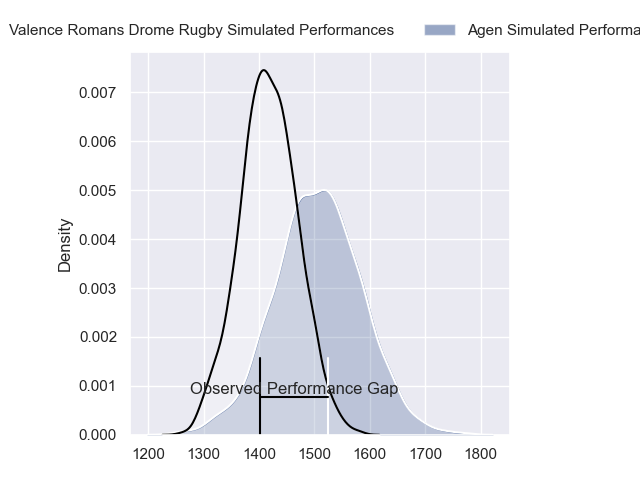
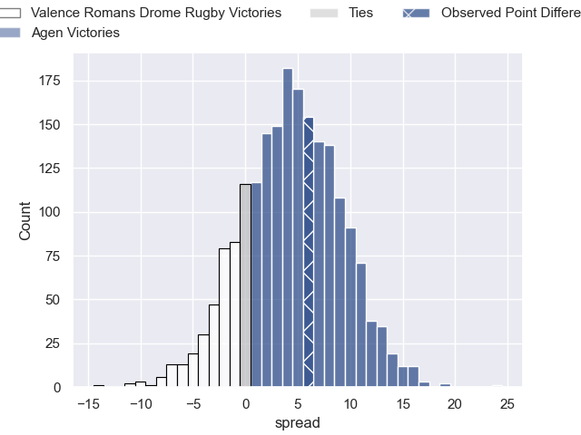
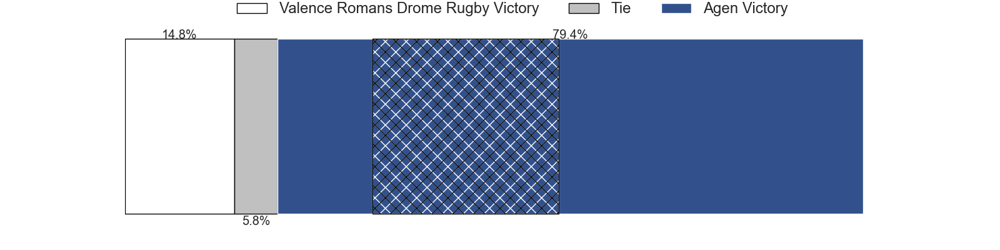
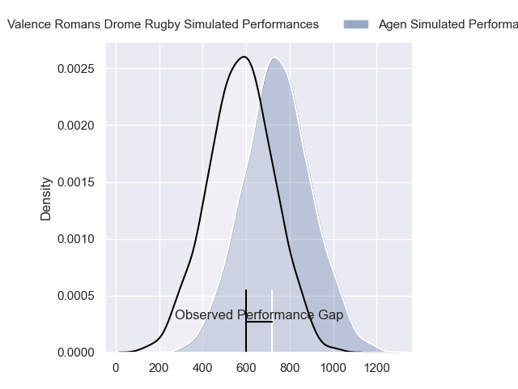
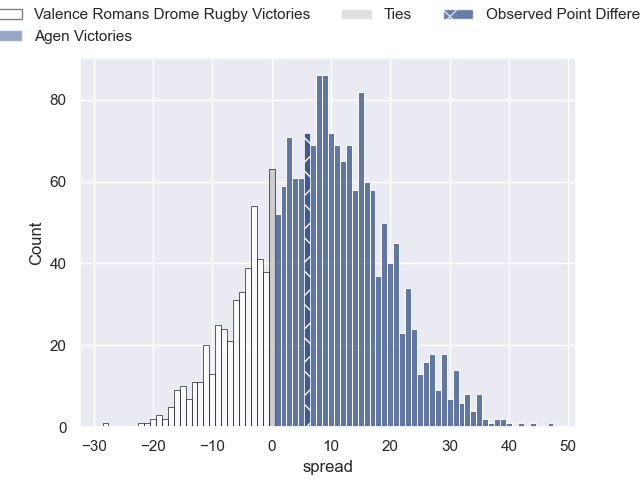
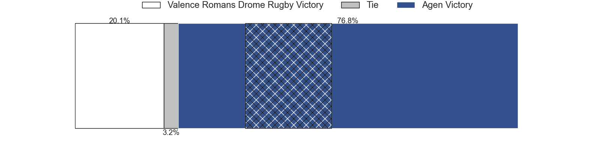
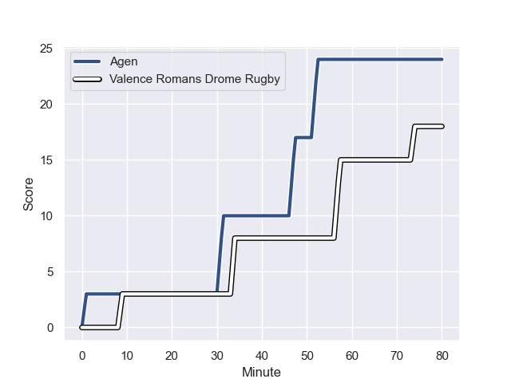
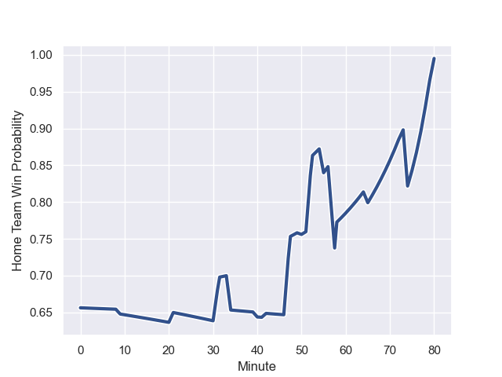

---  
layout: page  
title: Valence Romans Drome Rugby at Agen; 18-24  
date: 2024-01-05 18:00:00 -0500  
categories: "Pro D2 2023" match review  
---
# Valence Romans Drome Rugby at Agen; 18-24

# Club Level Predictions

The first set of predictions treats a club as the smallest object, as the club develops its members, organizes a gameplan, and deploys its players as needed for each match. This club model has a prediction of 0.622, which translates to predicting Agen to win by 4.4.

Our Over/Under is 47.5 - and combined with the spread above, we have a predicted scoreline of 22 to 26

Each club has a rating and a rating deviation (similar to a Glicko rating), and expected performances can be generated. This allows for simulated matches and spreads like the ones below.
## Projected Performances - Club Model

## Projected Spreads - Club Model

## Projected Results - Club Model

# Player Level Predictions - Version 2

Treating teams instead as an entity made up of the currently active players, I have ratings for each player in an altogether different system. These can be combined to form team ratings once teamsheets are announced, weighting starters a bit higher than the reserves. After the match is played, players can be weighted by their minutes on the field, allowing for an accurate measure of the team's composition. With these compiled team ratings, we can make predictions, measure inaccuracy, and update the individual player ratings.
## Prediction with Player Minutes: Agen by 7.1

Agen by 0.5 on a neutral field
## Prediction without Player Minutes: Agen by 7.9

Agen by 0.4 on a neutral pitch

## Projected Performances - Player Model

## Projected Spreads - Player Model

## Projected Results - Player Model

## Scores over Time

## Win Probability over Time

There were 15 large changes in win probability in this match

|   Away Minutes | Away Player           |   Away elo |   Number |   Home elo | Home Player        |   Home Minutes |
|---------------:|:----------------------|-----------:|---------:|-----------:|:-------------------|---------------:|
|             40 | Julien Royer          |     -12.04 |        1 |      48.38 | Hans Lombard-Buret |             60 |
|             50 | Cyril Deligny         |     -22.32 |        2 |      20.16 | Mike Sosene-Feagai |             55 |
|             48 | Chris Talakai         |      35.65 |        3 |      32.83 | Malik Hamadache    |             42 |
|             80 | Ryan McCauley         |      18.17 |        4 |       6.34 | Joe Maksymiw       |             50 |
|             21 | Darrell Dyer          |      61.4  |        5 |      -3.76 | Evan Olmstead      |             80 |
|             65 | Axel Bruchet          |       9.7  |        6 |      20.71 | Julien Lebian      |             80 |
|             80 | Loan Real             |      41.1  |        7 |      57.56 | Arnaud Duputs      |             80 |
|             80 | Ioane Iashagashvili   |      64.12 |        8 |      30.81 | Martin Devergie    |             40 |
|             58 | Tim Menzel            |      56.86 |        9 |      32.85 | Theo Idjellidaine  |             73 |
|             80 | Lucas Meret           |       0.18 |       10 |      21.33 | Ben Volavola       |             65 |
|             50 | Noe Perret-Tourlonias |      43.01 |       11 |      20.75 | Iban Etcheverry    |             80 |
|             55 | Mathieu Guillomot     |      30.17 |       12 |      59.94 | Harry Sloan        |             80 |
|             80 | Anatole Pauvert       |      58.63 |       13 |      55    | Clement Garrigues  |             80 |
|             80 | Adam Vargas           |      94.12 |       14 |      62.01 | Tevita Railevu     |             80 |
|             80 | Gauthier Minguillon   |      40.9  |       15 |      72.97 | Mathieu Lamoulie   |             65 |
|             59 | Florian Goumat        |      39.01 |       16 |      51.51 | Valentin Gayraud   |             40 |
|             40 | Anthony Aléo          |      20.53 |       17 |      43.9  | Théo Sauzaret      |             38 |
|             32 | Kevin Goze            |      57.57 |       18 |      32.05 | Zak Farrance       |             30 |
|             30 | Dorian Marco Pena     |      45.34 |       19 |      38.04 | Pierre Jouvin      |             25 |
|             30 | Charles Bouldoire     |      70.01 |       20 |       0.09 | Florent Guion      |             20 |
|             25 | Ben Neiceru           |      50.04 |       21 |      39.23 | Emile Dayral       |             15 |
|             22 | Thomas Lhusero        |      78.89 |       22 |      77.85 | Henry Purdy        |             15 |
|             15 | Éloi Massot           |      -6.2  |       23 |      45.32 | Dorian Bellot      |              7 |

