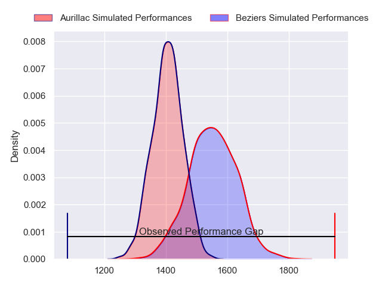
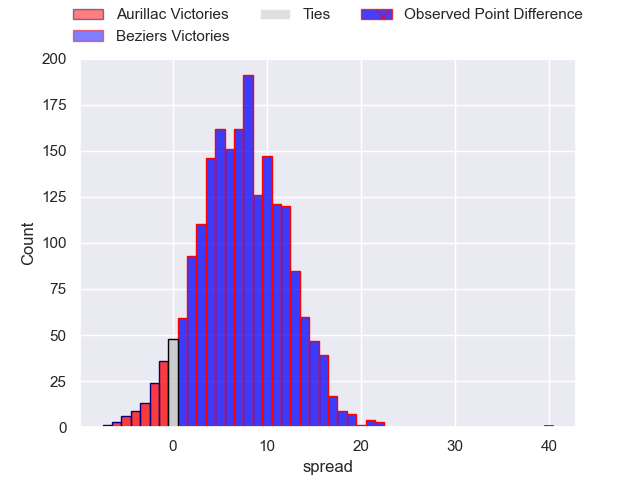
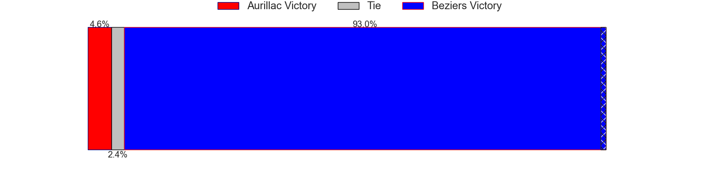
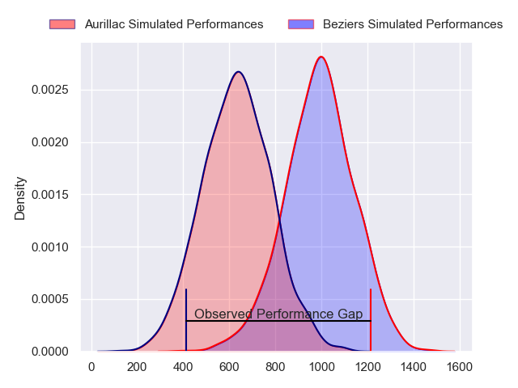
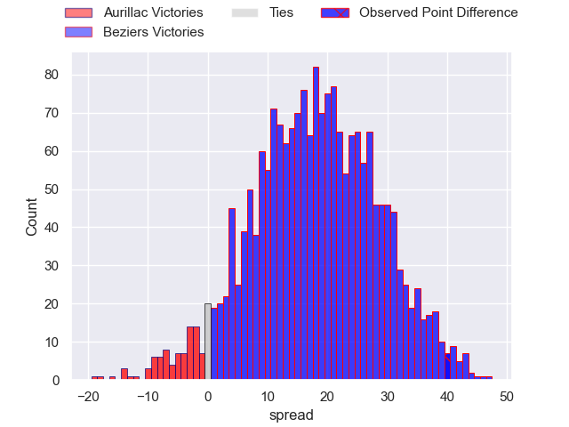
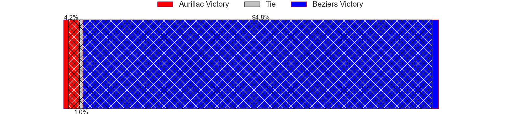
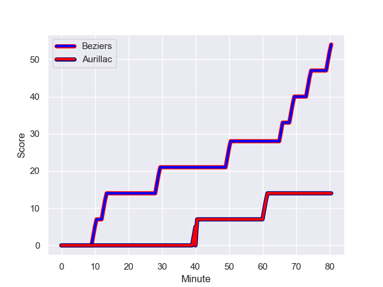
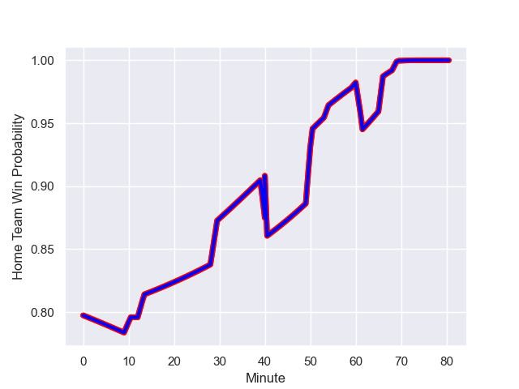

---  
layout: page  
title: Aurillac at Beziers; 14-54  
date: 2024-01-05 18:00:00 -0500  
categories: "Pro D2 2023" match review  
---
# Aurillac at Beziers; 14-54

# Club Level Predictions

The first set of predictions treats a club as the smallest object, as the club develops its members, organizes a gameplan, and deploys its players as needed for each match. This club model has a prediction of 0.698, which translates to predicting Beziers to win by 7.4.

Our Over/Under is 38.5 - and combined with the spread above, we have a predicted scoreline of 16 to 23

Each club has a rating and a rating deviation (similar to a Glicko rating), and expected performances can be generated. This allows for simulated matches and spreads like the ones below.
## Projected Performances - Club Model

## Projected Spreads - Club Model

## Projected Results - Club Model

# Player Level Predictions - Version 2

Treating teams instead as an entity made up of the currently active players, I have ratings for each player in an altogether different system. These can be combined to form team ratings once teamsheets are announced, weighting starters a bit higher than the reserves. After the match is played, players can be weighted by their minutes on the field, allowing for an accurate measure of the team's composition. With these compiled team ratings, we can make predictions, measure inaccuracy, and update the individual player ratings.
## Prediction with Player Minutes: Beziers by 15.0

Beziers by 7.8 on a neutral field
## Prediction without Player Minutes: Beziers by 14.6

Beziers by 7.4 on a neutral pitch

## Projected Performances - Player Model

## Projected Spreads - Player Model

## Projected Results - Player Model

## Scores over Time

## Win Probability over Time

There were 5 large changes in win probability in this match

|   Away Minutes | Away Player         |   Away elo |   Number |   Home elo | Home Player         |   Home Minutes |
|---------------:|:--------------------|-----------:|---------:|-----------:|:--------------------|---------------:|
|             66 | Robert Rodgers      |      17.81 |        1 |      32.27 | Youssef Amrouni     |             54 |
|             61 | Luka Nioradze       |      18.87 |        2 |      48.25 | Wilmar Arnoldi      |             60 |
|             29 | Tim Daniel-Meissen  |      32.32 |        3 |      73.55 | Jon Zabala Arrieta  |             60 |
|             54 | Martial Rolland     |      39.6  |        4 |      22.16 | Gillian Benoy       |             80 |
|             46 | Cam Dodson          |      68.81 |        5 |      -0.56 | Hans N'kinsi        |             54 |
|             80 | Eoghan Masterson    |      79.06 |        6 |      37.96 | William van Bost    |             80 |
|             80 | Hugo Huurman        |      59.96 |        7 |      31.45 | Clement Ancely      |             80 |
|             54 | Yohann Gbizie       |      84.41 |        8 |      61.36 | Otonuku Jr Pauta    |             60 |
|             80 | David Delarue       |      31.46 |        9 |      77.87 | Samuel Marques      |             70 |
|             80 | Marc Palmier        |      34.53 |       10 |      70.82 | Charly Malie        |             80 |
|             80 | AJ Coertzen         |      57.94 |       11 |      84.27 | Nicolas Plazy       |             66 |
|             80 | Christa Powell      |      10.29 |       12 |      54.92 | Taleta Tupuola      |             60 |
|             51 | Hugo Bastard        |      50.34 |       13 |      43.49 | Maxime Espeut       |             80 |
|             70 | Simeli Yabaki       |       7.65 |       14 |      99.95 | Raffaele Storti     |             80 |
|             80 | Jules Margarit      |      37.68 |       15 |     103.24 | Gabin Lorre         |             80 |
|             51 | Thomas Cretu        |      46.67 |       16 |      25.13 | Francisco Fernandes |             26 |
|             34 | Heath Backhouse     |      53.49 |       17 |     -32.18 | Pierrick Gunther    |             26 |
|             29 | Juun Pieters        |      47.06 |       18 |      61.67 | Yvann Lalevee       |             20 |
|             26 | Mehdi Slamani       |      41.91 |       19 |      62.26 | Sias Koen           |             20 |
|             26 | Didier Tison        |      54.24 |       20 |      87.79 | Watisoni Votu       |             20 |
|             19 | Lilian Djomboue     |      41.47 |       21 |      60.58 | Marco Trauth        |             20 |
|             14 | Jean-Jacques Gymael |      29.64 |       22 |      37.75 | Victor Dreuille     |             14 |
|             10 | Leo Salvan          |      47.08 |       23 |      33.35 | Jean Victor Goillot |             10 |

