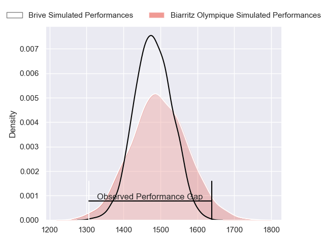
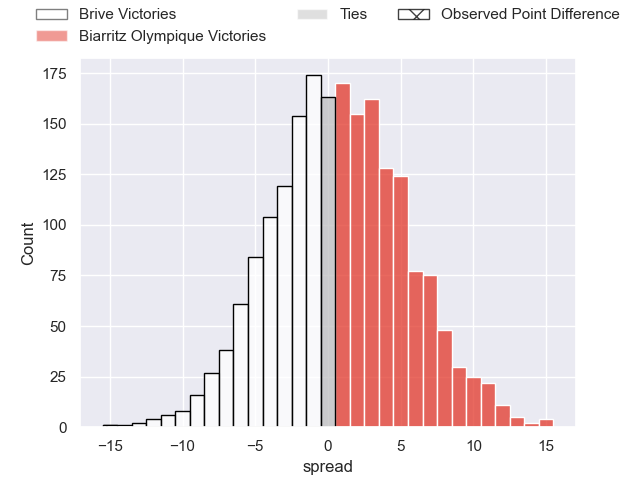
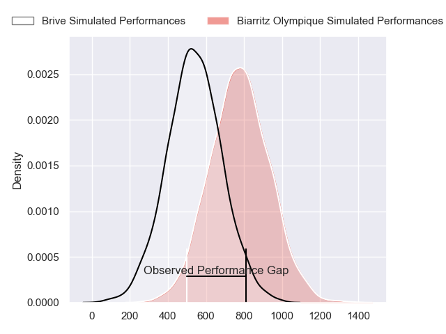
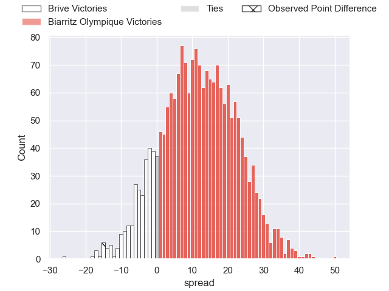
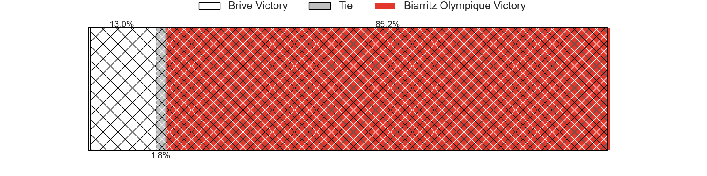
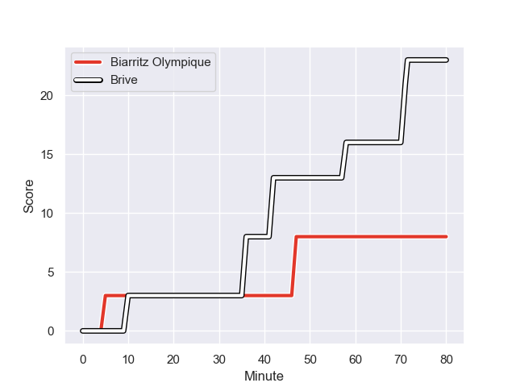
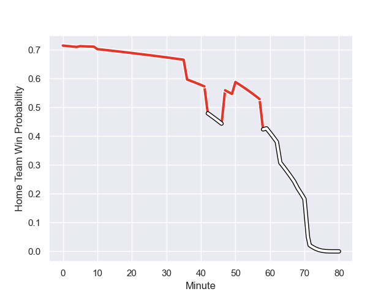

---  
layout: page  
title: Brive at Biarritz Olympique; 23-8  
date: 2024-01-05 18:00:00 -0500  
categories: "Pro D2 2023" match review  
---
# Brive at Biarritz Olympique; 23-8

# Club Level Predictions

The first set of predictions treats a club as the smallest object, as the club develops its members, organizes a gameplan, and deploys its players as needed for each match. This club model has a prediction of 0.519, which translates to predicting Biarritz Olympique to win by 0.7.

Our Over/Under is 33.5 - and combined with the spread above, we have a predicted scoreline of 17 to 17

Each club has a rating and a rating deviation (similar to a Glicko rating), and expected performances can be generated. This allows for simulated matches and spreads like the ones below.
## Projected Performances - Club Model

## Projected Spreads - Club Model

## Projected Results - Club Model

# Player Level Predictions - Version 2

Treating teams instead as an entity made up of the currently active players, I have ratings for each player in an altogether different system. These can be combined to form team ratings once teamsheets are announced, weighting starters a bit higher than the reserves. After the match is played, players can be weighted by their minutes on the field, allowing for an accurate measure of the team's composition. With these compiled team ratings, we can make predictions, measure inaccuracy, and update the individual player ratings.
## Prediction with Player Minutes: Biarritz Olympique by 10.0

Biarritz Olympique by 1.6 on a neutral field
## Prediction without Player Minutes: Biarritz Olympique by 8.8

Biarritz Olympique by 0.4 on a neutral pitch

## Projected Performances - Player Model

## Projected Spreads - Player Model

## Projected Results - Player Model

## Scores over Time

## Win Probability over Time

There were 8 large changes in win probability in this match

|   Away Minutes | Away Player             |   Away elo |   Number |   Home elo | Home Player         |   Home Minutes |
|---------------:|:------------------------|-----------:|---------:|-----------:|:--------------------|---------------:|
|             50 | Hugo Reilhes            |      51.2  |        1 |      25.49 | Giorgi Nutsubidze   |             59 |
|             50 | Lucas da Silva          |      27.25 |        2 |      62.2  | Thomas Sauveterre   |             60 |
|             50 | Vakh Abdaladze          |      53.74 |        3 |      22.45 | Alfie Petch         |             47 |
|             50 | Tevita Ratuva           |      50.99 |        4 |      61.16 | Charlie Matthews    |             80 |
|             50 | Julien Delannoy         |      36.07 |        5 |     -10.21 | Adrian Motoc        |             59 |
|             80 | Retief Marais           |      37.47 |        6 |      36.48 | Simon Augry         |             59 |
|             80 | Sasha Gue               |      28.72 |        7 |      -1.08 | Charlie Francoz     |             80 |
|             50 | Rahboni Warren-Vosayaco |      71.53 |        8 |      37.18 | Temo Matiu          |             80 |
|             80 | Leo Carbonneau          |      -1.95 |        9 |      48.31 | Kerman Aurrekoetxea |             63 |
|             80 | Jackson Garden-Bachop   |     -15.81 |       10 |       3.58 | Billy Searle        |             68 |
|             71 | Asaeli Tuivuaka         |      42.42 |       11 |      50.05 | Steeve Barry        |             80 |
|             80 | Guillaume Galletier     |      44.86 |       12 |      70.38 | Tyler Morgan        |             63 |
|             63 | Sammy Arnold            |      16.83 |       13 |      86.91 | Jonathan Joseph     |             80 |
|             80 | Mathis Ferté            |      28.01 |       14 |      16.21 | Zach Kibirige       |             80 |
|             80 | Stuart Olding           |      72.4  |       15 |      61.59 | Joe Jonas           |             80 |
|             30 | Wesley Tapueluelu       |      44.93 |       16 |      53.02 | Mohamed Haouas      |             33 |
|             30 | Renger Van Eerten       |      39.9  |       17 |      20.63 | Zakaria El Fakir    |             21 |
|             30 | Benjamin Boudou         |      31.68 |       18 |      34.85 | Tornike Jalagonia   |             21 |
|             30 | Asier Usarraga          |      48.82 |       19 |      30.87 | Johan Aliouat       |             21 |
|             30 | Said Hireche            |      80.47 |       20 |      38.06 | Brendan Lebrun      |             20 |
|             30 | Marcel van der Merwe    |      17.99 |       21 |      44.12 | Imanol Biscay       |             17 |
|             17 | Benjamin Lefranc        |      42.11 |       22 |     -11.99 | Francois Vergnaud   |             17 |
|              9 | Tom Raffy               |      22.06 |       23 |      60.97 | Ilian Perraux       |             12 |

