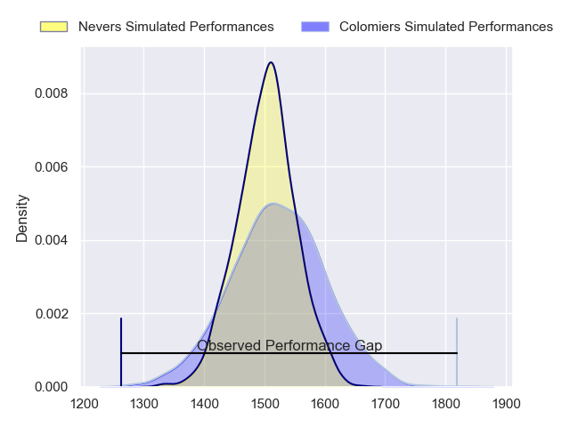
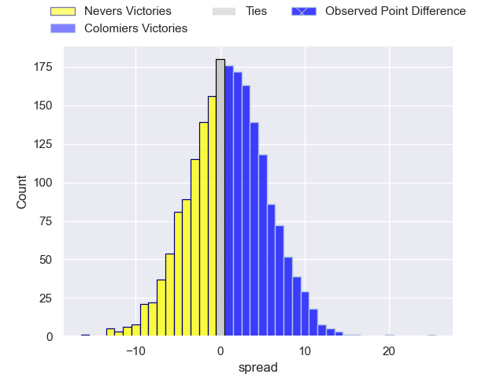
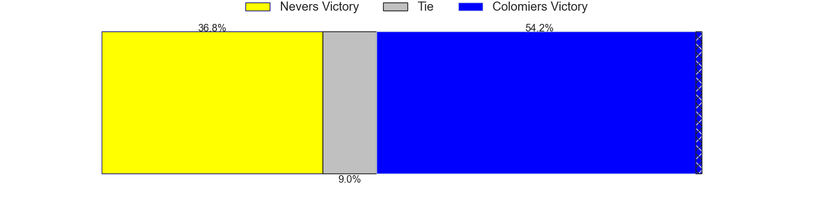
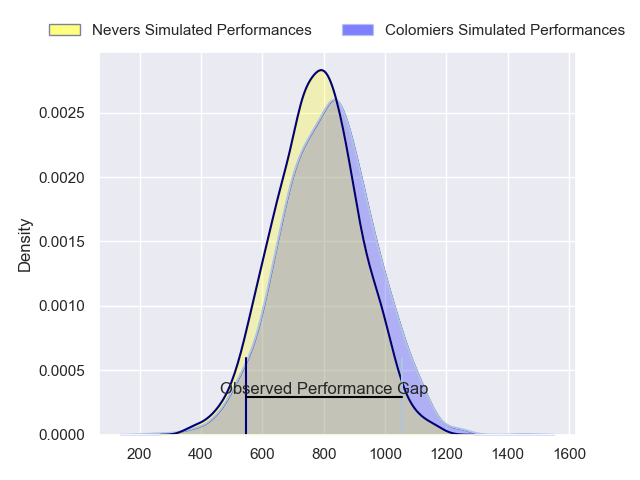
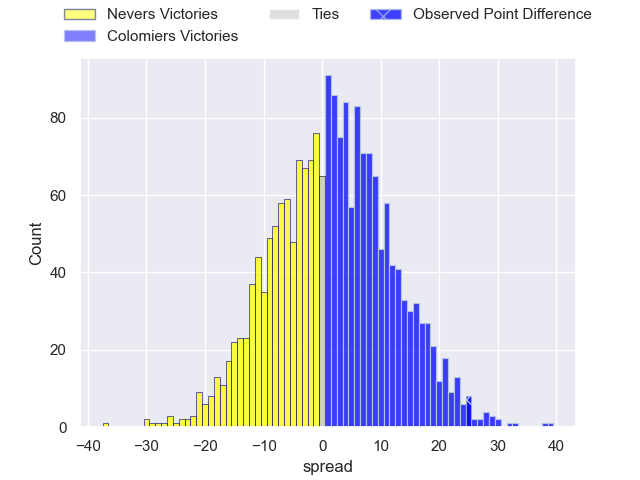
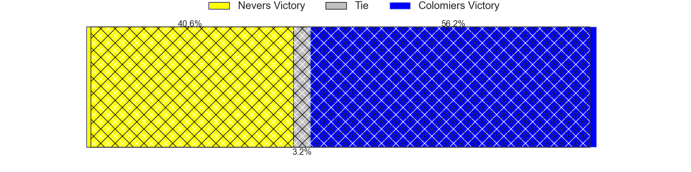
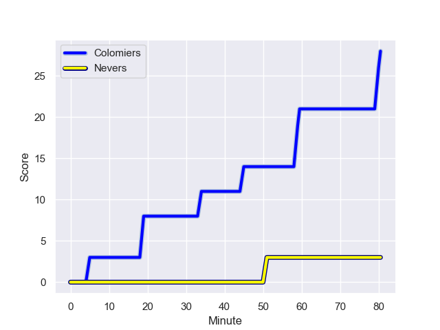
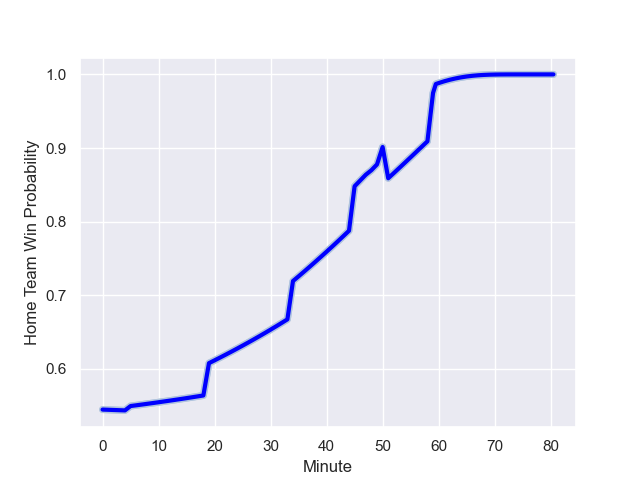

---  
layout: page  
title: Nevers at Colomiers; 3-28  
date: 2024-01-05 18:00:00 -0500  
categories: "Pro D2 2023" match review  
---
# Nevers at Colomiers; 3-28

# Club Level Predictions

The first set of predictions treats a club as the smallest object, as the club develops its members, organizes a gameplan, and deploys its players as needed for each match. This club model has a prediction of 0.526, which translates to predicting Colomiers to win by 0.9.

Our Over/Under is 27.5 - and combined with the spread above, we have a predicted scoreline of 13 to 14

Each club has a rating and a rating deviation (similar to a Glicko rating), and expected performances can be generated. This allows for simulated matches and spreads like the ones below.
## Projected Performances - Club Model

## Projected Spreads - Club Model

## Projected Results - Club Model

# Player Level Predictions - Version 2

Treating teams instead as an entity made up of the currently active players, I have ratings for each player in an altogether different system. These can be combined to form team ratings once teamsheets are announced, weighting starters a bit higher than the reserves. After the match is played, players can be weighted by their minutes on the field, allowing for an accurate measure of the team's composition. With these compiled team ratings, we can make predictions, measure inaccuracy, and update the individual player ratings.
## Prediction with Player Minutes: Colomiers by 2.0

Nevers by 4.9 on a neutral field
## Prediction without Player Minutes: Colomiers by 1.6

Nevers by 5.2 on a neutral pitch

## Projected Performances - Player Model

## Projected Spreads - Player Model

## Projected Results - Player Model

## Scores over Time

## Win Probability over Time

There were 5 large changes in win probability in this match

|   Away Minutes | Away Player              |   Away elo |   Number |   Home elo | Home Player           |   Home Minutes |
|---------------:|:-------------------------|-----------:|---------:|-----------:|:----------------------|---------------:|
|             61 | Jordan Seneca            |      54.45 |        1 |      54.08 | Hugo Djehi            |             61 |
|             51 | Elia Elia                |      44.69 |        2 |      -2.7  | Thomas Larrieu        |             50 |
|             51 | Ilia Kaikatsishvili      |      50    |        3 |      45.26 | Hugo Pirlet           |             51 |
|             80 | Christiaan van der Merwe |      -7.77 |        4 |      18.56 | Anthony Coletta       |             59 |
|             48 | Makatuki Polutele        |      26.49 |        5 |      75.14 | Maxime Granouillet    |             55 |
|             54 | Luka Plataret            |      47.37 |        6 |      36.48 | Waël Ponpon           |             55 |
|             48 | Julien Kazubek           |      78.5  |        7 |      67.85 | Aldric Lescure        |             80 |
|             80 | Jason-Colin Fraser       |     107.37 |        8 |      46.54 | Joseva Tamani         |             80 |
|             54 | Guillaume Manevy         |      26.86 |        9 |      29.48 | Ugo Seguela           |             61 |
|             80 | Yohan Le Bourhis         |      44.36 |       10 |      -8.54 | Brett Herron          |             80 |
|             80 | Arthur Mathiron          |      58.23 |       11 |     104.72 | Rodrigo Marta         |             80 |
|             80 | Rudy Derrieux            |      56.05 |       12 |      54.63 | Ray Nu'u              |             80 |
|             80 | Alifereti Loaloa         |      87.62 |       13 |      -0.32 | Martin Dulon          |             65 |
|             57 | Perry Mayo               |      52.8  |       14 |      73.31 | Vincent Pinto         |             80 |
|             80 | Thomas Zenon             |      20.09 |       15 |      20.85 | Thomas Girard         |             80 |
|             32 | Will Skelton             |      97.88 |       16 |      38.6  | Pablo Dimcheff        |             30 |
|             32 | Hugues Bastide           |      82.16 |       17 |      67.3  | Michael Simutoga      |             29 |
|             29 | Jonathan Maiau           |      31.47 |       18 |      43.52 | Jeremy Bechu          |             25 |
|             29 | Cleopas Kundiona         |      38.22 |       19 |      36.62 | Alexandre Manukula    |             25 |
|             26 | Kevin Noah               |      45.91 |       20 |      38.08 | Pierre-Samuel Pacheco |             19 |
|             26 | Hugo Bouyssou            |      18.16 |       21 |      47.86 | Jean Thomas           |             21 |
|             23 | Dylan Jaminet            |      57.21 |       22 |      55.67 | Mathis Galthié        |             19 |
|             19 | Aitor Kitutu             |      61.84 |       23 |      59.02 | Dorian Laborde        |             15 |

