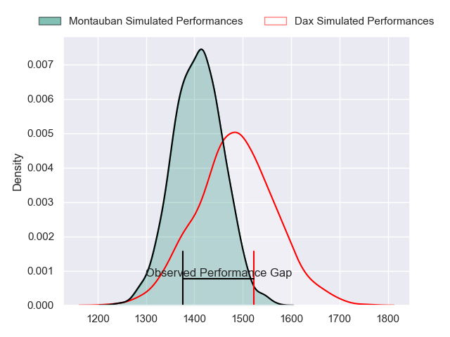
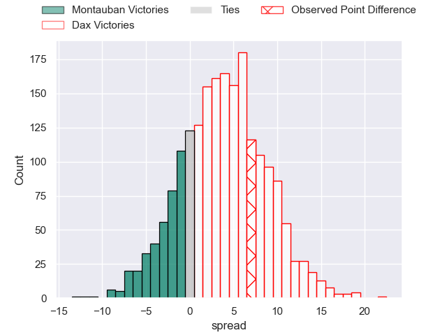
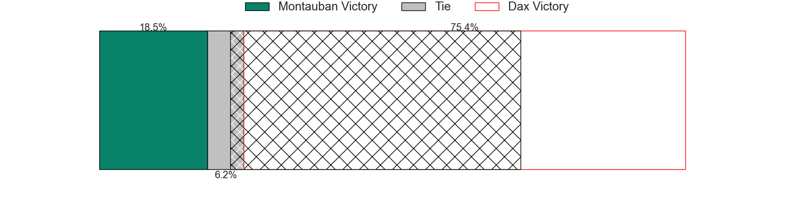
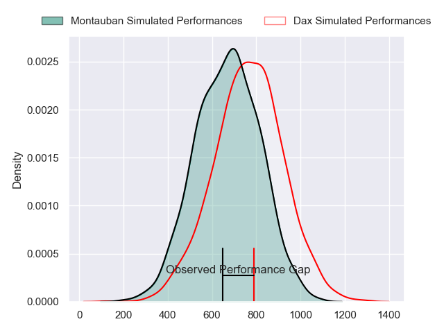
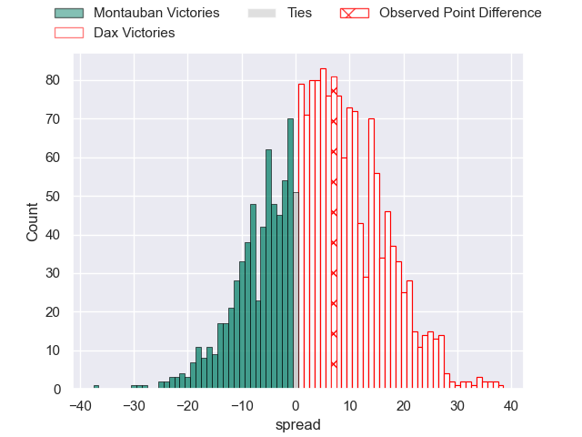
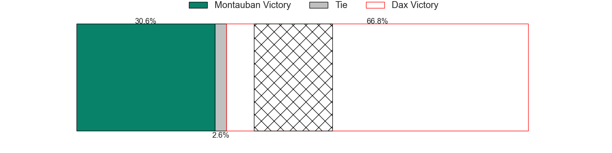
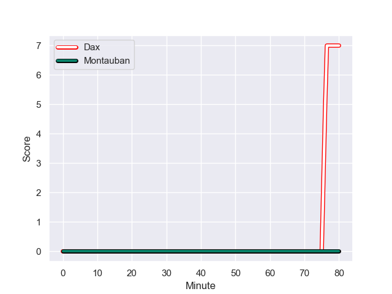
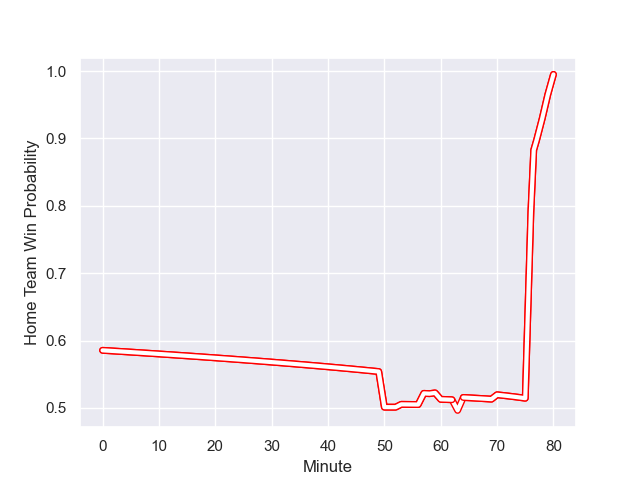

---  
layout: page  
title: Montauban at Dax; 0-7  
date: 2024-01-05 18:00:00 -0500  
categories: "Pro D2 2023" match review  
---
# Montauban at Dax; 0-7

# Club Level Predictions

The first set of predictions treats a club as the smallest object, as the club develops its members, organizes a gameplan, and deploys its players as needed for each match. This club model has a prediction of 0.605, which translates to predicting Dax to win by 3.7.

Our Over/Under is 41.5 - and combined with the spread above, we have a predicted scoreline of 19 to 23

Each club has a rating and a rating deviation (similar to a Glicko rating), and expected performances can be generated. This allows for simulated matches and spreads like the ones below.
## Projected Performances - Club Model

## Projected Spreads - Club Model

## Projected Results - Club Model

# Player Level Predictions - Version 2

Treating teams instead as an entity made up of the currently active players, I have ratings for each player in an altogether different system. These can be combined to form team ratings once teamsheets are announced, weighting starters a bit higher than the reserves. After the match is played, players can be weighted by their minutes on the field, allowing for an accurate measure of the team's composition. With these compiled team ratings, we can make predictions, measure inaccuracy, and update the individual player ratings.
## Prediction with Player Minutes: Dax by 3.8

Montauban by 2.9 on a neutral field
## Prediction without Player Minutes: Dax by 4.7

Montauban by 2.0 on a neutral pitch

## Projected Performances - Player Model

## Projected Spreads - Player Model

## Projected Results - Player Model

## Scores over Time

## Win Probability over Time

There were 6 large changes in win probability in this match

|   Away Minutes | Away Player       |   Away elo |   Number |   Home elo | Home Player           |   Home Minutes |
|---------------:|:------------------|-----------:|---------:|-----------:|:----------------------|---------------:|
|             53 | Lucas Seyrolle    |      23.49 |        1 |      62.34 | Louis Mary            |             50 |
|             60 | Kevin Firmin      |      14.98 |        2 |      37.88 | Maxime Delonca        |             50 |
|             64 | Mirian Burduli    |       7.22 |        3 |      13.68 | Diogo Hasse Ferreira  |             50 |
|             80 | Frank Bradshaw    |      70.27 |        4 |      30.89 | Josh Furno            |             80 |
|             50 | Kevin Gimeno      |      -5.97 |        5 |      66.07 | Mat Luamanu           |             60 |
|             50 | Kyllian Ringuet   |      38.69 |        6 |      31.92 | Jean-Baptiste Barrère |             53 |
|             59 | Karl Wilkins      |      55.13 |        7 |      68.17 | Paul Arnaud Ausset    |             80 |
|             80 | Tyrone Viiga      |       6.89 |        8 |      50.07 | Sam Wasley            |             80 |
|             50 | Alexis Bernadet   |      69.94 |        9 |      42.85 | Sylvère Reteau        |             70 |
|             80 | Thomas Fortunel   |      46.59 |       10 |      39.91 | Romuald Séguy         |             80 |
|             80 | Bastien Guillemin |      23.68 |       11 |      22.17 | Maxime Oltmann        |             80 |
|             53 | Sevanaia Galala   |      87.06 |       12 |      38.05 | Ilikena Bolakoro      |             80 |
|             80 | Yvan Reilhac      |      76.44 |       13 |      15.91 | Benjamin Puntous      |             57 |
|             80 | Josua Vici        |      46.15 |       14 |      45.17 | Théo Gatelier         |             80 |
|             80 | Jérôme Bosviel    |      96.15 |       15 |      55.52 | Théo Duprat           |             63 |
|             30 | Lewis Bean        |      53.12 |       16 |      10.47 | Asa Faitotoa          |             30 |
|             30 | Quentin Witt      |      33.42 |       17 |      11.43 | David Lolohea         |             30 |
|             30 | Yoan Cottin       |      74.25 |       18 |      26.32 | Louis Barrere         |             30 |
|             27 | Maxime Mathy      |      29.48 |       19 |      48.47 | Arnaud Aletti         |             27 |
|             27 | Leo Aouf          |      20.9  |       20 |      61.01 | Bastien Daguerre      |             23 |
|             20 | Ru-Hann Greyling  |      41.14 |       21 |       7.22 | Jean-Baptiste Singer  |             20 |
|             21 | Noa Kanika        |      50.47 |       22 |      54.04 | Hugo Cerisier         |             17 |
|             16 | WillGriff John    |      60.61 |       23 |      70.92 | Simon Garrouteigt     |             10 |

