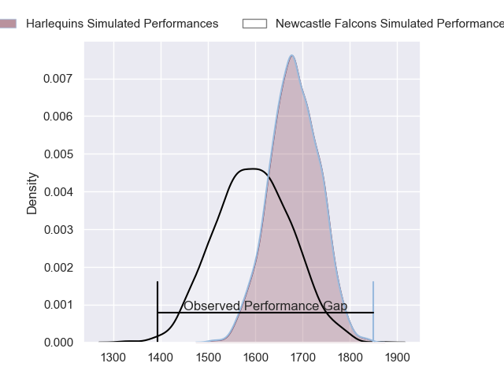
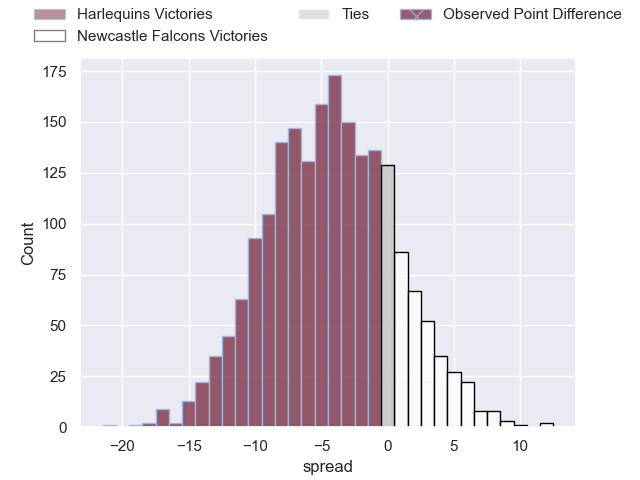
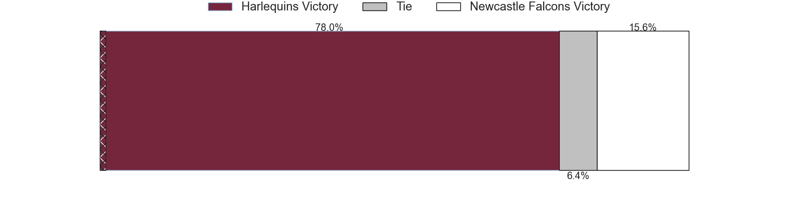
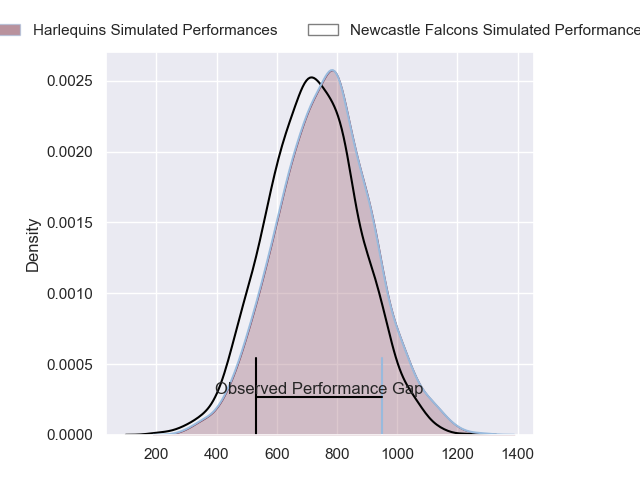
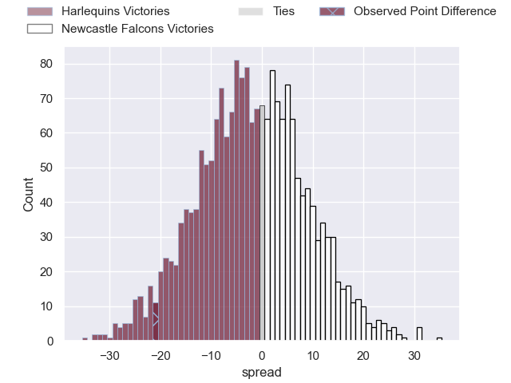
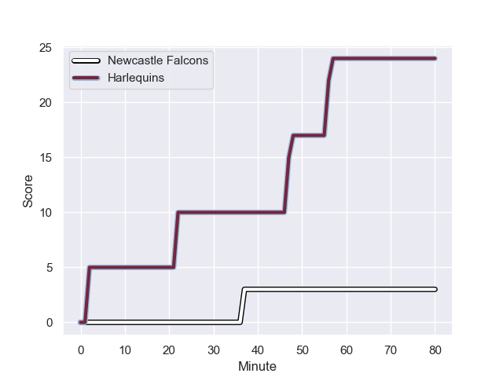
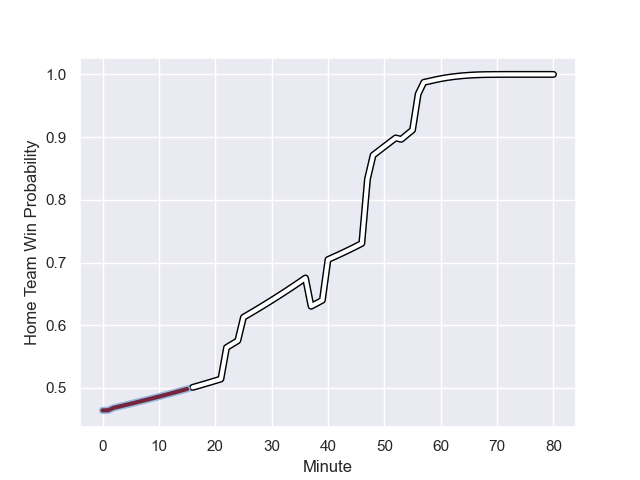

---  
layout: page  
title: Harlequins at Newcastle Falcons; 24-3  
date: 2024-01-05 18:00:00 -0500  
categories: "Gallagher Premiership 2023" match review  
---
# Harlequins at Newcastle Falcons; 24-3

# Club Level Predictions

The first set of predictions treats a club as the smallest object, as the club develops its members, organizes a gameplan, and deploys its players as needed for each match. This club model has a prediction of 0.375, which translates to predicting Harlequins to win by 4.5.

Our Over/Under is 46.5 - and combined with the spread above, we have a predicted scoreline of 25 to 21

Each club has a rating and a rating deviation (similar to a Glicko rating), and expected performances can be generated. This allows for simulated matches and spreads like the ones below.
## Projected Performances - Club Model

## Projected Spreads - Club Model

## Projected Results - Club Model

# Player Level Predictions - Version 2

Treating teams instead as an entity made up of the currently active players, I have ratings for each player in an altogether different system. These can be combined to form team ratings once teamsheets are announced, weighting starters a bit higher than the reserves. After the match is played, players can be weighted by their minutes on the field, allowing for an accurate measure of the team's composition. With these compiled team ratings, we can make predictions, measure inaccuracy, and update the individual player ratings.
## Prediction with Player Minutes: Harlequins by 1.6

Harlequins by 8.5 on a neutral field
## Prediction without Player Minutes: Newcastle Falcons by 0.0

Harlequins by 6.9 on a neutral pitch

## Projected Performances - Player Model

## Projected Spreads - Player Model

## Projected Results - Player Model

## Scores over Time

## Win Probability over Time

There were 7 large changes in win probability in this match

|   Away Minutes | Away Player               |   Away elo |   Number |   Home elo | Home Player         |   Home Minutes |
|---------------:|:--------------------------|-----------:|---------:|-----------:|:--------------------|---------------:|
|             76 | Fin Baxter                |      17.2  |        1 |      27.66 | Phil Brantingham    |             57 |
|             66 | Jack Walker               |      24.74 |        2 |      57.42 | Bryan Byrne         |             75 |
|             66 | Will Collier              |      67.62 |        3 |      26.49 | Eduardo Bello       |             66 |
|             57 | Irne Herbst               |      53.01 |        4 |      -1.69 | Sebastian de Chaves |             69 |
|             80 | George Hammond            |      -7.35 |        5 |      32.51 | Kiran McDonald      |             80 |
|             80 | James Chisholm            |      73.14 |        6 |      37.25 | Pedro Rubiolo       |             58 |
|             80 | Will Evans                |      46.66 |        7 |      35.14 | Guy Pepper          |             80 |
|             57 | Alex Dombrandt            |      76.65 |        8 |       8.32 | Callum Chick        |             80 |
|             25 | Will Porter               |      14.81 |        9 |      18.44 | James Elliott       |             53 |
|             80 | Will Edwards              |      57.95 |       10 |      42.23 | Brett Connon        |             80 |
|             80 | Cameron Anderson          |      27.84 |       11 |      42.52 | Iwan Stephens       |             80 |
|             80 | Andre Esterhuizen         |     109.07 |       12 |      46.65 | Jordan Holgate      |             41 |
|             72 | Oscar Beard               |      55.08 |       13 |       9.26 | George Wacokecoke   |             80 |
|             66 | Nick David                |      29.23 |       14 |      99.15 | Adam Radwan         |             80 |
|             80 | Tyrone Green              |      71.26 |       15 |      98.17 | Tom Penny           |             40 |
|             14 | Sam Riley                 |      41.13 |       16 |      46.65 | Michael van Vuuren  |              5 |
|              4 | Jordan Els                |      46.65 |       17 |      -2.09 | Adam Brocklebank    |             23 |
|             14 | Lovejoy Chawatama         |      46.65 |       18 |      44.96 | Murray McCallum     |             14 |
|             23 | Joe Launchbury            |     111    |       19 |      42.41 | Tim Cardall         |             11 |
|             23 | Chandler Cunningham-South |      56.88 |       20 |      46.65 | Philip van der Walt |             22 |
|             55 | Max Green                 |      46.65 |       21 |      46.65 | Josh Barton         |             27 |
|              8 | Lennox Anyanwu            |      78.38 |       22 |      46.65 | Louie Johnson       |             39 |
|             14 | Louis Lynagh              |      62.54 |       23 |      22.7  | Elliott Obatoyinbo  |             40 |

