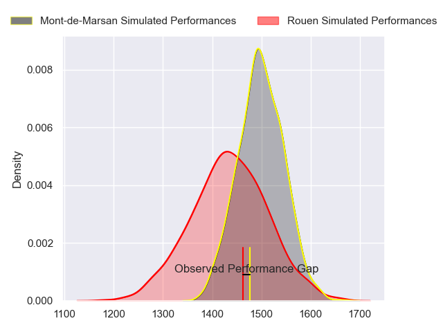
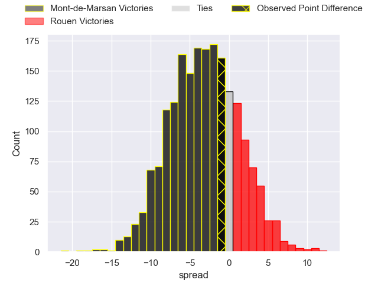
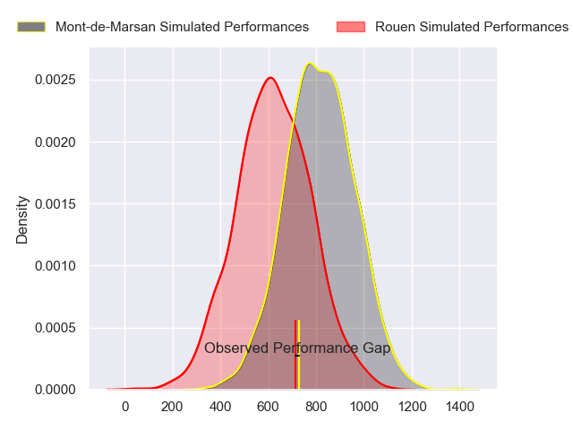
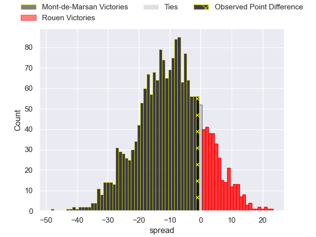
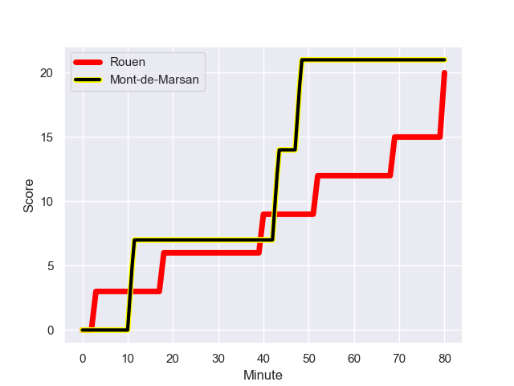
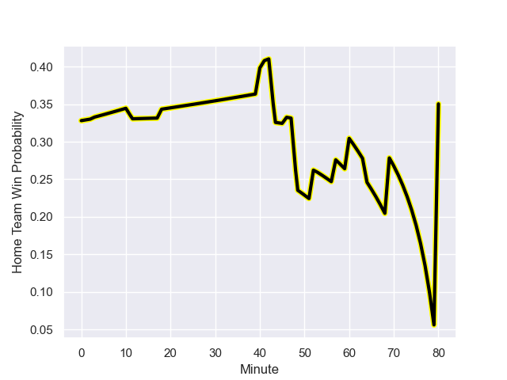

---  
layout: page  
title: Mont-de-Marsan at Rouen; 21-20  
date: 2024-01-05 18:00:00 -0500  
categories: "Pro D2 2023" match review  
---
# Mont-de-Marsan at Rouen; 21-20

# Club Level Predictions

The first set of predictions treats a club as the smallest object, as the club develops its members, organizes a gameplan, and deploys its players as needed for each match. This club model has a prediction of 0.41, which translates to predicting Mont-de-Marsan to win by 3.2.

Our Over/Under is 37.5 - and combined with the spread above, we have a predicted scoreline of 20 to 17

Each club has a rating and a rating deviation (similar to a Glicko rating), and expected performances can be generated. This allows for simulated matches and spreads like the ones below.
## Projected Performances - Club Model

## Projected Spreads - Club Model

## Projected Results - Club Model

# Player Level Predictions - Version 2

Treating teams instead as an entity made up of the currently active players, I have ratings for each player in an altogether different system. These can be combined to form team ratings once teamsheets are announced, weighting starters a bit higher than the reserves. After the match is played, players can be weighted by their minutes on the field, allowing for an accurate measure of the team's composition. With these compiled team ratings, we can make predictions, measure inaccuracy, and update the individual player ratings.
## Prediction with Player Minutes: Mont-de-Marsan by 7.8

Mont-de-Marsan by 11.6 on a neutral field
## Prediction without Player Minutes: Mont-de-Marsan by 9.0

Mont-de-Marsan by 12.8 on a neutral pitch

## Projected Performances - Player Model

## Projected Spreads - Player Model

## Projected Results - Player Model

## Scores over Time

## Win Probability over Time

There were 13 large changes in win probability in this match

|   Away Minutes | Away Player               |   Away elo |   Number |   Home elo | Home Player        |   Home Minutes |
|---------------:|:--------------------------|-----------:|---------:|-----------:|:-------------------|---------------:|
|             41 | Dino Casadei              |      50.93 |        1 |      -2.2  | Elias El Ansari    |             66 |
|             60 | Torsten van Jaarsveld     |     110.64 |        2 |     -25.21 | Jeremie Maurouard  |             71 |
|             64 | Gheorghe Gajion           |      76.27 |        3 |      45.7  | Soso Bekoshvili    |             60 |
|             80 | Nicolas Garrault          |      21.12 |        4 |      10.88 | John-Charles Astle |             53 |
|             80 | Romain Durand             |      57.48 |        5 |       9.95 | Will Witty         |             80 |
|             46 | Aurélien Lisena           |      41.02 |        6 |      46.57 | Tienie Burger      |             60 |
|             80 | Léo Banos                 |      77.94 |        7 |      76.03 | Julien Ruaud       |             53 |
|             57 | Veresa Tuqovu Ramototabua |      72.93 |        8 |      20.04 | Tino Mapapalangi   |             80 |
|             46 | Kevin Viallard            |      45.87 |        9 |      52.69 | Maxime Sidobre     |             64 |
|             46 | Willie du Plessis         |      63.47 |       10 |      41.53 | Hugo Aubry         |             64 |
|             80 | Eroni Sau                 |      74.85 |       11 |      34.16 | Paul Vallee        |             80 |
|             60 | Jules Even                |      61.56 |       12 |      65.98 | Taylor Gontineac   |             80 |
|             80 | Gatien Masse              |      43.92 |       13 |      32.06 | Pablo Patilla      |             80 |
|             80 | Simao Broeiro Bento       |      28.4  |       14 |      51.62 | Benjamin Descamps  |             80 |
|             80 | Yoann Laousse Azpiazu     |      39.92 |       15 |      61.63 | Franck Pourteau    |             80 |
|             39 | Thomas Bultel             |      35.34 |       16 |      35.68 | Jimi Maximin       |             27 |
|             34 | Raphaël Robic             |      58.32 |       17 |      77.4  | Kevin Bly          |             27 |
|             34 | Joris Pialot              |      24.2  |       18 |      32.83 | Cody Thomas        |             20 |
|             34 | Baptiste Canut            |      45.98 |       19 |      56.65 | Lucas Costa        |             20 |
|             23 | Aston Fortuin             |      29.77 |       20 |      10.63 | JT Jackson         |             16 |
|             20 | Patricio Fernandez        |      60.22 |       21 |      20.87 | Florent Campeggia  |             16 |
|             20 | Simon Labouyrie           |      32.46 |       22 |      37.15 | Antoine Fournier   |             14 |
|             16 | Mattéo Lalanne            |      46.38 |       23 |      32    | Lucas Malbert      |              9 |

