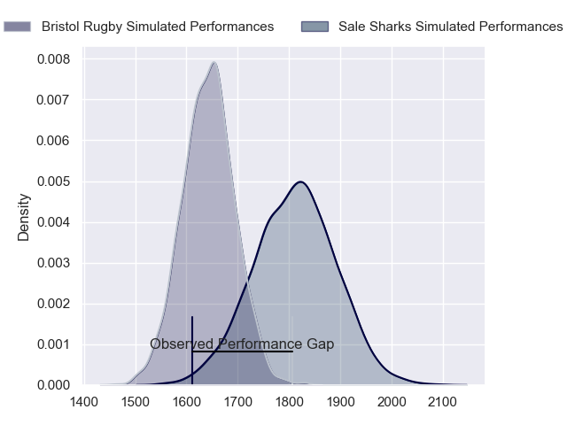
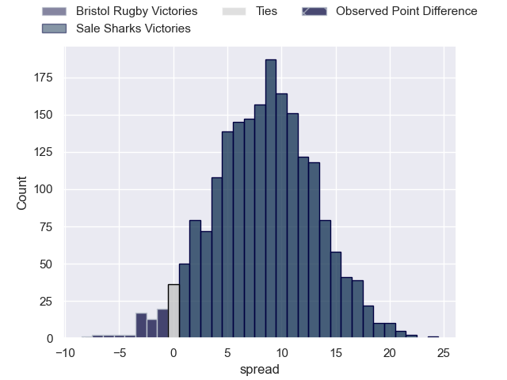
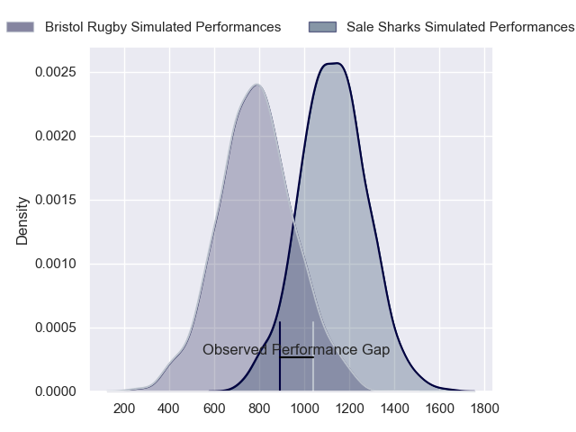
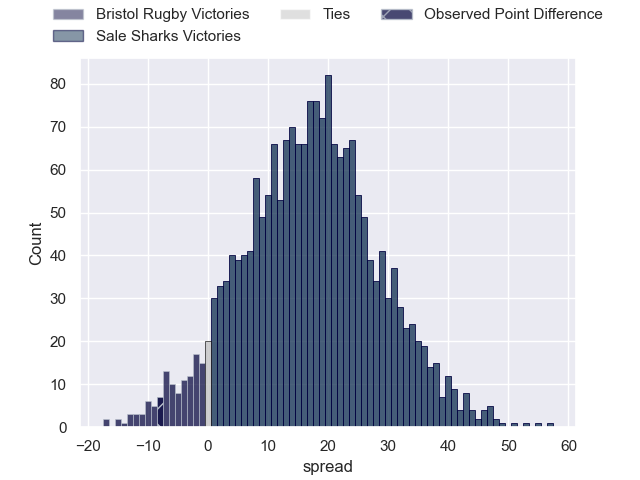
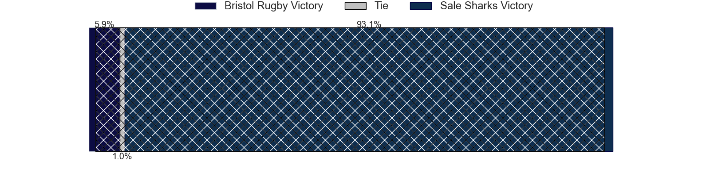
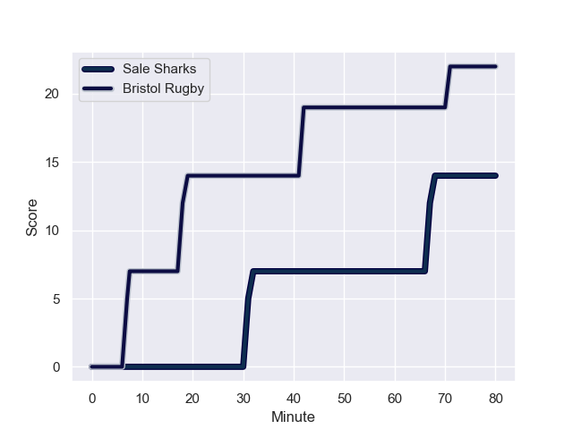
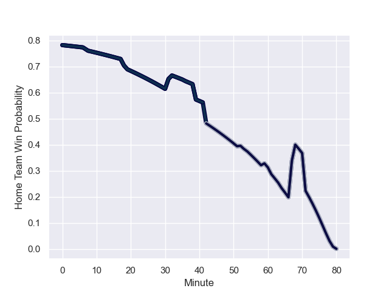

---  
layout: page  
title: Bristol Rugby at Sale Sharks; 22-14  
date: 2024-01-05 18:00:00 -0500  
categories: "Gallagher Premiership 2023" match review  
---
# Bristol Rugby at Sale Sharks; 22-14

# Club Level Predictions

The first set of predictions treats a club as the smallest object, as the club develops its members, organizes a gameplan, and deploys its players as needed for each match. This club model has a prediction of 0.722, which translates to predicting Sale Sharks to win by 8.4.

Our Over/Under is 43.5 - and combined with the spread above, we have a predicted scoreline of 18 to 26

Each club has a rating and a rating deviation (similar to a Glicko rating), and expected performances can be generated. This allows for simulated matches and spreads like the ones below.
## Projected Performances - Club Model

## Projected Spreads - Club Model

## Projected Results - Club Model

# Player Level Predictions - Version 2

Treating teams instead as an entity made up of the currently active players, I have ratings for each player in an altogether different system. These can be combined to form team ratings once teamsheets are announced, weighting starters a bit higher than the reserves. After the match is played, players can be weighted by their minutes on the field, allowing for an accurate measure of the team's composition. With these compiled team ratings, we can make predictions, measure inaccuracy, and update the individual player ratings.
## Prediction with Player Minutes: Sale Sharks by 14.2

Sale Sharks by 6.5 on a neutral field
## Prediction without Player Minutes: Sale Sharks by 15.3

Sale Sharks by 7.6 on a neutral pitch

## Projected Performances - Player Model

## Projected Spreads - Player Model

## Projected Results - Player Model

## Scores over Time

## Win Probability over Time

There were 14 large changes in win probability in this match

|   Away Minutes | Away Player                |   Away elo |   Number |   Home elo | Home Player          |   Home Minutes |
|---------------:|:---------------------------|-----------:|---------:|-----------:|:---------------------|---------------:|
|             64 | Max Lahiff                 |      33.58 |        1 |      76.61 | Ross Harrison        |             61 |
|             80 | Gabriel Oghre              |      34.51 |        2 |      88.36 | Luke Cowan-Dickie    |             61 |
|             59 | Kyle Sinckler              |      67.24 |        3 |      40.44 | Nic Schonert         |             52 |
|             80 | Josh Caulfield             |      42.15 |        4 |      62.14 | Josh Beaumont        |             80 |
|             80 | Joe Batley                 |      53.76 |        5 |      46.51 | Jonny Hill           |             80 |
|             59 | Steven Luatua              |      90.43 |        6 |      95.28 | Ernst van Rhyn       |             52 |
|             64 | Daniel Thomas              |      46.95 |        7 |      37.64 | Ben Curry            |             80 |
|             80 | Magnus Bradbury            |      22.01 |        8 |     139.38 | Jean-Luc du Preez    |             39 |
|             36 | Harry Randall              |      81.56 |        9 |      41.67 | Gus Warr             |             54 |
|             80 | AJ MacGinty                |      46.65 |       10 |      40    | Robert du Preez      |             80 |
|             80 | Gabriel Ibitoye            |      77.18 |       11 |      82.72 | Arron Reed           |             80 |
|             80 | James Williams             |      37.09 |       12 |      46.65 | Rekeiti Ma'asi-White |             74 |
|             80 | Benhard Janse van Rensburg |      76.31 |       13 |      99.46 | Sam James            |             80 |
|             80 | Noah Heward                |      47.57 |       14 |      63.53 | Tom Roebuck          |             52 |
|             80 | Max Malins                 |      39.3  |       15 |      25.76 | Joe Carpenter        |             80 |
|              0 | Will Capon                 |      29.97 |       16 |      90.95 | Agustin Creevy       |             19 |
|             16 | Sam Grahamslaw             |      46.65 |       17 |      46.69 | Tumy Onasanya        |             19 |
|             21 | George Kloska              |      56.36 |       18 |      46.65 | James Harper         |             28 |
|             21 | Joe Owen                   |      46.65 |       19 |      46.65 | Ben Bamber           |             41 |
|             16 | Jake Heenan                |      46.05 |       20 |      35.24 | Sam Dugdale          |             28 |
|             44 | Kieran Marmion             |      83.87 |       21 |      46.69 | Nye Thomas           |             26 |
|              0 | Kalaveti Ravouvou          |      62.39 |       22 |      46.65 | Tom Curtis           |              6 |
|              0 | Richard Lane               |      51.5  |       23 |     143.77 | Telusa Veainu        |             28 |

