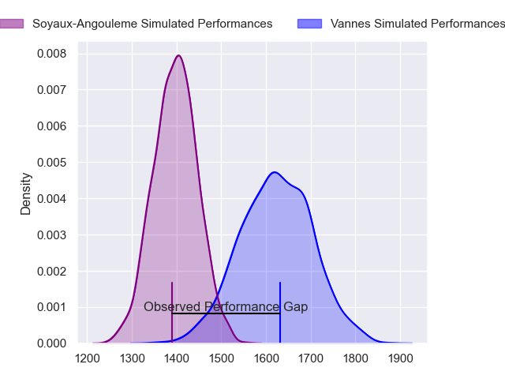
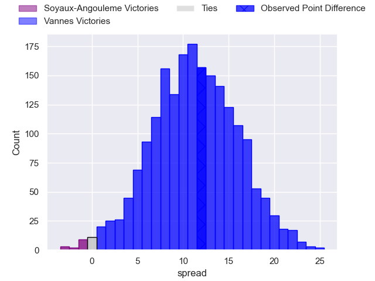
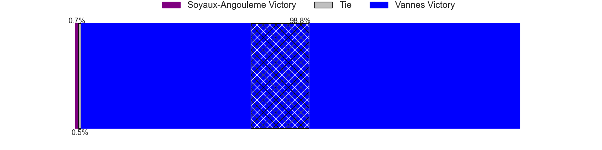
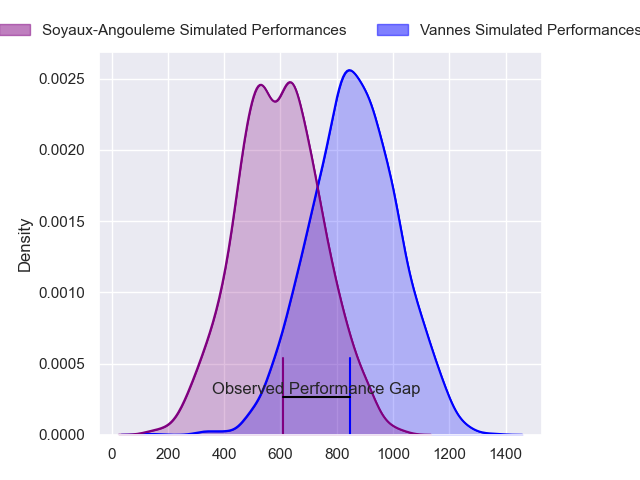
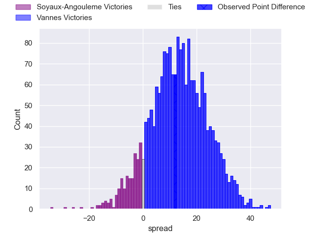
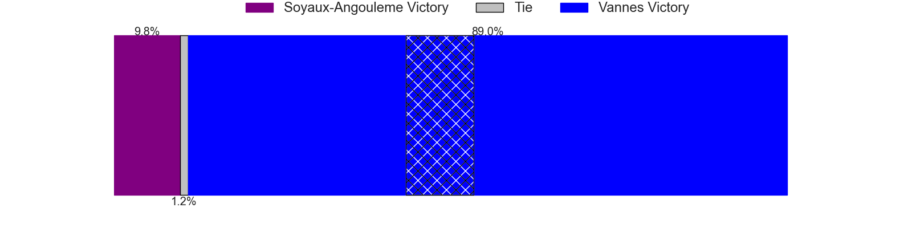
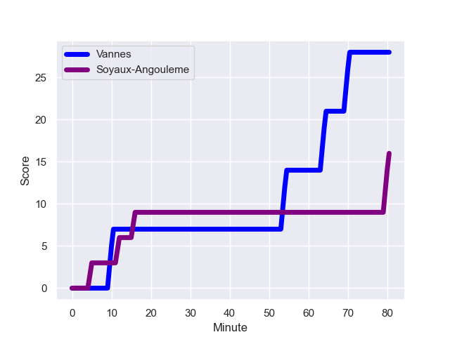
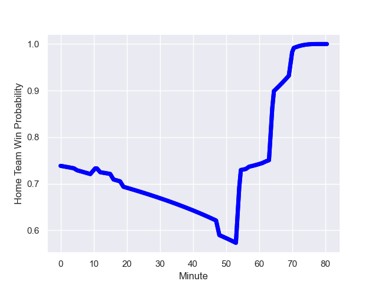

---  
layout: page  
title: Soyaux-Angouleme at Vannes; 16-28  
date: 2024-01-05 18:00:00 -0500  
categories: "Pro D2 2023" match review  
---
# Soyaux-Angouleme at Vannes; 16-28

# Club Level Predictions

The first set of predictions treats a club as the smallest object, as the club develops its members, organizes a gameplan, and deploys its players as needed for each match. This club model has a prediction of 0.783, which translates to predicting Vannes to win by 11.3.

Our Over/Under is 48.5 - and combined with the spread above, we have a predicted scoreline of 18 to 30

Each club has a rating and a rating deviation (similar to a Glicko rating), and expected performances can be generated. This allows for simulated matches and spreads like the ones below.
## Projected Performances - Club Model

## Projected Spreads - Club Model

## Projected Results - Club Model

# Player Level Predictions - Version 2

Treating teams instead as an entity made up of the currently active players, I have ratings for each player in an altogether different system. These can be combined to form team ratings once teamsheets are announced, weighting starters a bit higher than the reserves. After the match is played, players can be weighted by their minutes on the field, allowing for an accurate measure of the team's composition. With these compiled team ratings, we can make predictions, measure inaccuracy, and update the individual player ratings.
## Prediction with Player Minutes: Vannes by 11.4

Vannes by 7.1 on a neutral field
## Prediction without Player Minutes: Vannes by 12.8

Vannes by 8.4 on a neutral pitch

## Projected Performances - Player Model

## Projected Spreads - Player Model

## Projected Results - Player Model

## Scores over Time

## Win Probability over Time

There were 6 large changes in win probability in this match

|   Away Minutes | Away Player        |   Away elo |   Number |   Home elo | Home Player             |   Home Minutes |
|---------------:|:-------------------|-----------:|---------:|-----------:|:------------------------|---------------:|
|             57 | Omar Odishvili     |      58.59 |        1 |      59.78 | Andy Bordelai           |             54 |
|             19 | Patxi Bidart       |      42.48 |        2 |      54.5  | Pat Leafa               |             54 |
|             48 | Omar Dahir         |      54.32 |        3 |      76.46 | Paga Tafili             |             62 |
|             80 | Ian Kitwanga       |      49.36 |        4 |      65.42 | Darren O'Shea           |             62 |
|             63 | Matthew Dalton     |       1.76 |        5 |      46.41 | Anton Bresler           |             62 |
|             48 | Gautier Gibouin    |     -18.64 |        6 |      25.16 | Juan Bautista Pedemonte |             80 |
|             80 | Nicolas Martins    |      76.68 |        7 |      97.1  | Francisco Gorrissen     |             80 |
|             54 | Matt Va'ai         |       0.34 |        8 |      63.57 | Sione Kalamafoni        |             62 |
|             54 | Alexis Levron      |      23.82 |        9 |      39.97 | Jules Le Bail           |             62 |
|             71 | Corentin Glenat    |      30.08 |       10 |      16.84 | Massimo Ortolan         |             54 |
|             80 | Matthys Gratien    |      53.74 |       11 |      26.55 | Martin Alonso Munoz     |             80 |
|             80 | Mathis Lafon       |      34.18 |       12 |      -0.5  | Alex Arrate             |             80 |
|             80 | Inaki Ayarza       |      39.14 |       13 |       1.92 | Arthur Proult           |             80 |
|             80 | Eoghan Barrett     |      41.67 |       14 |      55.22 | Paul Surano             |             80 |
|             80 | Jules Dubecq       |      49.22 |       15 |     129.37 | Gwenaël Duplenne        |             80 |
|             61 | Rayne Barka        |      58.49 |       16 |      42.12 | Charles-Henri Berguet   |             26 |
|             32 | Seydou Diakité     |      33.17 |       17 |      47.65 | Théo Beziat             |             26 |
|             32 | Germain Burgaud    |      60.58 |       18 |     102.88 | Maxime Lafage           |             26 |
|             26 | Hubert Texier      |      47.69 |       19 |      29.22 | Mattéo Desjeux          |             18 |
|             26 | Adrien Bau         |      -7.26 |       20 |      -7.01 | Eric Marks              |             18 |
|             23 | Luca Tabarot       |      48.96 |       21 |      26.79 | Léon Boulier            |             18 |
|             17 | William Greatbanks |      49.69 |       22 |     102.34 | Michael Ruru            |             18 |
|              9 | Ben Botica         |      66.37 |       23 |      59.78 | Jérémy Boyadjis         |             18 |

