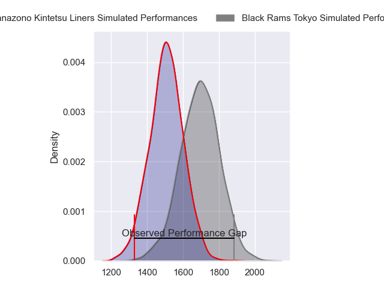
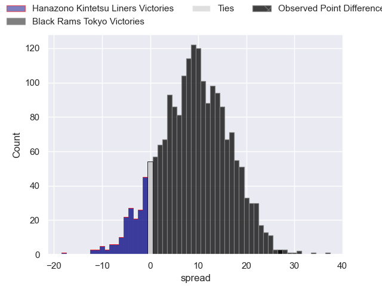
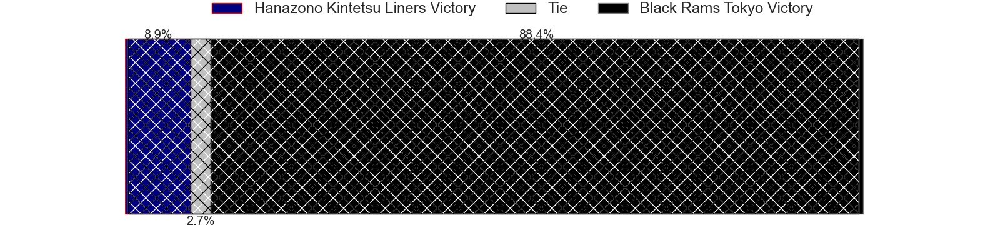
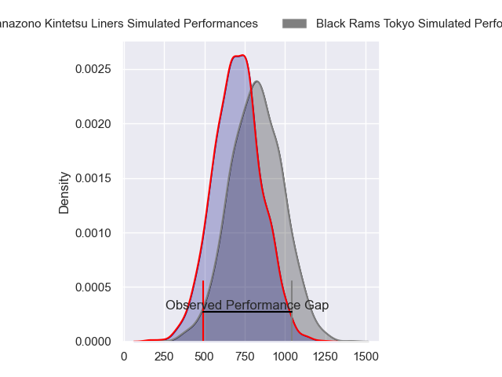
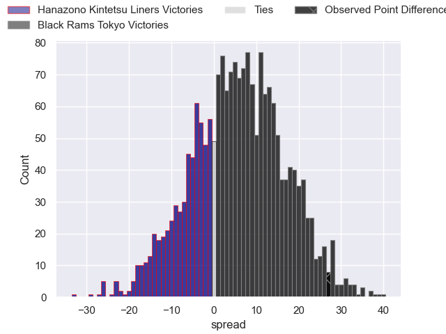
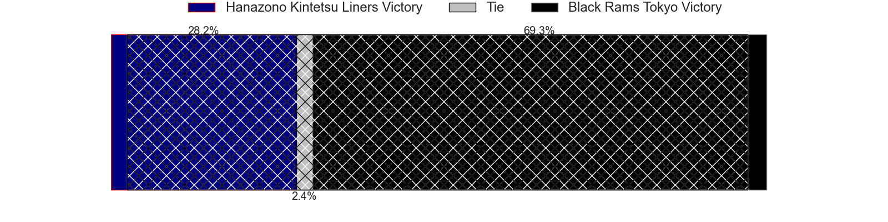
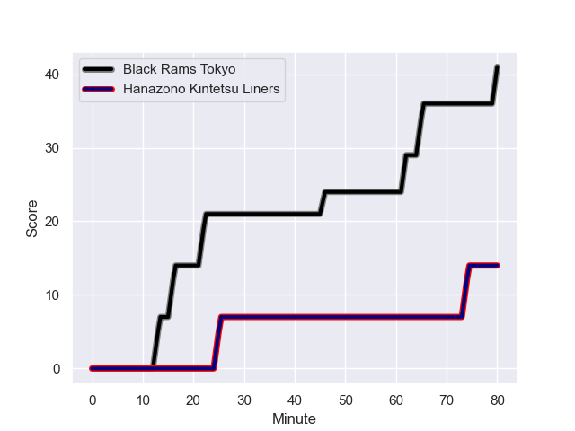
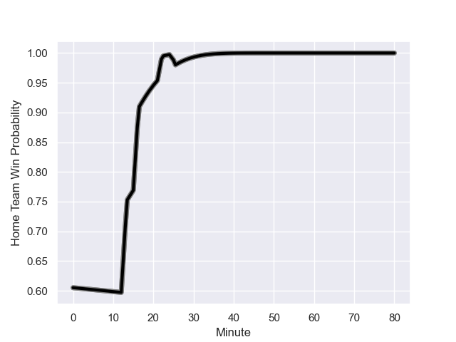

---  
layout: page  
title: Hanazono Kintetsu Liners at Black Rams Tokyo; 14-41  
date: 2024-01-06 18:00:00 -0500  
categories: "Japan Rugby League One 2023" match review  
---
# Hanazono Kintetsu Liners at Black Rams Tokyo; 14-41

# Club Level Predictions

The first set of predictions treats a club as the smallest object, as the club develops its members, organizes a gameplan, and deploys its players as needed for each match. This club model has a prediction of 0.728, which translates to predicting Black Rams Tokyo to win by 8.9.

Our Over/Under is 48.5 - and combined with the spread above, we have a predicted scoreline of 20 to 29

Each club has a rating and a rating deviation (similar to a Glicko rating), and expected performances can be generated. This allows for simulated matches and spreads like the ones below.
## Projected Performances - Club Model

## Projected Spreads - Club Model

## Projected Results - Club Model

# Player Level Predictions - Version 2

Treating teams instead as an entity made up of the currently active players, I have ratings for each player in an altogether different system. These can be combined to form team ratings once teamsheets are announced, weighting starters a bit higher than the reserves. After the match is played, players can be weighted by their minutes on the field, allowing for an accurate measure of the team's composition. With these compiled team ratings, we can make predictions, measure inaccuracy, and update the individual player ratings.
## Prediction with Player Minutes: Black Rams Tokyo by 4.7

Hanazono Kintetsu Liners by 1.0 on a neutral field
## Prediction without Player Minutes: Black Rams Tokyo by 3.3

Hanazono Kintetsu Liners by 0.3 on a neutral pitch

## Projected Performances - Player Model

## Projected Spreads - Player Model

## Projected Results - Player Model

## Scores over Time

## Win Probability over Time

There were 5 large changes in win probability in this match

|   Away Minutes | Away Player       |   Away elo |   Number |   Home elo | Home Player        |   Home Minutes |
|---------------:|:------------------|-----------:|---------:|-----------:|:-------------------|---------------:|
|             52 | Shun Sasaki       |      31.4  |        1 |      73.14 | Yuichiro Taniguchi |             51 |
|             52 | Keiichi Kaneko    |      39.09 |        2 |      71.69 | Ko Sato            |             80 |
|             70 | Yuchol Mun        |      45.51 |        3 |      42.71 | Paddy Ryan         |             60 |
|             80 | James Blackwell   |      34.17 |        4 |     -16.82 | Mike Stolberg      |             80 |
|             24 | Sanaila Waqa      |      65.07 |        5 |      53.95 | Pohiva Lotoahea    |             63 |
|             80 | Jed Brown         |      49.88 |        6 |      63.62 | Talau Fakatava     |             80 |
|             52 | Tsuyoshi Murata   |      10.45 |        7 |      65.06 | Shuhei Matsuhashi  |             80 |
|             80 | Jose Seru         |      75.1  |        8 |      91.28 | Nathan Hughes      |             60 |
|             52 | Will Genia        |      97.32 |        9 |      50.74 | Toshiya Takahashi  |             67 |
|             80 | Quade Cooper      |     181.87 |       10 |      46.65 | Ichigo Nakakusu    |             56 |
|             80 | Tomoya Kimura     |      54.62 |       11 |      69.97 | Netani Vakayalia   |             80 |
|             80 | Takumi Yoshimoto  |      36.36 |       12 |      21.14 | Yuta Kurihara      |             80 |
|             52 | Tom Hendrickson   |      58.45 |       13 |      -5.3  | Viliami Lolohea    |             63 |
|             80 | Joshua Nohra      |       5.81 |       14 |      30.51 | Daisuke Nishikawa  |             80 |
|             64 | Daisuke Noguchi   |       3.22 |       15 |      60.2  | Isaac Lucas        |             80 |
|             56 | Takahito Sugahara |     -22.11 |       16 |      62.37 | Kazuma Nishi       |             29 |
|             28 | Nesta Mahina      |      44.61 |       17 |      80.5  | Matt McGahan       |             24 |
|             28 | Andrew Makalio    |      24.05 |       18 |      46.62 | Shohei Oyama       |             20 |
|             28 | Patrick Tafa      |      15.12 |       19 |      25.62 | Jacob Skeen        |              5 |
|             28 | Kensyo Kawamura   |      46.57 |       20 |      84.86 | Brodi McCurran     |             17 |
|             28 | Haruki Kanazawa   |      25.44 |       21 |      60.63 | Semisi Tupou       |             17 |
|             16 | Liekina Kaufusi   |      39.15 |       22 |      30.81 | Takanobu Minami    |             13 |
|             10 | Shinki Ushikubo   |      36.57 |       23 |      43.36 | Kazuhiro Koike     |             15 |

