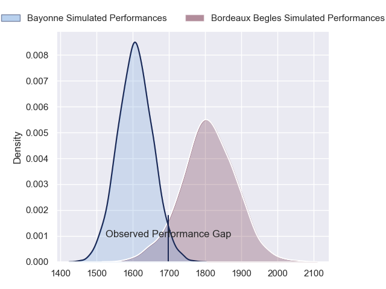
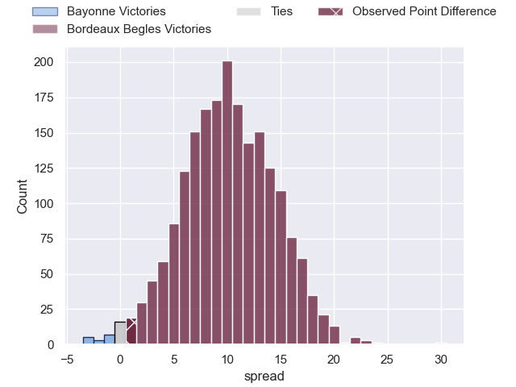
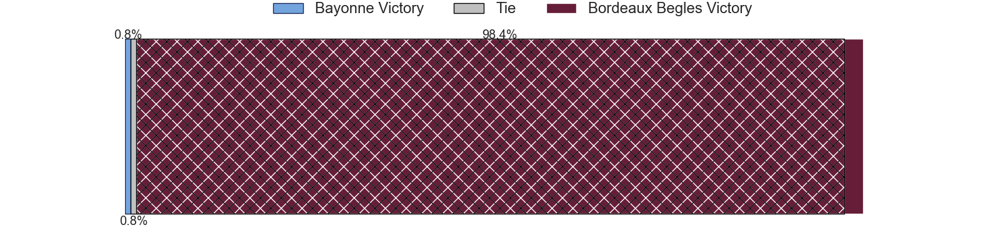
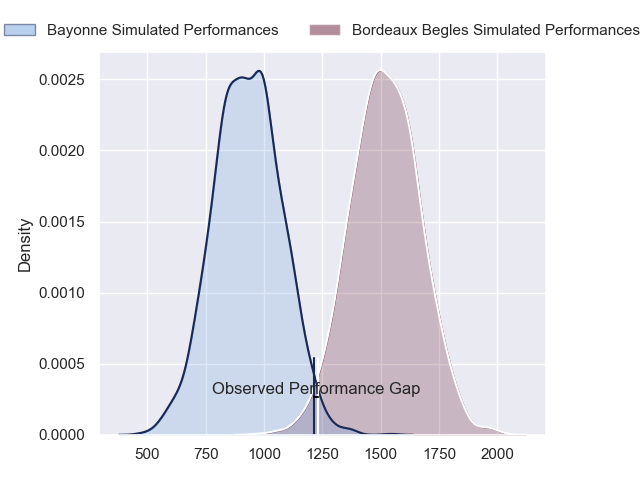
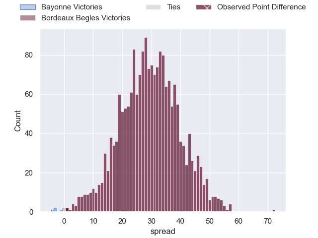
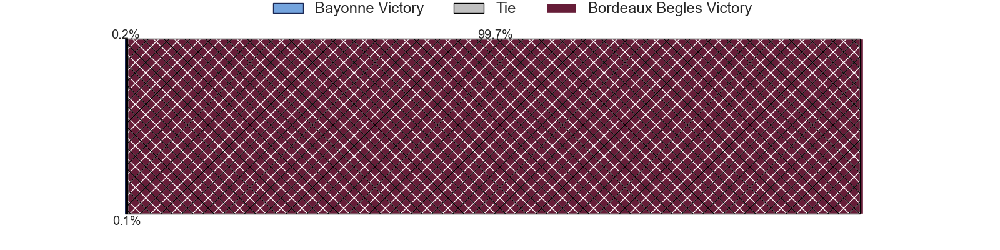
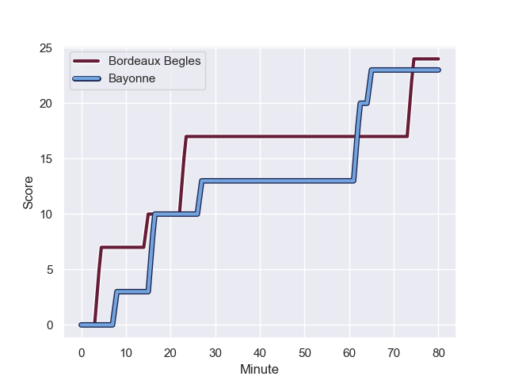
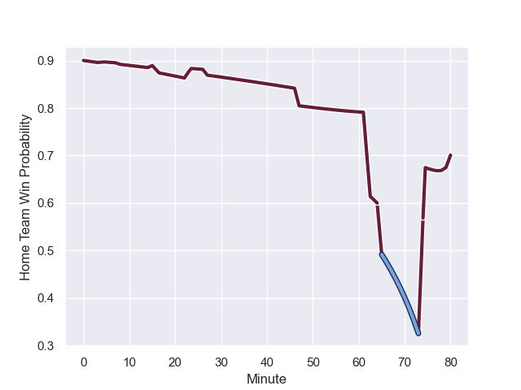

---  
layout: page  
title: Bayonne at Bordeaux Begles; 23-24  
date: 2024-01-06 18:00:00 -0500  
categories: "Top 14 Orange 2023" match review  
---
# Bayonne at Bordeaux Begles; 23-24

# Club Level Predictions

The first set of predictions treats a club as the smallest object, as the club develops its members, organizes a gameplan, and deploys its players as needed for each match. This club model has a prediction of 0.761, which translates to predicting Bordeaux Begles to win by 10.2.

Our Over/Under is 45.5 - and combined with the spread above, we have a predicted scoreline of 18 to 28

Each club has a rating and a rating deviation (similar to a Glicko rating), and expected performances can be generated. This allows for simulated matches and spreads like the ones below.
## Projected Performances - Club Model

## Projected Spreads - Club Model

## Projected Results - Club Model

# Player Level Predictions - Version 2

Treating teams instead as an entity made up of the currently active players, I have ratings for each player in an altogether different system. These can be combined to form team ratings once teamsheets are announced, weighting starters a bit higher than the reserves. After the match is played, players can be weighted by their minutes on the field, allowing for an accurate measure of the team's composition. With these compiled team ratings, we can make predictions, measure inaccuracy, and update the individual player ratings.
## Prediction with Player Minutes: Bordeaux Begles by 24.1

Bordeaux Begles by 16.7 on a neutral field
## Prediction without Player Minutes: Bordeaux Begles by 24.6

Bordeaux Begles by 17.2 on a neutral pitch

## Projected Performances - Player Model

## Projected Spreads - Player Model

## Projected Results - Player Model

## Scores over Time

## Win Probability over Time

There were 9 large changes in win probability in this match

|   Away Minutes | Away Player           |   Away elo |   Number |   Home elo | Home Player               |   Home Minutes |
|---------------:|:----------------------|-----------:|---------:|-----------:|:--------------------------|---------------:|
|             47 | Swan Cormenier        |      56    |        1 |      80.32 | Ugo Boniface              |             56 |
|             47 | Thomas Acquier        |      66.96 |        2 |      61.35 | Maxime Lamothe            |             54 |
|             47 | Tevita Tatafu         |      48.66 |        3 |     119.62 | Ben Tameifuna             |             56 |
|             47 | Denis Marchois        |     119.71 |        4 |      82.08 | Guido Petti               |             80 |
|             47 | Thomas Ceyte          |      38.9  |        5 |     138.33 | Adam Coleman              |             51 |
|             47 | Rodrigo Bruni         |     124.94 |        6 |     107.49 | Pierre Bochaton           |             80 |
|             80 | Remi Bourdeau         |      85.52 |        7 |      84.64 | Bastien Vergnes Taillefer |             54 |
|             80 | Uzair Cassiem         |      79.93 |        8 |      90.52 | Tevita Tatafu             |             47 |
|             80 | Maxime Machenaud      |      72.66 |        9 |     156.94 | Maxime Lucu               |             80 |
|             80 | Camille Lopez         |     116.2  |       10 |     134.4  | Matthieu Jalibert         |             80 |
|             80 | Remy Baget            |      94.97 |       11 |      78.19 | Louis Bielle-Biarrey      |             80 |
|             80 | Eneriko Buliruarua    |      -1.97 |       12 |      77.18 | Yoram Moefana             |             80 |
|             47 | Guillaume Martocq     |      22.07 |       13 |      70.41 | Nicolas Depoortere        |             80 |
|             80 | Arnaud Erbinartegaray |      42.14 |       14 |     122.07 | Damian Penaud             |             80 |
|             80 | Cheikh Tiberghien     |      14.81 |       15 |      75.29 | Nans Ducuing              |             47 |
|             33 | Baptiste Heguy        |      90.18 |       16 |      36.48 | Pablo Uberti              |             33 |
|             33 | Tom Spring            |      14.75 |       17 |      52.76 | Alexandre Ricard          |             29 |
|             33 | Lucas Paulos          |      71.88 |       18 |      72.39 | Pete Samu                 |             26 |
|             33 | Matis Perchaud        |      36.78 |       19 |       0.53 | Romain Laterrade          |             26 |
|             33 | Facundo Bosch         |      90.71 |       20 |      28.7  | Carlu Sadie               |             24 |
|             33 | Luke Tagi             |      39.04 |       21 |      56.35 | Jefferson Poirot          |             24 |
|             33 | Manuel Leindekar      |      13.59 |       22 |     nan    | nan                       |            nan |

