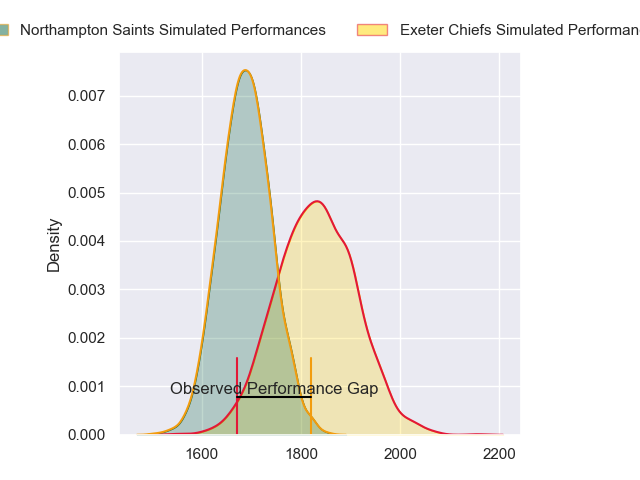
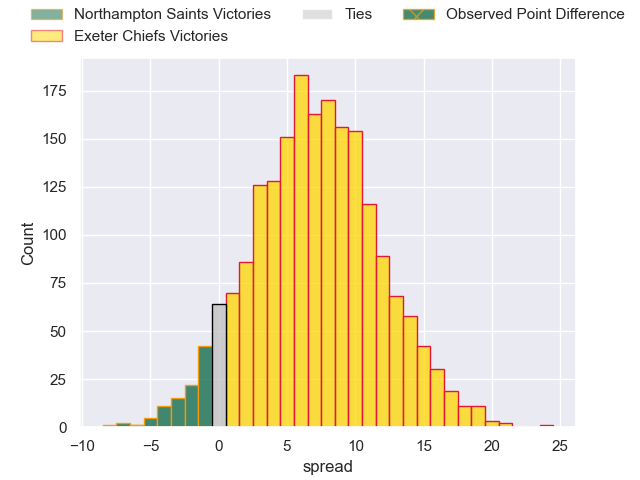
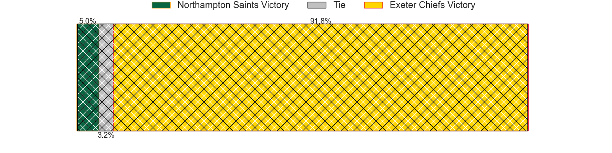
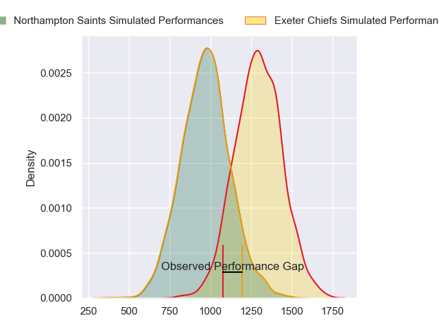
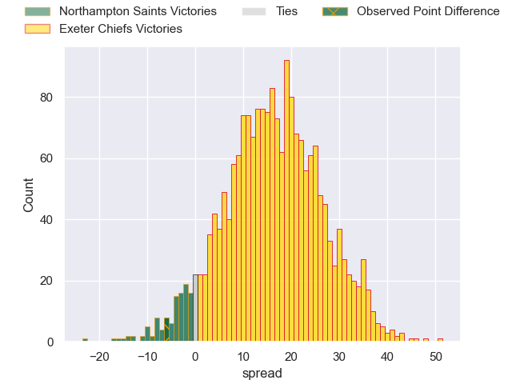
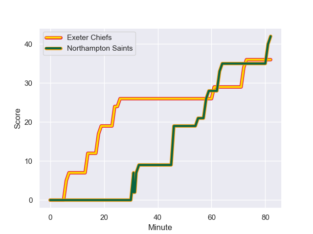
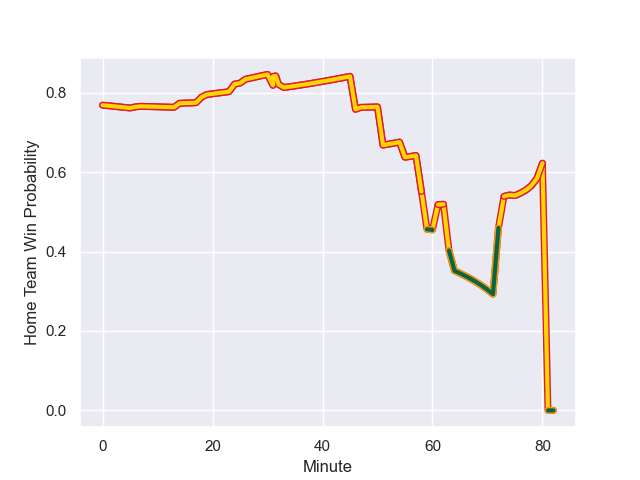

---  
layout: page  
title: Northampton Saints at Exeter Chiefs; 42-36  
date: 2024-01-06 18:00:00 -0500  
categories: "Gallagher Premiership 2023" match review  
---
# Northampton Saints at Exeter Chiefs; 42-36

# Club Level Predictions

The first set of predictions treats a club as the smallest object, as the club develops its members, organizes a gameplan, and deploys its players as needed for each match. This club model has a prediction of 0.69, which translates to predicting Exeter Chiefs to win by 7.0.

Our Over/Under is 51.5 - and combined with the spread above, we have a predicted scoreline of 22 to 30

Each club has a rating and a rating deviation (similar to a Glicko rating), and expected performances can be generated. This allows for simulated matches and spreads like the ones below.
## Projected Performances - Club Model

## Projected Spreads - Club Model

## Projected Results - Club Model

# Player Level Predictions - Version 2

Treating teams instead as an entity made up of the currently active players, I have ratings for each player in an altogether different system. These can be combined to form team ratings once teamsheets are announced, weighting starters a bit higher than the reserves. After the match is played, players can be weighted by their minutes on the field, allowing for an accurate measure of the team's composition. With these compiled team ratings, we can make predictions, measure inaccuracy, and update the individual player ratings.
## Prediction with Player Minutes: Exeter Chiefs by 13.1

Exeter Chiefs by 7.4 on a neutral field
## Prediction without Player Minutes: Exeter Chiefs by 16.2

Exeter Chiefs by 10.5 on a neutral pitch

## Projected Performances - Player Model

## Projected Spreads - Player Model

## Projected Results - Player Model

## Scores over Time

## Win Probability over Time

There were 13 large changes in win probability in this match

|   Away Minutes | Away Player         |   Away elo |   Number |   Home elo | Home Player          |   Home Minutes |
|---------------:|:--------------------|-----------:|---------:|-----------:|:---------------------|---------------:|
|             51 | Tarek Haffar        |      51.09 |        1 |      85.01 | Nika Abuladze        |             51 |
|             51 | Sam Matavesi        |      64.06 |        2 |      87.37 | Jack Yeandle         |             51 |
|             59 | Trevor Davison      |       8.78 |        3 |      99.46 | Josh Iosefa-Scott    |             51 |
|             82 | Alex Moon           |      93.56 |        4 |      53.32 | Lewis Pearson        |             82 |
|             75 | Chunya Munga        |      57.25 |        5 |      98.92 | Dafydd Jenkins       |             51 |
|             82 | Alex Coles          |       8.45 |        6 |      83.7  | Ethan Roots          |             82 |
|             59 | Angus Scott-Young   |      34.08 |        7 |      85.39 | Jacques Vermeulen    |             59 |
|             82 | Sam Graham          |     117.46 |        8 |      83.25 | Greg Fisilau         |             82 |
|             51 | Callum Braley       |       0.75 |        9 |      90    | Stu Townsend         |             55 |
|             82 | Fin Smith           |      55.82 |       10 |      56.73 | Harvey Skinner       |             82 |
|             51 | Tom Litchfield      |      52.94 |       11 |      64.06 | Ben Hammersley       |             59 |
|             82 | Rory Hutchinson     |      64.11 |       12 |      29.44 | Joe Hawkins          |             59 |
|             47 | Burger Odendaal     |      75.63 |       13 |     131.47 | Henry Slade          |             82 |
|             82 | Ollie Sleightholme  |     112.66 |       14 |      77.82 | Immanuel Feyi-Waboso |             82 |
|             82 | George Furbank      |      83.29 |       15 |     109.41 | Tom Wyatt            |             82 |
|             31 | Curtis Langdon      |      77.92 |       16 |      47.87 | Max Norey            |             31 |
|             31 | Emmanuel Iyogun     |      56.41 |       17 |      65.66 | Alec Hepburn         |             31 |
|             23 | Elliot Millar-Mills |      53.85 |       18 |      54.44 | Ehren Painter        |             31 |
|              7 | Temo Mayanavanua    |      93.66 |       19 |      32.26 | Rusiate Tuima        |             31 |
|             23 | Tom Pearson         |     127.74 |       20 |      53.18 | Ross Vintcent        |             23 |
|             31 | Alex Mitchell       |      85.77 |       21 |      59.58 | Tom Cairns           |             27 |
|             35 | Fraser Dingwall     |      60.15 |       22 |      41.93 | Ollie Devoto         |             23 |
|             31 | Tommy Freeman       |      95.6  |       23 |      48.69 | Zack Wimbush         |             23 |

