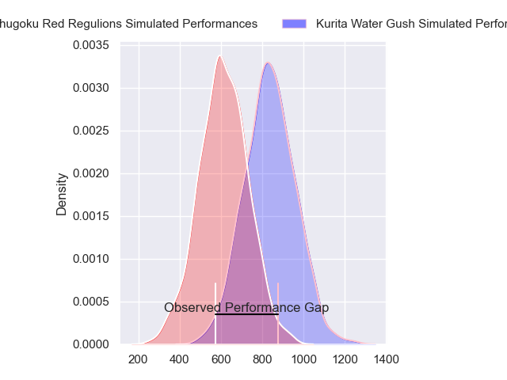
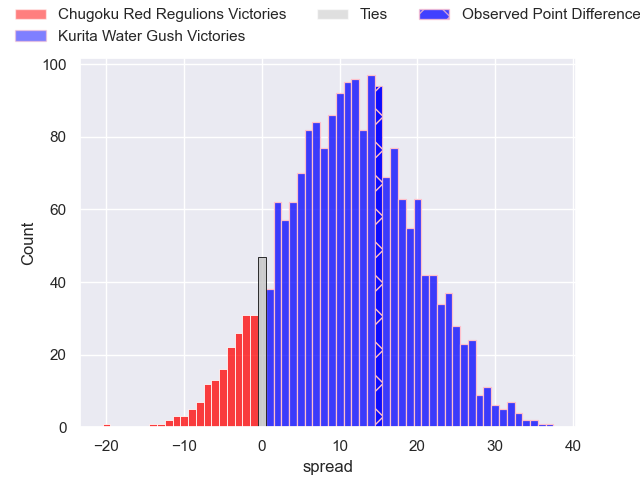
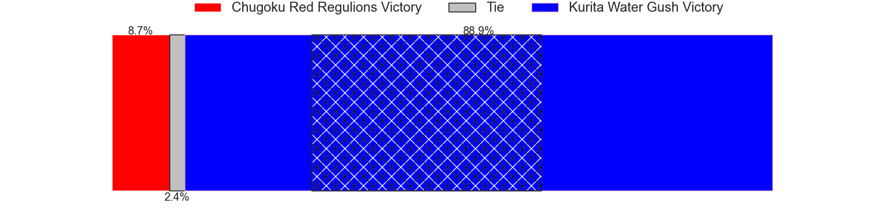
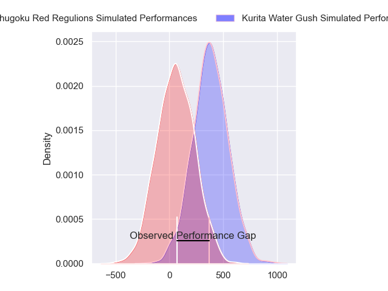
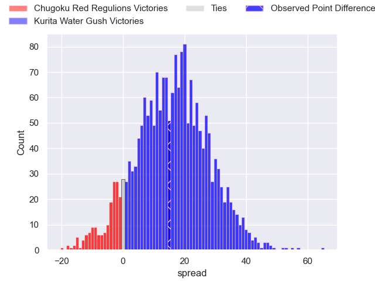
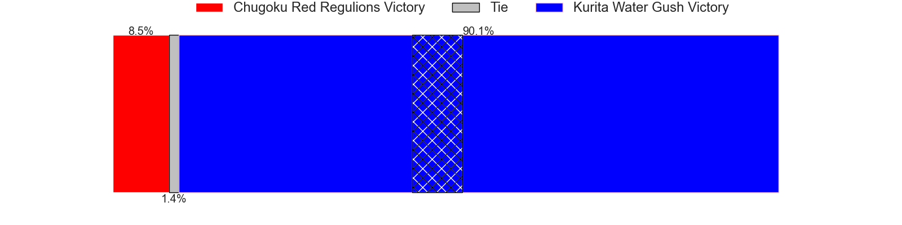
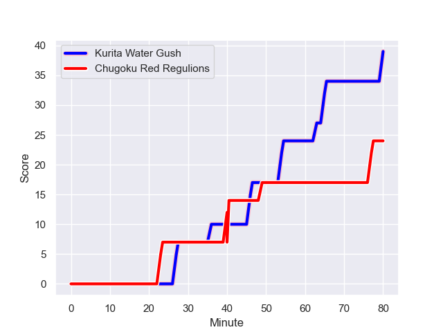
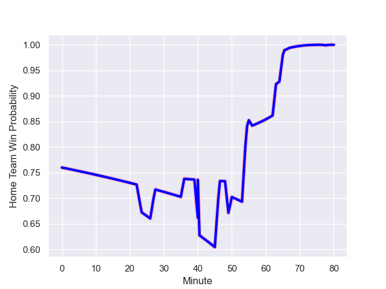

---  
layout: page  
title: Chugoku Red Regulions at Kurita Water Gush; 24-39  
date: 2024-01-06 18:00:00 -0500  
categories: "Japan Rugby League One D3 2023" match review  
---
# Chugoku Red Regulions at Kurita Water Gush; 24-39

# Club Level Predictions

The first set of predictions treats a club as the smallest object, as the club develops its members, organizes a gameplan, and deploys its players as needed for each match. This club model has a prediction of 0.766, which translates to predicting Kurita Water Gush to win by 11.0.

Our Over/Under is 71.5 - and combined with the spread above, we have a predicted scoreline of 30 to 41

Each club has a rating and a rating deviation (similar to a Glicko rating), and expected performances can be generated. This allows for simulated matches and spreads like the ones below.
## Projected Performances - Club Model

## Projected Spreads - Club Model

## Projected Results - Club Model

# Player Level Predictions - Version 2

Treating teams instead as an entity made up of the currently active players, I have ratings for each player in an altogether different system. These can be combined to form team ratings once teamsheets are announced, weighting starters a bit higher than the reserves. After the match is played, players can be weighted by their minutes on the field, allowing for an accurate measure of the team's composition. With these compiled team ratings, we can make predictions, measure inaccuracy, and update the individual player ratings.
## Prediction with Player Minutes: Kurita Water Gush by 12.8

Kurita Water Gush by 9.6 on a neutral field
## Prediction without Player Minutes: Kurita Water Gush by 13.0

Kurita Water Gush by 9.8 on a neutral pitch

## Projected Performances - Player Model

## Projected Spreads - Player Model

## Projected Results - Player Model

## Scores over Time

## Win Probability over Time

There were 14 large changes in win probability in this match

|   Away Minutes | Away Player       |   Away elo |   Number |   Home elo | Home Player          |   Home Minutes |
|---------------:|:------------------|-----------:|---------:|-----------:|:---------------------|---------------:|
|             80 | Toshiyuki Ooki    |      11.01 |        1 |       4.87 | Shoya Koyama         |             50 |
|             63 | Yuuki Asai        |      13.22 |        2 |      -1.97 | Ryota Kuribara       |             63 |
|             79 | Kento Miyata      |      33.65 |        3 |      18.33 | Kuriyama Rui         |             75 |
|             80 | Taro Nishikawa    |     -68.72 |        4 |     -41.99 | Daymon Leasuasu      |             80 |
|             80 | Kouta Moriyama    |     -43.84 |        5 |       6.73 | Mike Williams        |             80 |
|             80 | Shintaro Matsuda  |      23.5  |        6 |      57.32 | Tebita Oto           |             63 |
|             63 | Riki Yamaguchi    |      14.19 |        7 |     -11.83 | Yosuke Ishii         |             55 |
|             80 | Ed Quirk          |      -8.32 |        8 |      67.15 | Teariki Ben-Nicholas |             80 |
|             56 | Shohei Tsukamoto  |     -15.67 |        9 |      23.79 | Ryo Omasa            |             50 |
|             80 | Miyazaki Hayato   |      45.85 |       10 |      46.21 | Piers Francis        |             76 |
|             66 | Masahiro Nakano   |     -13.47 |       11 |      43.87 | Tumanawa Tawhai      |             80 |
|             80 | Makoto Torikai    |       3.12 |       12 |      44.34 | Jamie Vakalahi       |             70 |
|             67 | Azuma Syougo      |      45.85 |       13 |     -28.19 | Ayato Sakamoto       |             80 |
|             80 | Kentaro Fujii     |      20.78 |       14 |     -15.67 | Kentaro Sugimori     |             80 |
|             79 | Yuto Matsuoka     |       4.82 |       15 |      51.66 | Koshi Emoto          |             80 |
|             24 | Rintaro Kawashima |      22.81 |       16 |      39.87 | Kei Shibuya          |             30 |
|             17 | Kentaro Iwanaga   |      -0.48 |       17 |      48.46 | Kakeru Sugihara      |             30 |
|             17 | Noriyuki Kureyama |      23.01 |       18 |      17.57 | Mitsuo Nakao         |             25 |
|             14 | Keigo Hatanaka    |      -7.01 |       19 |      46.34 | Ryutaro Iguchi       |             17 |
|             13 | Masaaki Morita    |     -23.54 |       20 |      15.24 | Kengo Nakamura       |             17 |
|              1 | Saiya Kitajima    |       7.52 |       21 |      43.79 | Daiki Yokota         |             10 |
|              1 | Hashizo Yoshida   |       7    |       22 |      41.98 | Aki Kajiwara         |              5 |
|            nan | nan               |     nan    |       23 |      46.65 | Shogo Yanagita       |              4 |

