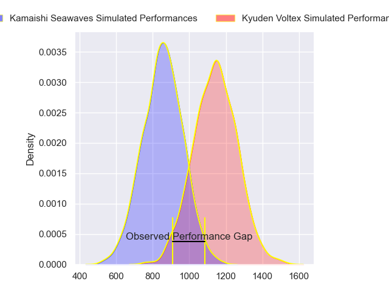
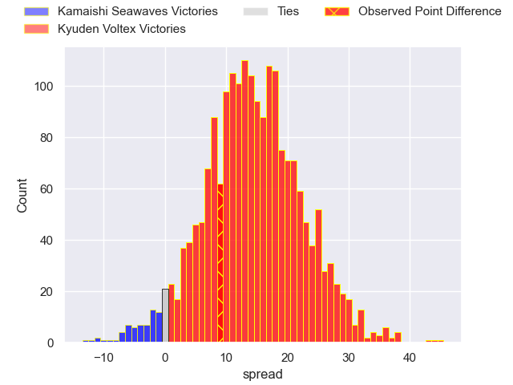
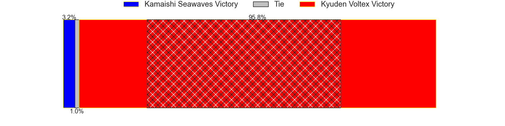
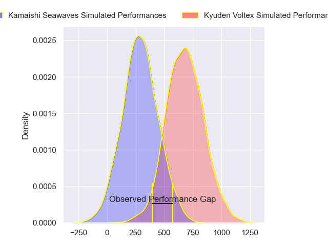
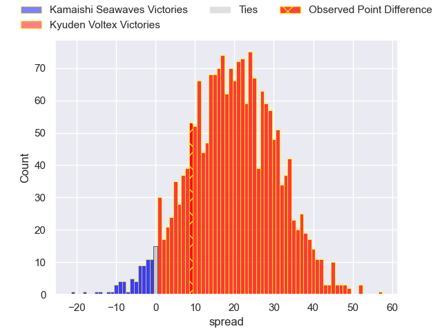
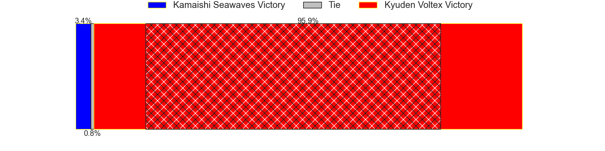
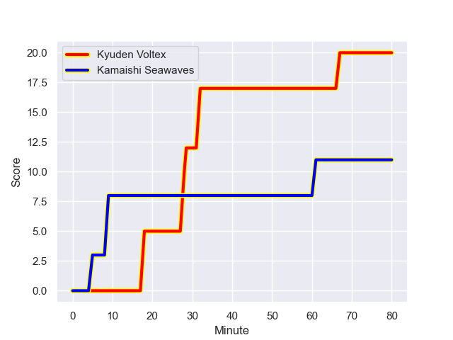
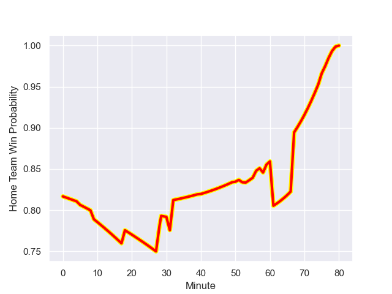

---  
layout: page  
title: Kamaishi Seawaves at Kyuden Voltex; 11-20  
date: 2024-01-06 18:00:00 -0500  
categories: "Japan Rugby League One D2 2023" match review  
---
# Kamaishi Seawaves at Kyuden Voltex; 11-20

# Club Level Predictions

The first set of predictions treats a club as the smallest object, as the club develops its members, organizes a gameplan, and deploys its players as needed for each match. This club model has a prediction of 0.825, which translates to predicting Kyuden Voltex to win by 14.2.

Our Over/Under is 58.5 - and combined with the spread above, we have a predicted scoreline of 22 to 37

Each club has a rating and a rating deviation (similar to a Glicko rating), and expected performances can be generated. This allows for simulated matches and spreads like the ones below.
## Projected Performances - Club Model

## Projected Spreads - Club Model

## Projected Results - Club Model

# Player Level Predictions - Version 2

Treating teams instead as an entity made up of the currently active players, I have ratings for each player in an altogether different system. These can be combined to form team ratings once teamsheets are announced, weighting starters a bit higher than the reserves. After the match is played, players can be weighted by their minutes on the field, allowing for an accurate measure of the team's composition. With these compiled team ratings, we can make predictions, measure inaccuracy, and update the individual player ratings.
## Prediction with Player Minutes: Kyuden Voltex by 16.5

Kyuden Voltex by 13.1 on a neutral field
## Prediction without Player Minutes: Kyuden Voltex by 17.1

Kyuden Voltex by 13.8 on a neutral pitch

## Projected Performances - Player Model

## Projected Spreads - Player Model

## Projected Results - Player Model

## Scores over Time

## Win Probability over Time

There were 4 large changes in win probability in this match

|   Away Minutes | Away Player        |   Away elo |   Number |   Home elo | Home Player            |   Home Minutes |
|---------------:|:-------------------|-----------:|---------:|-----------:|:-----------------------|---------------:|
|             56 | Yusuke Yamada      |      47.27 |        1 |      55.24 | Samuel Nozomu Faialaga |             58 |
|             58 | Daiki Ito          |       4.06 |        2 |       9.88 | Kyungmun Wang          |             76 |
|             31 | Flyn Yates         |       1.66 |        3 |      16.7  | Yasuo Saruwatari       |             52 |
|             80 | Hamish Dalzell     |      29.47 |        4 |      33.05 | Ray Tatafu             |             59 |
|             80 | Ben Nee Nee        |      -2.38 |        5 |      35.27 | Sean Robinson          |             80 |
|             40 | Kohei Ishigaki     |      26.72 |        6 |      48.08 | Ken Nakashima          |             53 |
|             80 | Daisuke Musya      |       7.79 |        7 |      30.29 | Yuuki Yamada           |             80 |
|             56 | Dallas Tatana      |       2.11 |        8 |      23.31 | Walker Alex Takuya     |             80 |
|             76 | Atsushi Minami     |      32.2  |        9 |      53.99 | Shunta Takenouchi      |             59 |
|             80 | Kazuki Ochi        |      43.87 |       10 |      58.08 | Tom Taylor             |             80 |
|             80 | Jamie Henry        |      81.93 |       11 |      31.85 | Ren Hagiwara           |             80 |
|             80 | Mosese Tonga       |      26.07 |       12 |      50.65 | Phil Burleigh          |             50 |
|             52 | Osuka Lloyd Murata |      -5.38 |       13 |      38.69 | Sione Likuata          |             80 |
|             76 | Kodai Ono          |     -31.99 |       14 |     126.33 | Akihito Yamada         |             80 |
|             80 | Cam Bailey         |     -15.42 |       15 |     -20.24 | Makoto Kato            |             75 |
|             49 | Taiki Noguchi      |      32.83 |       16 |      46.65 | Charlie Worthington    |             30 |
|             40 | Seta Koroitamana   |      28.64 |       17 |      39.51 | Kosuke Oike            |             28 |
|             28 | Syou Kataoka       |      33.93 |       18 |      46.17 | Kazuto Tokunaga        |             22 |
|             24 | Ryunosuke Yamada   |       3.05 |       19 |      39.01 | Yusaku Kanda           |             21 |
|             24 | Shoichiro Inada    |      27.28 |       20 |      70.77 | Aaron Carroll          |             21 |
|             22 | Yuki Go            |      27.31 |       21 |      39    | Keisuke Yamzoe         |             27 |
|              4 | Ryo Kikkawa        |      36.23 |       22 |      43.17 | Masaya Kanado          |              5 |
|              4 | Takumi Tokairin    |      36.67 |       23 |      43.87 | Yuya Otsuka            |              4 |

