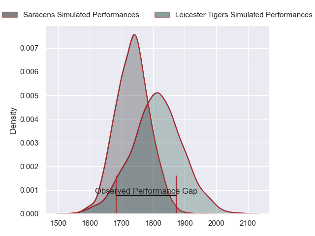
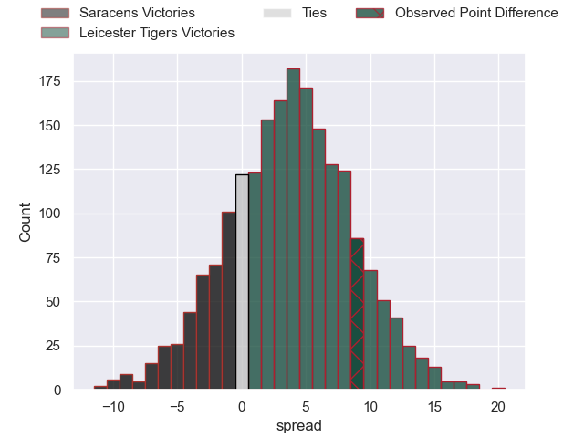
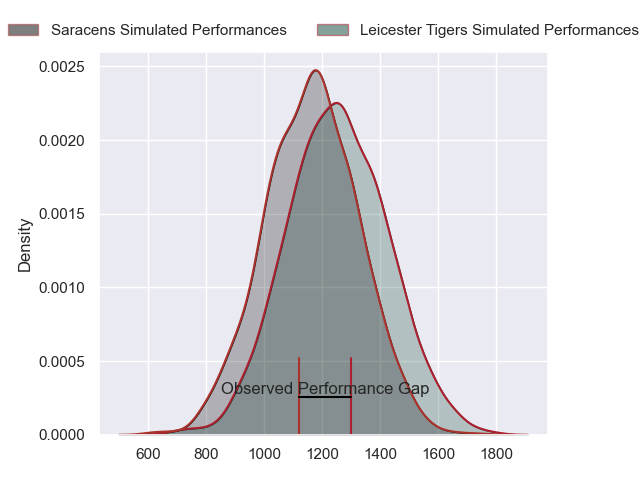
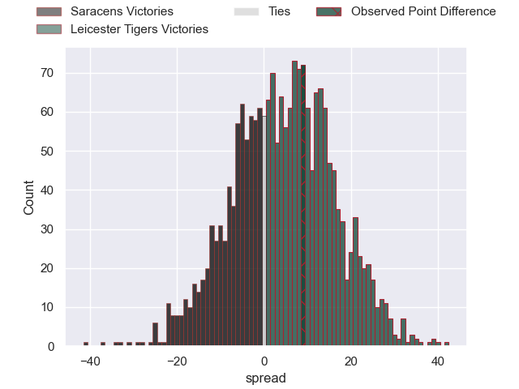
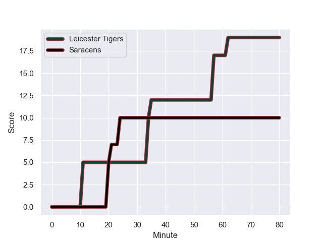
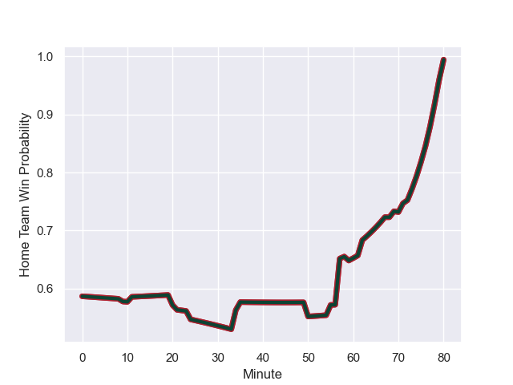

---  
layout: page  
title: Saracens at Leicester Tigers; 10-19  
date: 2024-01-06 18:00:00 -0500  
categories: "Gallagher Premiership 2023" match review  
---
# Saracens at Leicester Tigers; 10-19

# Club Level Predictions

The first set of predictions treats a club as the smallest object, as the club develops its members, organizes a gameplan, and deploys its players as needed for each match. This club model has a prediction of 0.602, which translates to predicting Leicester Tigers to win by 3.6.

Our Over/Under is 45.5 - and combined with the spread above, we have a predicted scoreline of 21 to 24

Each club has a rating and a rating deviation (similar to a Glicko rating), and expected performances can be generated. This allows for simulated matches and spreads like the ones below.
## Projected Performances - Club Model

## Projected Spreads - Club Model

## Projected Results - Club Model

# Player Level Predictions - Version 2

Treating teams instead as an entity made up of the currently active players, I have ratings for each player in an altogether different system. These can be combined to form team ratings once teamsheets are announced, weighting starters a bit higher than the reserves. After the match is played, players can be weighted by their minutes on the field, allowing for an accurate measure of the team's composition. With these compiled team ratings, we can make predictions, measure inaccuracy, and update the individual player ratings.
## Prediction with Player Minutes: Leicester Tigers by 3.9

Saracens by 4.5 on a neutral field
## Prediction without Player Minutes: Leicester Tigers by 5.4

Saracens by 3.0 on a neutral pitch

## Projected Performances - Player Model

## Projected Spreads - Player Model

## Projected Results - Player Model

## Scores over Time

## Win Probability over Time

There were 8 large changes in win probability in this match

|   Away Minutes | Away Player          |   Away elo |   Number |   Home elo | Home Player          |   Home Minutes |
|---------------:|:---------------------|-----------:|---------:|-----------:|:---------------------|---------------:|
|             68 | Sam Crean            |      47.76 |        1 |      87.48 | James Cronin         |             62 |
|              9 | Kapeli Pifeleti      |      46.65 |        2 |     109.15 | Julian Montoya       |             72 |
|             50 | Christian Judge      |      57.85 |        3 |      83.3  | Joe Heyes            |             62 |
|             80 | Maro Itoje           |     127.34 |        4 |      81.43 | George Martin        |             72 |
|             50 | Hugh Tizard          |      41.5  |        5 |      63.53 | Ollie Chessum        |             80 |
|             69 | Theo McFarland       |      48.97 |        6 |      67.35 | Matt Rogerson        |             70 |
|             80 | Juan Martin Gonzalez |      94.37 |        7 |      70.27 | Tommy Reffell        |             76 |
|             80 | Ben Earl             |     105.1  |        8 |      78.9  | Jasper Wiese         |             80 |
|             59 | Gareth Simpson       |      31.03 |        9 |      20.07 | Tom Whiteley         |             55 |
|             80 | Owen Farrell         |     131.01 |       10 |     103.5  | Handre Pollard       |             80 |
|             80 | Lucio Cinti          |      43.84 |       11 |      81.64 | Mike Brown           |             80 |
|             80 | Nick Tompkins        |     101.39 |       12 |      47.24 | Solomone Kata        |             80 |
|             80 | Elliot Daly          |      81.32 |       13 |      89.84 | Dan Kelly            |             80 |
|             69 | Rotimi Segun         |      42.01 |       14 |      38.23 | Harry Simmons        |             80 |
|             80 | Tom Parton           |     105.41 |       15 |      47.63 | Freddie Steward      |             74 |
|             71 | Theo Dan             |      55.1  |       16 |      46.36 | Finn Theobald-Thomas |              8 |
|             12 | Logovi'i Mulipola    |     104.71 |       17 |      62.62 | Francois van Wyk     |             18 |
|             30 | Oli Hoskins          |      94.5  |       18 |      44.29 | Will Hurd            |             18 |
|             30 | Nick Isiekwe         |      80.67 |       19 |      65.28 | Harry Wells          |              8 |
|             11 | Andy Christie        |      36.64 |       20 |     -19.11 | Kyle Hatherell       |             10 |
|             21 | Ivan van Zyl         |      71.95 |       21 |      59.67 | Olly Cracknell       |              4 |
|              0 | Manu Vunipola        |      48.32 |       22 |      77.77 | Ben Youngs           |             25 |
|             11 | Alex Lewington       |      61.97 |       23 |      46.6  | Jamie Shillcock      |              6 |

