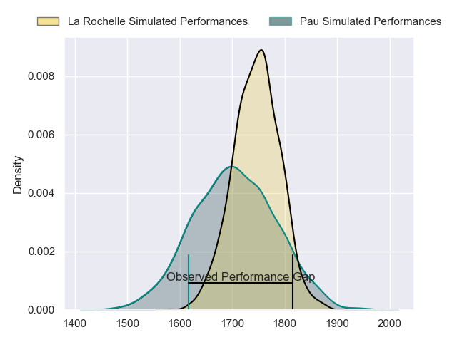
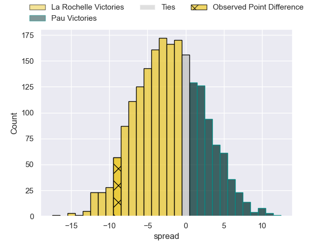
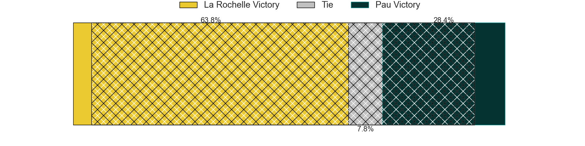
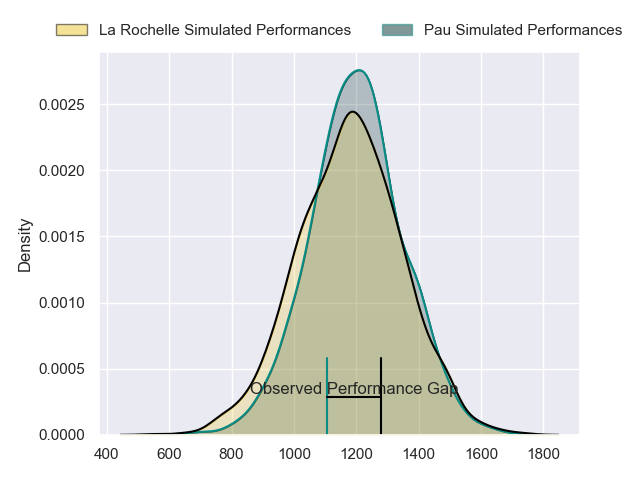
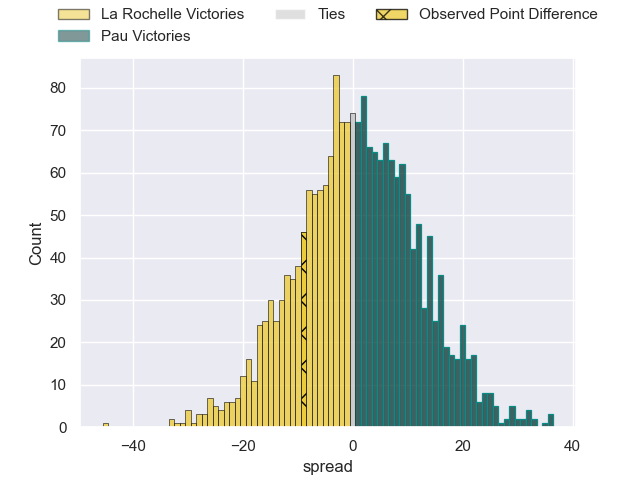
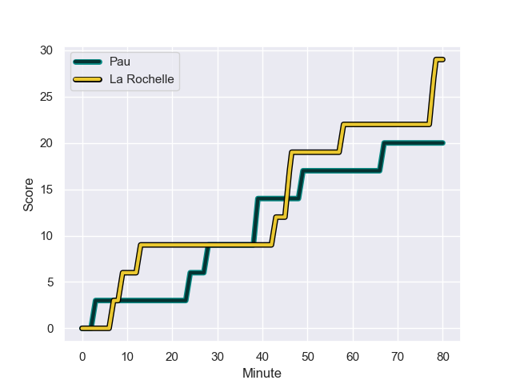
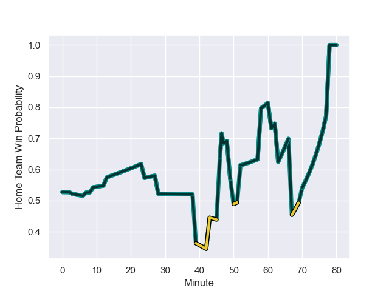

---  
layout: page  
title: La Rochelle at Pau; 29-20  
date: 2024-01-06 18:00:00 -0500  
categories: "Top 14 Orange 2023" match review  
---
# La Rochelle at Pau; 29-20

# Club Level Predictions

The first set of predictions treats a club as the smallest object, as the club develops its members, organizes a gameplan, and deploys its players as needed for each match. This club model has a prediction of 0.441, which translates to predicting La Rochelle to win by 2.1.

Our Over/Under is 45.5 - and combined with the spread above, we have a predicted scoreline of 24 to 22

Each club has a rating and a rating deviation (similar to a Glicko rating), and expected performances can be generated. This allows for simulated matches and spreads like the ones below.
## Projected Performances - Club Model

## Projected Spreads - Club Model

## Projected Results - Club Model

# Player Level Predictions - Version 2

Treating teams instead as an entity made up of the currently active players, I have ratings for each player in an altogether different system. These can be combined to form team ratings once teamsheets are announced, weighting starters a bit higher than the reserves. After the match is played, players can be weighted by their minutes on the field, allowing for an accurate measure of the team's composition. With these compiled team ratings, we can make predictions, measure inaccuracy, and update the individual player ratings.
## Prediction with Player Minutes: Pau by 1.2

La Rochelle by 6.6 on a neutral field
## Prediction without Player Minutes: Pau by 0.6

La Rochelle by 7.3 on a neutral pitch

## Projected Performances - Player Model

## Projected Spreads - Player Model

## Projected Results - Player Model

## Scores over Time

## Win Probability over Time

There were 23 large changes in win probability in this match

|   Away Minutes | Away Player         |   Away elo |   Number |   Home elo | Home Player         |   Home Minutes |
|---------------:|:--------------------|-----------:|---------:|-----------:|:--------------------|---------------:|
|             63 | Reda Wardi          |     104.42 |        1 |      40.32 | Siegfried Fisi'ihoi |             50 |
|             63 | Quentin Lespiaucq   |      55.52 |        2 |      29.49 | Lucas Rey           |             50 |
|             52 | Aleksandre Kuntelia |      33.73 |        3 |      14.42 | Nicolas Corato      |             50 |
|             80 | Ultan Dillane       |      54.51 |        4 |     146.23 | Samuel Whitelock    |             80 |
|             80 | Will Skelton        |      99.22 |        5 |      48.27 | Mickael Capelli     |             47 |
|             79 | Judicael Cancoriet  |      38.49 |        6 |      79.9  | Lekima Tagitagivalu |             52 |
|             59 | Levani Botia        |     106.09 |        7 |      44.64 | Reece Hewat         |             68 |
|             80 | Gregory Alldritt    |     137.99 |        8 |     101.47 | Luke Whitelock      |             80 |
|             79 | Tawera Kerr-Barlow  |     113.02 |        9 |     111.68 | Thibault Daubagna   |             59 |
|             80 | Hugo Reus           |      46.23 |       10 |     106.92 | Joe Simmonds        |             80 |
|             80 | Dillyn Leyds        |     109.23 |       11 |       3.89 | Samuel Ezeala       |             61 |
|             70 | Simeli Daunivucu    |      47.03 |       12 |      86.4  | Tumua Manu          |             80 |
|             80 | Ulupano Seuteni     |      43.29 |       13 |      53.98 | Emilien Gailleton   |             80 |
|             79 | Teddy Thomas        |      72.81 |       14 |      30.73 | Théo Attissogbe     |             80 |
|             80 | Brice Dulin         |     108.87 |       15 |      68.59 | Jack Maddocks       |             80 |
|             28 | Uini Atonio         |     131.77 |       16 |      79.36 | Fabrice Metz        |             33 |
|             21 | Thomas Ployet       |      45.61 |       17 |      39.32 | Youri Delhommel     |             30 |
|             17 | Tolu Latu           |      84.83 |       18 |      66.11 | Remi Seneca         |             30 |
|             17 | Louis Penverne      |      46.49 |       19 |      74.72 | Siate Tokolahi      |             30 |
|             10 | Ihaia West          |      34.9  |       20 |      52.32 | Martin Puech        |             28 |
|              1 | Hoani Bosmorin      |      34.55 |       21 |     129.88 | Dan Robson          |             21 |
|              1 | Thomas Berjon       |      82.79 |       22 |      66.75 | Nathan Decron       |             19 |
|              1 | Édouard Richer      |      46.65 |       23 |       8.36 | Hugo Auradou        |             12 |

