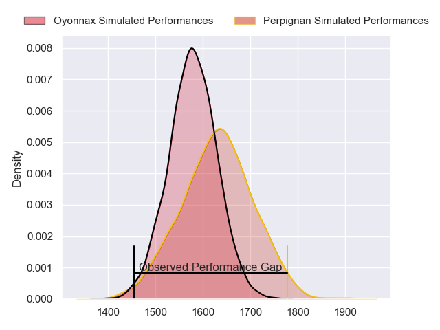
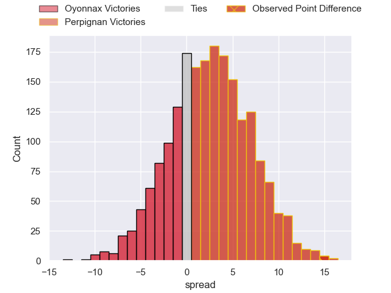
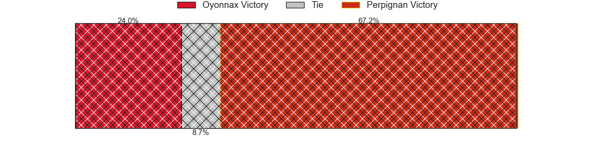
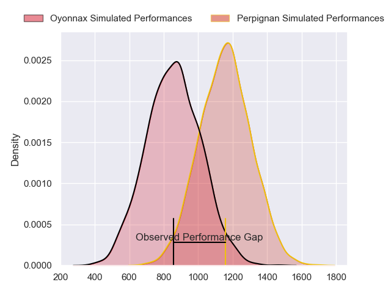
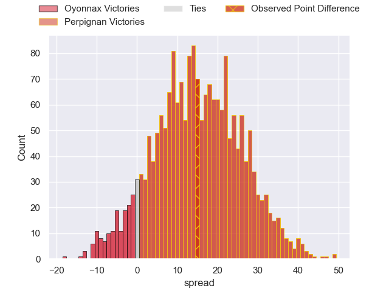
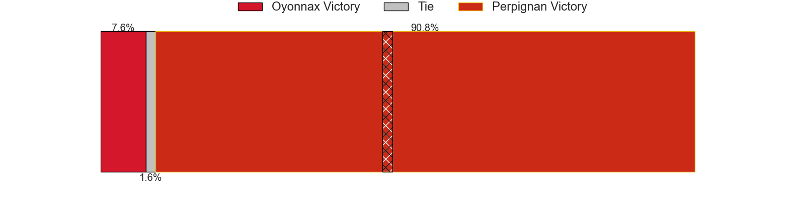
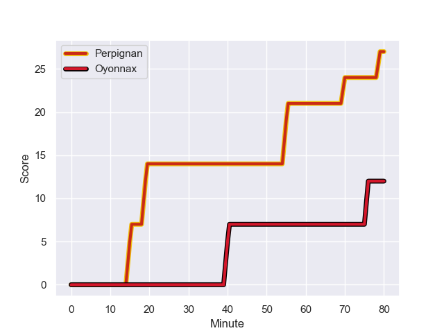
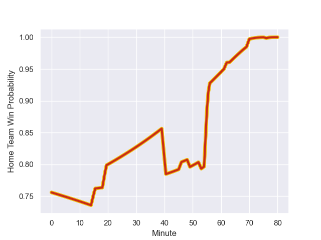

---  
layout: page  
title: Oyonnax at Perpignan; 12-27  
date: 2024-01-06 18:00:00 -0500  
categories: "Top 14 Orange 2023" match review  
---
# Oyonnax at Perpignan; 12-27

# Club Level Predictions

The first set of predictions treats a club as the smallest object, as the club develops its members, organizes a gameplan, and deploys its players as needed for each match. This club model has a prediction of 0.574, which translates to predicting Perpignan to win by 2.6.

Our Over/Under is 40.5 - and combined with the spread above, we have a predicted scoreline of 19 to 22

Each club has a rating and a rating deviation (similar to a Glicko rating), and expected performances can be generated. This allows for simulated matches and spreads like the ones below.
## Projected Performances - Club Model

## Projected Spreads - Club Model

## Projected Results - Club Model

# Player Level Predictions - Version 2

Treating teams instead as an entity made up of the currently active players, I have ratings for each player in an altogether different system. These can be combined to form team ratings once teamsheets are announced, weighting starters a bit higher than the reserves. After the match is played, players can be weighted by their minutes on the field, allowing for an accurate measure of the team's composition. With these compiled team ratings, we can make predictions, measure inaccuracy, and update the individual player ratings.
## Prediction with Player Minutes: Perpignan by 12.4

Perpignan by 4.3 on a neutral field
## Prediction without Player Minutes: Perpignan by 12.8

Perpignan by 4.7 on a neutral pitch

## Projected Performances - Player Model

## Projected Spreads - Player Model

## Projected Results - Player Model

## Scores over Time

## Win Probability over Time

There were 3 large changes in win probability in this match

|   Away Minutes | Away Player        |   Away elo |   Number |   Home elo | Home Player           |   Home Minutes |
|---------------:|:-------------------|-----------:|---------:|-----------:|:----------------------|---------------:|
|             53 | Tommy Raynaud      |      53.79 |        1 |      58.94 | Sacha Lotrian         |             49 |
|             70 | Teddy Durand       |      27.42 |        2 |      57.03 | Ignacio Ruiz          |             49 |
|             70 | Christopher Vaotoa |      38.07 |        3 |      66.43 | Pietro Ceccarelli     |             56 |
|             80 | Phoenix Battye     |     112.9  |        4 |      57.1  | Jacobus van Tonder    |             80 |
|             46 | Steve Mafi         |      34    |        5 |      44.37 | Posolo Tuilagi        |             63 |
|             46 | Wandrille Picault  |      42.93 |        6 |      79.19 | Patrick Sobela        |             53 |
|             80 | Loïc Credoz        |      51.05 |        7 |      52.84 | Alan Brazo            |             80 |
|             63 | Rory Grice         |      78.24 |        8 |      67.44 | Joaquin Oviedo        |             49 |
|             53 | Jonathan Ruru      |      97.56 |        9 |      58.25 | Tom Ecochard          |             49 |
|             80 | Domingo Miotti     |     110.7  |       10 |      80.52 | Jake McIntyre         |             80 |
|             63 | Maxime Salles      |      55.04 |       11 |      37.59 | Ali Crossdale         |             80 |
|             80 | Theo Millet        |      76.58 |       12 |     141.99 | Jeronimo de la Fuente |             80 |
|             80 | Pedro Bettencourt  |      13.87 |       13 |      73.76 | Afusipa Taumoepeau    |             80 |
|             80 | Gavin Stark        |      34.81 |       14 |      41.82 | Tavite Veredamu       |             80 |
|             80 | Darren Sweetnam    |      63.71 |       15 |      55.73 | Tommaso Allan         |             62 |
|             34 | Victor Lebas       |      17.29 |       16 |      57.96 | Seilala Lam           |             31 |
|             34 | Kevin Lebreton     |      38.4  |       17 |     114.05 | So'otala Fa'aso'o     |             31 |
|             27 | Antoine Abraham    |      50.39 |       18 |      18.39 | Sadek Deghmache       |             31 |
|             27 | Charlie Cassang    |      88.4  |       19 |      20.91 | Xavier Chiocci        |             31 |
|             17 | Loic Godener       |      27.99 |       20 |      35.17 | Tristan Labouteley    |             27 |
|             17 | Justin Bouraux     |      25.87 |       21 |     123.19 | Arthur Joly           |             24 |
|             10 | Manu Leiataua      |      -7.72 |       22 |     107.73 | Mathieu Acebes        |             18 |
|             10 | Thibault Berthaud  |      40.67 |       23 |     -20.9  | Shahn Eru             |             17 |

