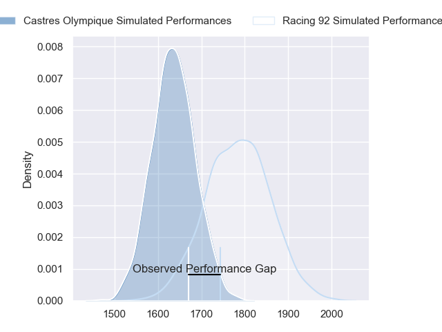
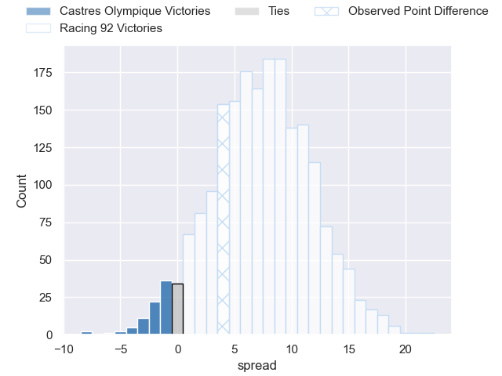
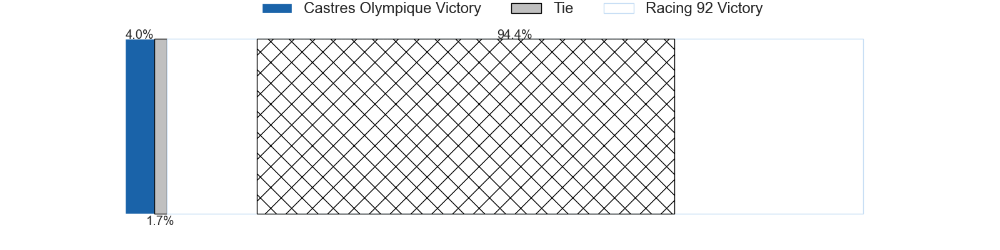
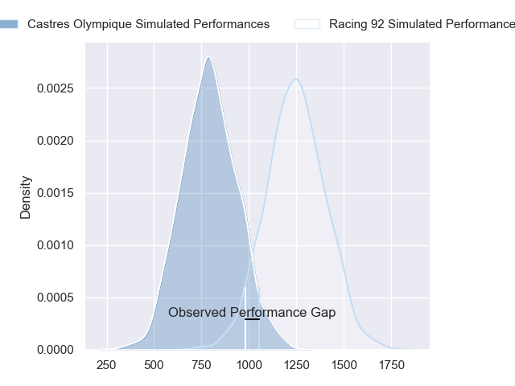
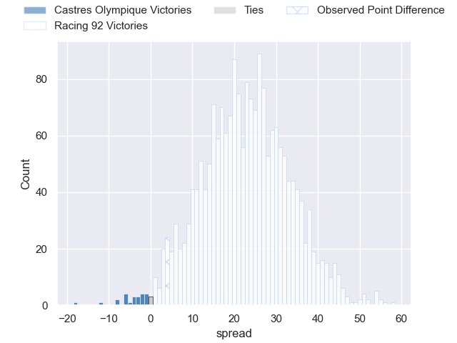
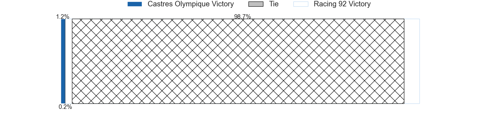
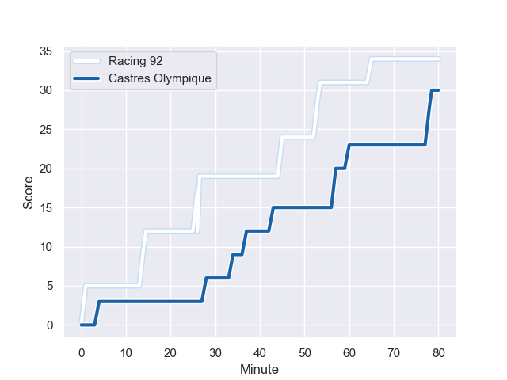
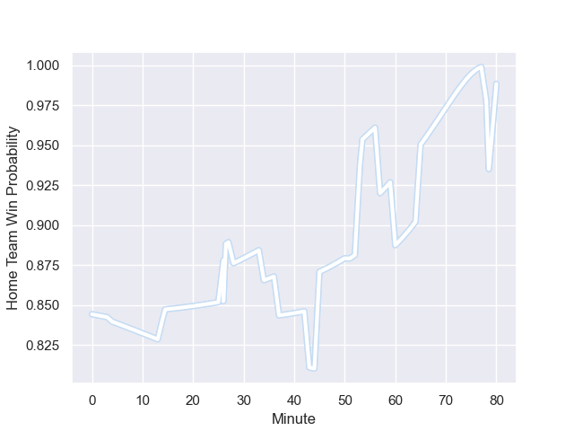

---  
layout: page  
title: Castres Olympique at Racing 92; 30-34  
date: 2024-01-06 18:00:00 -0500  
categories: "Top 14 Orange 2023" match review  
---
# Castres Olympique at Racing 92; 30-34

# Club Level Predictions

The first set of predictions treats a club as the smallest object, as the club develops its members, organizes a gameplan, and deploys its players as needed for each match. This club model has a prediction of 0.698, which translates to predicting Racing 92 to win by 7.4.

Our Over/Under is 50.5 - and combined with the spread above, we have a predicted scoreline of 22 to 29

Each club has a rating and a rating deviation (similar to a Glicko rating), and expected performances can be generated. This allows for simulated matches and spreads like the ones below.
## Projected Performances - Club Model

## Projected Spreads - Club Model

## Projected Results - Club Model

# Player Level Predictions - Version 2

Treating teams instead as an entity made up of the currently active players, I have ratings for each player in an altogether different system. These can be combined to form team ratings once teamsheets are announced, weighting starters a bit higher than the reserves. After the match is played, players can be weighted by their minutes on the field, allowing for an accurate measure of the team's composition. With these compiled team ratings, we can make predictions, measure inaccuracy, and update the individual player ratings.
## Prediction with Player Minutes: Racing 92 by 18.5

Racing 92 by 11.2 on a neutral field
## Prediction without Player Minutes: Racing 92 by 17.2

Racing 92 by 9.9 on a neutral pitch

## Projected Performances - Player Model

## Projected Spreads - Player Model

## Projected Results - Player Model

## Scores over Time

## Win Probability over Time

There were 11 large changes in win probability in this match

|   Away Minutes | Away Player                |   Away elo |   Number |   Home elo | Home Player         |   Home Minutes |
|---------------:|:---------------------------|-----------:|---------:|-----------:|:--------------------|---------------:|
|             51 | Loïs Guerois               |      43.07 |        1 |      47.43 | Guram Gogichashvili |             58 |
|             51 | Gaetan Barlot              |      85.89 |        2 |     108.85 | Camille Chat        |             58 |
|             51 | Wilfrid Hounkpatin         |      53.55 |        3 |      67.5  | Thomas Laclayat     |             58 |
|             80 | Gauthier Maravat           |      -1.12 |        4 |      67.63 | Cameron Woki        |             80 |
|             58 | Tom Staniforth             |      62.01 |        5 |      39.34 | Will Rowlands       |             65 |
|             80 | Nick Champion de Crespigny |      57.85 |        6 |      98.58 | Wenceslas Lauret    |             80 |
|             80 | Baptiste Cope              |      42.6  |        7 |     108.01 | Siya Kolisi         |             80 |
|             55 | Abraham Papali'i           |      53.94 |        8 |      70.62 | Jordan Joseph       |             58 |
|             55 | Jeremy Fernandez           |      10.61 |        9 |      70.99 | Nolann Le Garrec    |             80 |
|             80 | Louis Le Brun              |      46.4  |       10 |      42.02 | Martin Méliande     |             61 |
|             80 | Nathanael Hulleu           |      68.9  |       11 |      88.21 | Wame Naituvi        |             80 |
|             63 | Jack Goodhue               |      97.3  |       12 |      37.06 | Francis Saili       |             58 |
|             80 | Vilimoni Botitu            |      56.68 |       13 |      97.15 | Gael Fickou         |             80 |
|             58 | Geoffrey Palis             |      86.02 |       14 |      58.18 | Vinaya Habosi       |             67 |
|             80 | Julien Dumora              |      54.11 |       15 |      42.87 | Henry Arundell      |             80 |
|             29 | Wayan de Benedittis        |      50.02 |       16 |      51.65 | Janick Tarrit       |             22 |
|             29 | Loris Zarantonello         |      41.57 |       17 |     118.33 | Henry Chavancy      |             22 |
|             29 | Aurélien Azar              |      26.95 |       18 |      51.31 | Trevor Nyakane      |             22 |
|             25 | Baptiste Delaporte         |      54.82 |       19 |      41.78 | Maxime Baudonne     |             22 |
|             25 | Santiago Arata             |      57.8  |       20 |      42.04 | Hassane Kolingar    |             22 |
|             22 | Josaia Raisuqe             |      55.22 |       21 |      94.04 | Antoine Gibert      |             19 |
|             22 | Leone Nakarawa             |      73.78 |       22 |      76.78 | Boris Palu          |             15 |
|             17 | Adrien Seguret             |      34.71 |       23 |      94.49 | Christian Wade      |             13 |

