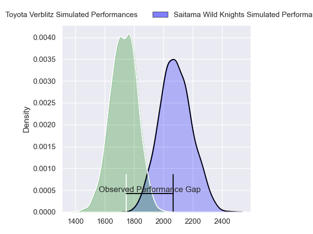
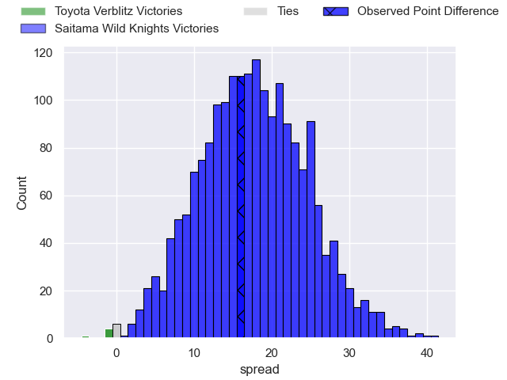
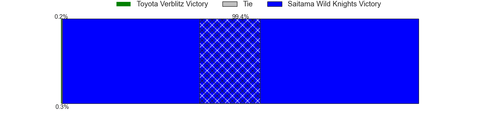
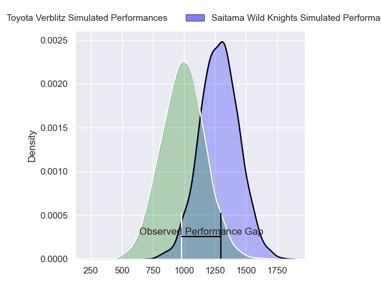
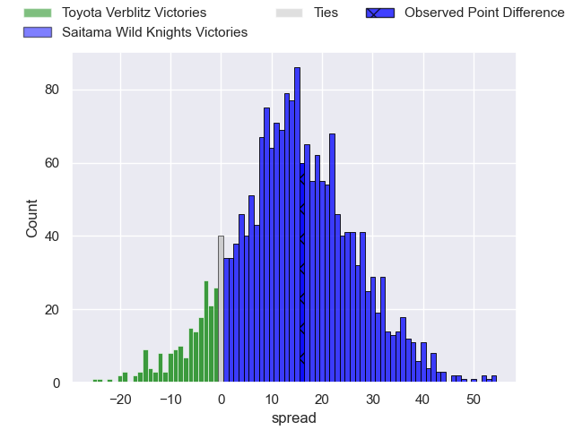
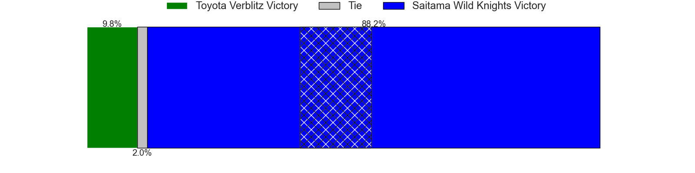
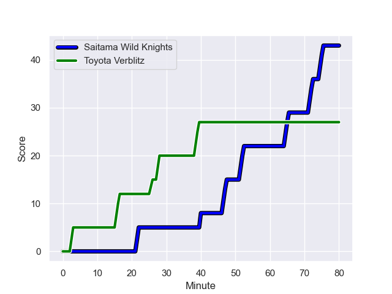
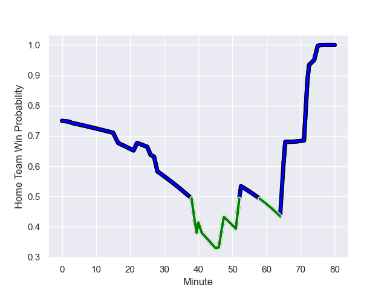

---  
layout: page  
title: Toyota Verblitz at Saitama Wild Knights; 27-43  
date: 2024-01-06 18:00:00 -0500  
categories: "Japan Rugby League One 2023" match review  
---
# Toyota Verblitz at Saitama Wild Knights; 27-43

# Club Level Predictions

The first set of predictions treats a club as the smallest object, as the club develops its members, organizes a gameplan, and deploys its players as needed for each match. This club model has a prediction of 0.878, which translates to predicting Saitama Wild Knights to win by 17.9.

Our Over/Under is 58.5 - and combined with the spread above, we have a predicted scoreline of 20 to 38

Each club has a rating and a rating deviation (similar to a Glicko rating), and expected performances can be generated. This allows for simulated matches and spreads like the ones below.
## Projected Performances - Club Model

## Projected Spreads - Club Model

## Projected Results - Club Model

# Player Level Predictions - Version 2

Treating teams instead as an entity made up of the currently active players, I have ratings for each player in an altogether different system. These can be combined to form team ratings once teamsheets are announced, weighting starters a bit higher than the reserves. After the match is played, players can be weighted by their minutes on the field, allowing for an accurate measure of the team's composition. With these compiled team ratings, we can make predictions, measure inaccuracy, and update the individual player ratings.
## Prediction with Player Minutes: Saitama Wild Knights by 12.2

Saitama Wild Knights by 8.4 on a neutral field
## Prediction without Player Minutes: Saitama Wild Knights by 13.2

Saitama Wild Knights by 9.4 on a neutral pitch

## Projected Performances - Player Model

## Projected Spreads - Player Model

## Projected Results - Player Model

## Scores over Time

## Win Probability over Time

There were 15 large changes in win probability in this match

|   Away Minutes | Away Player          |   Away elo |   Number |   Home elo | Home Player       |   Home Minutes |
|---------------:|:---------------------|-----------:|---------:|-----------:|:------------------|---------------:|
|             47 | Ryunosuke Momoji     |      46.65 |        1 |      89.36 | Keita Inagaki     |             41 |
|             61 | Yoshikatsu Hikosaka  |      93.86 |        2 |      49.55 | Atsushi Sakate    |             46 |
|             61 | Genki Sudo           |      63.94 |        3 |      97.5  | Asaeli Ai Valu    |             53 |
|             80 | Ryusei Koike         |      47.6  |        4 |      37.69 | Liam Mitchell     |             80 |
|             66 | Tom Robinson         |      72.46 |        5 |      67.3  | Esei Ha'angana    |             66 |
|             80 | Pieter-Steph du Toit |      68.31 |        6 |      55    | Shota Fukui       |             80 |
|             73 | Mitsuru Furukawa     |      49.18 |        7 |      82.25 | Shunsuke Nunomaki |             47 |
|             80 | Kazuki Himeno        |      48.38 |        8 |      93.63 | Jack Cornelsen    |             80 |
|             80 | Aaron Smith          |     149.43 |        9 |      85.89 | Taiki Koyama      |             67 |
|             80 | Beauden Barrett      |     174.73 |       10 |     121.99 | Rikiya Matsuda    |             80 |
|             70 | Vatiliai Tuidraki    |      37.84 |       11 |      93.11 | Marika Koroibete  |             80 |
|             80 | Charlie Lawrence     |      95.98 |       12 |      72.53 | Damian de Allende |             80 |
|             80 | Siosaia Fifita       |     -43.63 |       13 |     125.31 | Dylan Riley       |             80 |
|             80 | Taichi Takahashi     |      78.54 |       14 |      19.77 | Tomoki Osada      |             80 |
|             80 | Dick Wilson          |       9.04 |       15 |     120.94 | Koki Takeyama     |             40 |
|             33 | Shogo Miura          |      55.9  |       16 |      51.55 | Craig Millar      |             39 |
|             19 | Ryuhei Arita         |      37.76 |       17 |     118.19 | Ryuji Noguchi     |             40 |
|             19 | Runya Choi           |      85.75 |       18 |      77.73 | Shota Horie       |             34 |
|             14 | Isaiah Mapusua       |      85.04 |       19 |      88.36 | Itsuki Onishi     |             33 |
|             10 | Shuhei Yamaguchi     |      47.2  |       20 |      57.3  | Taiki Fujii       |             27 |
|              7 | Ryoma Nishimura      |      62.03 |       21 |      17.34 | Mark Abbott       |             14 |
|            nan | nan                  |     nan    |       22 |     159.41 | Keisuke Uchida    |             13 |

