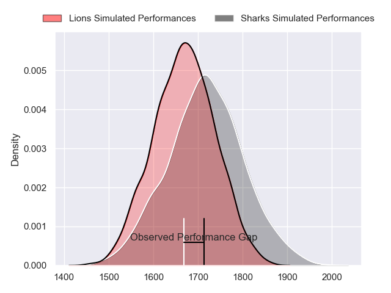
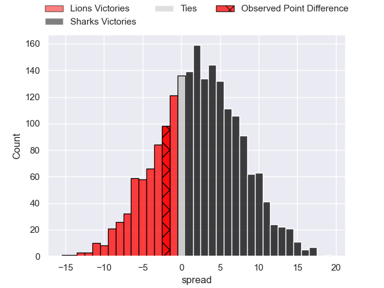
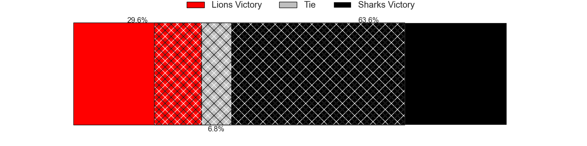
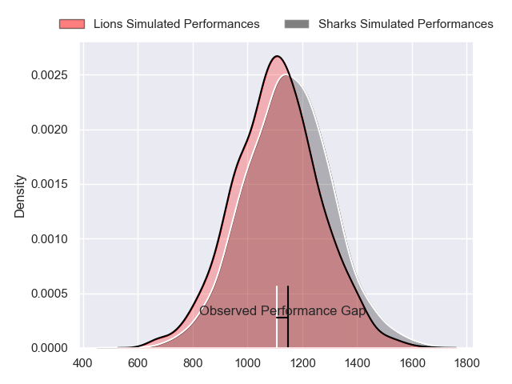
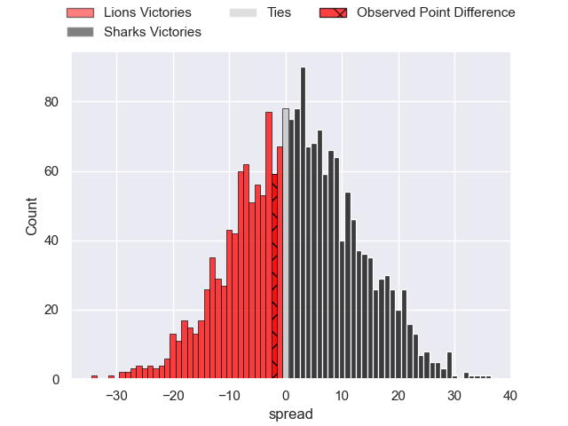
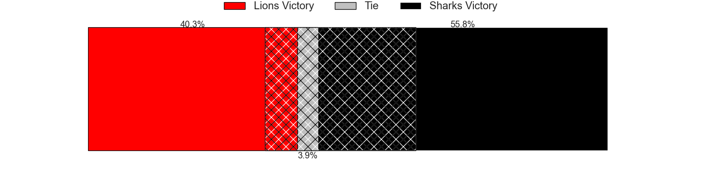
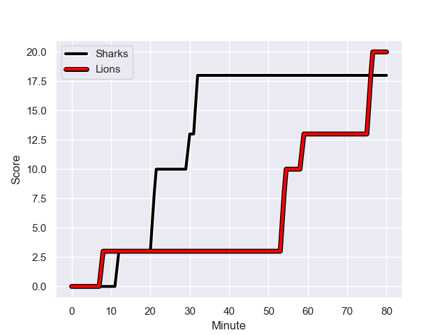
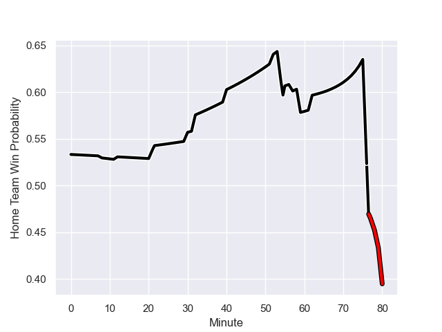

---  
layout: page  
title: Lions at Sharks; 20-18  
date: 2024-01-06 18:00:00 -0500  
categories: "United Rugby Championship 2023" match review  
---
# Lions at Sharks; 20-18

# Club Level Predictions

The first set of predictions treats a club as the smallest object, as the club develops its members, organizes a gameplan, and deploys its players as needed for each match. This club model has a prediction of 0.563, which translates to predicting Sharks to win by 2.3.

Our Over/Under is 51.5 - and combined with the spread above, we have a predicted scoreline of 24 to 27

Each club has a rating and a rating deviation (similar to a Glicko rating), and expected performances can be generated. This allows for simulated matches and spreads like the ones below.
## Projected Performances - Club Model

## Projected Spreads - Club Model

## Projected Results - Club Model

# Player Level Predictions - Version 2

Treating teams instead as an entity made up of the currently active players, I have ratings for each player in an altogether different system. These can be combined to form team ratings once teamsheets are announced, weighting starters a bit higher than the reserves. After the match is played, players can be weighted by their minutes on the field, allowing for an accurate measure of the team's composition. With these compiled team ratings, we can make predictions, measure inaccuracy, and update the individual player ratings.
## Prediction with Player Minutes: Sharks by 1.5

Lions by 3.3 on a neutral field
## Prediction without Player Minutes: Sharks by 3.7

Lions by 1.0 on a neutral pitch

## Projected Performances - Player Model

## Projected Spreads - Player Model

## Projected Results - Player Model

## Scores over Time

## Win Probability over Time

There were 4 large changes in win probability in this match

|   Away Minutes | Away Player            |   Away elo |   Number |   Home elo | Home Player         |   Home Minutes |
|---------------:|:-----------------------|-----------:|---------:|-----------:|:--------------------|---------------:|
|             57 | Jean-Pierre Smith      |      48.05 |        1 |     136.29 | Ox Nche             |             52 |
|             57 | PJ Botha               |      35.41 |        2 |      76.51 | Fez Mbatha          |             52 |
|             57 | Asenathi Ntlabakanye   |      28.05 |        3 |      44.09 | Hanro Jacobs        |             40 |
|             80 | Ruben Schoeman         |      87.58 |        4 |     121.16 | Eben Etzebeth       |             80 |
|             49 | Darrien-Lane Landsberg |      20.4  |        5 |      22.12 | Gerbrandt Grobler   |             80 |
|             57 | Emmanuel Tshituka      |      55.23 |        6 |      37.47 | James Venter        |             80 |
|             61 | Ruan Venter            |      85.9  |        7 |      43.73 | Jeandre Labuschagne |             62 |
|             80 | Francke Horn           |     130.37 |        8 |      54.22 | Phepsi Buthelezi    |             80 |
|             55 | Morne Van den Berg     |      35.41 |        9 |      55.75 | Grant Williams      |             59 |
|             80 | Sanele Nohamba         |     124.65 |       10 |      61.47 | Curwin Bosch        |             62 |
|             80 | Edwill van der Merwe   |      69.03 |       11 |     144.95 | Makazole Mapimpi    |             80 |
|             80 | Marius Louw            |     103.43 |       12 |      43.01 | Francois Venter     |             80 |
|             80 | Henco van Wyk          |      77.52 |       13 |      61.5  | Lukhanyo Am         |             80 |
|             80 | Richard Kriel          |      54.32 |       14 |      56.79 | Werner Kok          |             80 |
|             80 | Quan Horn              |      93.27 |       15 |      96.86 | Aphelele Fassi      |             80 |
|             25 | Jordan Hendrikse       |      25.96 |       16 |     103.59 | Joel Hintz          |             40 |
|             31 | Reinhard Nothnagel     |     111.03 |       17 |      29.01 | George Cronje       |             18 |
|             23 | Ruan Smith             |      64.9  |       18 |      27.57 | Ntuthuko Mchunu     |             28 |
|             23 | Morgan Naude           |      47.57 |       19 |      25.36 | Kerron van Vuuren   |             28 |
|             23 | Hanru Sirgel           |     117.82 |       20 |      81.29 | Jaden Hendrikse     |             21 |
|             23 | Jaco Visagie           |      52.35 |       21 |      59.61 | Boeta Chamberlain   |             18 |
|             19 | Johannes JC Pretorius  |      76.87 |       22 |     nan    | nan                 |            nan |

