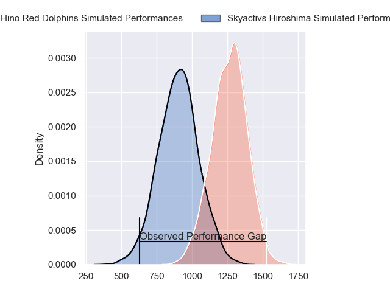
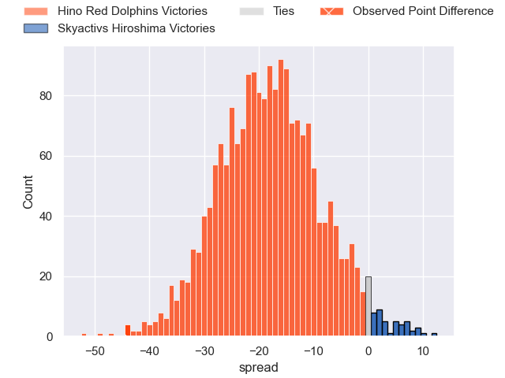
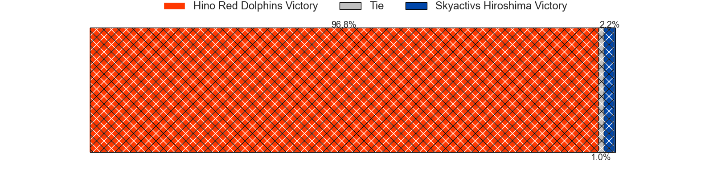
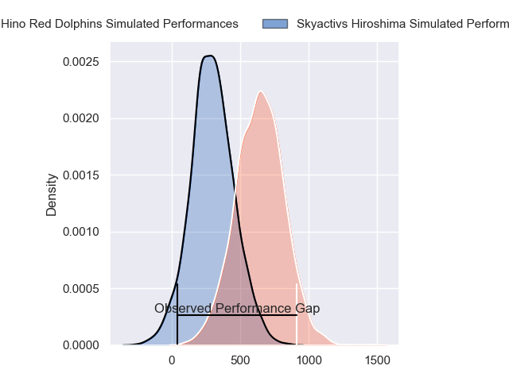
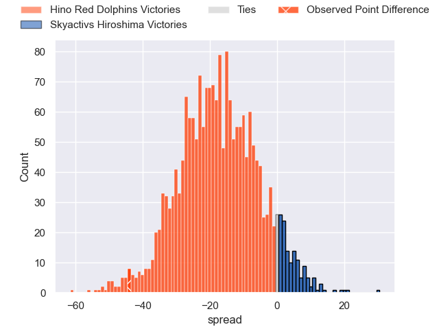
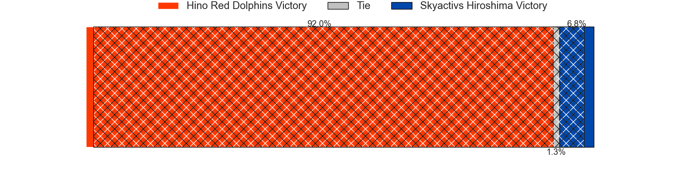
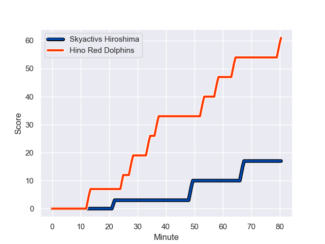
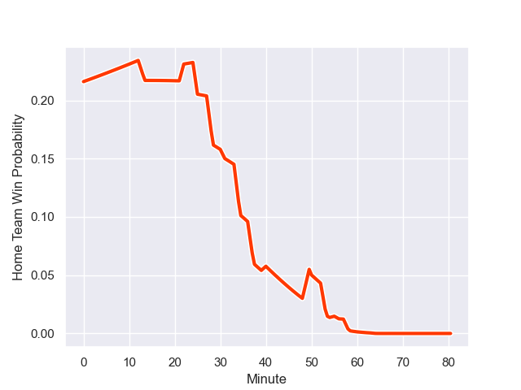

---  
layout: page  
title: Hino Red Dolphins at Skyactivs Hiroshima; 61-17  
date: 2024-01-06 18:00:00 -0500  
categories: "Japan Rugby League One D3 2023" match review  
---
# Hino Red Dolphins at Skyactivs Hiroshima; 61-17

# Club Level Predictions

The first set of predictions treats a club as the smallest object, as the club develops its members, organizes a gameplan, and deploys its players as needed for each match. This club model has a prediction of 0.124, which translates to predicting Hino Red Dolphins to win by 18.2.

Our Over/Under is 59.5 - and combined with the spread above, we have a predicted scoreline of 39 to 21

Each club has a rating and a rating deviation (similar to a Glicko rating), and expected performances can be generated. This allows for simulated matches and spreads like the ones below.
## Projected Performances - Club Model

## Projected Spreads - Club Model

## Projected Results - Club Model

# Player Level Predictions - Version 2

Treating teams instead as an entity made up of the currently active players, I have ratings for each player in an altogether different system. These can be combined to form team ratings once teamsheets are announced, weighting starters a bit higher than the reserves. After the match is played, players can be weighted by their minutes on the field, allowing for an accurate measure of the team's composition. With these compiled team ratings, we can make predictions, measure inaccuracy, and update the individual player ratings.
## Prediction with Player Minutes: Hino Red Dolphins by 14.3

Hino Red Dolphins by 17.5 on a neutral field
## Prediction without Player Minutes: Hino Red Dolphins by 15.0

Hino Red Dolphins by 18.2 on a neutral pitch

## Projected Performances - Player Model

## Projected Spreads - Player Model

## Projected Results - Player Model

## Scores over Time

## Win Probability over Time

There were 4 large changes in win probability in this match

|   Away Minutes | Away Player        |   Away elo |   Number |   Home elo | Home Player        |   Home Minutes |
|---------------:|:-------------------|-----------:|---------:|-----------:|:-------------------|---------------:|
|             75 | Yuto Tokuda        |      46.86 |        1 |     -22.64 | Koshi Kato         |             55 |
|             77 | Towa Taniguchi     |      47.69 |        2 |      -8.23 | Tomohiro Takeda    |             68 |
|             50 | Shosuke Funaki     |      25.89 |        3 |      -2.88 | Tomoya Otake       |             57 |
|             80 | Zephania Tuinona   |      48.07 |        4 |      32.07 | Yutaro Tanaka      |             61 |
|             65 | AJ Wolf            |      46.65 |        5 |     -13.88 | Lachlan Osborne    |             80 |
|             75 | Shun Nakashika     |      47.37 |        6 |     -29.76 | Tomoki Ashida      |             74 |
|             80 | Shun Tomonaga      |      48.05 |        7 |      56.53 | Koki Nakano        |             80 |
|             80 | Shohei Ijima       |      47.85 |        8 |      17.54 | Tevin Ferris       |             80 |
|             68 | Norifumi Hashimoto |       4    |        9 |      53.43 | Syoya Maeda        |             80 |
|             80 | Simon Hickey       |      66.78 |       10 |     -56.21 | Beaudein Waaka     |             40 |
|             65 | Sora Ohchi         |      21.8  |       11 |      53.43 | Kohei Tanaka       |             31 |
|             80 | Keita Doi          |      46.67 |       12 |      57    | Jacob Abel         |             80 |
|             75 | Yuta Matsui        |      39.67 |       13 |      -6.03 | Haruki Kitajima    |             80 |
|             80 | Ko Kojima          |      48.08 |       14 |      -1.06 | Yuto Nakamura      |             80 |
|             80 | Kyoji Takano       |      40.88 |       15 |      46.48 | Keisuke Nakamoto   |             67 |
|             30 | Taiga Yamaguchi    |      47.1  |       16 |      39.57 | Kaito Sasaoka      |             49 |
|             15 | Junya Lee          |      38.31 |       17 |     -13.79 | Ryoutarou Saito    |             40 |
|             15 | Kuniya Sonoki      |      45    |       18 |      51.49 | Haruki Umemoto     |             25 |
|             12 | Yuki Kagoshima     |      64.37 |       19 |      48.61 | Tadatsugu Kanayama |             23 |
|              5 | Yutaro Danno       |      46.75 |       20 |      49.26 | Kaiha Noda         |             19 |
|              5 | Yuta Kasahara      |      37.85 |       21 |     -90.75 | Ginjiro Sakiguchi  |             13 |
|              5 | Ryuji Hirose       |      46.65 |       22 |      46.65 | Taichi Yoko        |             12 |
|              3 | Daiki Nakagawa     |      46.66 |       23 |      45.97 | Hirokazu Ishigami  |              6 |

