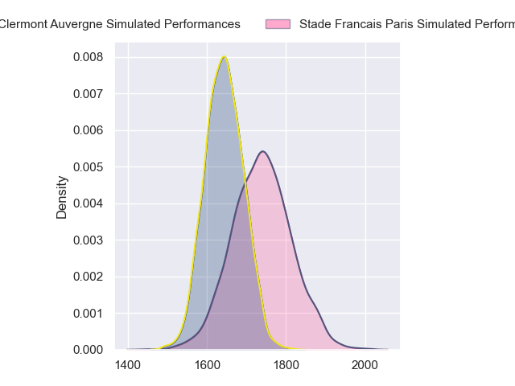
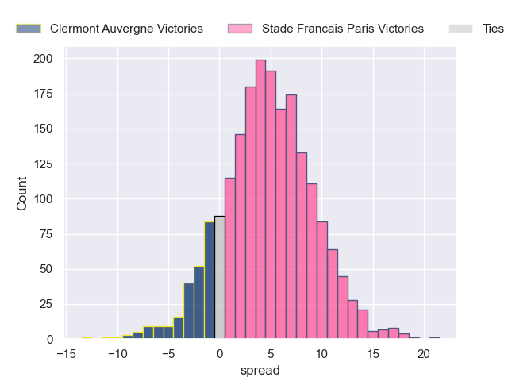
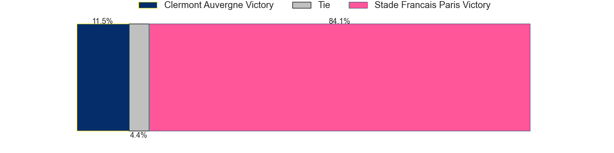
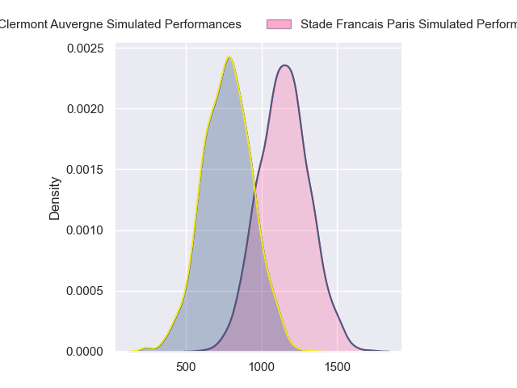
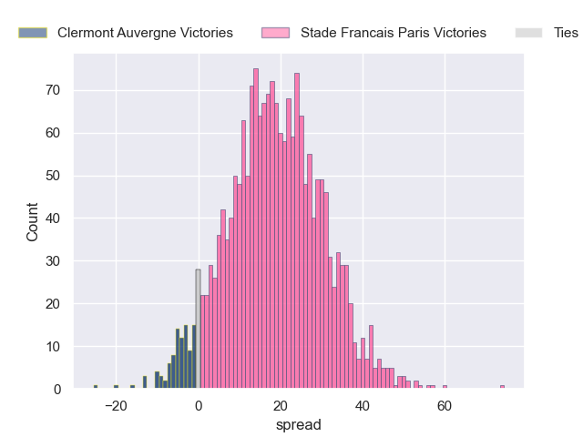
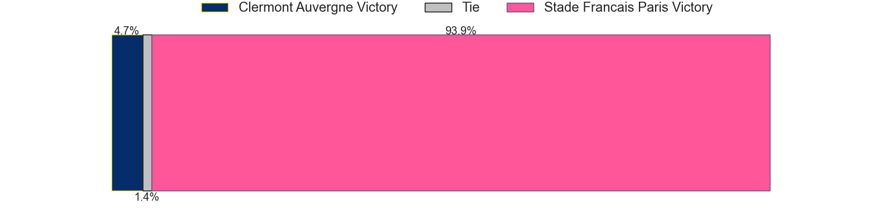
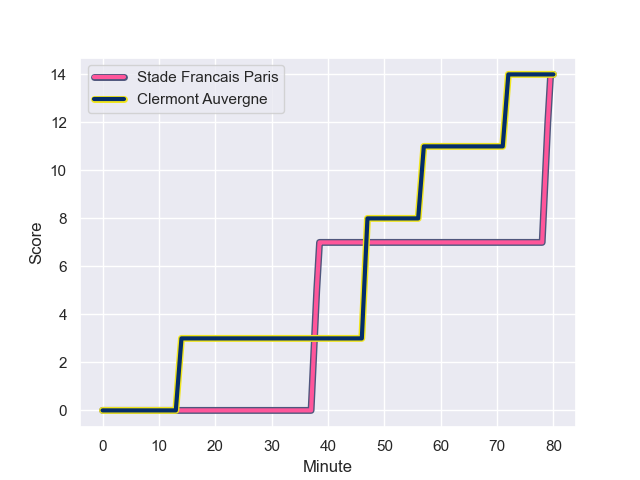
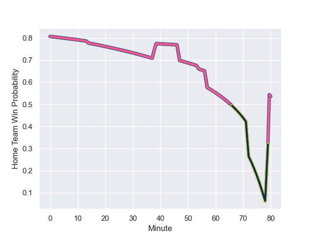

---  
layout: page  
title: Clermont Auvergne at Stade Francais Paris; 14-14  
date: 2024-01-06 18:00:00 -0500  
categories: "Top 14 Orange 2023" match review  
---
# Clermont Auvergne at Stade Francais Paris; 14-14

# Club Level Predictions

The first set of predictions treats a club as the smallest object, as the club develops its members, organizes a gameplan, and deploys its players as needed for each match. This club model has a prediction of 0.629, which translates to predicting Stade Francais Paris to win by 4.6.

Our Over/Under is 50.5 - and combined with the spread above, we have a predicted scoreline of 23 to 28

Each club has a rating and a rating deviation (similar to a Glicko rating), and expected performances can be generated. This allows for simulated matches and spreads like the ones below.
## Projected Performances - Club Model

## Projected Spreads - Club Model

## Projected Results - Club Model

# Player Level Predictions - Version 2

Treating teams instead as an entity made up of the currently active players, I have ratings for each player in an altogether different system. These can be combined to form team ratings once teamsheets are announced, weighting starters a bit higher than the reserves. After the match is played, players can be weighted by their minutes on the field, allowing for an accurate measure of the team's composition. With these compiled team ratings, we can make predictions, measure inaccuracy, and update the individual player ratings.
## Prediction with Player Minutes: Stade Francais Paris by 15.9

Stade Francais Paris by 7.7 on a neutral field
## Prediction without Player Minutes: Stade Francais Paris by 17.1

Stade Francais Paris by 8.9 on a neutral pitch

## Projected Performances - Player Model

## Projected Spreads - Player Model

## Projected Results - Player Model

## Scores over Time

## Win Probability over Time

There were 12 large changes in win probability in this match

|   Away Minutes | Away Player          |   Away elo |   Number |   Home elo | Home Player             |   Home Minutes |
|---------------:|:---------------------|-----------:|---------:|-----------:|:------------------------|---------------:|
|             58 | Etienne Falgoux      |      53.77 |        1 |      75.93 | Sergo Abramishvili      |             54 |
|             77 | Etienne Fourcade     |      36.94 |        2 |      96.33 | Mickael Ivaldi          |             59 |
|             68 | Rabah Slimani        |      55.17 |        3 |      75.06 | Paul Alo-Emile          |             61 |
|             58 | Thibaud Lanen        |      60.48 |        4 |      44.81 | Paul Gabrillagues       |             80 |
|             80 | Tomas Lavanini       |      62.29 |        5 |      90.67 | JJ van der Mescht       |             54 |
|             77 | Killian Tixeront     |      48.34 |        6 |      19.05 | Tanginoa Halaifonua     |             68 |
|             80 | Marcos Kremer        |      43.09 |        7 |      58.12 | Romain Briatte          |             80 |
|             80 | Fritz Lee            |      75.7  |        8 |      25.02 | Mathieu Hirigoyen       |             80 |
|             75 | Sebastien Bezy       |      71.61 |        9 |      94.48 | Brad Weber              |             80 |
|             80 | Anthony Belleau      |      63.77 |       10 |      68.01 | Zack Henry              |             80 |
|             80 | Alivereti Raka       |      27.51 |       11 |      65.5  | Lester Etien            |             80 |
|             68 | Pierre Fouyssac      |      16.33 |       12 |     110.88 | Jeremy Ward             |             80 |
|             80 | Julien Heriteau      |      45.39 |       13 |      78.85 | Joe Marchant            |             61 |
|             80 | Bautista Delguy      |      68.26 |       14 |      14.79 | Kylan Hamdaoui          |             80 |
|             58 | Thomas Roziere       |      18.81 |       15 |      68.6  | Leo Barre               |             80 |
|             22 | Jules Plisson        |      77.73 |       16 |      51.47 | Moses Alo-Emile         |             26 |
|             22 | Rob Simmons          |      83.72 |       17 |      46.45 | Pierre-Henri Azagoh     |             26 |
|             22 | Giorgi Beria         |      43.13 |       18 |      44.14 | Lucas Peyresblanques    |             21 |
|             12 | Giorgi Dzmanashvili  |      42.05 |       19 |      77.47 | Francisco Gomez Kodela  |             19 |
|             12 | Leon Darricarrere    |      41.24 |       20 |      46.19 | Peniasi Dakuwaqa        |             19 |
|              5 | Baptiste Jauneau     |      22.41 |       21 |      92.73 | Giovanni Habel-Kueffner |             12 |
|              3 | Peceli Yato Senibitu |     103.37 |       22 |     nan    | nan                     |            nan |
|              3 | Yohan Beheregaray    |      37.57 |       23 |     nan    | nan                     |            nan |

