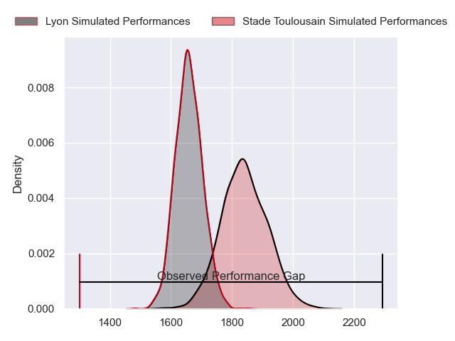
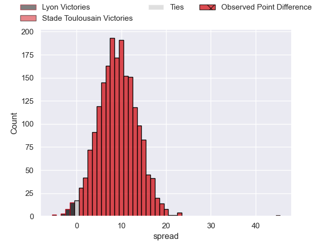
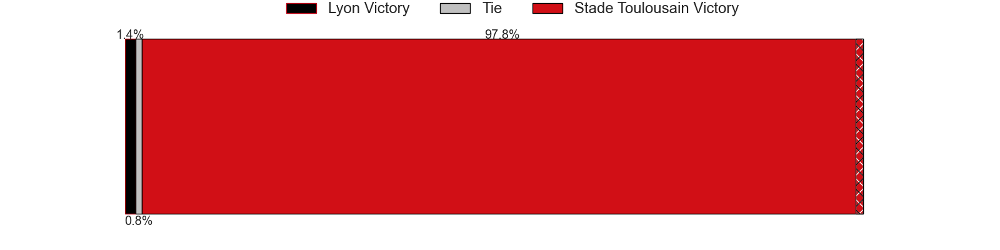
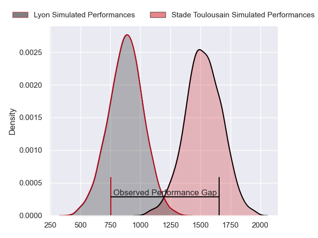
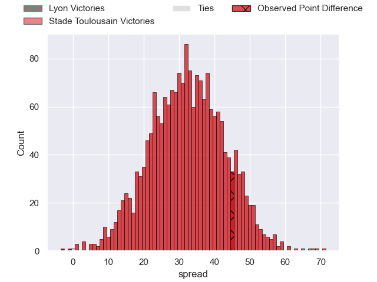
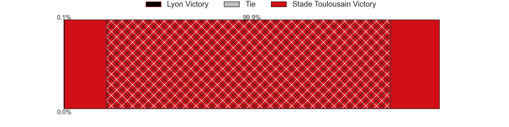
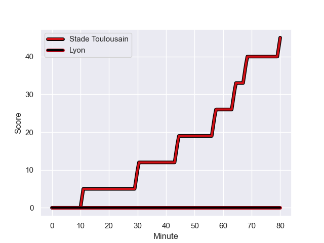
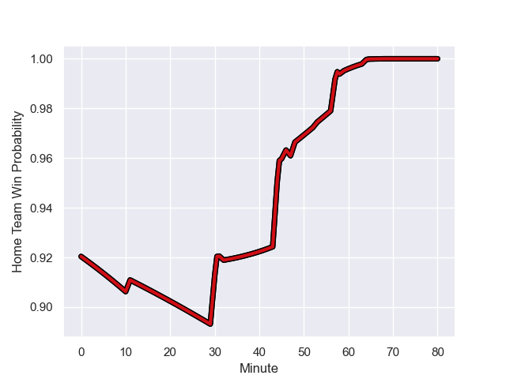

---  
layout: page  
title: Lyon at Stade Toulousain; 0-45  
date: 2024-01-06 18:00:00 -0500  
categories: "Top 14 Orange 2023" match review  
---
# Lyon at Stade Toulousain; 0-45

# Club Level Predictions

The first set of predictions treats a club as the smallest object, as the club develops its members, organizes a gameplan, and deploys its players as needed for each match. This club model has a prediction of 0.738, which translates to predicting Stade Toulousain to win by 9.1.

Our Over/Under is 48.5 - and combined with the spread above, we have a predicted scoreline of 19 to 29

Each club has a rating and a rating deviation (similar to a Glicko rating), and expected performances can be generated. This allows for simulated matches and spreads like the ones below.
## Projected Performances - Club Model

## Projected Spreads - Club Model

## Projected Results - Club Model

# Player Level Predictions - Version 2

Treating teams instead as an entity made up of the currently active players, I have ratings for each player in an altogether different system. These can be combined to form team ratings once teamsheets are announced, weighting starters a bit higher than the reserves. After the match is played, players can be weighted by their minutes on the field, allowing for an accurate measure of the team's composition. With these compiled team ratings, we can make predictions, measure inaccuracy, and update the individual player ratings.
## Prediction with Player Minutes: Stade Toulousain by 26.8

Stade Toulousain by 19.0 on a neutral field
## Prediction without Player Minutes: Stade Toulousain by 26.6

Stade Toulousain by 18.8 on a neutral pitch

## Projected Performances - Player Model

## Projected Spreads - Player Model

## Projected Results - Player Model

## Scores over Time

## Win Probability over Time

There were 1 large changes in win probability in this match

|   Away Minutes | Away Player           |   Away elo |   Number |   Home elo | Home Player         |   Home Minutes |
|---------------:|:----------------------|-----------:|---------:|-----------:|:--------------------|---------------:|
|             48 | Vivien Devisme        |      50.81 |        1 |      59.08 | David Ainu'u        |             46 |
|             47 | Guillaume Marchand    |      33.8  |        2 |      95.82 | Julien Marchand     |             53 |
|             59 | Demba Bamba           |      76.33 |        3 |     103.96 | Dorian Aldegheri    |             58 |
|             80 | Joel Kpoku            |      44.63 |        4 |      30    | Richie Arnold       |             58 |
|             80 | Mickael Guillard      |      42.93 |        5 |      65.53 | Emmanuel Meafou     |             80 |
|             80 | Arno Botha            |      58.59 |        6 |     117.32 | Francois Cros       |             80 |
|             32 | Pierre-Samuel Pacheco |      38.08 |        7 |     112.43 | Jack Willis         |             46 |
|             59 | Maxime Gouzou         |      31.46 |        8 |     128.06 | Anthony Jelonch     |             80 |
|             60 | Martin Page-Relo      |      69.23 |        9 |     140.91 | Antoine Dupont      |             80 |
|             80 | Paddy Jackson         |      60.84 |       10 |     115.81 | Thomas Ramos        |             65 |
|             80 | Vincent Rattez        |     124.05 |       11 |     130.37 | Matthis Lebel       |             58 |
|             59 | Kyle Godwin           |      61.21 |       12 |      22.19 | Pita Ahki           |             58 |
|             80 | Ethan Dumortier       |      54.57 |       13 |      63.08 | Dimitri Delibes     |             80 |
|             60 | Xavier Mignot         |      64.92 |       14 |      72.94 | Setareki Bituniyata |             80 |
|             80 | Davit Niniashvili     |      80.91 |       15 |     104.26 | Juan Cruz Mallia    |             80 |
|             20 | Thaakir Abrahams      |      24.88 |       16 |      96.45 | Cyril Baille        |             34 |
|             33 | Liam Coltman          |      66.51 |       17 |      92.71 | Alexandre Roumat    |             34 |
|             32 | Jerome Rey            |      14.3  |       18 |     104.99 | Peato Mauvaka       |             27 |
|             21 | Valentin Simutoga     |      34.6  |       19 |      99.74 | Ange Capuozzo       |             22 |
|             21 | Thibault Regard       |      79.91 |       20 |      16.52 | Santiago Chocobares |             22 |
|             21 | Ugo Vignolles         |      46.96 |       21 |      41.65 | Joshua Brennan      |             22 |
|             20 | Liam Rimet            |      42.63 |       22 |      56.25 | Joel Merkler        |             22 |
|             48 | Liam Allen            |      45.74 |       23 |      34.79 | Paul Graou          |             15 |

