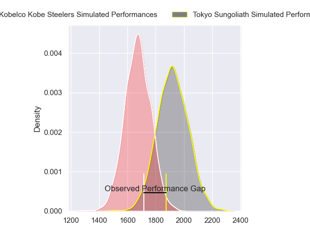
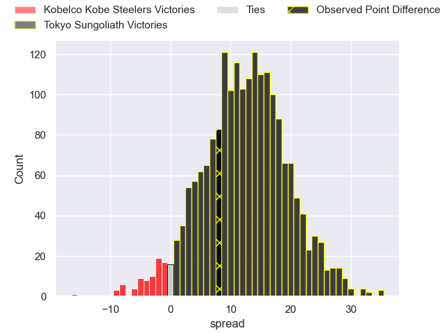
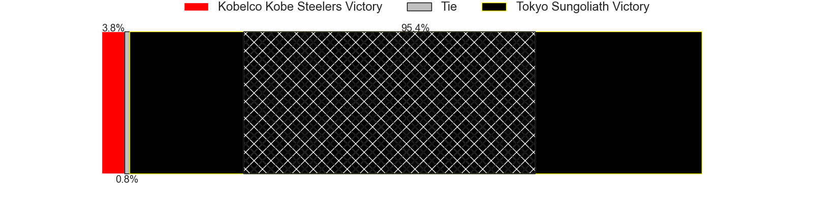
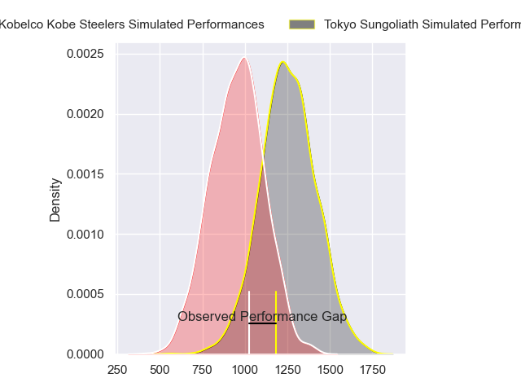
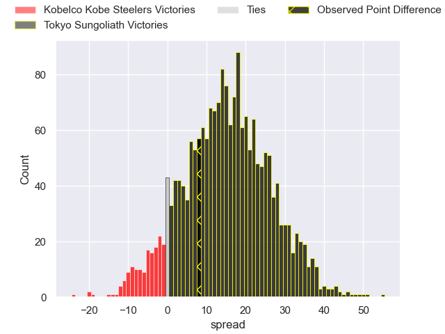
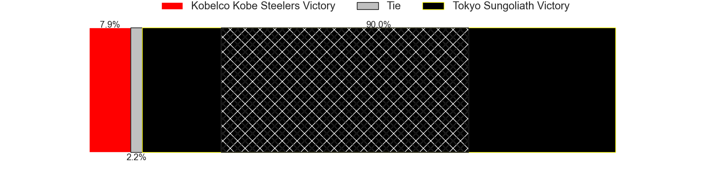
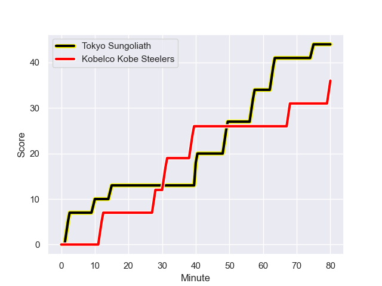
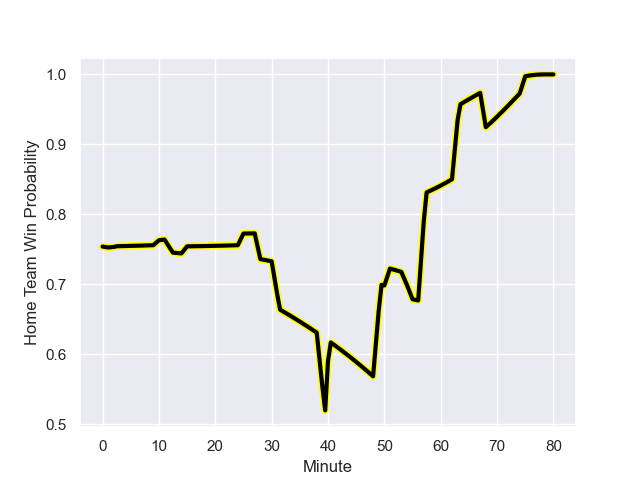

---  
layout: page  
title: Kobelco Kobe Steelers at Tokyo Sungoliath; 36-44  
date: 2024-01-06 18:00:00 -0500  
categories: "Japan Rugby League One 2023" match review  
---
# Kobelco Kobe Steelers at Tokyo Sungoliath; 36-44

# Club Level Predictions

The first set of predictions treats a club as the smallest object, as the club develops its members, organizes a gameplan, and deploys its players as needed for each match. This club model has a prediction of 0.802, which translates to predicting Tokyo Sungoliath to win by 12.6.

Our Over/Under is 61.5 - and combined with the spread above, we have a predicted scoreline of 25 to 37

Each club has a rating and a rating deviation (similar to a Glicko rating), and expected performances can be generated. This allows for simulated matches and spreads like the ones below.
## Projected Performances - Club Model

## Projected Spreads - Club Model

## Projected Results - Club Model

# Player Level Predictions - Version 2

Treating teams instead as an entity made up of the currently active players, I have ratings for each player in an altogether different system. These can be combined to form team ratings once teamsheets are announced, weighting starters a bit higher than the reserves. After the match is played, players can be weighted by their minutes on the field, allowing for an accurate measure of the team's composition. With these compiled team ratings, we can make predictions, measure inaccuracy, and update the individual player ratings.
## Prediction with Player Minutes: Tokyo Sungoliath by 12.3

Tokyo Sungoliath by 8.5 on a neutral field
## Prediction without Player Minutes: Tokyo Sungoliath by 11.4

Tokyo Sungoliath by 7.5 on a neutral pitch

## Projected Performances - Player Model

## Projected Spreads - Player Model

## Projected Results - Player Model

## Scores over Time

## Win Probability over Time

There were 12 large changes in win probability in this match

|   Away Minutes | Away Player              |   Away elo |   Number |   Home elo | Home Player       |   Home Minutes |
|---------------:|:-------------------------|-----------:|---------:|-----------:|:------------------|---------------:|
|             51 | Isileli Nakajima Vakauta |      79.33 |        1 |      91.41 | Yukio Morikawa    |             51 |
|             55 | Kenta Matsuoka           |      48.15 |        2 |      43.28 | Kosuke Horikoshi  |             54 |
|             61 | Koo Ji-won               |       1.25 |        3 |      43.75 | Kan Nakano        |             80 |
|             54 | Waisake Raratubua        |      53.38 |        4 |      58.73 | Sione Lavemai     |             51 |
|             75 | Brodie Retallick         |     166.47 |        5 |     137.47 | Harry Hockings    |             69 |
|             80 | Amanaki Saumaki          |      46    |        6 |      45.85 | Kanji Shimokawa   |             80 |
|             80 | Ardie Savea              |     140.77 |        7 |      34.57 | Kai Yamamoto      |             25 |
|             80 | Tiennan Costley          |      45.64 |        8 |     121.33 | Sam Cane          |             80 |
|             55 | Daiki Nakajima           |      44.7  |        9 |      89.08 | Yutaka Nagare     |             54 |
|             80 | Bryn Gatland             |      81.69 |       10 |      56.44 | Mikiya Takamoto   |             80 |
|             75 | Rakuhei Yamashita        |     100.23 |       11 |     143.97 | Cheslin Kolbe     |             80 |
|             61 | Ngani Laumape            |      66.88 |       12 |      35.09 | Isaiah Punivai    |             51 |
|             80 | Seungsin Lee             |       8.9  |       13 |      57.32 | Taiga Ozaki       |             80 |
|             80 | Junta Hamano             |      23.98 |       14 |      94.17 | Seiya Ozaki       |             80 |
|             80 | Kanta Matsunaga          |      51.36 |       15 |     113.71 | Kotaro Matsushima |             80 |
|             29 | Shigure Takao            |      45.54 |       16 |      62.68 | Koji Iino         |             55 |
|             26 | Takara Imamura           |      33.61 |       17 |      49.56 | Kenta Kobayashi   |             29 |
|             25 | Takuya Kitade            |      71.71 |       18 |      96.13 | Sam Jeffries      |             29 |
|             25 | Atsushi Hiwasa           |      61.34 |       19 |      60.64 | Shota Emi         |             29 |
|             19 | Takayuki Watanabe        |      53.55 |       20 |      24.64 | Naoto Saito       |             26 |
|             19 | Michael Little           |      74.62 |       21 |      51.93 | Kienori Go        |             26 |
|              5 | Gerard Cowley-Tuioti     |      56.94 |       22 |      34.62 | Tamati Ioane      |             11 |
|              5 | Shintaro Hayashi         |      37.99 |       23 |     nan    | nan               |            nan |

