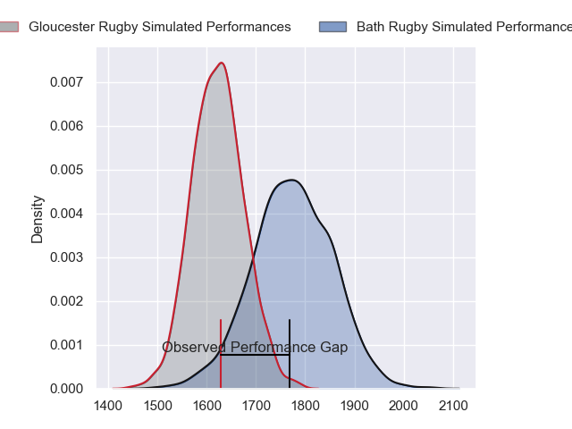
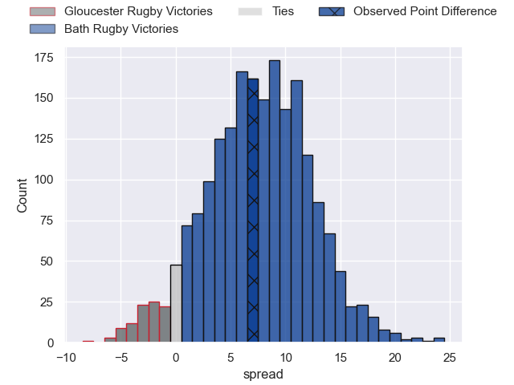
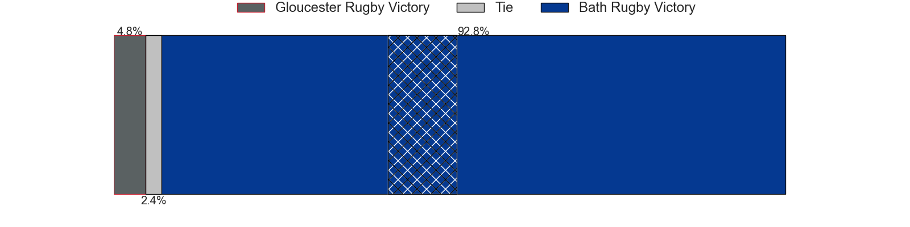
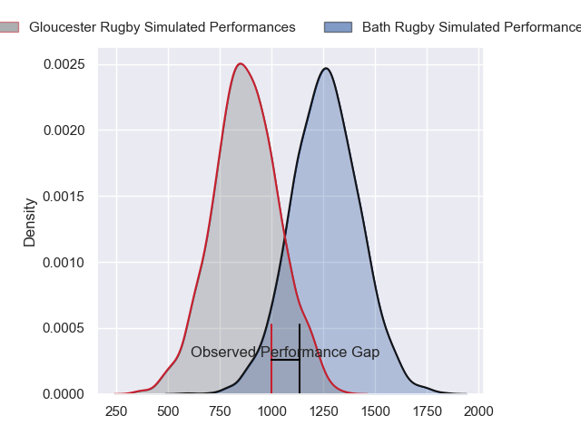
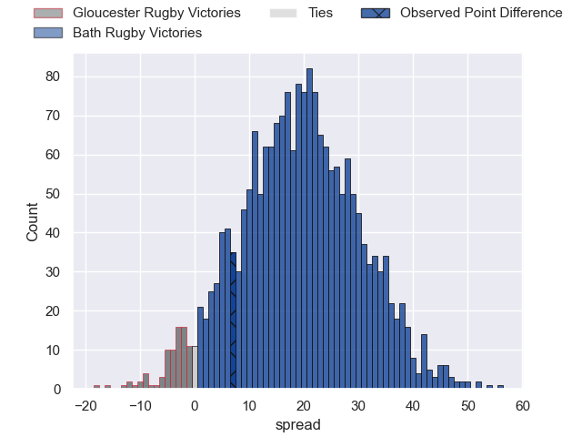
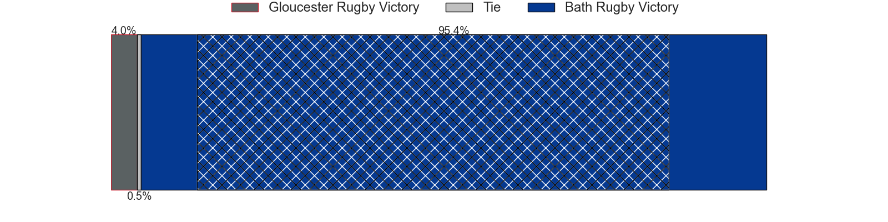
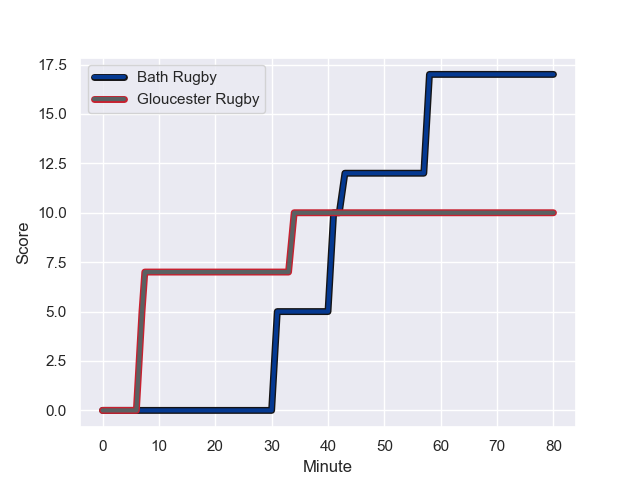
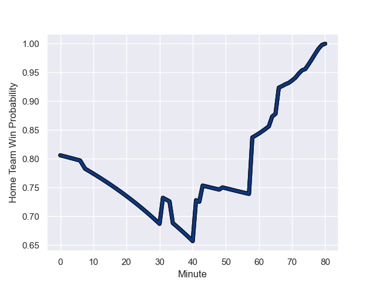

---  
layout: page  
title: Gloucester Rugby at Bath Rugby; 10-17  
date: 2024-01-07 18:00:00 -0500  
categories: "Gallagher Premiership 2023" match review  
---
# Gloucester Rugby at Bath Rugby; 10-17

# Club Level Predictions

The first set of predictions treats a club as the smallest object, as the club develops its members, organizes a gameplan, and deploys its players as needed for each match. This club model has a prediction of 0.703, which translates to predicting Bath Rugby to win by 7.6.

Our Over/Under is 44.5 - and combined with the spread above, we have a predicted scoreline of 18 to 26

Each club has a rating and a rating deviation (similar to a Glicko rating), and expected performances can be generated. This allows for simulated matches and spreads like the ones below.
## Projected Performances - Club Model

## Projected Spreads - Club Model

## Projected Results - Club Model

# Player Level Predictions - Version 2

Treating teams instead as an entity made up of the currently active players, I have ratings for each player in an altogether different system. These can be combined to form team ratings once teamsheets are announced, weighting starters a bit higher than the reserves. After the match is played, players can be weighted by their minutes on the field, allowing for an accurate measure of the team's composition. With these compiled team ratings, we can make predictions, measure inaccuracy, and update the individual player ratings.
## Prediction with Player Minutes: Bath Rugby by 15.8

Bath Rugby by 8.1 on a neutral field
## Prediction without Player Minutes: Bath Rugby by 15.9

Bath Rugby by 8.2 on a neutral pitch

## Projected Performances - Player Model

## Projected Spreads - Player Model

## Projected Results - Player Model

## Scores over Time

## Win Probability over Time

There were 6 large changes in win probability in this match

|   Away Minutes | Away Player         |   Away elo |   Number |   Home elo | Home Player      |   Home Minutes |
|---------------:|:--------------------|-----------:|---------:|-----------:|:-----------------|---------------:|
|             49 | Mayco Vivas         |      16.93 |        1 |      78.84 | Beno Obano       |             58 |
|             69 | George McGuigan     |      66.39 |        2 |     119.64 | Tom Dunn         |             58 |
|             66 | Kirill Gotovtsev    |      70.42 |        3 |      36.64 | Will Stuart      |             72 |
|             69 | Freddie Clarke      |      43.86 |        4 |      84.23 | Elliott Stooke   |             72 |
|             80 | Matias Alemanno     |      50.21 |        5 |      54.41 | Charlie Ewels    |             80 |
|             66 | Ruan Ackermann      |     102.56 |        6 |      53.21 | GJ van Velze     |             66 |
|             80 | Lewis Ludlow        |      42.48 |        7 |     114.81 | Miles Reid       |             80 |
|             80 | Zach Mercer         |      52.19 |        8 |      50.95 | Jaco Coetzee     |             49 |
|             64 | Caolan Englefield   |      56.12 |        9 |      44.81 | Ben Spencer      |             80 |
|             80 | Adam Hastings       |     121.17 |       10 |     162.53 | Finn Russell     |             80 |
|             80 | Ollie Thorley       |      88.48 |       11 |      -0.48 | Will Muir        |             80 |
|             74 | Sebastien Atkinson  |       9.08 |       12 |      66.67 | Cameron Redpath  |             80 |
|             80 | Chris Harris        |      53.77 |       13 |      65.5  | Ollie Lawrence   |             80 |
|             80 | Jonny May           |      45.4  |       14 |     101    | Joe Cokanasiga   |             80 |
|             80 | Santiago Carreras   |      82.82 |       15 |      28.26 | Tom de Glanville |             74 |
|             11 | Sebastian Blake     |      30.58 |       16 |      55.23 | Niall Annett     |             22 |
|             31 | Jamal Ford-Robinson |      11.31 |       17 |      97.67 | Thomas du Toit   |             22 |
|             14 | Fraser Balmain      |      26.09 |       18 |      46.65 | Archie Griffin   |              8 |
|             11 | Cameron Jordan      |      88.8  |       19 |      93.86 | Quinn Roux       |              8 |
|             14 | Jack Clement        |      34.33 |       20 |      55.5  | Alfie Barbeary   |             31 |
|             16 | Stephen Varney      |       6.22 |       21 |      49.07 | Tom Carr-Smith   |              0 |
|              6 | Max Llewellyn       |      92.31 |       22 |      46.63 | Sam Harris       |              6 |
|              0 | Lloyd Evans         |      68.23 |       23 |     163.77 | Chris Cloete     |             14 |

