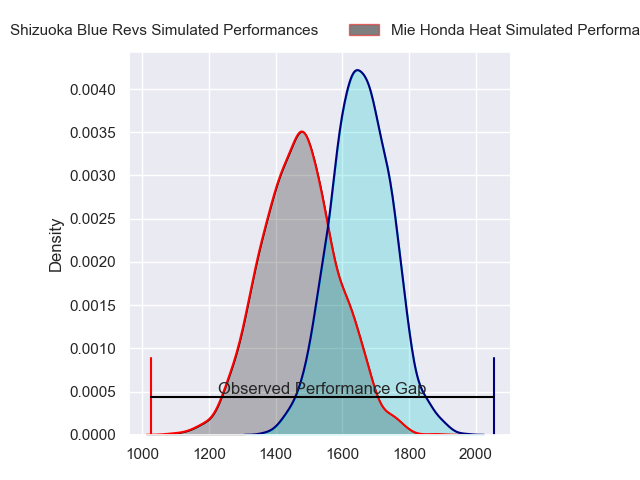
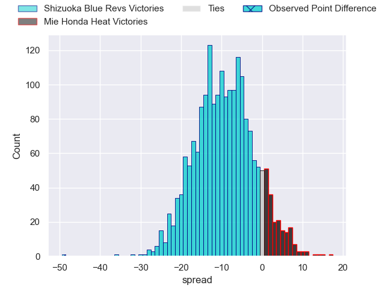
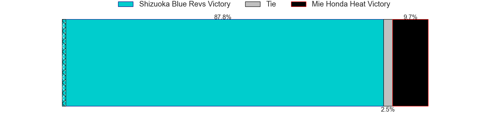
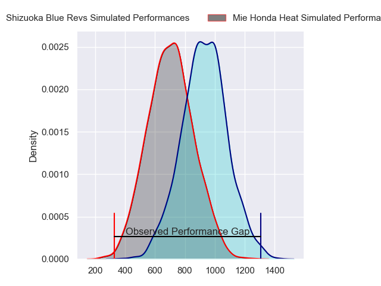
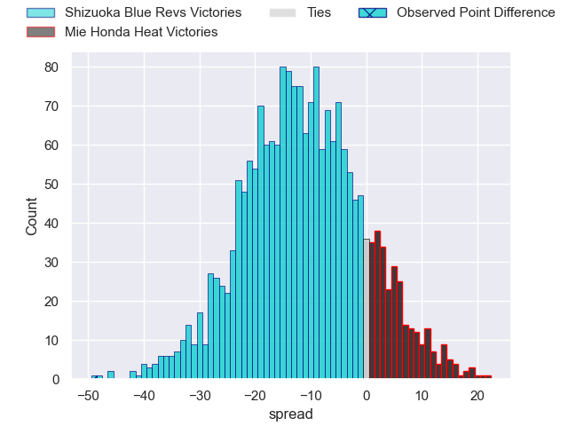
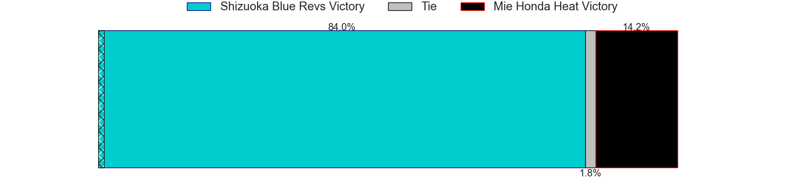
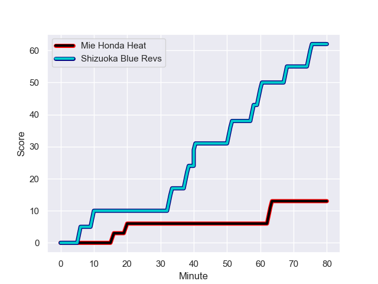
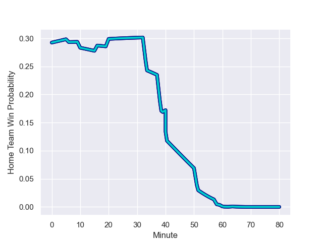

---  
layout: page  
title: Shizuoka Blue Revs at Mie Honda Heat; 62-13  
date: 2024-01-07 18:00:00 -0500  
categories: "Japan Rugby League One 2023" match review  
---
# Shizuoka Blue Revs at Mie Honda Heat; 62-13

# Club Level Predictions

The first set of predictions treats a club as the smallest object, as the club develops its members, organizes a gameplan, and deploys its players as needed for each match. This club model has a prediction of 0.262, which translates to predicting Shizuoka Blue Revs to win by 9.4.

Our Over/Under is 55.5 - and combined with the spread above, we have a predicted scoreline of 32 to 23

Each club has a rating and a rating deviation (similar to a Glicko rating), and expected performances can be generated. This allows for simulated matches and spreads like the ones below.
## Projected Performances - Club Model

## Projected Spreads - Club Model

## Projected Results - Club Model

# Player Level Predictions - Version 2

Treating teams instead as an entity made up of the currently active players, I have ratings for each player in an altogether different system. These can be combined to form team ratings once teamsheets are announced, weighting starters a bit higher than the reserves. After the match is played, players can be weighted by their minutes on the field, allowing for an accurate measure of the team's composition. With these compiled team ratings, we can make predictions, measure inaccuracy, and update the individual player ratings.
## Prediction with Player Minutes: Shizuoka Blue Revs by 9.7

Shizuoka Blue Revs by 13.2 on a neutral field
## Prediction without Player Minutes: Shizuoka Blue Revs by 10.1

Shizuoka Blue Revs by 13.6 on a neutral pitch

## Projected Performances - Player Model

## Projected Spreads - Player Model

## Projected Results - Player Model

## Scores over Time

## Win Probability over Time

There were 4 large changes in win probability in this match

|   Away Minutes | Away Player        |   Away elo |   Number |   Home elo | Home Player           |   Home Minutes |
|---------------:|:-------------------|-----------:|---------:|-----------:|:----------------------|---------------:|
|             59 | Kazuhiro Kawata    |      19.9  |        1 |      15.52 | Tatsuhiko Tsurukawa   |             53 |
|             59 | Takeshi Hino       |      85.28 |        2 |      17.84 | Lee Seung Hyok        |             59 |
|             53 | Heiichiro Ito      |      62.45 |        3 |      35.21 | Taiki Yoshioka        |             49 |
|             80 | Eishin Kuwano      |      86.81 |        4 |      29.71 | Tetuhi Roberts        |             70 |
|             59 | Murray Douglas     |     100.99 |        5 |     108.09 | Franco Mostert        |             80 |
|             80 | Yuya Odo           |      88.99 |        6 |      13.83 | Ryota Kobayashi       |             80 |
|             80 | Kwagga Smith       |      83.15 |        7 |      -1.31 | Ryo Furuta            |             80 |
|             57 | Malgene Ilaua      |      58.35 |        8 |      23.85 | Heiden Bedwell-Curtis |             40 |
|             59 | Kodai Okazaki      |      46.65 |        9 |      38.47 | Shogo Nezuka          |             56 |
|             80 | Kenta Iemura       |      58.79 |       10 |      70.78 | Mitch Hunt            |             49 |
|             80 | Malo Tuitama       |      66.89 |       11 |     106.42 | Tevita Li             |             80 |
|             53 | Viliami Tahitu'a   |      50.8  |       12 |      19.75 | Fraser Quirk          |             80 |
|             80 | Charles Piutau     |      72.41 |       13 |      30.49 | Clinton Knox          |             80 |
|             80 | Hironori Yatomi    |      23.4  |       14 |      45    | Kanta Watanabe        |             80 |
|             65 | Futo Yamaguchi     |      69.43 |       15 |      55    | Yoshikazu Fujita      |             14 |
|             27 | Sohei Nishimura    |      31.24 |       16 |      45.37 | Haruhiko Uemura       |             66 |
|             27 | Sam Greene         |       0.49 |       17 |      50.27 | Waimana Kapa          |             40 |
|             23 | Shoji Takuma       |      44.79 |       18 |      49.49 | SongGi Pak            |             31 |
|             21 | Shintaro Okamoto   |      62.64 |       19 |      31.68 | Matthys Basson        |             31 |
|             21 | Richmond Tongatama |      47.23 |       20 |      42.91 | Kanato Hirano         |             27 |
|             21 | Bryn Hall          |     120.23 |       21 |      34.06 | Taichi Takenaka       |             24 |
|             21 | Ryosuke Funahashi  |      42.74 |       22 |      44.77 | Koki Hida             |             21 |
|             15 | Kakeru Okumura     |      18.8  |       23 |      32.59 | Yoji Akiyama          |             10 |

