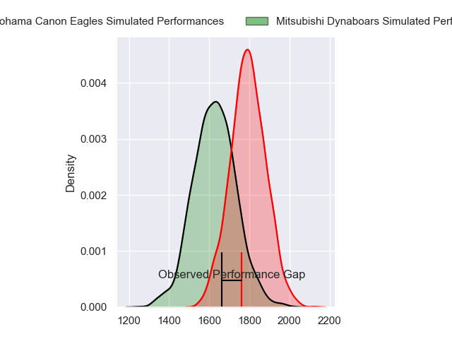
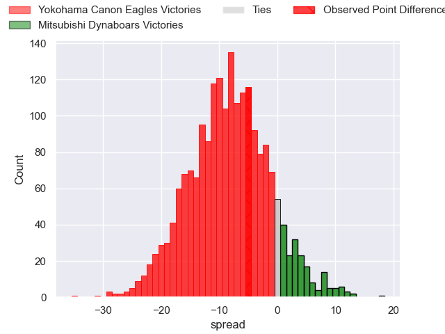
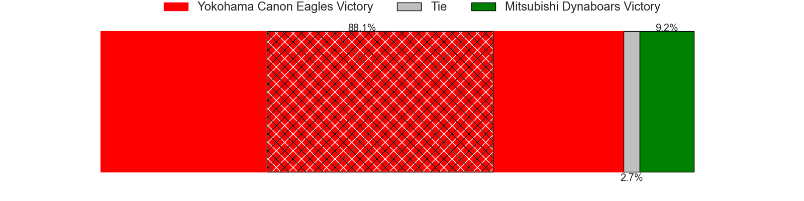
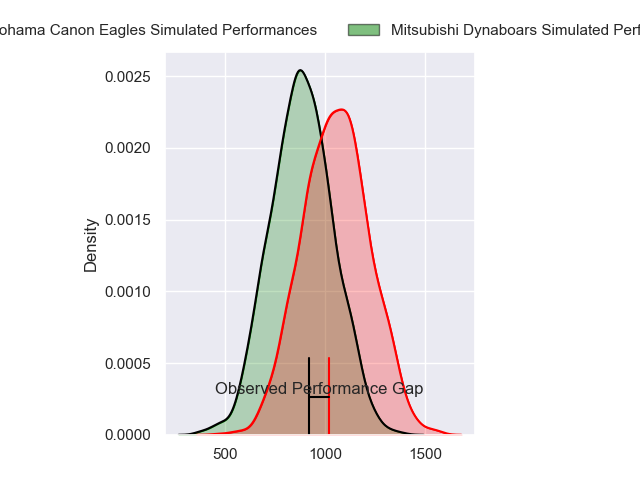
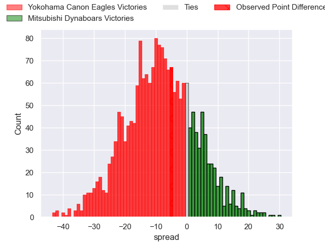
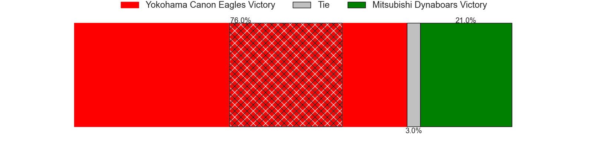
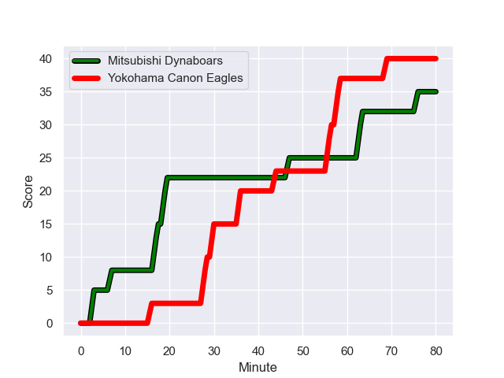
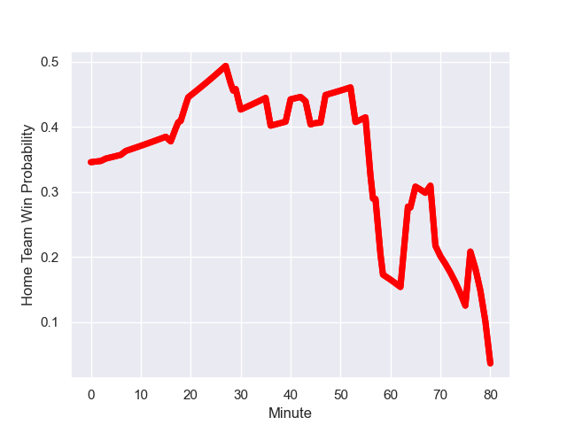

---  
layout: page  
title: Yokohama Canon Eagles at Mitsubishi Dynaboars; 40-35  
date: 2024-01-07 18:00:00 -0500  
categories: "Japan Rugby League One 2023" match review  
---
# Yokohama Canon Eagles at Mitsubishi Dynaboars; 40-35

# Club Level Predictions

The first set of predictions treats a club as the smallest object, as the club develops its members, organizes a gameplan, and deploys its players as needed for each match. This club model has a prediction of 0.285, which translates to predicting Yokohama Canon Eagles to win by 8.3.

Our Over/Under is 52.5 - and combined with the spread above, we have a predicted scoreline of 31 to 22

Each club has a rating and a rating deviation (similar to a Glicko rating), and expected performances can be generated. This allows for simulated matches and spreads like the ones below.
## Projected Performances - Club Model

## Projected Spreads - Club Model

## Projected Results - Club Model

# Player Level Predictions - Version 2

Treating teams instead as an entity made up of the currently active players, I have ratings for each player in an altogether different system. These can be combined to form team ratings once teamsheets are announced, weighting starters a bit higher than the reserves. After the match is played, players can be weighted by their minutes on the field, allowing for an accurate measure of the team's composition. With these compiled team ratings, we can make predictions, measure inaccuracy, and update the individual player ratings.
## Prediction with Player Minutes: Yokohama Canon Eagles by 7.1

Yokohama Canon Eagles by 10.4 on a neutral field
## Prediction without Player Minutes: Yokohama Canon Eagles by 6.6

Yokohama Canon Eagles by 10.0 on a neutral pitch

## Projected Performances - Player Model

## Projected Spreads - Player Model

## Projected Results - Player Model

## Scores over Time

## Win Probability over Time

There were 20 large changes in win probability in this match

|   Away Minutes | Away Player       |   Away elo |   Number |   Home elo | Home Player            |   Home Minutes |
|---------------:|:------------------|-----------:|---------:|-----------:|:-----------------------|---------------:|
|             62 | Takato Okabe      |     103.04 |        1 |      31.38 | Shunsuke Sakamoto      |             56 |
|             65 | Shunta Nakamura   |      54.92 |        2 |      39.72 | Yuki Miyazato          |             80 |
|             60 | Ryosuke Iwaihara  |      52.55 |        3 |      45.31 | Chinen Yu              |             40 |
|             80 | Liaki Moli        |       3.67 |        4 |      -4.67 | Epineri Uluiviti       |             80 |
|             57 | Matt Philip       |      51.18 |        5 |      42.66 | Daniel Linde           |             80 |
|             80 | Lekima Nasamila   |      47.09 |        6 |      76.6  | Kyo Yoshida            |             80 |
|             80 | Naoto Shimada     |      30.2  |        7 |      47.17 | Yusuke Sakamoto        |             45 |
|             68 | Sioeli Vakalahi   |      86.26 |        8 |      60.68 | Jackson Hemopo         |             64 |
|             53 | Faf de Klerk      |     100.18 |        9 |      96.49 | Jack Stratton          |             53 |
|             70 | Yu Tamura         |      18.65 |       10 |      53.32 | Matt To'omua           |             80 |
|             80 | Viliame Takayawa  |     113.12 |       11 |      81.76 | Honeti Taumoha'apai    |             43 |
|             80 | Yusuke Kajimura   |     101.02 |       12 |      42.27 | Brackin Karauria-Henry |             80 |
|             80 | Jesse Kriel       |     129.3  |       13 |      66.85 | Curtis Rona            |             80 |
|             80 | Inoke Burua       |      92.95 |       14 |      61.9  | Ben Paltridge          |             80 |
|             80 | Jumpei Ogura      |     115.61 |       15 |      35.69 | Kazuki Ishida          |             45 |
|             27 | Kafazumi Yamasuga |      50.24 |       16 |     115.74 | Tomoaki Ishii          |             40 |
|             23 | Max Douglas       |      71.28 |       17 |      62.61 | Roland Alaiasa         |             37 |
|             20 | Tatsuro Sugimoto  |       2.57 |       18 |      45.25 | Ryuta Nakamori         |             35 |
|             18 | Chang Ho Ahn      |      53.16 |       19 |      40.84 | Jun Morimoto           |             35 |
|             15 | Shin Kawamura     |      13.65 |       20 |      58.35 | Matt Vaega             |             27 |
|             12 | Mitch Brown       |      62.17 |       21 |      89.83 | Masataka Tsuruya       |             24 |
|             10 | Ryu Fukuhara      |      46.65 |       22 |      37.09 | Marino Mikaele-Tu'u    |             16 |

