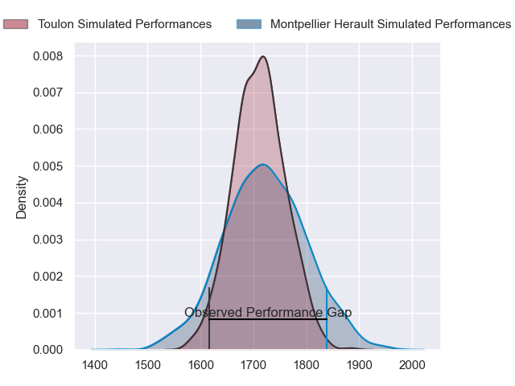
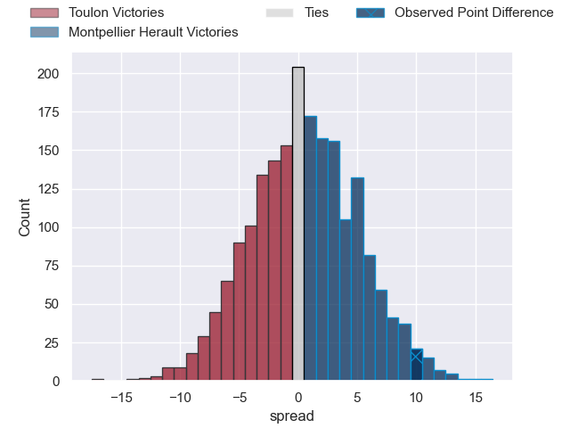
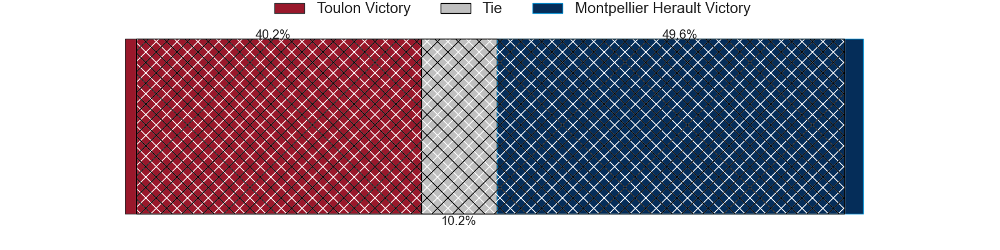
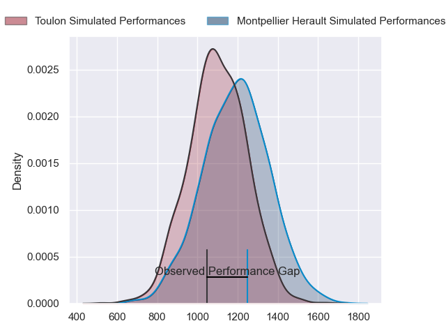
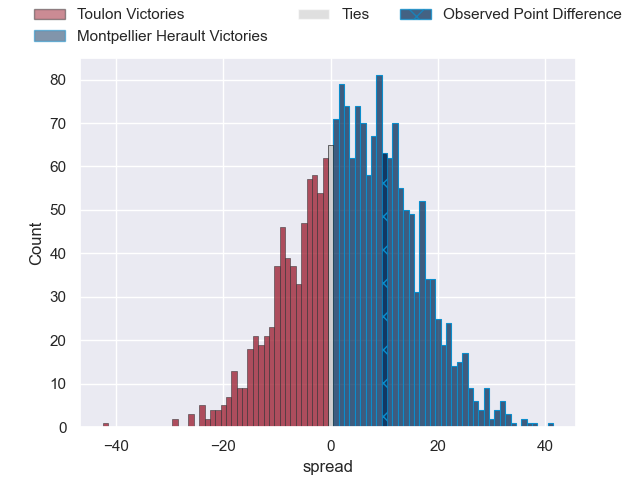
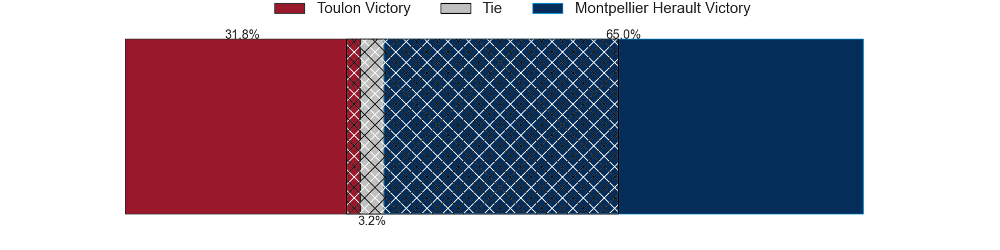
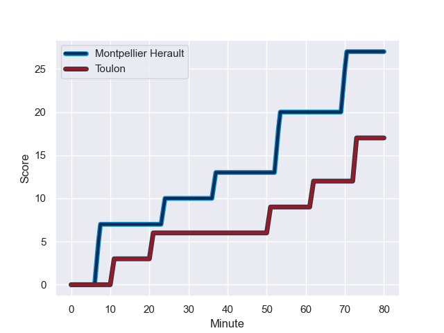
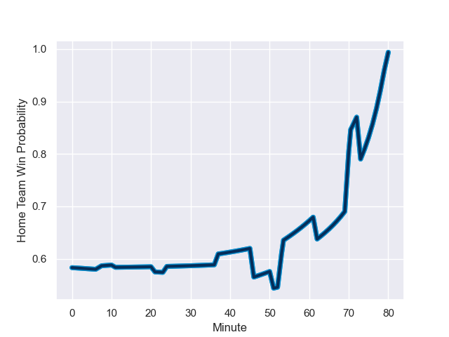

---  
layout: page  
title: Toulon at Montpellier Herault; 17-27  
date: 2024-01-07 18:00:00 -0500  
categories: "Top 14 Orange 2023" match review  
---
# Toulon at Montpellier Herault; 17-27

# Club Level Predictions

The first set of predictions treats a club as the smallest object, as the club develops its members, organizes a gameplan, and deploys its players as needed for each match. This club model has a prediction of 0.516, which translates to predicting Montpellier Herault to win by 0.6.

Our Over/Under is 42.5 - and combined with the spread above, we have a predicted scoreline of 21 to 21

Each club has a rating and a rating deviation (similar to a Glicko rating), and expected performances can be generated. This allows for simulated matches and spreads like the ones below.
## Projected Performances - Club Model

## Projected Spreads - Club Model

## Projected Results - Club Model

# Player Level Predictions - Version 2

Treating teams instead as an entity made up of the currently active players, I have ratings for each player in an altogether different system. These can be combined to form team ratings once teamsheets are announced, weighting starters a bit higher than the reserves. After the match is played, players can be weighted by their minutes on the field, allowing for an accurate measure of the team's composition. With these compiled team ratings, we can make predictions, measure inaccuracy, and update the individual player ratings.
## Prediction with Player Minutes: Montpellier Herault by 3.7

Toulon by 3.6 on a neutral field
## Prediction without Player Minutes: Montpellier Herault by 5.4

Toulon by 1.8 on a neutral pitch

## Projected Performances - Player Model

## Projected Spreads - Player Model

## Projected Results - Player Model

## Scores over Time

## Win Probability over Time

There were 13 large changes in win probability in this match

|   Away Minutes | Away Player                    |   Away elo |   Number |   Home elo | Home Player                 |   Home Minutes |
|---------------:|:-------------------------------|-----------:|---------:|-----------:|:----------------------------|---------------:|
|             46 | Bruce Devaux                   |      37.12 |        1 |       2.55 | Baptiste Erdocio            |             46 |
|             46 | Jack Singleton                 |     103.95 |        2 |      39.39 | Vano Karkadze               |             46 |
|             46 | Kieran Brookes                 |      34.48 |        3 |      33.36 | Lasha Macharashvili         |             46 |
|             50 | Swan Rebbadj                   |      63.62 |        4 |      78.78 | Nicolaas Janse van Rensburg |             80 |
|             80 | Brian Alainu'uese              |      71.59 |        5 |      64.95 | Paul Willemse               |             80 |
|             80 | Jules Coulon                   |      54.07 |        6 |      94.54 | Marco Tauleigne             |              3 |
|             64 | Mattéo Le Corvec               |      42.82 |        7 |     104.34 | Yacouba Camara              |             62 |
|             80 | Facundo Isa                    |      96.23 |        8 |      67.54 | Sam Simmonds                |             80 |
|             59 | Ben White                      |      72.64 |        9 |      91.57 | Cobus Reinach               |             80 |
|             46 | Enzo Herve                     |      72.05 |       10 |      34.13 | Louis Carbonel              |             80 |
|             80 | Gabin Villiere                 |      86.9  |       11 |     127.12 | Ben Lam                     |             67 |
|             80 | Duncan Paia'aua                |      64.24 |       12 |      90.04 | Jan Serfontein              |             80 |
|             80 | Leicester Fainga'anuku         |      97.47 |       13 |     116.66 | Geoffrey Doumayrou          |             72 |
|             54 | Jiuta Wainiqolo                |      85.22 |       14 |      56.95 | Arthur Vincent              |             80 |
|             80 | Melvyn Jaminet                 |      65.83 |       15 |      49.46 | Anthony Bouthier            |             80 |
|             34 | Dany Priso                     |      74.58 |       16 |      37.51 | Alexandre Becognee          |             77 |
|             34 | Christopher Tolofua            |      89.26 |       17 |      77.96 | Karl Tu'inukuafe            |             34 |
|             34 | Beka Gigashvili                |      59.47 |       18 |      50.62 | Titi Lamositele             |             34 |
|             34 | Dan Biggar                     |     130.51 |       19 |      49.96 | Brandon Paenga-Amosa        |             34 |
|             30 | Matthias Halagahu              |      44.71 |       20 |      80.51 | Masivesi Dakuwaqa           |             13 |
|             26 | Waisea Nayacalevu Vuidravuwalu |     135.19 |       21 |      40.18 | Tyler Duguid                |             18 |
|             16 | Selevasio Tolofua              |      85.57 |       22 |      53.66 | Paolo Garbisi               |              8 |
|             21 | Vasil Lobzhanidze              |      29.33 |       23 |     nan    | nan                         |            nan |

