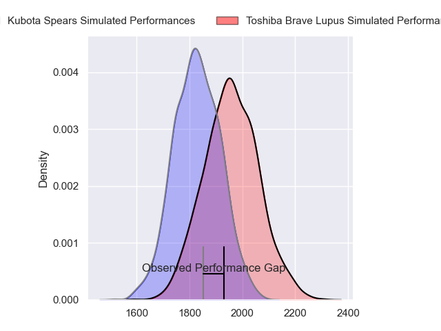
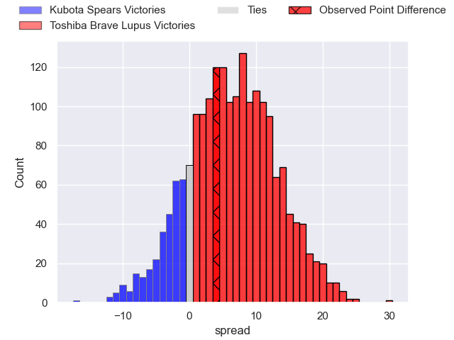
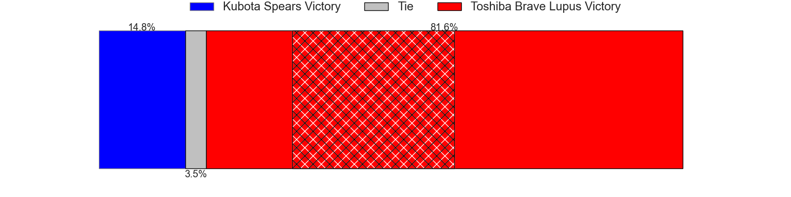
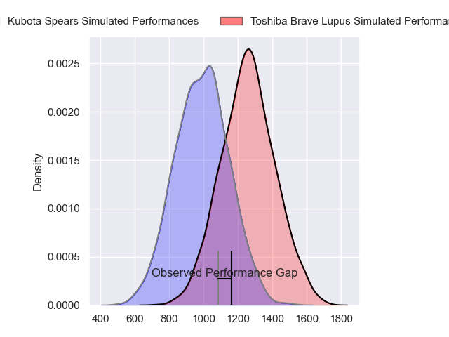
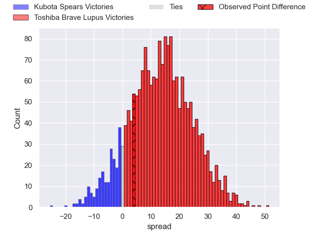
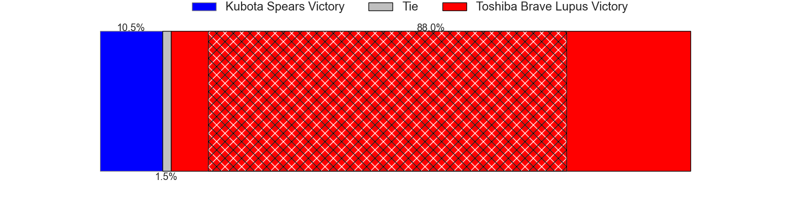
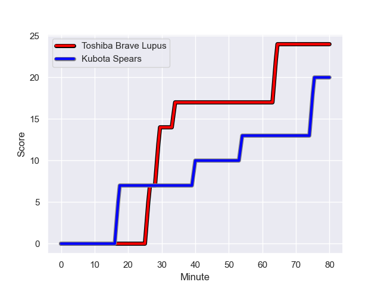
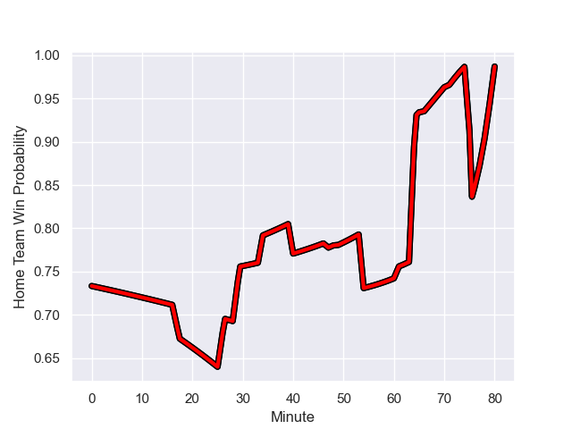

---  
layout: page  
title: Kubota Spears at Toshiba Brave Lupus; 20-24  
date: 2024-01-07 18:00:00 -0500  
categories: "Japan Rugby League One 2023" match review  
---
# Kubota Spears at Toshiba Brave Lupus; 20-24

# Club Level Predictions

The first set of predictions treats a club as the smallest object, as the club develops its members, organizes a gameplan, and deploys its players as needed for each match. This club model has a prediction of 0.678, which translates to predicting Toshiba Brave Lupus to win by 6.7.

Our Over/Under is 52.5 - and combined with the spread above, we have a predicted scoreline of 23 to 30

Each club has a rating and a rating deviation (similar to a Glicko rating), and expected performances can be generated. This allows for simulated matches and spreads like the ones below.
## Projected Performances - Club Model

## Projected Spreads - Club Model

## Projected Results - Club Model

# Player Level Predictions - Version 2

Treating teams instead as an entity made up of the currently active players, I have ratings for each player in an altogether different system. These can be combined to form team ratings once teamsheets are announced, weighting starters a bit higher than the reserves. After the match is played, players can be weighted by their minutes on the field, allowing for an accurate measure of the team's composition. With these compiled team ratings, we can make predictions, measure inaccuracy, and update the individual player ratings.
## Prediction with Player Minutes: Toshiba Brave Lupus by 11.2

Toshiba Brave Lupus by 7.8 on a neutral field
## Prediction without Player Minutes: Toshiba Brave Lupus by 9.2

Toshiba Brave Lupus by 5.8 on a neutral pitch

## Projected Performances - Player Model

## Projected Spreads - Player Model

## Projected Results - Player Model

## Scores over Time

## Win Probability over Time

There were 14 large changes in win probability in this match

|   Away Minutes | Away Player            |   Away elo |   Number |   Home elo | Home Player      |   Home Minutes |
|---------------:|:-----------------------|-----------:|---------:|-----------:|:-----------------|---------------:|
|             54 | Kota Kaishi            |      75.93 |        1 |      70.6  | Sena Kimura      |             61 |
|             54 | Dane Coles             |     119    |        2 |      65.06 | Mamoru Harada    |             61 |
|             61 | Shoya Matsunami        |     -15.16 |        3 |      64.51 | Teruo Makabe     |             47 |
|             54 | Uwe Helu               |      78.75 |        4 |      76.55 | Warner Dearns    |             71 |
|             61 | David Bulbring         |      82.72 |        5 |     150.21 | Jacob Pierce     |             80 |
|             80 | Lappies Labuschagne    |      69.22 |        6 |      74.17 | Shannon Frizell  |             80 |
|             54 | Takeo Suenaga          |      54.63 |        7 |      69.33 | Takeshi Sasaki   |             61 |
|             80 | Faulua Makisi          |      98.38 |        8 |      90.16 | Michael Leitch   |             80 |
|             80 | Shinobu Fujiwara       |      45.79 |        9 |      64.78 | Yuhei Sugiyama   |             49 |
|             80 | Harumichi Tatekawa     |      36.57 |       10 |     134.23 | Richie Mo'unga   |             80 |
|             80 | Haruto Kida            |      83.74 |       11 |      55.54 | Atsuki Kuwayama  |             71 |
|             80 | Rikus Pretorius        |      48.93 |       12 |      73.81 | Taichi Mano      |             80 |
|             66 | Sione Teaupa           |      35.78 |       13 |      18.7  | Rob Thompson     |             56 |
|             80 | Gerhard van den Heever |      76.35 |       14 |      87.42 | Masaki Hamada    |             80 |
|             80 | Liam Williams          |     125.74 |       15 |      85.97 | Takuro Matsunaga |             80 |
|             26 | Yota Kaminori          |      49.22 |       16 |      49.96 | Taufa Latu       |             33 |
|             26 | Finau Tupa             |      57.87 |       17 |      60.46 | Takahiro Ogawa   |             31 |
|             26 | Hiraoki Sugimoto       |      50.62 |       18 |      97.61 | Seta Tamanivalu  |             24 |
|             26 | JD Schickerling        |       0.7  |       19 |      39.64 | Daigo Hashimoto  |             19 |
|             19 | Satoshi Saita          |      47.15 |       20 |      50.51 | Masataka Mikami  |             19 |
|             19 | Ruan Botha             |     114.74 |       21 |      70.41 | Shin Ito         |             19 |
|             14 | Halatoa Vailea         |      72.75 |       22 |      50.93 | Yuto Mori        |              9 |
|            nan | nan                    |     nan    |       23 |      17.35 | Samuela Anise    |              9 |

