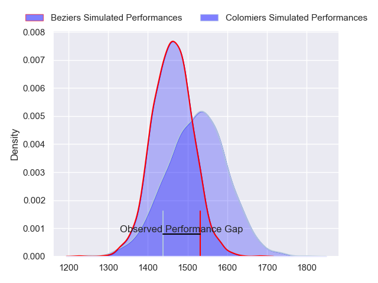
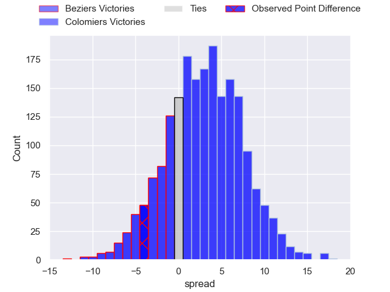
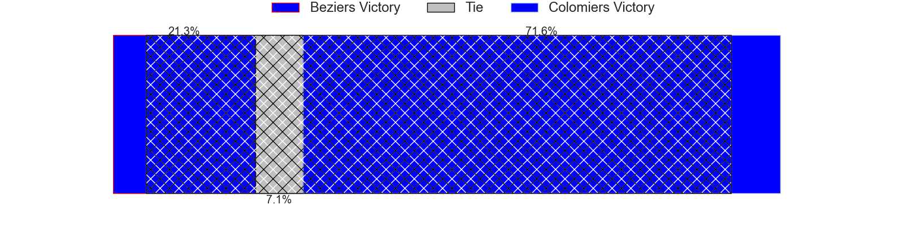
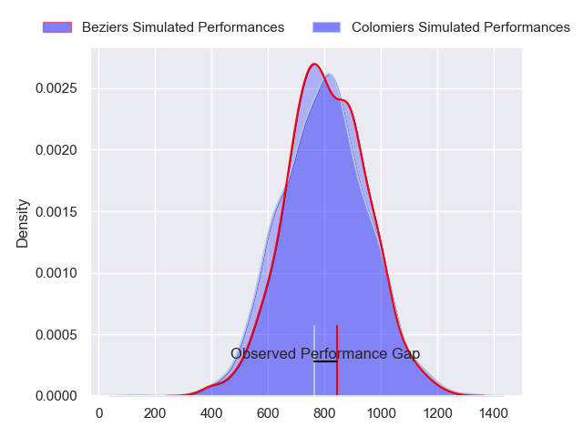
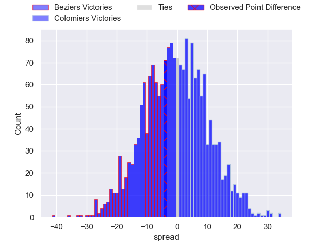
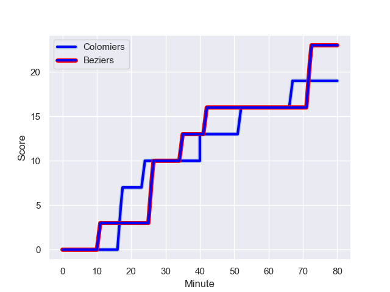
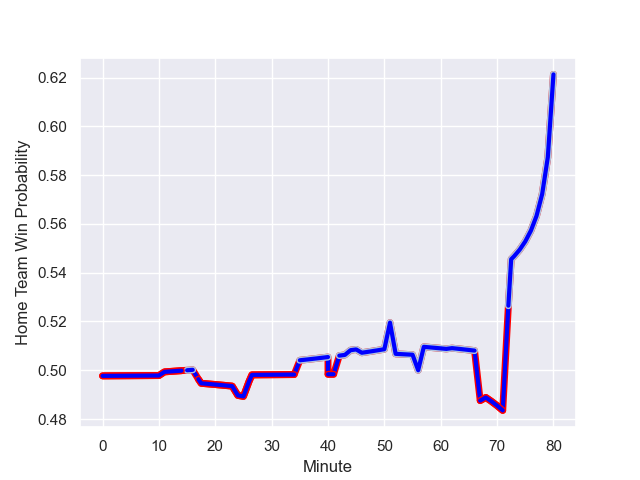

---  
layout: page  
title: Beziers at Colomiers; 23-19  
date: 2024-01-11 18:00:00 -0500  
categories: "Pro D2 2023" match review  
---
# Beziers at Colomiers; 23-19

# Club Level Predictions

The first set of predictions treats a club as the smallest object, as the club develops its members, organizes a gameplan, and deploys its players as needed for each match. This club model has a prediction of 0.586, which translates to predicting Colomiers to win by 3.1.

Our Over/Under is 37.5 - and combined with the spread above, we have a predicted scoreline of 17 to 20

Each club has a rating and a rating deviation (similar to a Glicko rating), and expected performances can be generated. This allows for simulated matches and spreads like the ones below.
## Projected Performances - Club Model

## Projected Spreads - Club Model

## Projected Results - Club Model

# Player Level Predictions - Version 2

Treating teams instead as an entity made up of the currently active players, I have ratings for each player in an altogether different system. These can be combined to form team ratings once teamsheets are announced, weighting starters a bit higher than the reserves. After the match is played, players can be weighted by their minutes on the field, allowing for an accurate measure of the team's composition. With these compiled team ratings, we can make predictions, measure inaccuracy, and update the individual player ratings.
## Prediction with Player Minutes: Beziers by 0.1

Beziers by 6.9 on a neutral field
## Prediction without Player Minutes: Colomiers by 1.0

Beziers by 5.8 on a neutral pitch

## Projected Performances - Player Model

## Projected Spreads - Player Model

## Projected Results - Player Model

## Scores over Time

## Win Probability over Time

There were 2 large changes in win probability in this match

|   Away Minutes | Away Player         |   Away elo |   Number |   Home elo | Home Player           |   Home Minutes |
|---------------:|:--------------------|-----------:|---------:|-----------:|:----------------------|---------------:|
|             56 | Youssef Amrouni     |      32.27 |        1 |      54.08 | Hugo Djehi            |             52 |
|             56 | Wilmar Arnoldi      |      48.25 |        2 |      -2.7  | Thomas Larrieu        |             52 |
|             57 | Jon Zabala Arrieta  |      73.55 |        3 |      45.26 | Hugo Pirlet           |             51 |
|             52 | Hans N'kinsi        |      -0.56 |        4 |      18.56 | Anthony Coletta       |             46 |
|             80 | John Madigan        |      10.29 |        5 |      75.14 | Maxime Granouillet    |             57 |
|             68 | William van Bost    |      37.96 |        6 |      36.48 | Waël Ponpon           |             80 |
|             80 | Clement Ancely      |      31.45 |        7 |      67.85 | Aldric Lescure        |             57 |
|             56 | Otonuku Jr Pauta    |      61.36 |        8 |      46.54 | Joseva Tamani         |             80 |
|             48 | Mitch Short         |      34.9  |        9 |      55.67 | Mathis Galthié        |             62 |
|             80 | Charly Malie        |      70.82 |       10 |      -8.54 | Brett Herron          |             80 |
|             80 | Gabin Lorre         |     103.24 |       11 |     104.72 | Rodrigo Marta         |             80 |
|             80 | Watisoni Votu       |      87.79 |       12 |      54.63 | Ray Nu'u              |             68 |
|             80 | Paul Reau           |      61.1  |       13 |      -0.32 | Martin Dulon          |             80 |
|             80 | Raffaele Storti     |      99.95 |       14 |      73.31 | Vincent Pinto         |             80 |
|             44 | Victor Dreuille     |      37.75 |       15 |      20.85 | Thomas Girard         |             80 |
|             36 | Taleta Tupuola      |      54.92 |       16 |      36.62 | Alexandre Manukula    |             34 |
|             32 | Samuel Marques      |      77.87 |       17 |      44.65 | Toma Kolokilagi       |             29 |
|             28 | Pierrick Gunther    |     -32.18 |       18 |      48.03 | Andrew Ready          |             28 |
|             24 | Yvann Lalevee       |      61.67 |       19 |      38.08 | Pierre-Samuel Pacheco |             28 |
|             24 | Francisco Fernandes |      25.13 |       20 |      47.86 | Jean Thomas           |             23 |
|             24 | Sias Koen           |      62.26 |       21 |      43.52 | Jeremy Bechu          |             23 |
|             23 | Marco Trauth        |      60.58 |       22 |      29.48 | Ugo Seguela           |             18 |
|             12 | Clément Bitz        |      59.71 |       23 |      39.59 | Fabien Perrin         |             12 |

