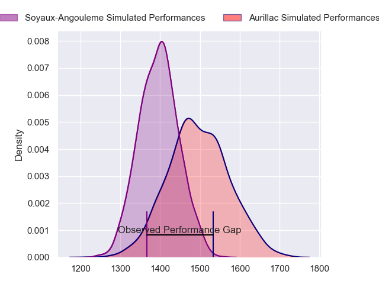
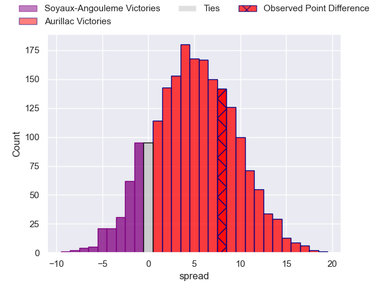
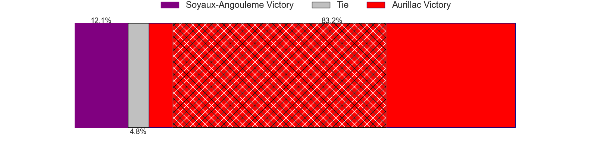
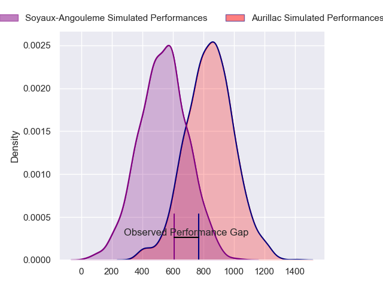
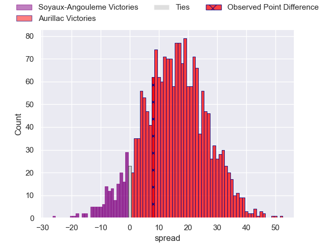
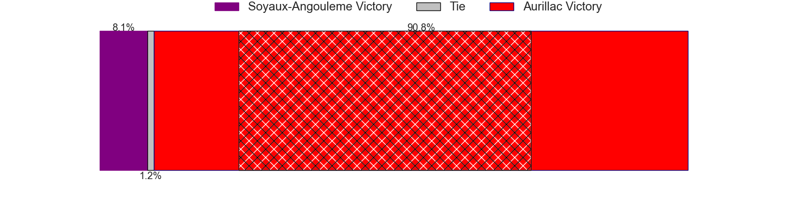
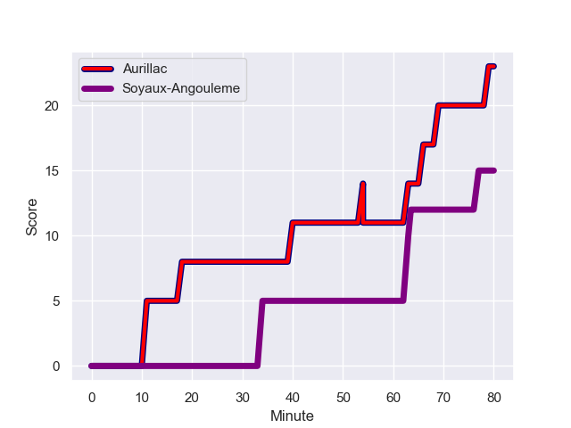
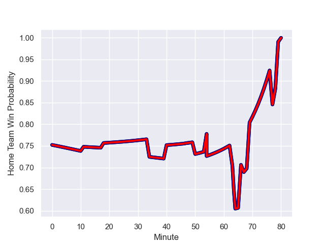

---  
layout: page  
title: Soyaux-Angouleme at Aurillac; 15-23  
date: 2024-01-12 18:00:00 -0500  
categories: "Pro D2 2023" match review  
---
# Soyaux-Angouleme at Aurillac; 15-23

# Club Level Predictions

The first set of predictions treats a club as the smallest object, as the club develops its members, organizes a gameplan, and deploys its players as needed for each match. This club model has a prediction of 0.636, which translates to predicting Aurillac to win by 4.9.

Our Over/Under is 35.5 - and combined with the spread above, we have a predicted scoreline of 15 to 20

Each club has a rating and a rating deviation (similar to a Glicko rating), and expected performances can be generated. This allows for simulated matches and spreads like the ones below.
## Projected Performances - Club Model

## Projected Spreads - Club Model

## Projected Results - Club Model

# Player Level Predictions - Version 2

Treating teams instead as an entity made up of the currently active players, I have ratings for each player in an altogether different system. These can be combined to form team ratings once teamsheets are announced, weighting starters a bit higher than the reserves. After the match is played, players can be weighted by their minutes on the field, allowing for an accurate measure of the team's composition. With these compiled team ratings, we can make predictions, measure inaccuracy, and update the individual player ratings.
## Prediction with Player Minutes: Aurillac by 12.2

Aurillac by 4.9 on a neutral field
## Prediction without Player Minutes: Aurillac by 12.2

Aurillac by 4.9 on a neutral pitch

## Projected Performances - Player Model

## Projected Spreads - Player Model

## Projected Results - Player Model

## Scores over Time

## Win Probability over Time

There were 13 large changes in win probability in this match

|   Away Minutes | Away Player            |   Away elo |   Number |   Home elo | Home Player           |   Home Minutes |
|---------------:|:-----------------------|-----------:|---------:|-----------:|:----------------------|---------------:|
|             29 | Khatchik Vartanov      |      14.62 |        1 |      49.38 | Irakli Mtchedlidze    |             50 |
|             67 | Rayne Barka            |      58.49 |        2 |      18.87 | Luka Nioradze         |             58 |
|             54 | Yassine Boutemane      |       7.79 |        3 |      52.04 | Giorgi Kartvelishvili |             67 |
|             80 | Matt Beukeboom         |      28.37 |        4 |      39.6  | Martial Rolland       |             50 |
|             47 | Sikeli Nabou           |      59.7  |        5 |      68.81 | Cam Dodson            |             80 |
|             80 | Gautier Gibouin        |     -18.64 |        6 |      79.06 | Eoghan Masterson      |             67 |
|             67 | Nicolas Martins        |      76.68 |        7 |      59.96 | Hugo Huurman          |             80 |
|             67 | Alexander Masibaka     |      42.32 |        8 |      54.24 | Didier Tison          |             64 |
|             54 | Adrien Bau             |      -7.26 |        9 |      31.46 | David Delarue         |             64 |
|             80 | Corentin Glenat        |      30.08 |       10 |      31.82 | Antoine Aucagne       |             64 |
|             80 | Eoghan Barrett         |      41.67 |       11 |      57.94 | AJ Coertzen           |             80 |
|             80 | Mathis Lafon           |      34.18 |       12 |      10.29 | Christa Powell        |             80 |
|             80 | Inaki Ayarza           |      39.14 |       13 |      50.34 | Hugo Bastard          |             80 |
|             54 | Matthys Gratien        |      53.74 |       14 |      47.06 | Juun Pieters          |             80 |
|             80 | Jules Dubecq           |      49.22 |       15 |      34.53 | Marc Palmier          |             80 |
|             51 | Omar Odishvili         |      58.59 |       16 |      17.81 | Robert Rodgers        |             30 |
|             33 | Matthew Dalton         |       1.76 |       17 |      53.49 | Heath Backhouse       |             30 |
|             26 | Alexis Levron          |      23.82 |       18 |      42.54 | Ronan Loughnane       |             22 |
|             26 | Akuila Joeli Tabualevu |      54.72 |       19 |     -16.55 | Latuka Maituku        |             16 |
|             26 | Omar Dahir             |      54.32 |       20 |       7.65 | Simeli Yabaki         |             16 |
|             13 | Georgy Balakarev       |      50.35 |       21 |      34.85 | Mikheil Alania        |             16 |
|             13 | Irakli Tskhadadze      |      71.9  |       22 |      32.32 | Tim Daniel-Meissen    |             13 |
|             13 | Hubert Texier          |      47.69 |       23 |      41.91 | Mehdi Slamani         |             13 |

