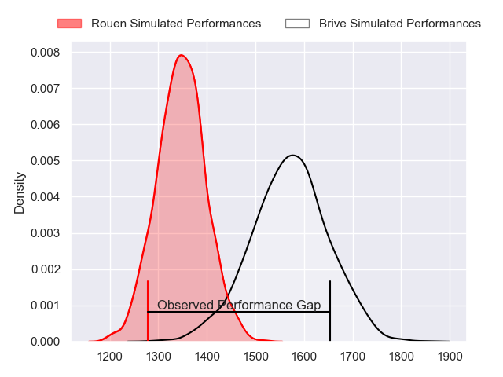
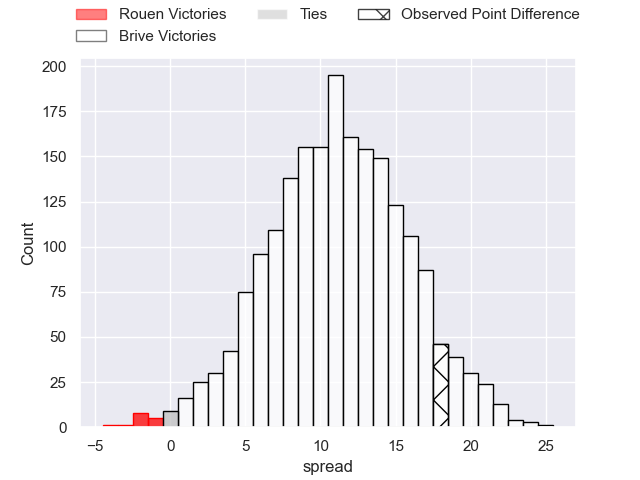
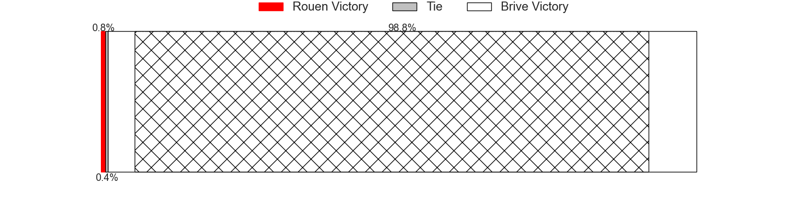
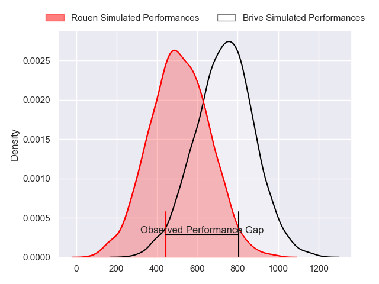
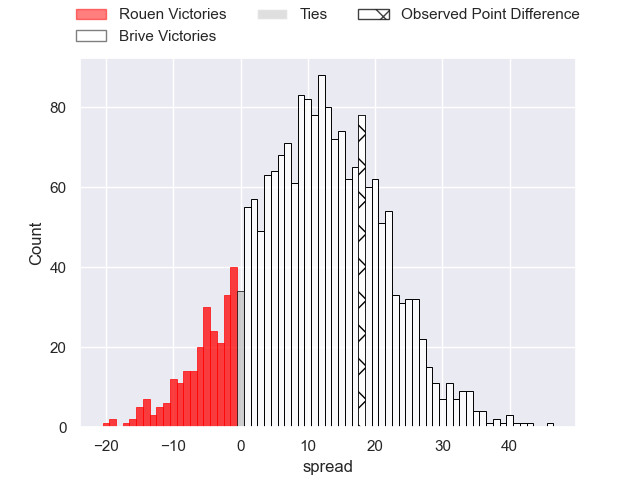
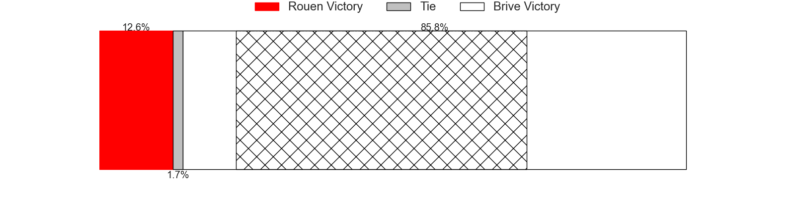
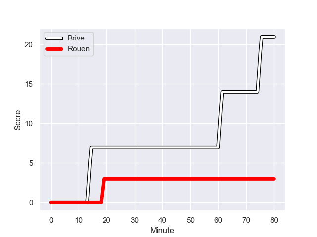
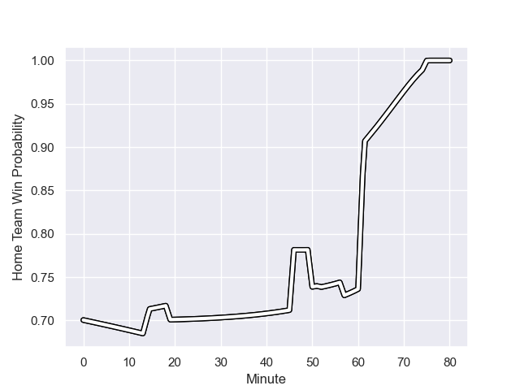

---  
layout: page  
title: Rouen at Brive; 3-21  
date: 2024-01-12 18:00:00 -0500  
categories: "Pro D2 2023" match review  
---
# Rouen at Brive; 3-21

# Club Level Predictions

The first set of predictions treats a club as the smallest object, as the club develops its members, organizes a gameplan, and deploys its players as needed for each match. This club model has a prediction of 0.782, which translates to predicting Brive to win by 11.2.

Our Over/Under is 42.5 - and combined with the spread above, we have a predicted scoreline of 16 to 27

Each club has a rating and a rating deviation (similar to a Glicko rating), and expected performances can be generated. This allows for simulated matches and spreads like the ones below.
## Projected Performances - Club Model

## Projected Spreads - Club Model

## Projected Results - Club Model

# Player Level Predictions - Version 2

Treating teams instead as an entity made up of the currently active players, I have ratings for each player in an altogether different system. These can be combined to form team ratings once teamsheets are announced, weighting starters a bit higher than the reserves. After the match is played, players can be weighted by their minutes on the field, allowing for an accurate measure of the team's composition. With these compiled team ratings, we can make predictions, measure inaccuracy, and update the individual player ratings.
## Prediction with Player Minutes: Brive by 9.3

Brive by 1.7 on a neutral field
## Prediction without Player Minutes: Brive by 9.3

Brive by 1.7 on a neutral pitch

## Projected Performances - Player Model

## Projected Spreads - Player Model

## Projected Results - Player Model

## Scores over Time

## Win Probability over Time

There were 4 large changes in win probability in this match

|   Away Minutes | Away Player          |   Away elo |   Number |   Home elo | Home Player               |   Home Minutes |
|---------------:|:---------------------|-----------:|---------:|-----------:|:--------------------------|---------------:|
|             52 | Cody Thomas          |      32.83 |        1 |      51.2  | Hugo Reilhes              |             46 |
|             50 | Jeremie Maurouard    |     -25.21 |        2 |      27.25 | Lucas da Silva            |             46 |
|             64 | Soso Bekoshvili      |      45.7  |        3 |      53.74 | Vakh Abdaladze            |             46 |
|             47 | John-Charles Astle   |      10.88 |        4 |      39.9  | Renger Van Eerten         |             80 |
|             80 | Jimi Maximin         |      35.68 |        5 |      36.07 | Julien Delannoy           |             46 |
|             80 | Lucas Costa          |      56.65 |        6 |      28.72 | Sasha Gue                 |             80 |
|             80 | Samuel Maximin       |       5.98 |        7 |      37.47 | Retief Marais             |             46 |
|             47 | Abdelkarim Fofana    |      32.04 |        8 |      47.91 | Taniela Sadrugu           |             46 |
|             57 | Florent Campeggia    |      20.87 |        9 |      47.77 | Julien Blanc              |             46 |
|             80 | Hugo Aubry           |      41.53 |       10 |     -15.81 | Jackson Garden-Bachop     |             46 |
|             80 | Kevin Bly            |      77.4  |       11 |      42.11 | Benjamin Lefranc          |             80 |
|             42 | Taylor Gontineac     |      65.98 |       12 |      44.86 | Guillaume Galletier       |             80 |
|             80 | Pablo Patilla        |      32.06 |       13 |      16.83 | Sammy Arnold              |             80 |
|             57 | Theo Velten          |      19.68 |       14 |      47.07 | Arthur Bonneval           |             80 |
|             80 | Franck Pourteau      |      61.63 |       15 |      28.01 | Mathis Ferté              |             80 |
|             38 | JT Jackson           |      10.63 |       16 |      29.21 | Francisco Coria Marchetti |             34 |
|             33 | Jean Leleu           |      37.23 |       17 |      80.47 | Said Hireche              |             34 |
|             33 | Willy N'Diaye        |      -9.39 |       18 |      48.02 | Nathan Fraissenon         |             34 |
|             30 | Lucas Malbert        |      32    |       19 |      31.68 | Benjamin Boudou           |             34 |
|             28 | Antoine Fournier     |      37.15 |       20 |      48.82 | Asier Usarraga            |             34 |
|             23 | Quentin Delord       |      25.03 |       21 |      80.79 | Ross Moriarty             |             34 |
|             23 | Benjamin Descamps    |      51.62 |       22 |      -1.95 | Leo Carbonneau            |             34 |
|             16 | Sidi-Mohammed Diallo |      46.65 |       23 |      22.06 | Tom Raffy                 |             34 |

