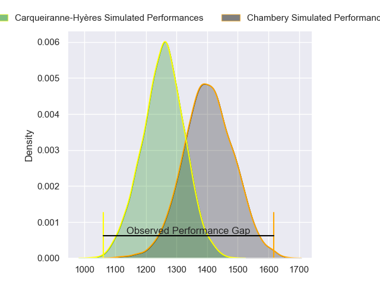
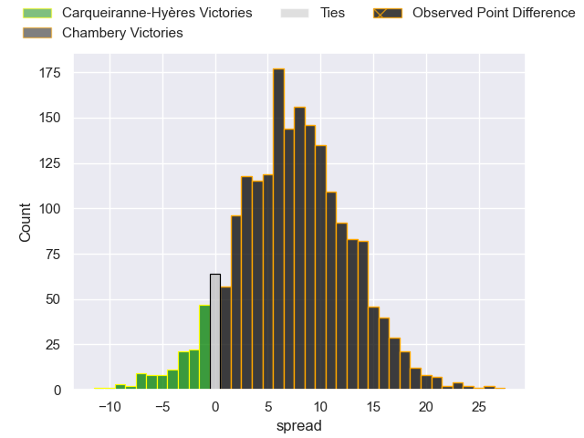
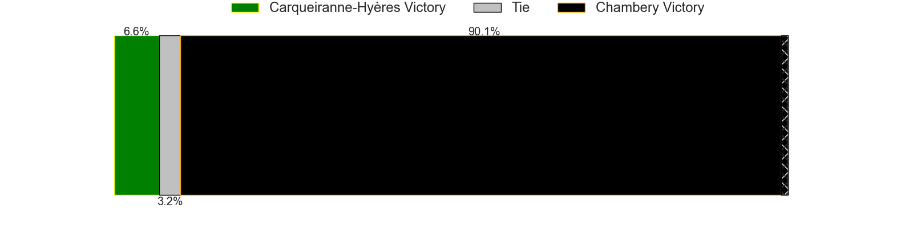
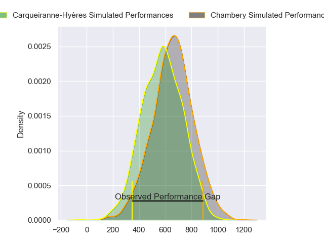
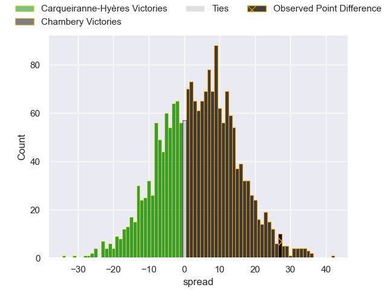
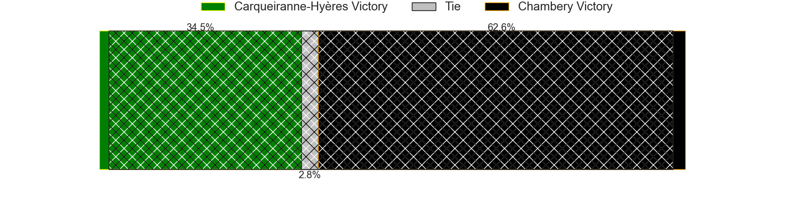
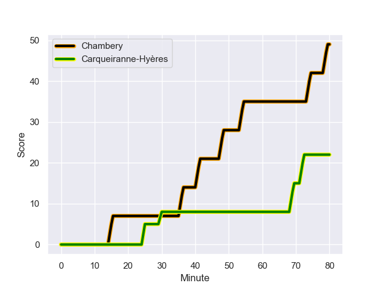
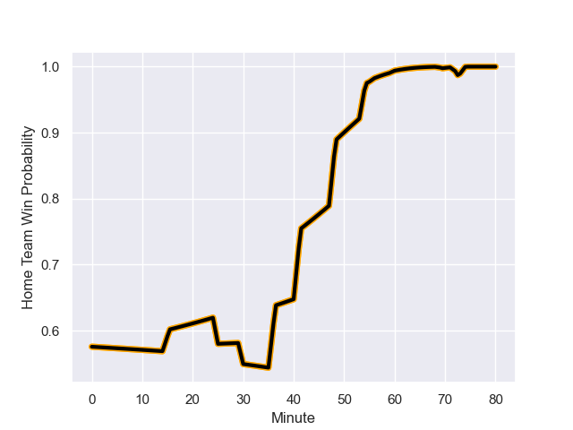

---  
layout: page  
title: Carqueiranne-Hyeres at Chambery; 22-49  
date: 2024-01-12 18:00:00 -0500  
categories: "Nationale 2023" match review  
---
# Carqueiranne-Hyeres at Chambery; 22-49

# Club Level Predictions

The first set of predictions treats a club as the smallest object, as the club develops its members, organizes a gameplan, and deploys its players as needed for each match. This club model has a prediction of 0.695, which translates to predicting Chambery to win by 7.3.

Our Over/Under is 36.5 - and combined with the spread above, we have a predicted scoreline of 14 to 22

Each club has a rating and a rating deviation (similar to a Glicko rating), and expected performances can be generated. This allows for simulated matches and spreads like the ones below.
## Projected Performances - Club Model

## Projected Spreads - Club Model

## Projected Results - Club Model

# Player Level Predictions - Version 2

Treating teams instead as an entity made up of the currently active players, I have ratings for each player in an altogether different system. These can be combined to form team ratings once teamsheets are announced, weighting starters a bit higher than the reserves. After the match is played, players can be weighted by their minutes on the field, allowing for an accurate measure of the team's composition. With these compiled team ratings, we can make predictions, measure inaccuracy, and update the individual player ratings.
## Prediction with Player Minutes: Chambery by 3.3

Carqueiranne-Hyères by 0.1 on a neutral field
## Prediction without Player Minutes: Chambery by 3.4

Carqueiranne-Hyères by 0.1 on a neutral pitch

## Projected Performances - Player Model

## Projected Spreads - Player Model

## Projected Results - Player Model

## Scores over Time

## Win Probability over Time

There were 9 large changes in win probability in this match

|   Away Minutes | Away Player              |   Away elo |   Number |   Home elo | Home Player                  |   Home Minutes |
|---------------:|:-------------------------|-----------:|---------:|-----------:|:-----------------------------|---------------:|
|             50 | Eli Serra-Miglietti      |      41.99 |        1 |      43.2  | Enzo Segui                   |             60 |
|             50 | Theo Lachaud             |      28.1  |        2 |      47.46 | Gauthier Brute de Remur      |             60 |
|             50 | Costel Burtila           |      44.81 |        3 |      47.43 | Giorgi Pertaia               |             60 |
|             80 | Adam Peters              |      21.18 |        4 |      38.2  | Steevy Cerqueira             |             80 |
|             62 | Lucas Cazac              |       9.45 |        5 |      44.46 | Steyl Barnard                |             60 |
|             80 | Nicolas Baquer           |      21.02 |        6 |      35.17 | Colin Lebian                 |             80 |
|             56 | Joachim Beaumont         |      58.07 |        7 |      78.39 | Matheo Triki                 |             60 |
|             80 | Johann Afonso Grundlingh |      56.23 |        8 |      51.36 | Tui Uru                      |             80 |
|             52 | Thomas Sonetti           |      62.88 |        9 |      25.85 | Thibault Dufau               |             60 |
|             80 | Juan Kotze               |      48.21 |       10 |      32.07 | Jean-Luc Alewyn Cilliers     |             60 |
|             80 | Vincent Alessi           |       3.06 |       11 |      -4.79 | Vereniki Goneva              |             80 |
|             80 | Romain Leveque           |      58.11 |       12 |      53.38 | Bastien Reymond              |             80 |
|             80 | Charles Brousse          |      39.62 |       13 |      44.65 | Emmanuel Vaitulukina         |             60 |
|             80 | Josselyn Bouchon         |      31.87 |       14 |      29.36 | Maewen Sao                   |             80 |
|             62 | Ionel Melinte            |      65.96 |       15 |      19.64 | Paul Baptiste Florent Altier |             80 |
|             30 | Sti Sithole              |      44.92 |       16 |      51.13 | Nugzar Somkhishvili          |             20 |
|             30 | Yan Tabarot              |      41.65 |       17 |      20.99 | Victor Pisano                |             20 |
|             30 | Miguel Mathieu           |      35.18 |       18 |      29.06 | Zauri Tevdorashvili          |             20 |
|             18 | Spike Salman             |      29.5  |       19 |      21.25 | Hugo Deschaux                |             20 |
|             24 | Shade Barkallah          |      42.68 |       20 |      51.36 | Jules Dorrival               |             20 |
|             28 | Rémi Dubié               |      28.3  |       21 |      36.33 | Fabien Witz                  |             20 |
|             18 | Enzo Miot                |      41.07 |       22 |      54.33 | Corentin Astier              |             20 |
|            nan | nan                      |     nan    |       23 |      46.65 | Julien Pierdomenico          |             20 |

