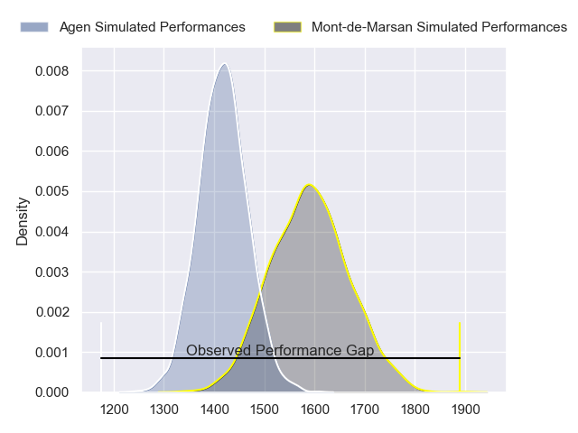
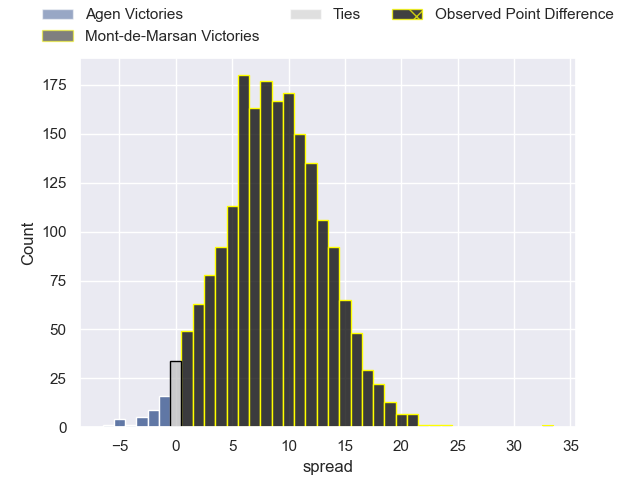
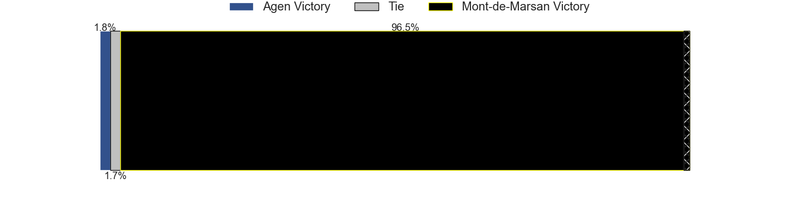
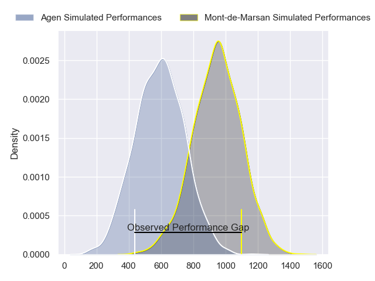
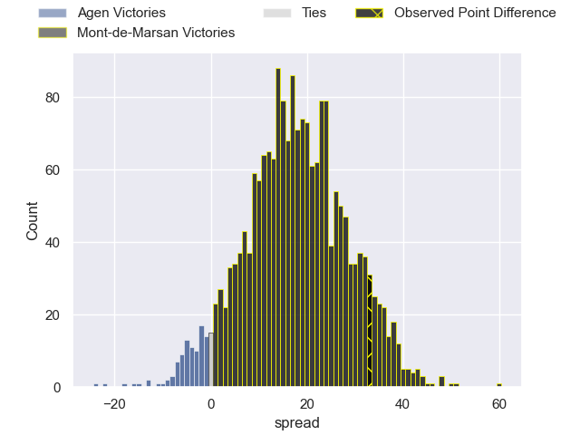
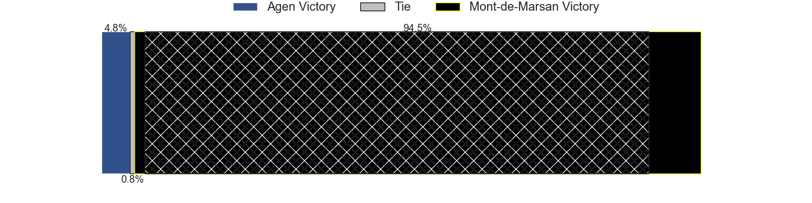
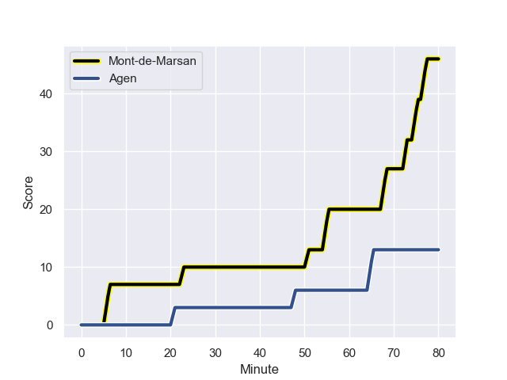
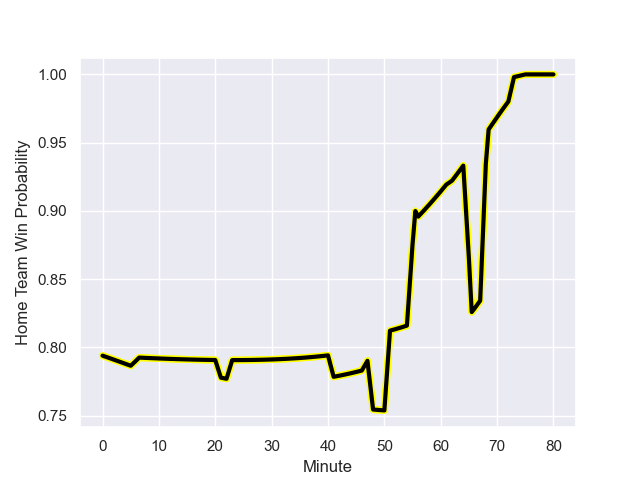

---  
layout: page  
title: Agen at Mont-de-Marsan; 13-46  
date: 2024-01-12 18:00:00 -0500  
categories: "Pro D2 2023" match review  
---
# Agen at Mont-de-Marsan; 13-46

# Club Level Predictions

The first set of predictions treats a club as the smallest object, as the club develops its members, organizes a gameplan, and deploys its players as needed for each match. This club model has a prediction of 0.727, which translates to predicting Mont-de-Marsan to win by 8.6.

Our Over/Under is 46.5 - and combined with the spread above, we have a predicted scoreline of 19 to 27

Each club has a rating and a rating deviation (similar to a Glicko rating), and expected performances can be generated. This allows for simulated matches and spreads like the ones below.
## Projected Performances - Club Model

## Projected Spreads - Club Model

## Projected Results - Club Model

# Player Level Predictions - Version 2

Treating teams instead as an entity made up of the currently active players, I have ratings for each player in an altogether different system. These can be combined to form team ratings once teamsheets are announced, weighting starters a bit higher than the reserves. After the match is played, players can be weighted by their minutes on the field, allowing for an accurate measure of the team's composition. With these compiled team ratings, we can make predictions, measure inaccuracy, and update the individual player ratings.
## Prediction with Player Minutes: Mont-de-Marsan by 14.9

Mont-de-Marsan by 7.3 on a neutral field
## Prediction without Player Minutes: Mont-de-Marsan by 15.0

Mont-de-Marsan by 7.4 on a neutral pitch

## Projected Performances - Player Model

## Projected Spreads - Player Model

## Projected Results - Player Model

## Scores over Time

## Win Probability over Time

There were 7 large changes in win probability in this match

|   Away Minutes | Away Player      |   Away elo |   Number |   Home elo | Home Player               |   Home Minutes |
|---------------:|:-----------------|-----------:|---------:|-----------:|:--------------------------|---------------:|
|             62 | Florent Guion    |       0.09 |        1 |      50.93 | Dino Casadei              |             55 |
|             62 | Pierre Jouvin    |      38.04 |        2 |     110.64 | Torsten van Jaarsveld     |             62 |
|             62 | Alex Burin       |      57.1  |        3 |      46.38 | Mattéo Lalanne            |             48 |
|             80 | Evan Olmstead    |      -3.76 |        4 |      29.77 | Aston Fortuin             |             80 |
|             51 | William Demotte  |      71.9  |        5 |      41.1  | Andrei Ostrikov           |             55 |
|             56 | Julien Lebian    |      20.71 |        6 |      77.94 | Léo Banos                 |             80 |
|             80 | Arnaud Duputs    |      57.56 |        7 |      21.12 | Nicolas Garrault          |             80 |
|             80 | Fotu Lokotui     |      28.34 |        8 |      72.93 | Veresa Tuqovu Ramototabua |             62 |
|             80 | Sonatane Takulua |       8.69 |        9 |      45.87 | Kevin Viallard            |             65 |
|             62 | Thomas Vincent   |      59.44 |       10 |      63.47 | Willie du Plessis         |             41 |
|             47 | Henry Purdy      |      77.85 |       11 |      74.85 | Eroni Sau                 |             80 |
|             80 | Harry Sloan      |      59.94 |       12 |      60.22 | Patricio Fernandez        |             62 |
|             80 | George Tilsley   |      71.6  |       13 |      43.92 | Gatien Masse              |             80 |
|             80 | Loris Tolot      |     -21.16 |       14 |      53.96 | Pierre Sayerse            |             80 |
|             80 | Mathieu Lamoulie |      72.97 |       15 |      28.4  | Simao Broeiro Bento       |             80 |
|             33 | Tevita Railevu   |      62.01 |       16 |      24.2  | Joris Pialot              |             39 |
|             29 | Zak Farrance     |      32.05 |       17 |      57.13 | Mathis Bats               |             32 |
|             24 | Valentin Gayraud |      51.51 |       18 |      35.34 | Thomas Bultel             |             25 |
|             18 | Mamuka Mstoiani  |      46.45 |       19 |      16.82 | Myles Edwards             |             25 |
|             18 | Clement Martinez |      46.51 |       20 |      30.1  | Yann Brethous             |             18 |
|             18 | Théo Sauzaret    |      43.9  |       21 |      32.46 | Simon Labouyrie           |             18 |
|             18 | Ben Volavola     |      21.33 |       22 |      61.56 | Jules Even                |             18 |
|            nan | nan              |     nan    |       23 |      27.83 | Christophe Loustalot      |             15 |

