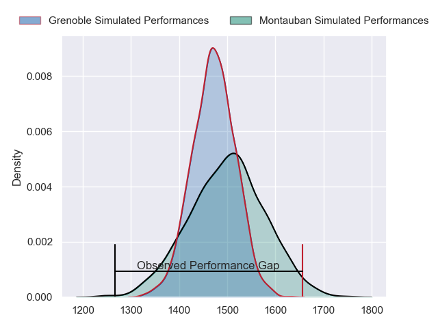
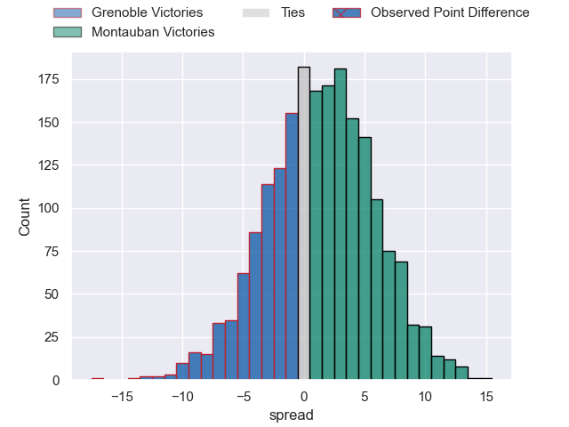
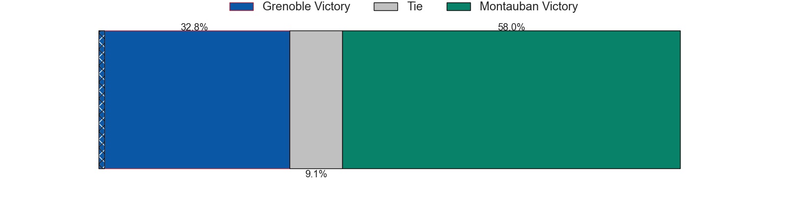
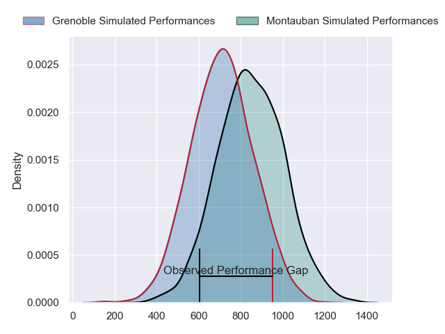
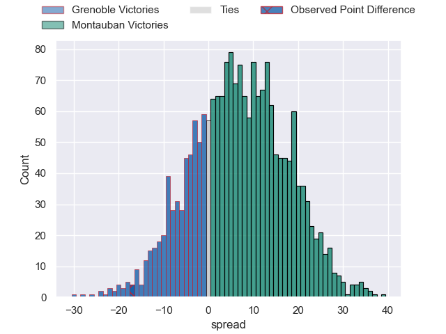
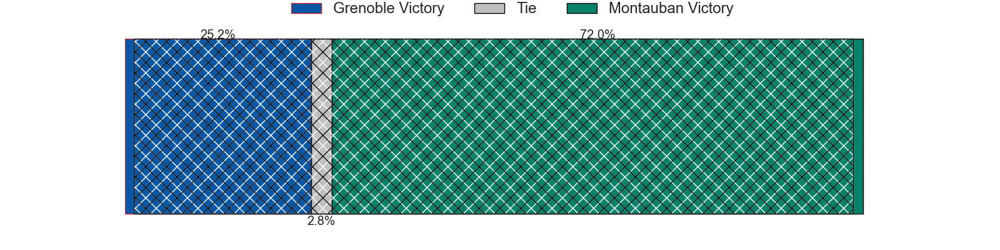
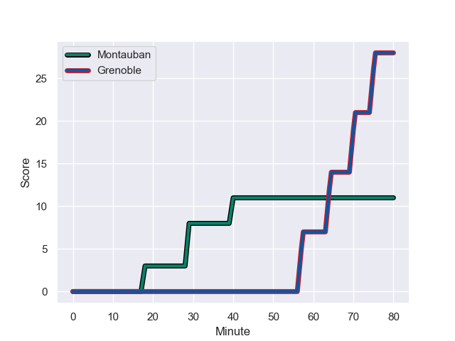
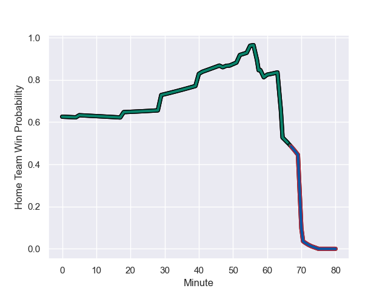

---  
layout: page  
title: Grenoble at Montauban; 28-11  
date: 2024-01-12 18:00:00 -0500  
categories: "Pro D2 2023" match review  
---
# Grenoble at Montauban; 28-11

# Club Level Predictions

The first set of predictions treats a club as the smallest object, as the club develops its members, organizes a gameplan, and deploys its players as needed for each match. This club model has a prediction of 0.534, which translates to predicting Montauban to win by 1.2.

Our Over/Under is 45.5 - and combined with the spread above, we have a predicted scoreline of 22 to 23

Each club has a rating and a rating deviation (similar to a Glicko rating), and expected performances can be generated. This allows for simulated matches and spreads like the ones below.
## Projected Performances - Club Model

## Projected Spreads - Club Model

## Projected Results - Club Model

# Player Level Predictions - Version 2

Treating teams instead as an entity made up of the currently active players, I have ratings for each player in an altogether different system. These can be combined to form team ratings once teamsheets are announced, weighting starters a bit higher than the reserves. After the match is played, players can be weighted by their minutes on the field, allowing for an accurate measure of the team's composition. With these compiled team ratings, we can make predictions, measure inaccuracy, and update the individual player ratings.
## Prediction with Player Minutes: Montauban by 5.6

Grenoble by 0.4 on a neutral field
## Prediction without Player Minutes: Montauban by 4.5

Grenoble by 1.5 on a neutral pitch

## Projected Performances - Player Model

## Projected Spreads - Player Model

## Projected Results - Player Model

## Scores over Time

## Win Probability over Time

There were 12 large changes in win probability in this match

|   Away Minutes | Away Player                 |   Away elo |   Number |   Home elo | Home Player       |   Home Minutes |
|---------------:|:----------------------------|-----------:|---------:|-----------:|:------------------|---------------:|
|             55 | Eli Eglaine                 |      19.29 |        1 |      23.36 | Lucas Seyrolle    |             60 |
|             47 | Mathis Sarragallet          |      22.36 |        2 |      14.92 | Kevin Firmin      |             59 |
|             55 | Regis Montagne              |      51.78 |        3 |       7.18 | Mirian Burduli    |             52 |
|             80 | Pierce Phillips             |      58.09 |        4 |      70.91 | Frank Bradshaw    |             80 |
|             64 | Georgi Javakhia             |      65.03 |        5 |      52.74 | Lewis Bean        |             52 |
|             49 | Antonin Berruyer            |      23.12 |        6 |      34.63 | Quentin Witt      |             80 |
|             80 | Steeve Blanc-Mappaz         |       6.8  |        7 |      55.03 | Karl Wilkins      |             80 |
|             80 | Tala Gray                   |      33.56 |        8 |       6.75 | Tyrone Viiga      |              5 |
|             51 | Eric Escande                |      61.73 |        9 |      69.92 | Alexis Bernadet   |             79 |
|             80 | Sam Davies                  |      77.84 |       10 |      95.98 | Jérôme Bosviel    |             80 |
|             80 | Geoffrey Cros               |      23.85 |       11 |      23.48 | Bastien Guillemin |             41 |
|             80 | Bautista Ezcurra            |      91.94 |       12 |      87.09 | Sevanaia Galala   |             55 |
|             70 | Atunaisa Taulanga Vaka Manu |      25.51 |       13 |      76.4  | Yvan Reilhac      |             80 |
|             80 | Wilfried Hulleu             |      49.37 |       14 |      37.57 | Raphael Sanchez   |             80 |
|             55 | Julien Farnoux              |     115.04 |       15 |       8.35 | Segundo Tuculet   |             80 |
|             33 | Barnabé Massa               |      48.47 |       16 |      14.52 | Frédéric Quercy   |             75 |
|             31 | Pio Muarua                  |      33.93 |       17 |      29.29 | Maxime Mathy      |             39 |
|             29 | Barnabe Couilloud           |      13.5  |       18 |      82.04 | Tietie Tuimauga   |             28 |
|             25 | Zack Gauthier               |      57.29 |       19 |      53.08 | Dimitri Vaotoa    |             28 |
|             25 | Erwan Dridi                 |      48.96 |       20 |      46.47 | Thomas Fortunel   |             25 |
|             25 | Irakli Aptsiauri            |      58.01 |       21 |      41.11 | Ru-Hann Greyling  |             21 |
|             16 | Hilan Delbois Fontaine      |      46.65 |       22 |      50.26 | Thomas Bue        |             20 |
|             10 | Romain Barthelemy           |      15.76 |       23 |      74.66 | Yoan Cottin       |              1 |

