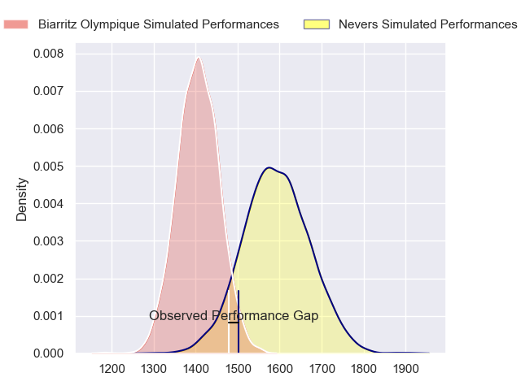
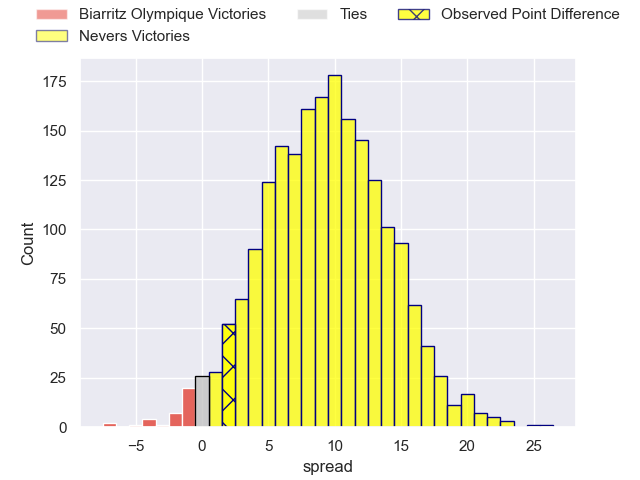
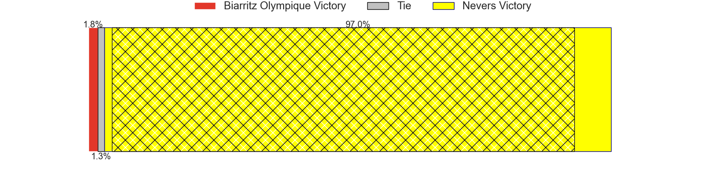
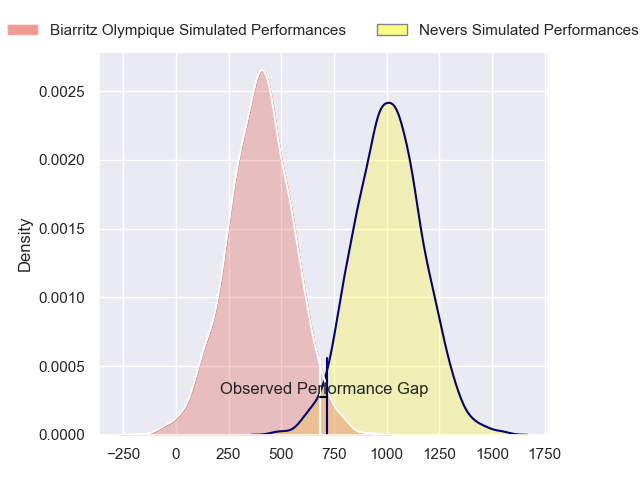
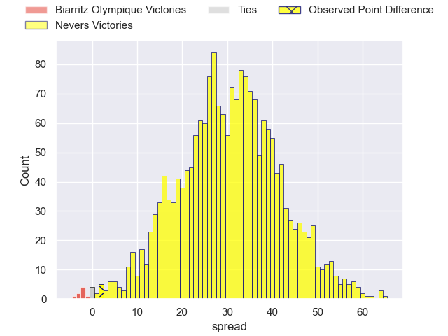
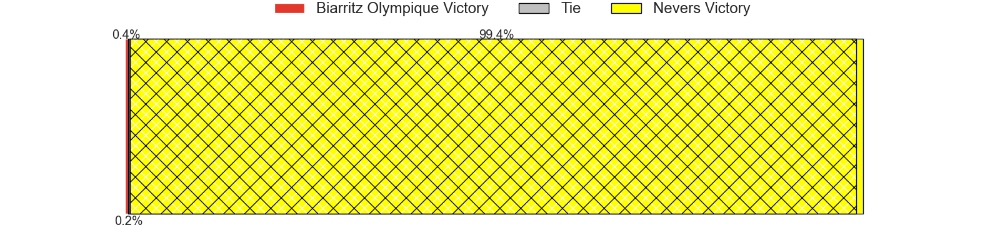
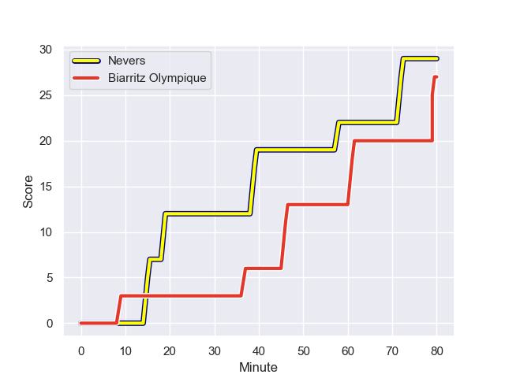
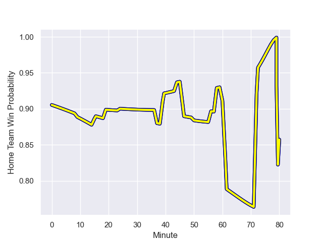

---  
layout: page  
title: Biarritz Olympique at Nevers; 27-29  
date: 2024-01-12 18:00:00 -0500  
categories: "Pro D2 2023" match review  
---
# Biarritz Olympique at Nevers; 27-29

# Club Level Predictions

The first set of predictions treats a club as the smallest object, as the club develops its members, organizes a gameplan, and deploys its players as needed for each match. This club model has a prediction of 0.747, which translates to predicting Nevers to win by 9.5.

Our Over/Under is 49.5 - and combined with the spread above, we have a predicted scoreline of 20 to 30

Each club has a rating and a rating deviation (similar to a Glicko rating), and expected performances can be generated. This allows for simulated matches and spreads like the ones below.
## Projected Performances - Club Model

## Projected Spreads - Club Model

## Projected Results - Club Model

# Player Level Predictions - Version 2

Treating teams instead as an entity made up of the currently active players, I have ratings for each player in an altogether different system. These can be combined to form team ratings once teamsheets are announced, weighting starters a bit higher than the reserves. After the match is played, players can be weighted by their minutes on the field, allowing for an accurate measure of the team's composition. With these compiled team ratings, we can make predictions, measure inaccuracy, and update the individual player ratings.
## Prediction with Player Minutes: Nevers by 24.9

Nevers by 20.7 on a neutral field
## Prediction without Player Minutes: Nevers by 23.1

Nevers by 18.9 on a neutral pitch

## Projected Performances - Player Model

## Projected Spreads - Player Model

## Projected Results - Player Model

## Scores over Time

## Win Probability over Time

There were 10 large changes in win probability in this match

|   Away Minutes | Away Player              |   Away elo |   Number |   Home elo | Home Player              |   Home Minutes |
|---------------:|:-------------------------|-----------:|---------:|-----------:|:-------------------------|---------------:|
|             56 | Zakaria El Fakir         |      20.63 |        1 |      59.85 | Tornike Mataradze        |             56 |
|             80 | Brendan Lebrun           |      38.06 |        2 |      44.69 | Elia Elia                |             80 |
|             56 | Mohamed Haouas           |      53.02 |        3 |      50    | Ilia Kaikatsishvili      |             50 |
|             80 | Nafi Ma'afu              |      39.87 |        4 |      -7.77 | Christiaan van der Merwe |             80 |
|             52 | Pieter Jansen van Vuuren |      24.96 |        5 |      97.89 | Will Skelton             |             50 |
|             80 | Dave O'Callaghan         |      15.87 |        6 |      47.37 | Luka Plataret            |             50 |
|             24 | Tiaan Jacobs             |      44.96 |        7 |      82.16 | Hugues Bastide           |             80 |
|             80 | Tornike Jalagonia        |      34.85 |        8 |     107.37 | Jason-Colin Fraser       |             80 |
|             60 | Kerman Aurrekoetxea      |      48.31 |        9 |      18.16 | Hugo Bouyssou            |             60 |
|             44 | Ilian Perraux            |      60.97 |       10 |      51.06 | Shaun Reynolds           |             80 |
|             60 | Yohann Artru             |      -0.11 |       11 |      58.23 | Arthur Mathiron          |             80 |
|             80 | Francois Vergnaud        |     -11.99 |       12 |      84.52 | Leonard Paris            |             80 |
|             80 | Vincent Martin           |      19.18 |       13 |      87.62 | Alifereti Loaloa         |             80 |
|             80 | Zach Kibirige            |      16.21 |       14 |      72.04 | Christian Ambadiang      |             80 |
|             80 | Gervais Cordin           |      21.06 |       15 |      80.91 | Kylian Jaminet           |             80 |
|             56 | Simon Augry              |      36.48 |       16 |      38.22 | Cleopas Kundiona         |             30 |
|             36 | Billy Searle             |       3.58 |       17 |      45.91 | Kevin Noah               |             29 |
|             28 | Johnny Dyer              |      -3.92 |       18 |      26.49 | Makatuki Polutele        |             30 |
|             24 | Lasha Tabidze            |      52.07 |       19 |      52.49 | Kamaliele Tufele         |             24 |
|             24 | Killian Taofifenua       |      31.88 |       20 |      26.86 | Guillaume Manevy         |             20 |
|             20 | Imanol Biscay            |      44.12 |       21 |      44.36 | Yohan Le Bourhis         |              1 |
|             20 | Joe Jonas                |      61.59 |       22 |     nan    | nan                      |            nan |

