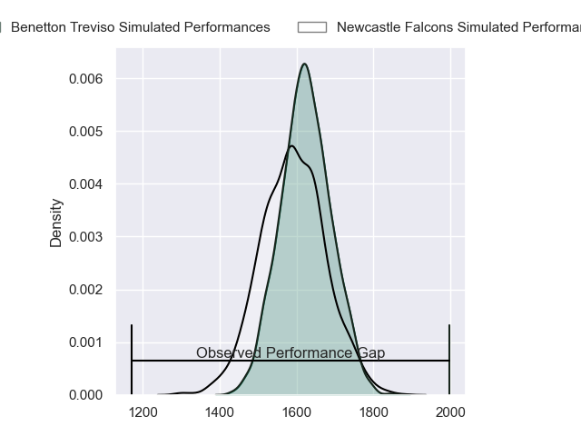
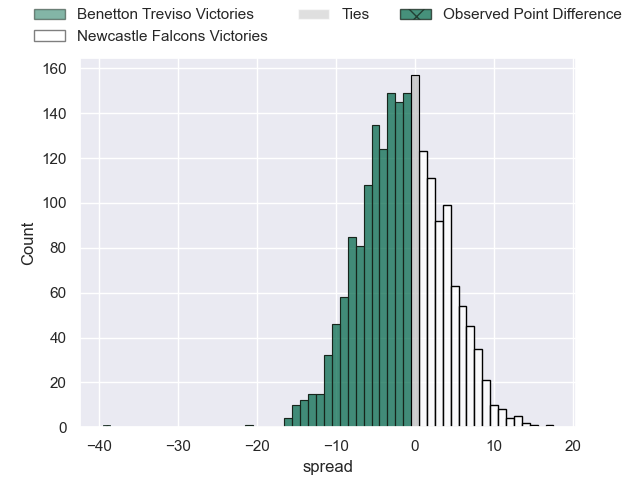
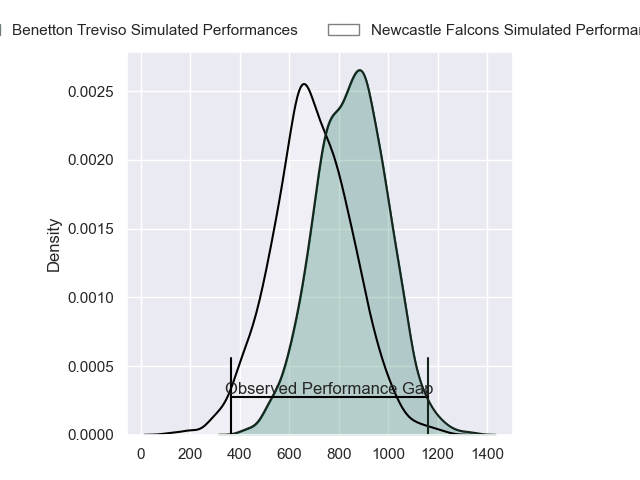
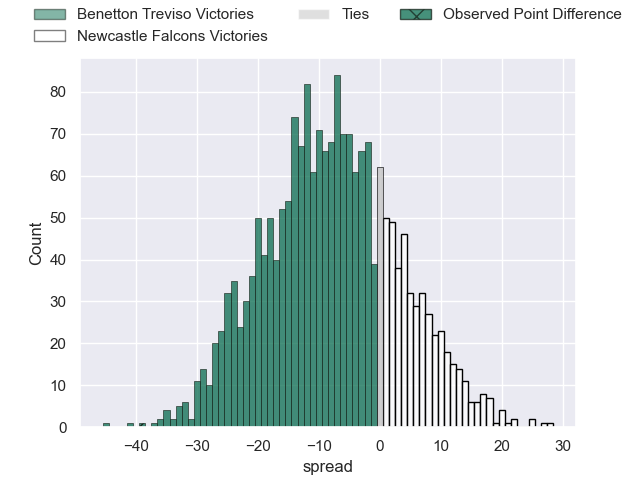
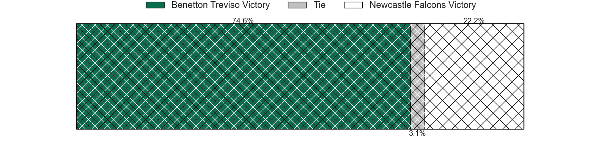
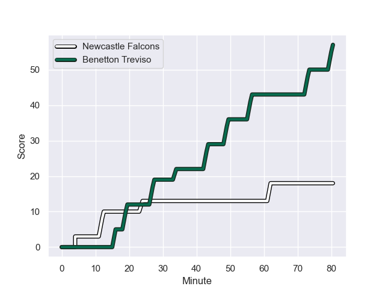
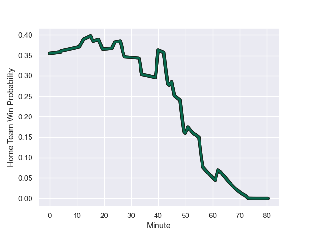

---  
layout: page  
title: Benetton Treviso at Newcastle Falcons; 57-18  
date: 2024-01-12 18:00:00 -0500  
categories: "European Rugby Challenge Cup 2023" match review  
---
# Benetton Treviso at Newcastle Falcons; 57-18

# Club Level Predictions

The first set of predictions treats a club as the smallest object, as the club develops its members, organizes a gameplan, and deploys its players as needed for each match. This club model has a prediction of 0.457, which translates to predicting Benetton Treviso to win by 1.5.

Our Over/Under is 48.5 - and combined with the spread above, we have a predicted scoreline of 25 to 23

Each club has a rating and a rating deviation (similar to a Glicko rating), and expected performances can be generated. This allows for simulated matches and spreads like the ones below.
## Projected Performances - Club Model

## Projected Spreads - Club Model

## Projected Results - Club Model

# Player Level Predictions - Version 2

Treating teams instead as an entity made up of the currently active players, I have ratings for each player in an altogether different system. These can be combined to form team ratings once teamsheets are announced, weighting starters a bit higher than the reserves. After the match is played, players can be weighted by their minutes on the field, allowing for an accurate measure of the team's composition. With these compiled team ratings, we can make predictions, measure inaccuracy, and update the individual player ratings.
## Prediction with Player Minutes: Benetton Treviso by 6.5

Benetton Treviso by 13.4 on a neutral field
## Prediction without Player Minutes: Benetton Treviso by 9.7

Benetton Treviso by 16.5 on a neutral pitch

## Projected Performances - Player Model

## Projected Spreads - Player Model

## Projected Results - Player Model

## Scores over Time

## Win Probability over Time

There were 7 large changes in win probability in this match

|   Away Minutes | Away Player         |   Away elo |   Number |   Home elo | Home Player         |   Home Minutes |
|---------------:|:--------------------|-----------:|---------:|-----------:|:--------------------|---------------:|
|             40 | Thomas Gallo        |      76.41 |        1 |      -1.75 | Adam Brocklebank    |             80 |
|             45 | Gianmarco Lucchesi  |      45.99 |        2 |      17.47 | Jamie Blamire       |             63 |
|             45 | Giosue Zilocchi     |      55.68 |        3 |      26.02 | Eduardo Bello       |             46 |
|             55 | Niccolo Cannone     |      15.87 |        4 |      14.63 | John Hawkins        |             54 |
|             64 | Eli Snyman          |      74.55 |        5 |      -5.08 | Sebastian de Chaves |             80 |
|             80 | Sebastian Negri     |      64.96 |        6 |      36.95 | Pedro Rubiolo       |             55 |
|             51 | Manuel Zuliani      |      52.42 |        7 |      36.06 | Guy Pepper          |             80 |
|             80 | Lorenzo Cannone     |      90.3  |        8 |       8.54 | Callum Chick        |             80 |
|             51 | Andy Uren           |      28.08 |        9 |       1.61 | Josh Barton         |             51 |
|             55 | Tomas Albornoz      |      76.55 |       10 |      41.87 | Brett Connon        |             80 |
|             55 | Tomas Albornoz      |      76.55 |       10 |      41.87 | Brett Connon        |             80 |
|             80 | Onisi Ratave        |      38.37 |       11 |      42.5  | Iwan Stephens       |             34 |
|             80 | Juan Ignacio Brex   |      78.05 |       12 |      55.64 | Cameron Hutchison   |             63 |
|             80 | Tommaso Menoncello  |      68.72 |       13 |       9    | George Wacokecoke   |             80 |
|             80 | Ignacio Mendy       |      19.97 |       14 |      99.49 | Adam Radwan         |             80 |
|             80 | Rhyno Smith         |      71.08 |       15 |      22.57 | Elliott Obatoyinbo  |             80 |
|             40 | Federico Zani       |      33.36 |       16 |      57.02 | Bryan Byrne         |             17 |
|             35 | Bautista Bernasconi |      30.47 |       17 |      45.09 | Murray McCallum     |             34 |
|             35 | Tiziano Pasquali    |      59.32 |       18 |      35.4  | Freddie Lockwood    |             26 |
|             25 | Gideon Koegelenberg |      18.08 |       19 |      47.69 | Sam Cross           |             25 |
|             16 | Federico Ruzza      |     101.64 |       20 |      34.16 | Hugh O'Sullivan     |             29 |
|             29 | Alessandro Izekor   |      59.68 |       21 |      41.87 | Brett Connon        |             17 |
|             29 | Alessandro Izekor   |      59.68 |       21 |      41.87 | Brett Connon        |             17 |
|             25 | Jacob Umaga         |      70.14 |       22 |      99.16 | Tom Penny           |             46 |
|             29 | Alessandro Garbisi  |      60.67 |       23 |     nan    | nan                 |            nan |

