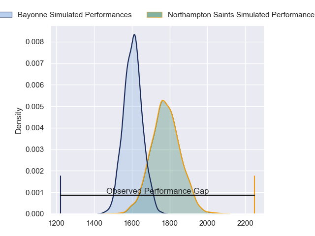
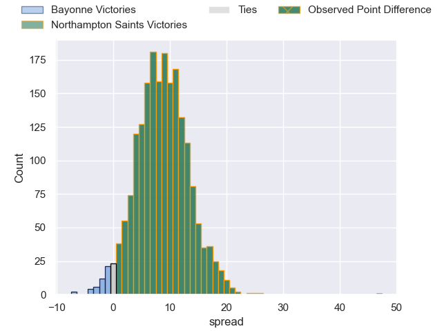
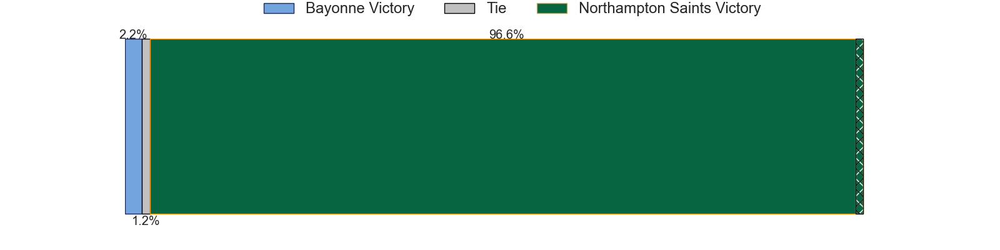
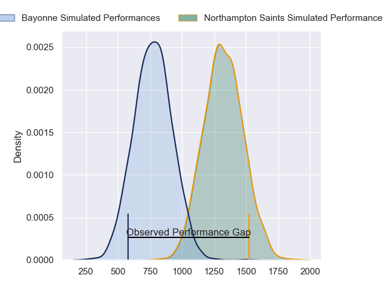
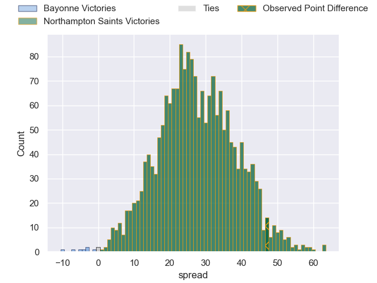
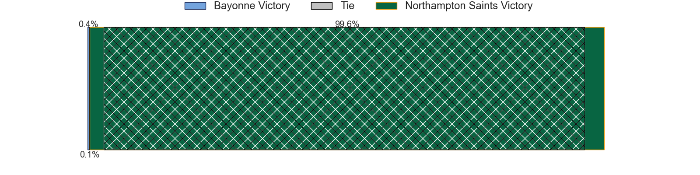
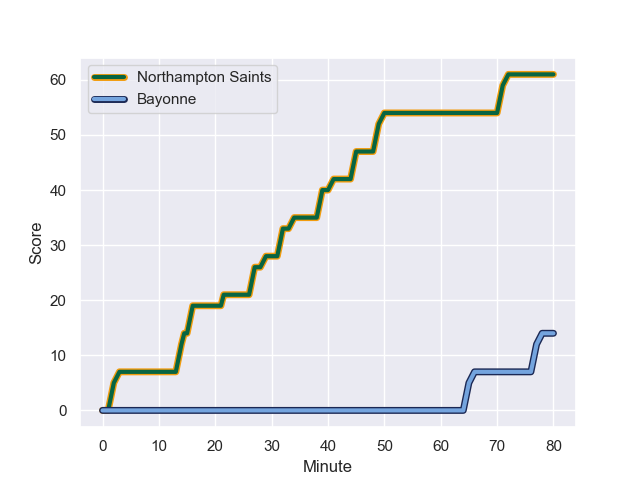
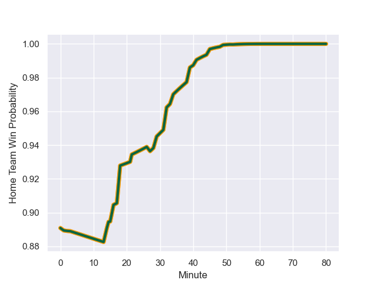

---  
layout: page  
title: Bayonne at Northampton Saints; 14-61  
date: 2024-01-12 18:00:00 -0500  
categories: "European Rugby Champions Cup 2023" match review  
---
# Bayonne at Northampton Saints; 14-61

# Club Level Predictions

The first set of predictions treats a club as the smallest object, as the club develops its members, organizes a gameplan, and deploys its players as needed for each match. This club model has a prediction of 0.728, which translates to predicting Northampton Saints to win by 8.7.

Our Over/Under is 56.5 - and combined with the spread above, we have a predicted scoreline of 24 to 32

Each club has a rating and a rating deviation (similar to a Glicko rating), and expected performances can be generated. This allows for simulated matches and spreads like the ones below.
## Projected Performances - Club Model

## Projected Spreads - Club Model

## Projected Results - Club Model

# Player Level Predictions - Version 2

Treating teams instead as an entity made up of the currently active players, I have ratings for each player in an altogether different system. These can be combined to form team ratings once teamsheets are announced, weighting starters a bit higher than the reserves. After the match is played, players can be weighted by their minutes on the field, allowing for an accurate measure of the team's composition. With these compiled team ratings, we can make predictions, measure inaccuracy, and update the individual player ratings.
## Prediction with Player Minutes: Northampton Saints by 23.0

Northampton Saints by 15.4 on a neutral field
## Prediction without Player Minutes: Northampton Saints by 23.3

Northampton Saints by 15.8 on a neutral pitch

## Projected Performances - Player Model

## Projected Spreads - Player Model

## Projected Results - Player Model

## Scores over Time

## Win Probability over Time

|   Away Minutes | Away Player         |   Away elo |   Number |   Home elo | Home Player         |   Home Minutes |
|---------------:|:--------------------|-----------:|---------:|-----------:|:--------------------|---------------:|
|             50 | Swan Cormenier      |      46.65 |        1 |     101.89 | Alex Waller         |             52 |
|             50 | Facundo Bosch       |      46.65 |        2 |      77.92 | Curtis Langdon      |             52 |
|             50 | Tevita Tatafu       |      48.66 |        3 |       8.78 | Trevor Davison      |             52 |
|             66 | Denis Marchois      |      46.65 |        4 |      93.66 | Temo Mayanavanua    |             80 |
|             80 | Manuel Leindekar    |      46.65 |        5 |       8.45 | Alex Coles          |             64 |
|             55 | Remi Bourdeau       |      46.65 |        6 |     112.01 | Courtney Lawes      |             52 |
|             80 | Baptiste Heguy      |      46.65 |        7 |     127.74 | Tom Pearson         |             64 |
|             71 | Rodrigo Bruni       |     124.94 |        8 |     117.46 | Sam Graham          |             80 |
|             64 | Maxime Machenaud    |      46.65 |        9 |      85.77 | Alex Mitchell       |             50 |
|             80 | Thomas Dolhagaray   |      51.78 |       10 |      55.82 | Fin Smith           |             80 |
|             80 | Remy Baget          |      46.65 |       11 |     112.66 | Ollie Sleightholme  |             80 |
|             46 | Eneriko Buliruarua  |      46.65 |       12 |      64.11 | Rory Hutchinson     |             72 |
|             56 | Cheikh Tiberghien   |      46.65 |       13 |      60.15 | Fraser Dingwall     |             80 |
|             80 | Nadir Megdoud       |      46.65 |       14 |      95.6  | Tommy Freeman       |             80 |
|             80 | Aurelien Callandret |      42.52 |       15 |      83.29 | George Furbank      |             80 |
|             30 | Vincent Giudicelli  |      46.65 |       16 |      64.06 | Sam Matavesi        |             28 |
|             30 | Matis Perchaud      |      46.65 |       17 |      56.41 | Emmanuel Iyogun     |             28 |
|             39 | Pascal Cotet        |      46.65 |       18 |      53.85 | Elliot Millar-Mills |             28 |
|             14 | Lucas Paulos        |      46.65 |       19 |      93.56 | Alex Moon           |             16 |
|             25 | Uzair Cassiem       |      46.65 |       20 |      56.56 | Juarno Augustus     |             16 |
|             16 | Kleo Labarbe        |      46.65 |       21 |      34.08 | Angus Scott-Young   |             28 |
|             19 | Tom Spring          |      46.65 |       22 |       4.62 | Tom James           |             30 |
|             39 | Yan Lestrade        |      46.65 |       23 |      52.94 | Tom Litchfield      |              8 |

