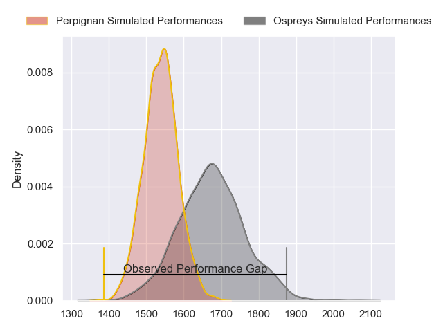
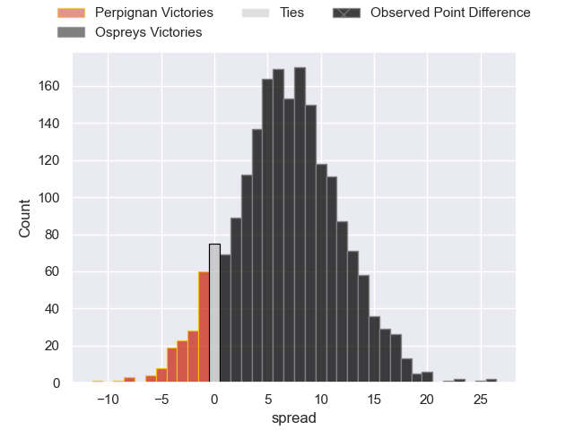
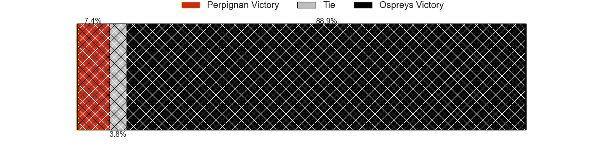
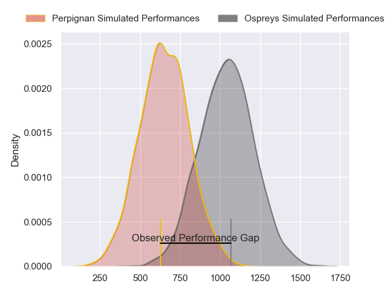
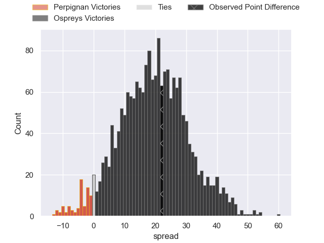
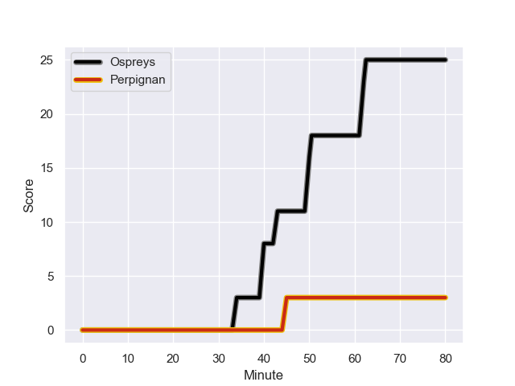
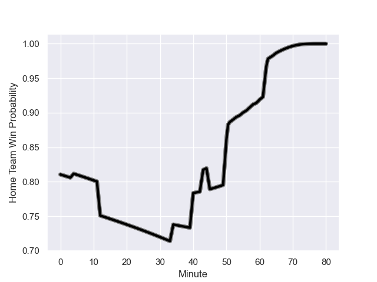

---  
layout: page  
title: Perpignan at Ospreys; 3-25  
date: 2024-01-12 18:00:00 -0500  
categories: "European Rugby Challenge Cup 2023" match review  
---
# Perpignan at Ospreys; 3-25

# Club Level Predictions

The first set of predictions treats a club as the smallest object, as the club develops its members, organizes a gameplan, and deploys its players as needed for each match. This club model has a prediction of 0.681, which translates to predicting Ospreys to win by 6.6.

Our Over/Under is 46.5 - and combined with the spread above, we have a predicted scoreline of 20 to 26

Each club has a rating and a rating deviation (similar to a Glicko rating), and expected performances can be generated. This allows for simulated matches and spreads like the ones below.
## Projected Performances - Club Model

## Projected Spreads - Club Model

## Projected Results - Club Model

# Player Level Predictions - Version 2

Treating teams instead as an entity made up of the currently active players, I have ratings for each player in an altogether different system. These can be combined to form team ratings once teamsheets are announced, weighting starters a bit higher than the reserves. After the match is played, players can be weighted by their minutes on the field, allowing for an accurate measure of the team's composition. With these compiled team ratings, we can make predictions, measure inaccuracy, and update the individual player ratings.
## Prediction with Player Minutes: Ospreys by 16.0

Ospreys by 10.1 on a neutral field
## Prediction without Player Minutes: Ospreys by 17.1

Ospreys by 11.3 on a neutral pitch

## Projected Performances - Player Model

## Projected Spreads - Player Model

## Projected Results - Player Model

## Scores over Time

## Win Probability over Time

There were 6 large changes in win probability in this match

|   Away Minutes | Away Player          |   Away elo |   Number |   Home elo | Home Player    |   Home Minutes |
|---------------:|:---------------------|-----------:|---------:|-----------:|:---------------|---------------:|
|             51 | Akato Fakatika       |      27.98 |        1 |      44.86 | Gareth Thomas  |             50 |
|             51 | Ignacio Ruiz         |      57.11 |        2 |      69.01 | Sam Parry      |             80 |
|             51 | Nemo Roelofse        |      34.22 |        3 |      62.04 | Tom Botha      |             61 |
|             65 | Tristan Labouteley   |      35.17 |        4 |      53.1  | James Fender   |             56 |
|             12 | Shahn Eru            |     -20.9  |        5 |      79.14 | Adam Beard     |             80 |
|             65 | Lucas Bachelier      |      80.03 |        6 |      41.51 | James Ratti    |             80 |
|             80 | Kelian Galletier     |      45.65 |        7 |      36.8  | Dewi Lake      |              4 |
|             80 | So'otala Fa'aso'o    |     114.1  |        8 |      47.62 | Morgan Morse   |             80 |
|             59 | Sadek Deghmache      |      18.39 |        9 |      50.81 | Luke Davies    |             77 |
|             80 | Jake McIntyre        |      80.69 |       10 |      49.19 | Dan Edwards    |             65 |
|             80 | Lucas Dubois         |      52.78 |       11 |      -5.53 | Keelan Giles   |             80 |
|             80 | Apisai Naqalevu      |      42.65 |       12 |     106.8  | Owen Watkin    |             77 |
|             80 | Edward Sawailau      |     -22.21 |       13 |     115.03 | George North   |             80 |
|             80 | Boris Goutard        |     -28.92 |       14 |      96    | Matt Protheroe |             80 |
|             54 | Louis Dupichot       |      59.26 |       15 |      38.98 | Iestyn Hopkins |             80 |
|             29 | Sacha Lotrian        |      59.01 |       16 |      54.82 | Ben Warren     |             19 |
|             29 | Victor Montgaillard  |      17.88 |       17 |      60.75 | Garyn Phillips |             24 |
|             29 | Pietro Ceccarelli    |      66.56 |       18 |      46.39 | Lewis Jones    |             24 |
|             15 | Alan Brazo           |      52.84 |       19 |      50.63 | Will Hickey    |             76 |
|             68 | Joaquin Oviedo       |      67.62 |       20 |      60.24 | Jack Walsh     |             15 |
|             15 | Bastien Chinarro     |      44.32 |       21 |      46.65 | Cam Jones      |              3 |
|             21 | Matteo Rodor         |      34.17 |       22 |      54.01 | Luke Scully    |              3 |
|             26 | Jean Pascal Barraque |      32.56 |       23 |      10.59 | Ethan Lewis    |              6 |

