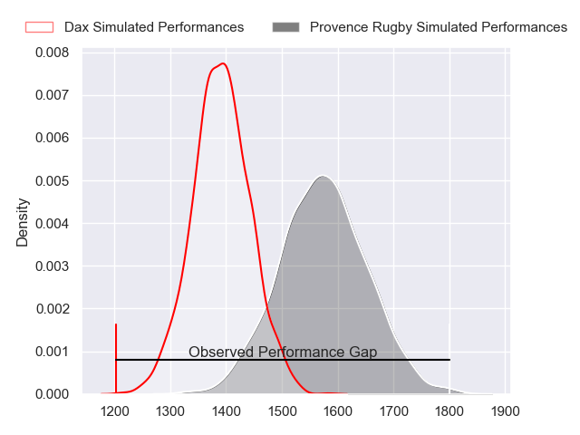
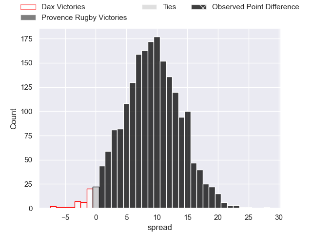
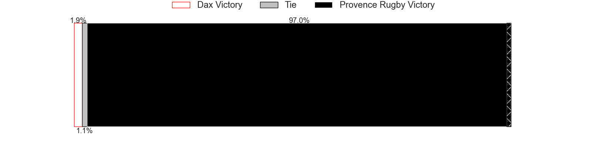
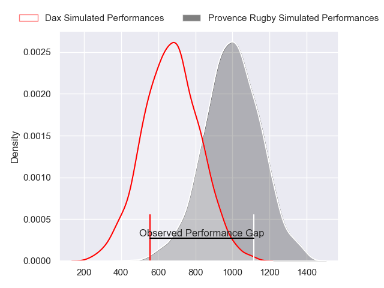
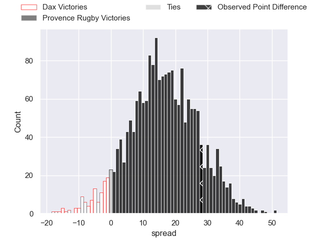
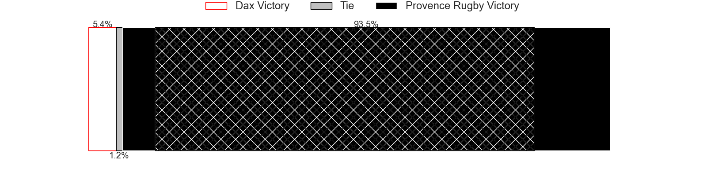
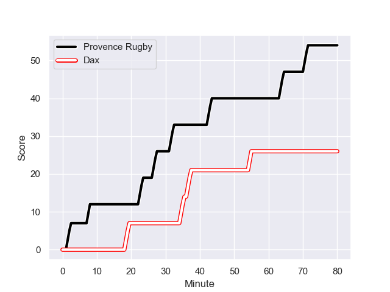
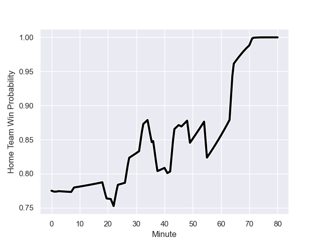

---  
layout: page  
title: Dax at Provence Rugby; 26-54  
date: 2024-01-12 18:00:00 -0500  
categories: "Pro D2 2023" match review  
---
# Dax at Provence Rugby; 26-54

# Club Level Predictions

The first set of predictions treats a club as the smallest object, as the club develops its members, organizes a gameplan, and deploys its players as needed for each match. This club model has a prediction of 0.735, which translates to predicting Provence Rugby to win by 9.0.

Our Over/Under is 48.5 - and combined with the spread above, we have a predicted scoreline of 20 to 29

Each club has a rating and a rating deviation (similar to a Glicko rating), and expected performances can be generated. This allows for simulated matches and spreads like the ones below.
## Projected Performances - Club Model

## Projected Spreads - Club Model

## Projected Results - Club Model

# Player Level Predictions - Version 2

Treating teams instead as an entity made up of the currently active players, I have ratings for each player in an altogether different system. These can be combined to form team ratings once teamsheets are announced, weighting starters a bit higher than the reserves. After the match is played, players can be weighted by their minutes on the field, allowing for an accurate measure of the team's composition. With these compiled team ratings, we can make predictions, measure inaccuracy, and update the individual player ratings.
## Prediction with Player Minutes: Provence Rugby by 13.6

Provence Rugby by 8.2 on a neutral field
## Prediction without Player Minutes: Provence Rugby by 15.9

Provence Rugby by 10.5 on a neutral pitch

## Projected Performances - Player Model

## Projected Spreads - Player Model

## Projected Results - Player Model

## Scores over Time

## Win Probability over Time

There were 7 large changes in win probability in this match

|   Away Minutes | Away Player          |   Away elo |   Number |   Home elo | Home Player           |   Home Minutes |
|---------------:|:---------------------|-----------:|---------:|-----------:|:----------------------|---------------:|
|             49 | Asa Faitotoa         |      10.62 |        1 |      52.02 | Federico Wegrzyn      |             51 |
|             49 | Louis Barrere        |      26.45 |        2 |      88.15 | Lucas Martin          |             51 |
|             49 | David Lolohea        |       9.47 |        3 |     143.04 | Tomas Francis         |             51 |
|             46 | Josh Furno           |      26.46 |        4 |      63.54 | Jérôme Dufour         |             48 |
|             80 | Brice Ferrer         |      42.62 |        5 |      74.13 | Josh Tyrell           |             80 |
|             80 | Arnaud Aletti        |      49.14 |        6 |      44.41 | Carl Axtens           |             49 |
|             80 | Ratu Nacika          |      35.45 |        7 |       7.75 | Jessy Jegerlehner     |             80 |
|             80 | Sam Wasley           |      50.14 |        8 |      49.61 | Malohi Suta           |             80 |
|             57 | Simon Garrouteigt    |      71.15 |        9 |      48.24 | Arthur Coville        |             55 |
|             80 | Hugo Cerisier        |      54.42 |       10 |      61    | Jimmy Gopperth        |             80 |
|             46 | Guillaume Bouche     |      56.44 |       11 |      49.09 | Eto Bainivalu         |             80 |
|             80 | Alex McHenry         |      75.91 |       12 |     107.26 | Kaveinga Finau        |             80 |
|             41 | Bastien Daguerre     |      61.31 |       13 |      53.58 | Atila Septar          |             22 |
|             80 | Maxime Oltmann       |      22.47 |       14 |      78.42 | Sione Tui             |             80 |
|             80 | Théo Duprat          |      55.96 |       15 |      19.06 | Adrien Lapegue-Lafaye |             80 |
|             39 | Hugo Fourquet        |      88.93 |       16 |      33.1  | Dorian Lavernhe       |             24 |
|              6 | Romuald Séguy        |      40.09 |       17 |      45.65 | Johnny McPhillips     |             34 |
|             34 | Jean-Baptiste Singer |       7.47 |       18 |      31.66 | Theo Hannoyer         |             32 |
|             31 | Iban Hiriart-Urruty  |      55.77 |       19 |      53.74 | Baptiste Belhadj      |             31 |
|             31 | Diogo Hasse Ferreira |      13.65 |       20 |      47.46 | Thomas Vernet         |             29 |
|             31 | Louis Mary           |      62.69 |       21 |      36.08 | Jean Charles Orioli   |             29 |
|             28 | Jean Despiau         |      23.01 |       22 |      54.75 | Paul Mallez           |             29 |
|             23 | Paul Ravier          |      52.81 |       23 |      42.02 | Simon Tarel           |             25 |

