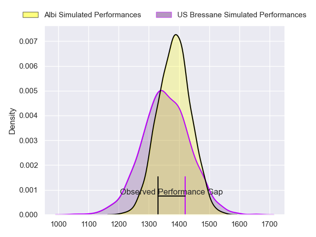
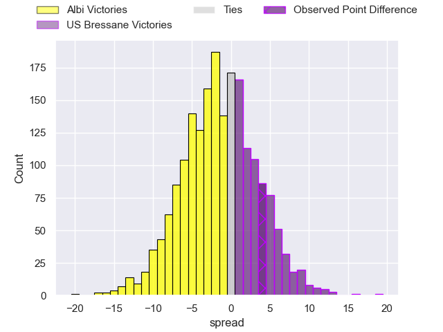
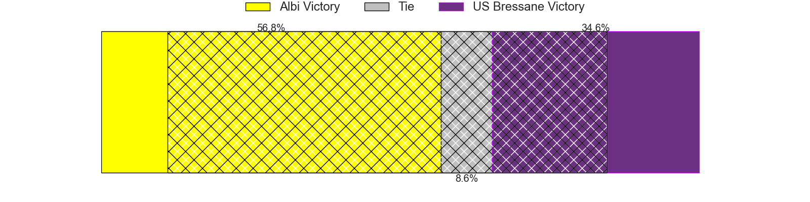
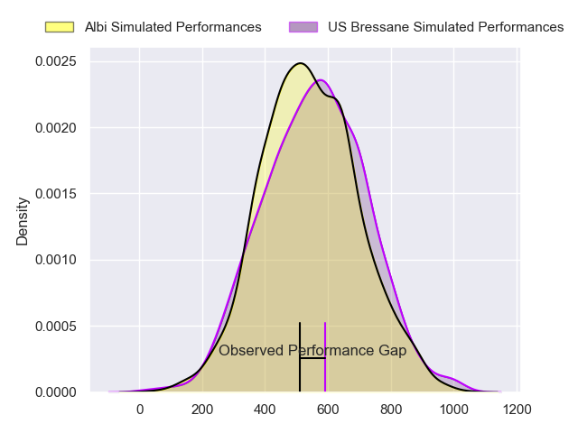
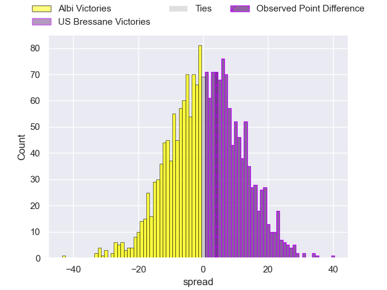
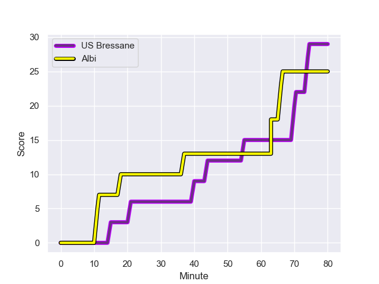
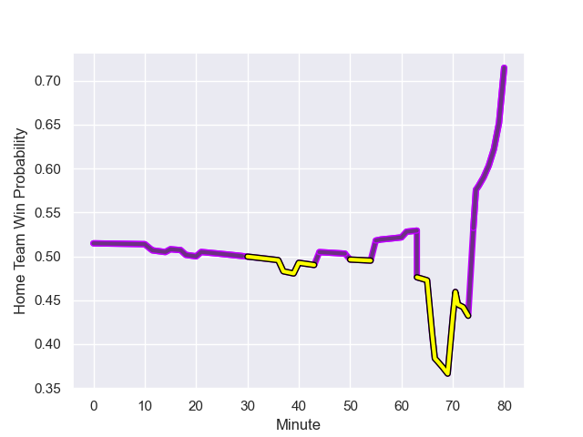

---  
layout: page  
title: Albi at US Bressane; 25-29  
date: 2024-01-12 18:00:00 -0500  
categories: "Nationale 2023" match review  
---
# Albi at US Bressane; 25-29

# Club Level Predictions

The first set of predictions treats a club as the smallest object, as the club develops its members, organizes a gameplan, and deploys its players as needed for each match. This club model has a prediction of 0.459, which translates to predicting Albi to win by 1.4.

Our Over/Under is 25.5 - and combined with the spread above, we have a predicted scoreline of 13 to 12

Each club has a rating and a rating deviation (similar to a Glicko rating), and expected performances can be generated. This allows for simulated matches and spreads like the ones below.
## Projected Performances - Club Model

## Projected Spreads - Club Model

## Projected Results - Club Model

# Player Level Predictions - Version 2

Treating teams instead as an entity made up of the currently active players, I have ratings for each player in an altogether different system. These can be combined to form team ratings once teamsheets are announced, weighting starters a bit higher than the reserves. After the match is played, players can be weighted by their minutes on the field, allowing for an accurate measure of the team's composition. With these compiled team ratings, we can make predictions, measure inaccuracy, and update the individual player ratings.
## Prediction with Player Minutes: US Bressane by 0.7

Albi by 3.5 on a neutral field
## Prediction without Player Minutes: US Bressane by 0.9

Albi by 3.2 on a neutral pitch

## Projected Performances - Player Model

## Projected Spreads - Player Model

## Projected Results - Player Model

## Scores over Time

## Win Probability over Time

There were 9 large changes in win probability in this match

|   Away Minutes | Away Player             |   Away elo |   Number |   Home elo | Home Player               |   Home Minutes |
|---------------:|:------------------------|-----------:|---------:|-----------:|:--------------------------|---------------:|
|             61 | Antoine Soave           |      58.67 |        1 |      46.29 | Vazha Kapanadze           |             56 |
|             61 | Reinach Venter          |      23.67 |        2 |      52.48 | Clement Jullien           |             56 |
|             61 | Jean Baptiste De Clercq |      51.97 |        3 |      21.28 | Atonio Ulutuipalelei      |             56 |
|             80 | Mohsen Essid            |      59.15 |        4 |      49.08 | Thomas Déliance           |             65 |
|             69 | Jacques Engelbrecht     |     -11.21 |        5 |     -34.94 | Maselino Paulino          |             74 |
|             80 | Pierre Roussel          |     -19.32 |        6 |      38.3  | Pierre Reynaud            |             80 |
|             61 | Mattéo Coustalat        |      36.88 |        7 |      71.74 | Lucas Lyons               |             65 |
|             80 | Guillem Calmon          |      28.48 |        8 |      42.33 | Loic Baradel              |             80 |
|             71 | Gilen Queheille         |      61.84 |        9 |     -21.71 | Nicolas Faure             |             65 |
|             80 | James Haydn Tedder      |      17.62 |       10 |      58.81 | Thibault Olender          |             80 |
|             80 | Téo Dospital            |       1.65 |       11 |      36.79 | Élie De Fleurian          |             80 |
|             71 | Jarrod Poi              |       8.95 |       12 |      -3.74 | Parataiso Silafai-Lea'ana |             80 |
|             80 | Baptiste Couchinave     |      75.06 |       13 |      32.6  | Maile Mamao               |             73 |
|             80 | Simon Hartmann          |      66.93 |       14 |      21.31 | Thibaut Perrette          |             80 |
|             50 | Enzo Marzocca           |      45.37 |       15 |      51.3  | Florent Massip            |             80 |
|             19 | Lucas Pindor            |      46.53 |       16 |      39.76 | Nicolas Lemaire           |             24 |
|             19 | Romain Maurice          |      60.26 |       17 |      32.19 | Arnaud Feltrin            |             24 |
|             19 | Dimitri Tchapnga        |      58.98 |       18 |       6.35 | Erich de Jager            |             24 |
|             11 | Dion Evrard Oulai       |      14.14 |       19 |      25.13 | Louis Bruinsma            |             15 |
|             19 | Simon Meka              |      67.54 |       20 |      48.82 | Nail Ait Naceur           |              6 |
|              9 | Titouan Pouzoullic      |      48.76 |       21 |      64.01 | Joseph Penitito           |             15 |
|              9 | Gabriel Aviragnet       |      44.6  |       22 |      27.72 | Robin Graulle             |             15 |
|             30 | Paul Clergue            |      84.04 |       23 |      13.87 | Alexandre Badet           |              7 |

