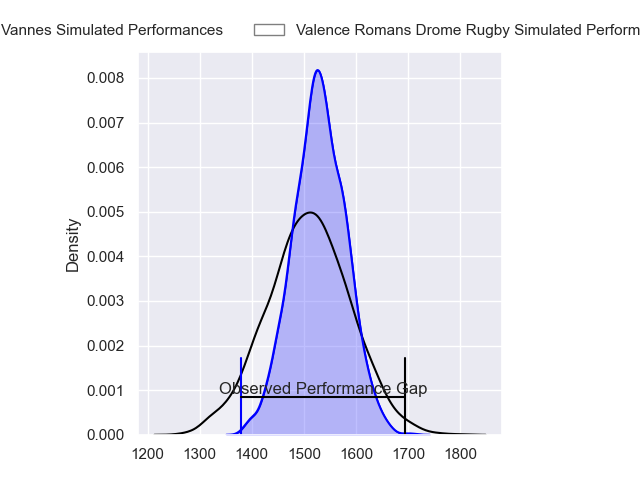
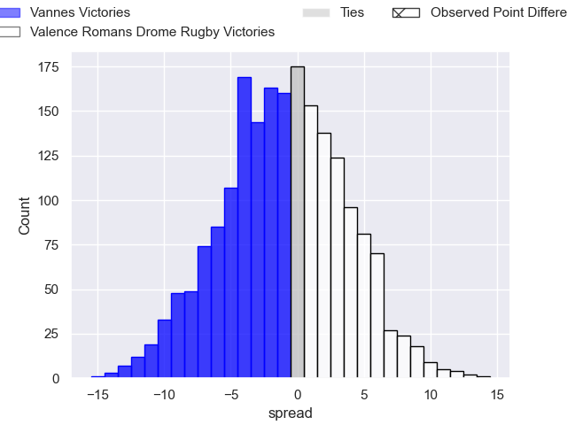
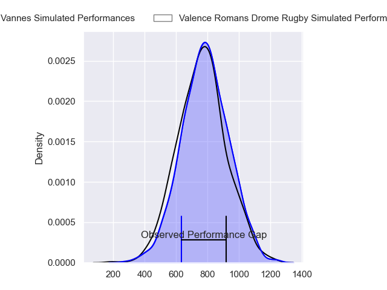
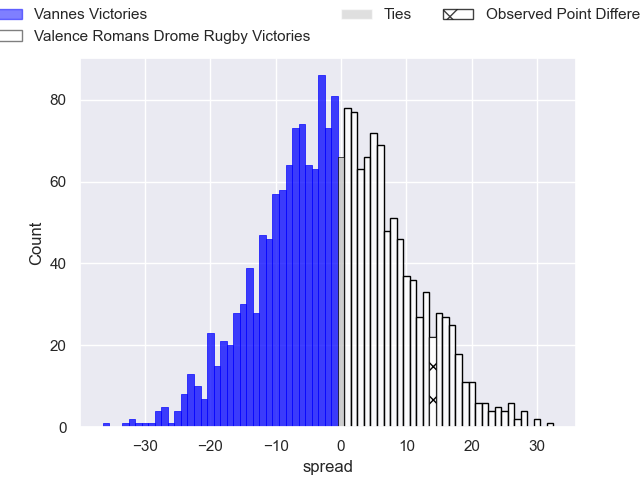
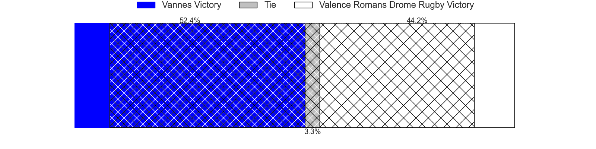
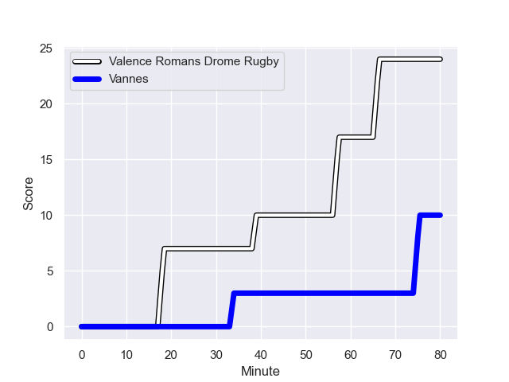
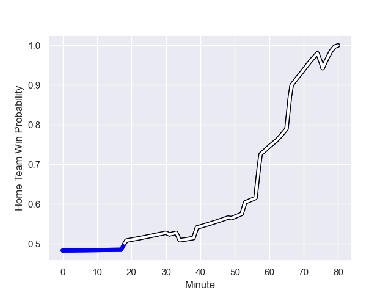

---  
layout: page  
title: Vannes at Valence Romans Drome Rugby; 10-24  
date: 2024-01-12 18:00:00 -0500  
categories: "Pro D2 2023" match review  
---
# Vannes at Valence Romans Drome Rugby; 10-24

# Club Level Predictions

The first set of predictions treats a club as the smallest object, as the club develops its members, organizes a gameplan, and deploys its players as needed for each match. This club model has a prediction of 0.468, which translates to predicting Vannes to win by 1.1.

Our Over/Under is 23.5 - and combined with the spread above, we have a predicted scoreline of 12 to 11

Each club has a rating and a rating deviation (similar to a Glicko rating), and expected performances can be generated. This allows for simulated matches and spreads like the ones below.
## Projected Performances - Club Model

## Projected Spreads - Club Model

## Projected Results - Club Model

# Player Level Predictions - Version 2

Treating teams instead as an entity made up of the currently active players, I have ratings for each player in an altogether different system. These can be combined to form team ratings once teamsheets are announced, weighting starters a bit higher than the reserves. After the match is played, players can be weighted by their minutes on the field, allowing for an accurate measure of the team's composition. With these compiled team ratings, we can make predictions, measure inaccuracy, and update the individual player ratings.
## Prediction with Player Minutes: Vannes by 0.8

Vannes by 4.3 on a neutral field
## Prediction without Player Minutes: Vannes by 0.8

Vannes by 4.4 on a neutral pitch

## Projected Performances - Player Model

## Projected Spreads - Player Model

## Projected Results - Player Model

## Scores over Time

## Win Probability over Time

There were 6 large changes in win probability in this match

|   Away Minutes | Away Player             |   Away elo |   Number |   Home elo | Home Player         |   Home Minutes |
|---------------:|:------------------------|-----------:|---------:|-----------:|:--------------------|---------------:|
|             49 | Ximun Bessonart         |      28.21 |        1 |      20.53 | Anthony Aléo        |             53 |
|             61 | Théo Beziat             |      47.65 |        2 |      45.34 | Dorian Marco Pena   |             62 |
|             53 | Paga Tafili             |      76.46 |        3 |      57.57 | Kevin Goze          |             31 |
|             49 | Darren O'Shea           |      65.42 |        4 |      18.17 | Ryan McCauley       |             80 |
|             80 | Anton Bresler           |      46.41 |        5 |      39.92 | Yassine Maamry      |             53 |
|             61 | Juan Bautista Pedemonte |      25.16 |        6 |       9.7  | Axel Bruchet        |             69 |
|             80 | Francisco Gorrissen     |      97.1  |        7 |      41.1  | Loan Real           |             80 |
|             53 | Karl Chateau            |       5.31 |        8 |      64.12 | Ioane Iashagashvili |             49 |
|             80 | Michael Ruru            |     102.34 |        9 |      78.89 | Thomas Lhusero      |             66 |
|             55 | Jean Cotarmanac'h       |      44.54 |       10 |       0.18 | Lucas Meret         |             62 |
|             80 | Romaric Camou           |      33.21 |       11 |      65.03 | Mosese Mawalu       |             80 |
|             80 | Andres Vilaseca         |      17.18 |       12 |      50.04 | Ben Neiceru         |             80 |
|             80 | Alex Arrate             |      -0.5  |       13 |      58.63 | Anatole Pauvert     |             80 |
|             80 | Théo Bastardie          |      73.93 |       14 |      94.12 | Adam Vargas         |             80 |
|             80 | Gwenaël Duplenne        |     129.37 |       15 |      28.71 | George Worth        |             80 |
|             31 | Charles-Henri Berguet   |      42.12 |       16 |      42.31 | Gareth Milasinovich |             49 |
|             31 | Eric Marks              |      -7.01 |       17 |      77.93 | Thembelani Bholi    |             31 |
|             27 | Jérémy Boyadjis         |      59.78 |       18 |      39.01 | Florian Goumat      |             27 |
|             27 | Léon Boulier            |      26.79 |       19 |      53.52 | Andrea Pontanier    |             27 |
|             19 | Pat Leafa               |      54.5  |       20 |     -22.32 | Cyril Deligny       |             18 |
|             25 | Massimo Ortolan         |      16.84 |       21 |      77.61 | Joris Moura         |             18 |
|             19 | Joe Edwards             |      93.32 |       22 |      56.86 | Tim Menzel          |             14 |
|            nan | nan                     |     nan    |       23 |      -6.2  | Éloi Massot         |             11 |

