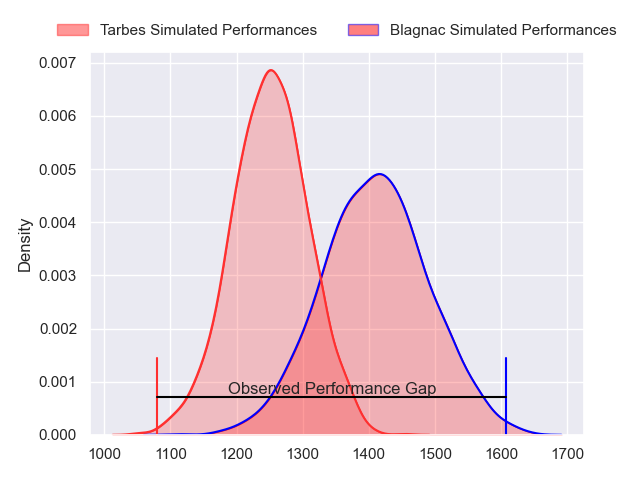
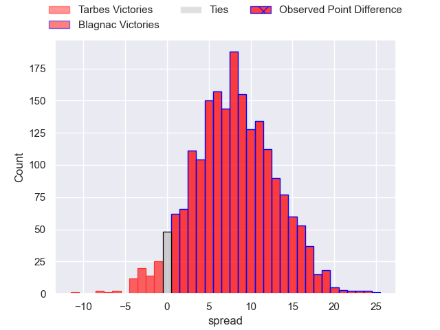
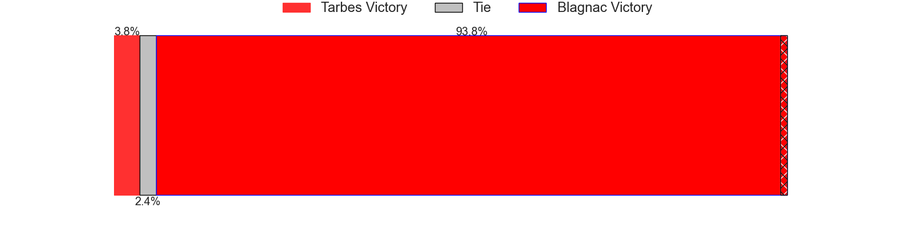
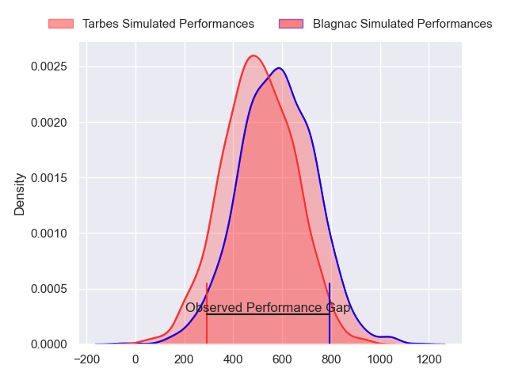
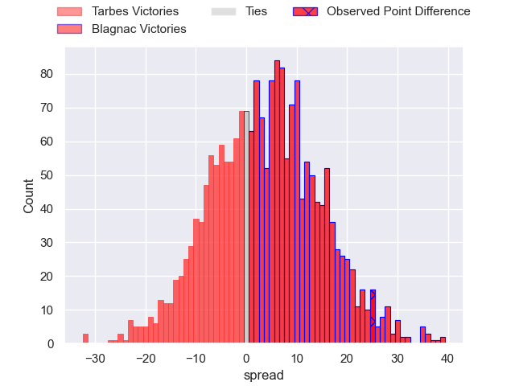
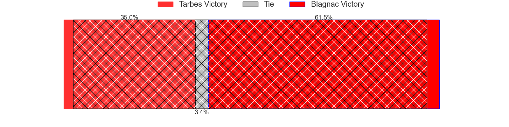
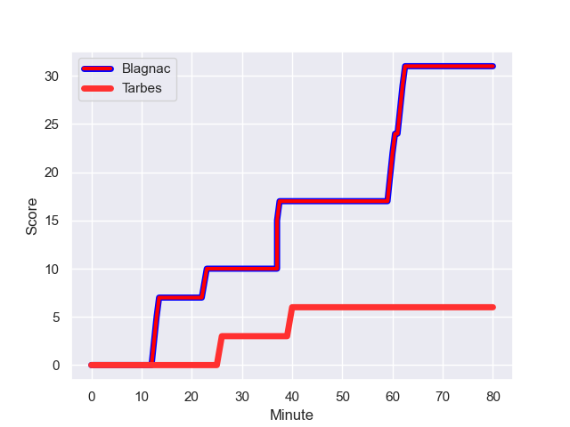
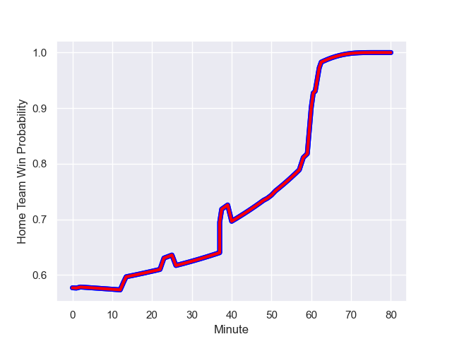

---  
layout: page  
title: Tarbes at Blagnac; 6-31  
date: 2024-01-13 18:00:00 -0500  
categories: "Nationale 2023" match review  
---
# Tarbes at Blagnac; 6-31

# Club Level Predictions

The first set of predictions treats a club as the smallest object, as the club develops its members, organizes a gameplan, and deploys its players as needed for each match. This club model has a prediction of 0.707, which translates to predicting Blagnac to win by 7.8.

Our Over/Under is 44.5 - and combined with the spread above, we have a predicted scoreline of 18 to 26

Each club has a rating and a rating deviation (similar to a Glicko rating), and expected performances can be generated. This allows for simulated matches and spreads like the ones below.
## Projected Performances - Club Model

## Projected Spreads - Club Model

## Projected Results - Club Model

# Player Level Predictions - Version 2

Treating teams instead as an entity made up of the currently active players, I have ratings for each player in an altogether different system. These can be combined to form team ratings once teamsheets are announced, weighting starters a bit higher than the reserves. After the match is played, players can be weighted by their minutes on the field, allowing for an accurate measure of the team's composition. With these compiled team ratings, we can make predictions, measure inaccuracy, and update the individual player ratings.
## Prediction with Player Minutes: Blagnac by 3.4

Blagnac by 0.2 on a neutral field
## Prediction without Player Minutes: Blagnac by 3.9

Blagnac by 0.3 on a neutral pitch

## Projected Performances - Player Model

## Projected Spreads - Player Model

## Projected Results - Player Model

## Scores over Time

## Win Probability over Time

There were 5 large changes in win probability in this match

|   Away Minutes | Away Player            |   Away elo |   Number |   Home elo | Home Player         |   Home Minutes |
|---------------:|:-----------------------|-----------:|---------:|-----------:|:--------------------|---------------:|
|             49 | Antoine Palisse        |      48.18 |        1 |      58.2  | Alexis Decaux       |             49 |
|             49 | Enzo Mondon            |      47.84 |        2 |      39.76 | Gabin Villerouge    |              2 |
|             49 | Aleksi Tchitchiashvili |      38.03 |        3 |      52.52 | Victor Delmas       |             49 |
|             49 | Léo Saint-Guilhem      |      36.44 |        4 |      31.11 | Vincent Mutel       |             80 |
|             80 | Baptiste Peytavi       |      41.88 |        5 |     -15.15 | Victor Fromenteze   |             58 |
|             80 | Alexis Armary          |      63.05 |        6 |      52.22 | Simon Veyrac        |             80 |
|             51 | Jean Guicherd          |      46.99 |        7 |      74.9  | Nikita Bekov        |             58 |
|             58 | Filipe Manu            |      -4.47 |        8 |      20.77 | Matthieu Thomas     |             80 |
|             58 | Thibaut Dulucq         |      31.67 |        9 |      29.44 | William Beaudon     |             58 |
|             80 | Mathieu Berbizier      |      20.57 |       10 |      53.18 | Ugo Seunes          |             58 |
|             80 | Jone Tuva              |      -7.25 |       11 |     -23.49 | Francois Tardieu    |             80 |
|             66 | Savenaca Rawaca        |      23.36 |       12 |      53.8  | Aurelien Labau      |             69 |
|             80 | Pierre Descoubet       |      51.19 |       13 |      43.45 | Baptiste Serrano    |             80 |
|             80 | Clement Latorre        |      31.73 |       14 |      35.68 | Peïo Retegui        |             80 |
|             80 | Thibaut Trotta         |      30.62 |       15 |       1.84 | Antoine Renaud      |             80 |
|             31 | Johan Mees Erasmus     |      31.5  |       16 |      38.41 | Benjamin Bertrand   |             31 |
|             31 | Florian Lamothe        |      48.22 |       17 |      42.75 | Antoine Marty-Rybak |             78 |
|             31 | Toma Taufa             |      38.74 |       18 |      56.24 | Baptiste Collet     |             31 |
|             31 | Jone Trevor Seuvou     |      24.28 |       19 |      28.64 | Lucas Lecomte       |             22 |
|             22 | Julien Cantan          |      18.36 |       20 |      28.56 | Nekolo Tolofua      |             22 |
|             29 | Aurelien Ricart        |      49.25 |       21 |      28.93 | Gérald Augustin     |             22 |
|             22 | Mickael Thébault       |      50.08 |       22 |      46.65 | Ruben Courties      |             22 |
|             14 | Kalione Nasoko         |      41.96 |       23 |      28.06 | Thibault Moleana    |             11 |

