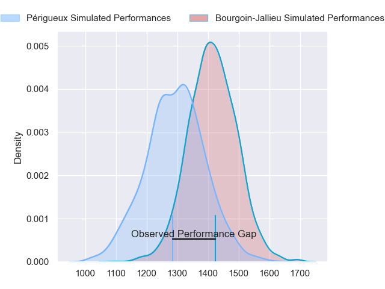
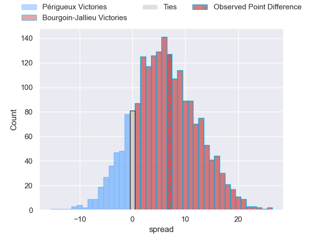
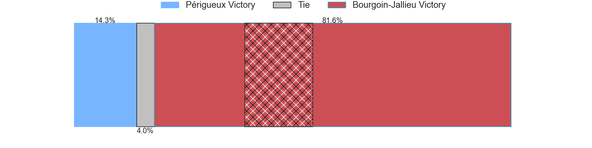
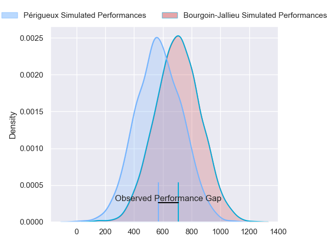
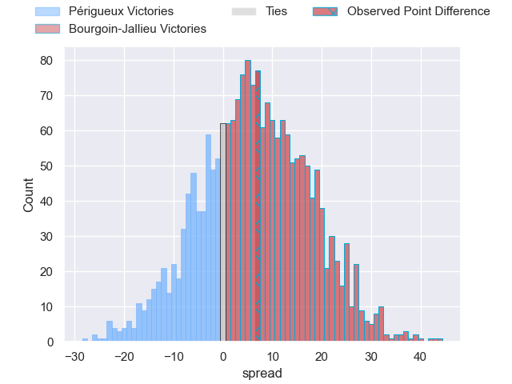
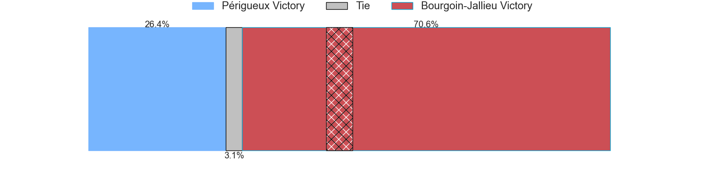
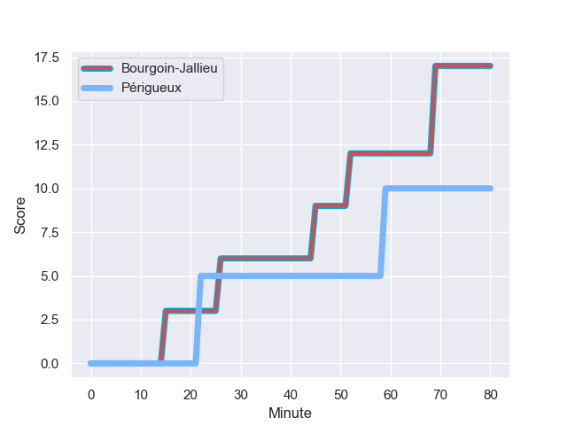
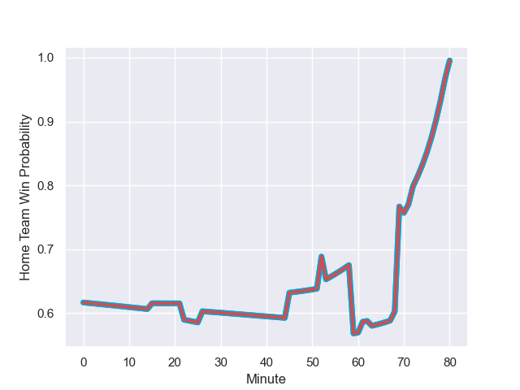

---  
layout: page  
title: Perigueux at Bourgoin-Jallieu; 10-17  
date: 2024-01-13 18:00:00 -0500  
categories: "Nationale 2023" match review  
---
# Perigueux at Bourgoin-Jallieu; 10-17

# Club Level Predictions

The first set of predictions treats a club as the smallest object, as the club develops its members, organizes a gameplan, and deploys its players as needed for each match. This club model has a prediction of 0.663, which translates to predicting Bourgoin-Jallieu to win by 6.1.

Our Over/Under is 35.5 - and combined with the spread above, we have a predicted scoreline of 15 to 21

Each club has a rating and a rating deviation (similar to a Glicko rating), and expected performances can be generated. This allows for simulated matches and spreads like the ones below.
## Projected Performances - Club Model

## Projected Spreads - Club Model

## Projected Results - Club Model

# Player Level Predictions - Version 2

Treating teams instead as an entity made up of the currently active players, I have ratings for each player in an altogether different system. These can be combined to form team ratings once teamsheets are announced, weighting starters a bit higher than the reserves. After the match is played, players can be weighted by their minutes on the field, allowing for an accurate measure of the team's composition. With these compiled team ratings, we can make predictions, measure inaccuracy, and update the individual player ratings.
## Prediction with Player Minutes: Bourgoin-Jallieu by 5.2

Périgueux by 1.2 on a neutral field
## Prediction without Player Minutes: Bourgoin-Jallieu by 6.0

Périgueux by 0.4 on a neutral pitch

## Projected Performances - Player Model

## Projected Spreads - Player Model

## Projected Results - Player Model

## Scores over Time

## Win Probability over Time

There were 11 large changes in win probability in this match

|   Away Minutes | Away Player        |   Away elo |   Number |   Home elo | Home Player              |   Home Minutes |
|---------------:|:-------------------|-----------:|---------:|-----------:|:-------------------------|---------------:|
|             53 | Jason Tindiliere   |      37.82 |        1 |      33.11 | Zhorzhi (Jorji) Saldadze |             53 |
|             59 | Lucas Marijon      |      47.95 |        2 |      15.24 | Mohamed Khribache        |             61 |
|             80 | Kalaveti Tawake    |      25.99 |        3 |      46.6  | Osman Dimen              |             70 |
|             59 | Richard Fourcade   |      24.95 |        4 |      38.59 | Robin Gascou             |             53 |
|             53 | Jaco Willemse      |      18.72 |        5 |      -9.37 | Léandre Cotte            |             80 |
|             68 | Madioke Konate     |      22.57 |        6 |      45.61 | Kevin Chaudouard         |             80 |
|             80 | Afaesetiti Amosa   |      59.46 |        7 |      39.46 | Theophile Cotte          |             63 |
|             80 | Clement Lanen      |      24.13 |        8 |      49.76 | Poutasi Luafutu          |             63 |
|             72 | Matteo Bordenave   |      42.27 |        9 |      74.48 | Tomas Munilla lo Duca    |             53 |
|             63 | Greg Hutley        |      47.59 |       10 |      55.04 | Nicolas Vuillemin        |             68 |
|             80 | Benjamin Yarde     |      28.17 |       11 |      12.28 | Christopher Bosch        |             80 |
|             80 | Fred Hickes        |      60.48 |       12 |      60.61 | Pieter Morton            |             80 |
|             80 | Vincent Fouillade  |      53.58 |       13 |      50.75 | Brieuc Plessis-Couillaud |             80 |
|             80 | Paul Piveteau      |      32.98 |       14 |      46.87 | Paul-Hugo Champ          |             80 |
|             80 | Thibault Rabourdin |      32.54 |       15 |      16.72 | Nicolas Cachet           |             80 |
|             27 | Thomas Vidal       |      49.59 |       16 |      38.26 | Romain Favaretto         |             27 |
|             21 | Baptiste Arvouet   |      39.66 |       17 |      61.19 | Killian Tripier          |             19 |
|             21 | Karl Lambert       |      38.97 |       18 |      41.12 | Maxime Calliet           |             10 |
|             27 | Damien Lavergne    |      34.13 |       19 |     -44.67 | Morgan Eames             |             27 |
|             12 | Hendri Storm       |      59.17 |       20 |      52.36 | Théo Lepage              |             17 |
|              8 | Gaëtan Chapon      |      44.66 |       21 |      19.21 | Aitor Hourcade           |             17 |
|             17 | Joffrey Tallet     |      44.76 |       22 |      61.8  | Jeremy Gondrand          |             27 |
|            nan | nan                |     nan    |       23 |      23.59 | Aviata Silago            |             12 |

