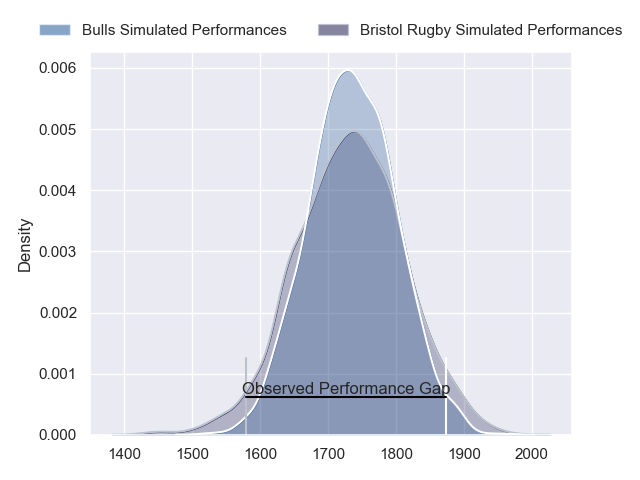
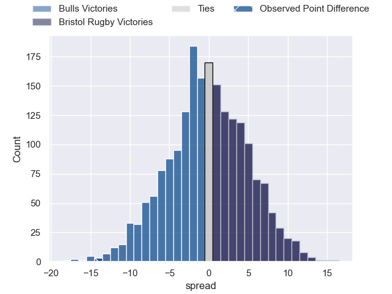
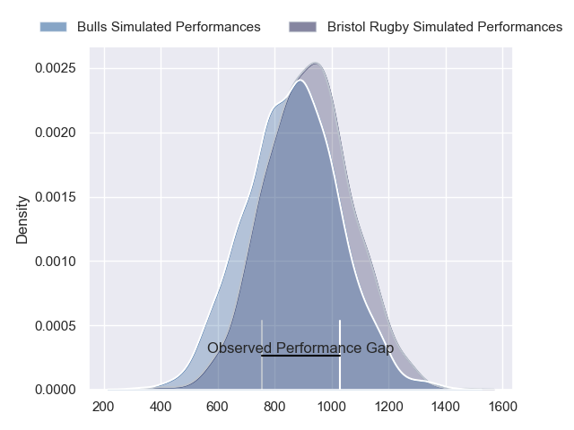
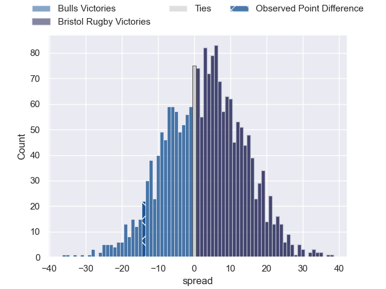
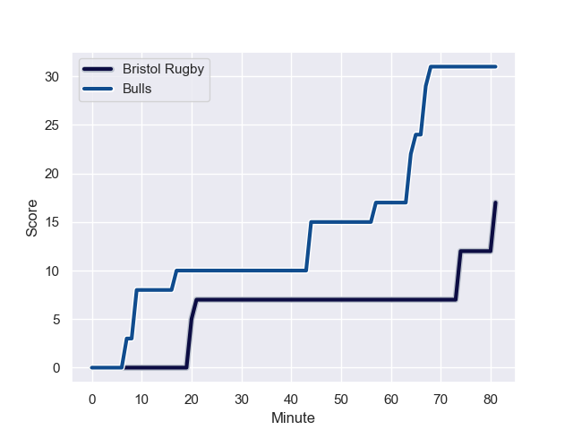
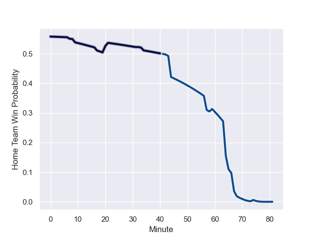

---  
layout: page  
title: Bulls at Bristol Rugby; 31-17  
date: 2024-01-13 18:00:00 -0500  
categories: "European Rugby Champions Cup 2023" match review  
---
# Bulls at Bristol Rugby; 31-17

# Club Level Predictions

The first set of predictions treats a club as the smallest object, as the club develops its members, organizes a gameplan, and deploys its players as needed for each match. This club model has a prediction of 0.498, which translates to predicting Bulls to win by 0.1.

Our Over/Under is 55.5 - and combined with the spread above, we have a predicted scoreline of 28 to 28

Each club has a rating and a rating deviation (similar to a Glicko rating), and expected performances can be generated. This allows for simulated matches and spreads like the ones below.
## Projected Performances - Club Model

## Projected Spreads - Club Model

## Projected Results - Club Model

# Player Level Predictions - Version 2

Treating teams instead as an entity made up of the currently active players, I have ratings for each player in an altogether different system. These can be combined to form team ratings once teamsheets are announced, weighting starters a bit higher than the reserves. After the match is played, players can be weighted by their minutes on the field, allowing for an accurate measure of the team's composition. With these compiled team ratings, we can make predictions, measure inaccuracy, and update the individual player ratings.
## Prediction with Player Minutes: Bristol Rugby by 2.6

Bulls by 2.2 on a neutral field
## Prediction without Player Minutes: Bristol Rugby by 3.9

Bulls by 0.9 on a neutral pitch

## Projected Performances - Player Model

## Projected Spreads - Player Model

## Projected Results - Player Model

## Scores over Time

## Win Probability over Time

There were 5 large changes in win probability in this match

|   Away Minutes | Away Player         |   Away elo |   Number |   Home elo | Home Player                |   Home Minutes |
|---------------:|:--------------------|-----------:|---------:|-----------:|:---------------------------|---------------:|
|             68 | Gerhard Steenekamp  |      72.95 |        1 |      44.93 | Sam Grahamslaw             |             34 |
|             79 | Jan-Hendrik Wessels |      45.95 |        2 |      34.69 | Gabriel Oghre              |             68 |
|             32 | Wilco Louw          |      46.65 |        3 |      56.6  | George Kloska              |             34 |
|             43 | Ruan Vermaak        |      46.65 |        4 |      41.11 | Josh Caulfield             |             81 |
|             81 | Reinhardt Ludwig    |      37.38 |        5 |      53.73 | Joe Batley                 |             81 |
|             77 | Marcell Coetzee     |      83.28 |        6 |      90.42 | Steven Luatua              |             71 |
|             81 | Elrigh Louw         |      75.23 |        7 |      46.59 | Daniel Thomas              |             71 |
|             81 | Celimpilo Gumede    |      43.01 |        8 |      22.74 | Magnus Bradbury            |             81 |
|             59 | Embrose Papier      |      99.13 |        9 |      83.68 | Kieran Marmion             |             68 |
|             70 | Johan Goosen        |      54.66 |       10 |      90.26 | AJ MacGinty                |             81 |
|             81 | Sergeal Petersen    |      46.65 |       11 |      77.64 | Gabriel Ibitoye            |             50 |
|             81 | Harold Vorster      |      46.65 |       12 |      37.08 | James Williams             |             58 |
|             81 | David Kriel         |      87.21 |       13 |      76.55 | Benhard Janse van Rensburg |             81 |
|             81 | Sebastian de Klerk  |      45.51 |       14 |      47.46 | Noah Heward                |             21 |
|             68 | Devon Williams      |      46.73 |       15 |      39.42 | Max Malins                 |             81 |
|              2 | Tiaan Lange         |      46.65 |       16 |      29.99 | Will Capon                 |             13 |
|             13 | Simphiwe Matanzima  |      59.69 |       17 |      52.43 | Jake Woolmore              |             47 |
|             49 | Khutha Mchunu       |      43.79 |       18 |      34.01 | Max Lahiff                 |             24 |
|             38 | Ruan Nortje         |      53.37 |       19 |      46.65 | Joe Owen                   |             10 |
|              4 | Deon Slabbert       |      46.65 |       20 |      46.03 | Jake Heenan                |             10 |
|             22 | Keagan Johannes     |      46.99 |       21 |      81.89 | Harry Randall              |             13 |
|             11 | Chris William Smith |      46.65 |       22 |      89.48 | Virimi Vakatawa            |             23 |
|             13 | Henry Immelman      |      46.65 |       23 |      51.45 | Richard Lane               |             60 |

