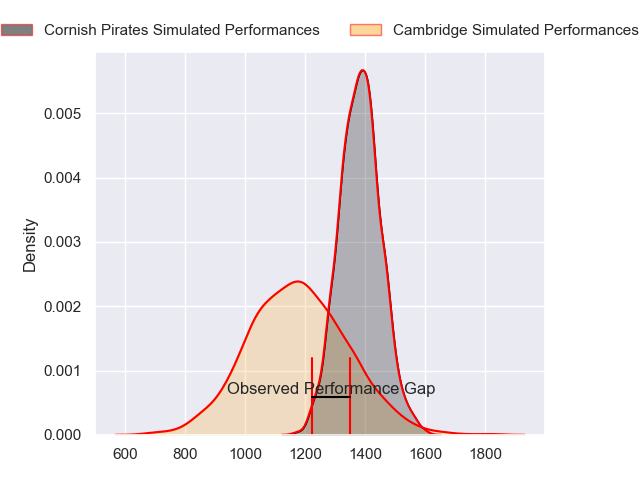
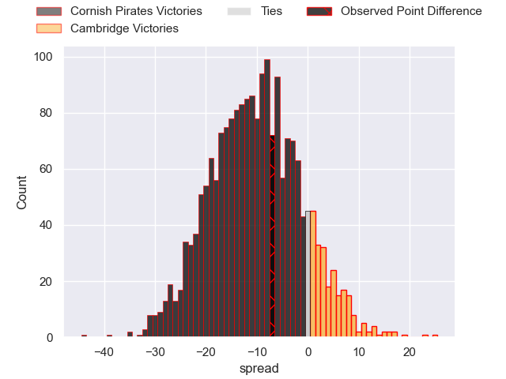
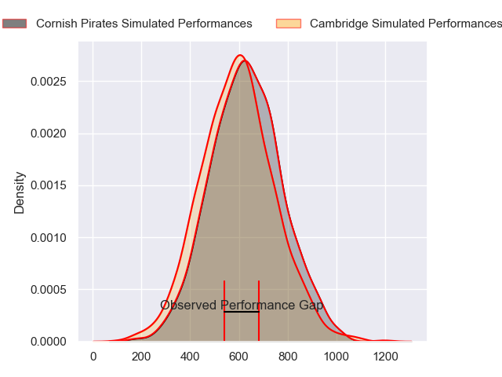
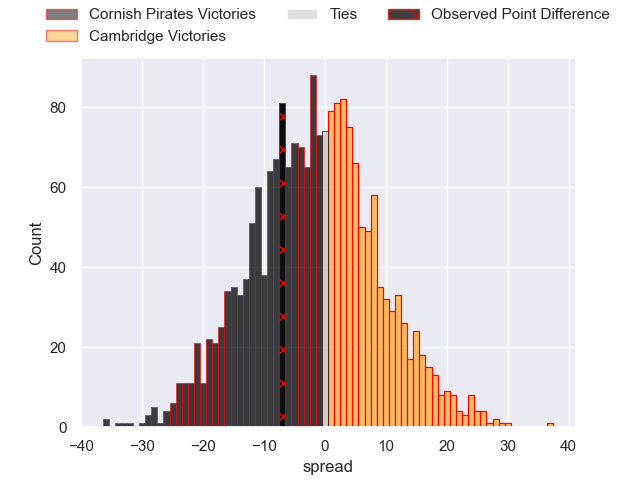
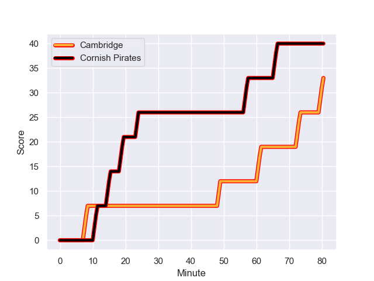
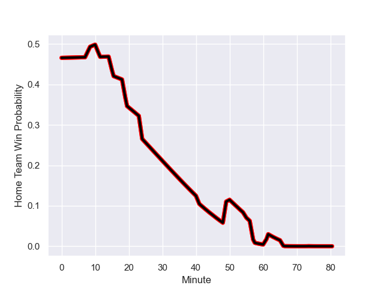

---  
layout: page  
title: Cornish Pirates at Cambridge; 40-33  
date: 2024-01-13 18:00:00 -0500  
categories: "RFU Championship 2023" match review  
---
# Cornish Pirates at Cambridge; 40-33

# Club Level Predictions

The first set of predictions treats a club as the smallest object, as the club develops its members, organizes a gameplan, and deploys its players as needed for each match. This club model has a prediction of 0.234, which translates to predicting Cornish Pirates to win by 10.6.

Our Over/Under is 50.5 - and combined with the spread above, we have a predicted scoreline of 31 to 20

Each club has a rating and a rating deviation (similar to a Glicko rating), and expected performances can be generated. This allows for simulated matches and spreads like the ones below.
## Projected Performances - Club Model

## Projected Spreads - Club Model

## Projected Results - Club Model

# Player Level Predictions - Version 2

Treating teams instead as an entity made up of the currently active players, I have ratings for each player in an altogether different system. These can be combined to form team ratings once teamsheets are announced, weighting starters a bit higher than the reserves. After the match is played, players can be weighted by their minutes on the field, allowing for an accurate measure of the team's composition. With these compiled team ratings, we can make predictions, measure inaccuracy, and update the individual player ratings.
## Prediction with Player Minutes: Cornish Pirates by 1.5

Cornish Pirates by 4.5 on a neutral field
## Prediction without Player Minutes: Cornish Pirates by 1.7

Cornish Pirates by 4.7 on a neutral pitch

## Projected Performances - Player Model

## Projected Spreads - Player Model

## Projected Results - Player Model

## Scores over Time

## Win Probability over Time

There were 5 large changes in win probability in this match

|   Away Minutes | Away Player          |   Away elo |   Number |   Home elo | Home Player          |   Home Minutes |
|---------------:|:---------------------|-----------:|---------:|-----------:|:---------------------|---------------:|
|             56 | Lefty Zigiriadis     |      47.51 |        1 |      34.84 | Jake Elwood          |             63 |
|             56 | Morgan Nelson        |      43.05 |        2 |      40.51 | Benjamin Brownlie    |             80 |
|             56 | Finlay Richardson    |      49.26 |        3 |      43.16 | Kieran Verden        |             68 |
|             50 | Josh Williams        |      52.38 |        4 |      39.9  | George Bretag-Norris |             80 |
|             80 | Steele Robert Barker |      48.98 |        5 |      39.07 | Geordie Irvine       |             45 |
|             80 | Peter Everett        |      50.86 |        6 |      42.49 | Benjamin Hoppe       |             55 |
|             45 | Will Gibson          |      64.19 |        7 |      23.01 | Jared Cardew         |             55 |
|             80 | Hugh Bokenham        |      46.73 |        8 |      42.91 | Anthony Maka         |             45 |
|             50 | Alex Schwarz         |      36.35 |        9 |      34.97 | Kieran Duffin        |             80 |
|             80 | Bruce Houston        |      49.15 |       10 |      37.22 | Steffan James        |             80 |
|             80 | Matthew McNab        |       5.43 |       11 |      38.87 | Josef Green          |             80 |
|             80 | Joe Elderkin         |      33.49 |       12 |      23.73 | Jamie Benson         |             80 |
|             80 | Robin Wedlake        |      29.97 |       13 |      47.97 | Tom Hoppe            |             72 |
|             62 | Will Trewin          |      51.48 |       14 |      29.38 | Kwaku Asiedu         |             41 |
|             58 | Kyle Moyle           |      38.85 |       15 |      30.95 | Elias Caven          |             80 |
|             35 | Harry Dugmore        |      47.82 |       16 |       3    | Sam Hanks            |             39 |
|             30 | Will Britton         |      12.99 |       17 |      34.9  | Nahum Merigan        |             35 |
|             30 | Ruaridh Dawson       |      46.35 |       18 |      31.2  | Kieran Frost         |             35 |
|             24 | Jake Morris          |      48.3  |       19 |       3.25 | Ben Adams            |             25 |
|             24 | Matt Johnson         |      52.65 |       20 |      40.39 | Matthew Dawson       |             25 |
|             24 | Rhys Williams        |      47.7  |       21 |      54.73 | Huw Owen             |             17 |
|             22 | Tom Pittman          |      51.09 |       22 |      43.84 | Matt Collins         |             12 |
|             18 | Iwan Jenkins         |      46.87 |       23 |      26.52 | Morgan Veness        |              8 |

