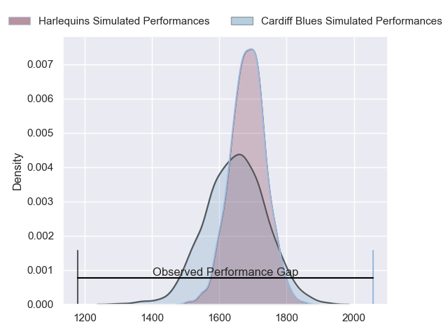
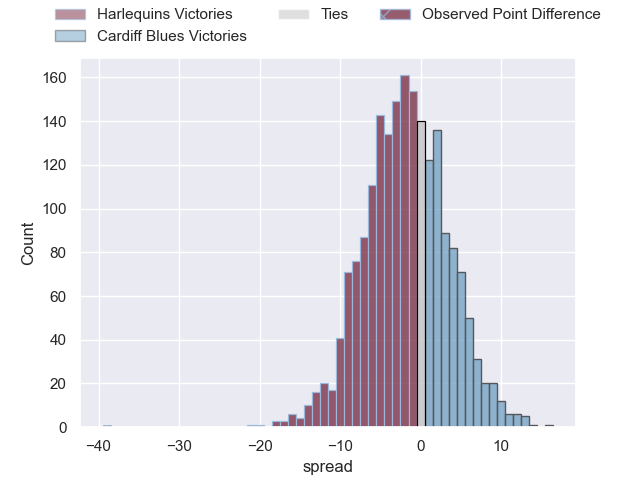
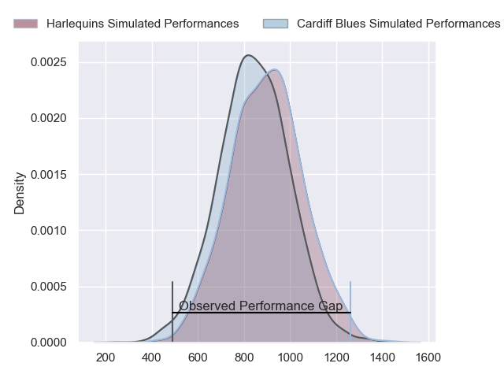
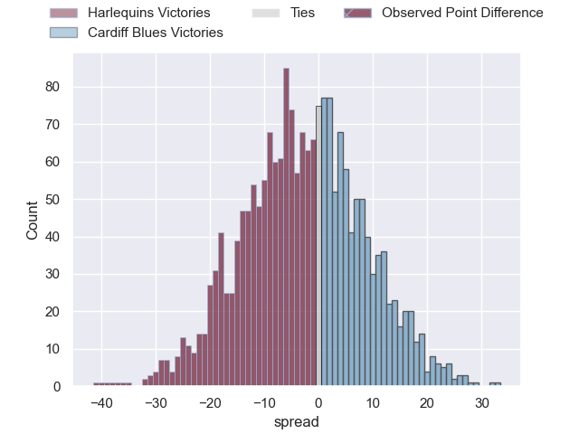
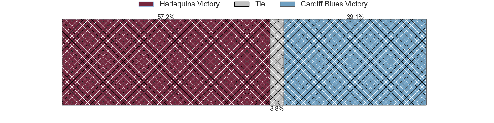
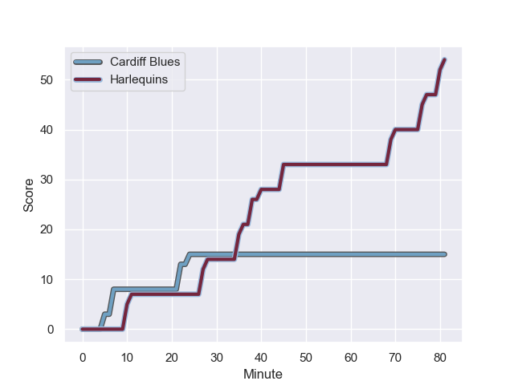
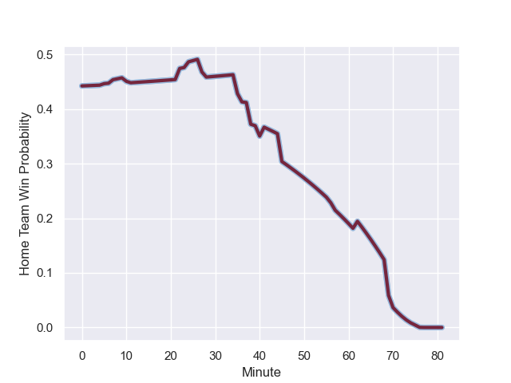

---  
layout: page  
title: Harlequins at Cardiff Blues; 54-15  
date: 2024-01-13 18:00:00 -0500  
categories: "European Rugby Champions Cup 2023" match review  
---
# Harlequins at Cardiff Blues; 54-15

# Club Level Predictions

The first set of predictions treats a club as the smallest object, as the club develops its members, organizes a gameplan, and deploys its players as needed for each match. This club model has a prediction of 0.452, which translates to predicting Harlequins to win by 1.7.

Our Over/Under is 49.5 - and combined with the spread above, we have a predicted scoreline of 25 to 24

Each club has a rating and a rating deviation (similar to a Glicko rating), and expected performances can be generated. This allows for simulated matches and spreads like the ones below.
## Projected Performances - Club Model

## Projected Spreads - Club Model

## Projected Results - Club Model

# Player Level Predictions - Version 2

Treating teams instead as an entity made up of the currently active players, I have ratings for each player in an altogether different system. These can be combined to form team ratings once teamsheets are announced, weighting starters a bit higher than the reserves. After the match is played, players can be weighted by their minutes on the field, allowing for an accurate measure of the team's composition. With these compiled team ratings, we can make predictions, measure inaccuracy, and update the individual player ratings.
## Prediction with Player Minutes: Harlequins by 2.6

Harlequins by 9.0 on a neutral field
## Prediction without Player Minutes: Harlequins by 4.0

Harlequins by 10.5 on a neutral pitch

## Projected Performances - Player Model

## Projected Spreads - Player Model

## Projected Results - Player Model

## Scores over Time

## Win Probability over Time

There were 4 large changes in win probability in this match

|   Away Minutes | Away Player               |   Away elo |   Number |   Home elo | Home Player       |   Home Minutes |
|---------------:|:--------------------------|-----------:|---------:|-----------:|:------------------|---------------:|
|             78 | Fin Baxter                |      17.81 |        1 |      46.65 | Rhys Carré        |             57 |
|             70 | Jack Walker               |      24.4  |        2 |      46.65 | Liam Belcher      |             41 |
|             57 | Will Collier              |      68.02 |        3 |      46.65 | Keiron Assiratti  |             47 |
|             41 | Joe Launchbury            |     111.37 |        4 |      40.98 | Teddy Williams    |             57 |
|             81 | George Hammond            |      -6.69 |        5 |      46.65 | Seb Davies        |             81 |
|             81 | James Chisholm            |      73.4  |        6 |      39.57 | Alex Mann         |             81 |
|             81 | Will Evans                |      46.89 |        7 |      46.65 | Thomas Young      |             56 |
|             70 | Alex Dombrandt            |      77.07 |        8 |      46.65 | James Botham      |             81 |
|             62 | Danny Care                |     147.54 |        9 |      46.65 | Tomos Williams    |             71 |
|             81 | Marcus Smith              |      73.07 |       10 |      38.9  | Tinus de Beer     |             81 |
|             56 | Cameron Anderson          |      51.32 |       11 |      46.65 | Mason Grady       |             81 |
|             70 | Andre Esterhuizen         |     108.58 |       12 |      46.65 | Uilisi Halaholo   |             62 |
|             81 | Oscar Beard               |      54.85 |       13 |      46.65 | Rey Lee-Lo        |             81 |
|             81 | Nick David                |      29.71 |       14 |      46.65 | Harri Millard     |             81 |
|             81 | Tyrone Green              |      71.67 |       15 |      46.65 | Cameron Winnett   |             17 |
|             11 | Nathan Jibulu             |      46.65 |       16 |      46.65 | Efan Daniel       |             40 |
|              3 | Jordan Els                |      31.58 |       17 |      46.65 | Corey Domachowski |             24 |
|             24 | Dillon Lewis              |     102.46 |       18 |      46.65 | Rhys Litterick    |             34 |
|             40 | Irne Herbst               |      52.88 |       19 |      46.65 | Rory Thornton     |             24 |
|             11 | Chandler Cunningham-South |      56.82 |       20 |      46.65 | Mackenzie Martin  |             25 |
|             19 | Will Porter               |      15.51 |       21 |      46.65 | Ellis Bevan       |             10 |
|             11 | Lennox Anyanwu            |      78.52 |       22 |      46.65 | Ben Thomas        |             64 |
|             25 | Louis Lynagh              |      63.14 |       23 |      46.65 | Owen Lane         |             19 |

