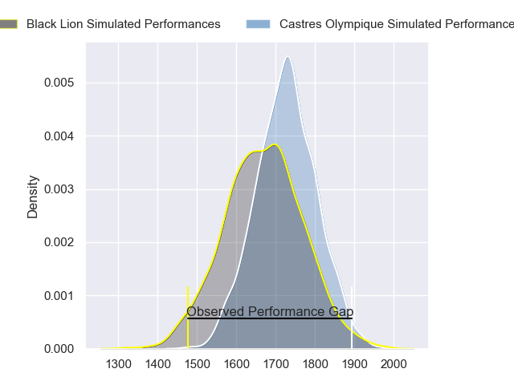
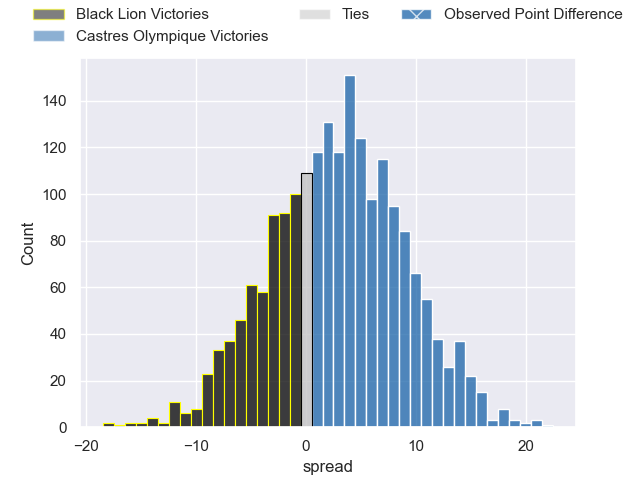
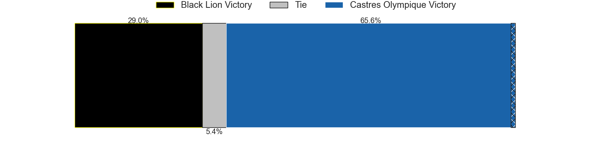
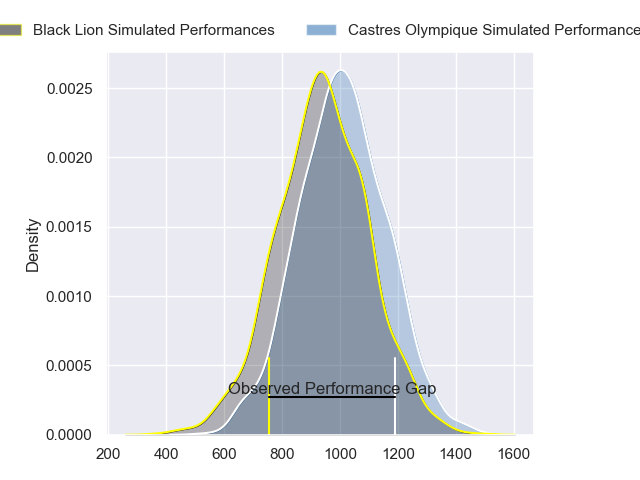
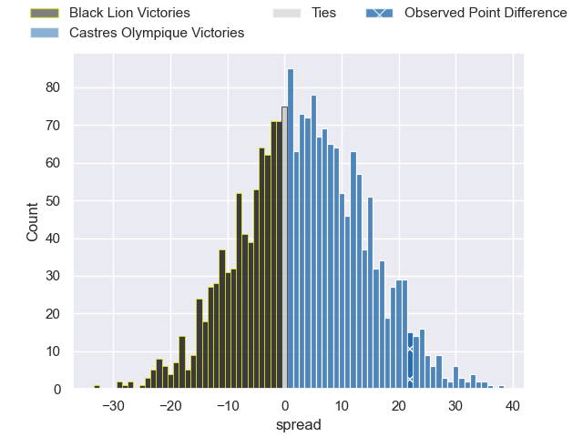
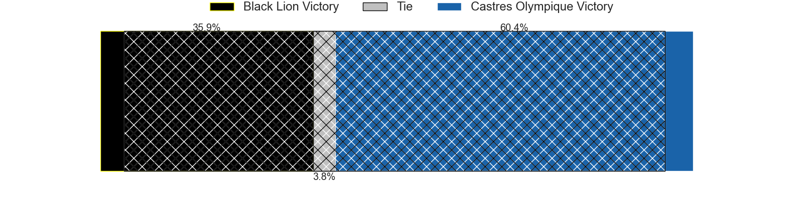
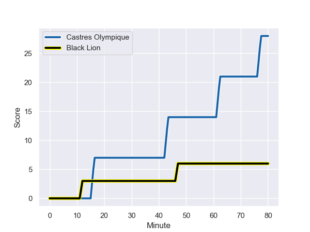
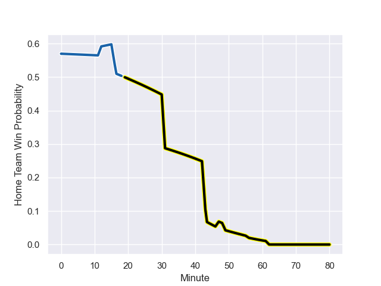

---  
layout: page  
title: Black Lion at Castres Olympique; 6-28  
date: 2024-01-13 18:00:00 -0500  
categories: "European Rugby Challenge Cup 2023" match review  
---
# Black Lion at Castres Olympique; 6-28

# Club Level Predictions

The first set of predictions treats a club as the smallest object, as the club develops its members, organizes a gameplan, and deploys its players as needed for each match. This club model has a prediction of 0.575, which translates to predicting Castres Olympique to win by 2.8.

Our Over/Under is 47.5 - and combined with the spread above, we have a predicted scoreline of 22 to 25

Each club has a rating and a rating deviation (similar to a Glicko rating), and expected performances can be generated. This allows for simulated matches and spreads like the ones below.
## Projected Performances - Club Model

## Projected Spreads - Club Model

## Projected Results - Club Model

# Player Level Predictions - Version 2

Treating teams instead as an entity made up of the currently active players, I have ratings for each player in an altogether different system. These can be combined to form team ratings once teamsheets are announced, weighting starters a bit higher than the reserves. After the match is played, players can be weighted by their minutes on the field, allowing for an accurate measure of the team's composition. With these compiled team ratings, we can make predictions, measure inaccuracy, and update the individual player ratings.
## Prediction with Player Minutes: Castres Olympique by 3.1

Black Lion by 4.8 on a neutral field
## Prediction without Player Minutes: Castres Olympique by 0.4

Black Lion by 7.4 on a neutral pitch

## Projected Performances - Player Model

## Projected Spreads - Player Model

## Projected Results - Player Model

## Scores over Time

## Win Probability over Time

There were 6 large changes in win probability in this match

|   Away Minutes | Away Player             |   Away elo |   Number |   Home elo | Home Player          |   Home Minutes |
|---------------:|:------------------------|-----------:|---------:|-----------:|:---------------------|---------------:|
|             56 | Dato Abdushelishvili    |      57.53 |        1 |      50.02 | Wayan de Benedittis  |             47 |
|             56 | Irakli Kvatadze         |      47.08 |        2 |      41.57 | Loris Zarantonello   |             47 |
|             49 | Giorgi Chkhartishvili   |      46.69 |        3 |      26.95 | Aurélien Azar        |             47 |
|             31 | Nodar Cheishvili        |     137.38 |        4 |      73.78 | Leone Nakarawa       |             80 |
|             63 | Grigor Kerdikoshvili    |      29.67 |        5 |      49.32 | Florent Vanverberghe |             63 |
|             80 | Giorgi Kervalishvili    |      42.53 |        6 |      54.82 | Baptiste Delaporte   |             80 |
|             80 | Sandro Mamamtavrishvili |      74    |        7 |      47.13 | Yann Peysson         |             80 |
|             80 | Ilia Spanderashvili     |      24.6  |        8 |      53.94 | Abraham Papali'i     |             56 |
|             71 | Giorgi Margalitadze     |      59.04 |        9 |      49.72 | Gauthier Doubrere    |             56 |
|             80 | Luka Matkava            |      96.02 |       10 |      46.4  | Louis Le Brun        |             80 |
|             80 | Sandro Todua            |      87.77 |       11 |      43.84 | Antoine Bouzerand    |             80 |
|             80 | Merab Sharikadze        |      48.76 |       12 |      79.87 | Adrea Cocagi         |             66 |
|             68 | Giorgi Kveseladze       |     104.01 |       13 |      97.3  | Jack Goodhue         |             80 |
|             80 | Aka Tabutsadze          |      80.18 |       14 |      55.22 | Josaia Raisuqe       |             80 |
|             63 | Mirian Modebadze        |      90.56 |       15 |      36.76 | Théo Chabouni        |             58 |
|             24 | Aliko Shamilishvili     |      44.31 |       16 |      90.09 | Antoine Tichit       |             33 |
|             24 | Tengiz Zamtaradze       |      41.94 |       17 |      20.59 | Pierre Colonna       |             33 |
|             31 | Nikoloz Khatiashvili    |       1.25 |       18 |      65.18 | Levan Chilachava     |             33 |
|             49 | Demuri Epremidze        |      48.71 |       19 |      -1.12 | Gauthier Maravat     |             17 |
|             17 | Saba Kurtanidze         |      46.55 |       20 |      59.11 | Mathieu Babillot     |             24 |
|             12 | Tornike Kakhoidze       |      54.78 |       21 |      57.8  | Santiago Arata       |             24 |
|              9 | Alexander Jighauri      |      46.65 |       22 |      37.53 | Osea Waqaninavatu    |             22 |
|             17 | Luka Tsirekidze         |      50.17 |       23 |      54.54 | Joris Dupont         |             14 |

